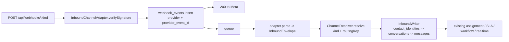

# ADR 0013 — Channel abstraction and contact identity

- **Status**: Accepted
- **Date**: 2026-08-23
- **Issue**: TAR-818 (Channel abstraction foundation), under TAR-808 (Omnichannel expansion)
- **Author**: Architect
- **Relates to**: ADR 0002 (guard pipeline slot 6), `docs/architecture/0009-tenant-lifecycle-and-self-signup.md`
  (decision 6, and TAR-403's recorded divergence from it)
- **Consumed by**: TAR-819 (this schema), TAR-820, TAR-821, TAR-822, TAR-823

> Landed in the repository by TAR-819, per the Architect's instruction on TAR-818:
> the ADR was posted as a comment there because a discovery issue has no PR, and
> the first PR in the chain is where it belongs. **Sections 1–12 are the
> Architect's text, unaltered.** Amendment 1 at the end is TAR-819's — it records
> where the implementation had to depart from the plan and is flagged back for
> acceptance rather than treated as settled.
>
> Every deviation from what is written here should come back to the Architect
> rather than be resolved locally. That is TAR-819's own acceptance criterion and
> it applies to all five downstream issues.

## Context and Problem

WhatsApp is not _a_ channel in this codebase; it is the only shape a conversation
can have. `conversations.whatsapp_account_id` is `NOT NULL`, sits in the thread's
natural key `@@unique([tenantId, whatsappAccountId, contactId])`, and leads all
three hot inbox indexes. 81 references across 23 non-test files.

Two constraints decide this ADR:

1. **Thread ownership.** Every inbox query, both assignment-scope indexes, and
   `WhatsAppAccountResolver` route through `whatsapp_account_id`. TAR-808 AC1
   ("WhatsApp itself runs through the new abstraction, no behavior regression")
   is exactly this column.
2. **Contact identity.** `contacts` is `@@unique([tenantId, phone_e164])`,
   `NOT NULL`. Instagram has no phone number — identity is a page-scoped IGSID.
   **This, not the account model, is the hard part**, and it is what a "second
   WhatsApp-shaped system beside the first" would get permanently wrong.

One seam is already channel-ready and should be left alone: `webhook_events`
carries `provider` and dedupes on `(provider, provider_event_id)`. A second
channel's webhooks reuse the existing table, sweeper, replay tooling and admin
console with **no migration**.

## Decision 1 — `channels` as a supertype, class-table inheritance

A `channels` row per connected channel holds what every channel has.
Provider-specific columns stay in their own table, joined on a **shared primary
key**.

```prisma
enum ChannelKind { whatsapp instagram messenger }

/// `connected | disconnected | error` — the same three values
/// `WhatsappAccountStatus` already carries, moved up. Sendability stays
/// per-provider (`whatsapp_accounts.registration_status`) for the reason
/// that enum already documents: the two cannot be one column.
enum ChannelStatus { connected disconnected error }

model Channel {
  id          String        @id @default(uuid(7)) @db.Uuid
  tenantId    String        @map("tenant_id") @db.Uuid
  kind        ChannelKind
  status      ChannelStatus @default(disconnected)
  /// What an operator sees in a channel list. Display only.
  displayName String        @map("display_name")
  /// The provider's own id for this endpoint, and the webhook routing key:
  /// `phone_number_id` for WhatsApp, the IG professional account id for
  /// Instagram, the Page id for Messenger.
  ///
  /// Unique across tenants **within a kind**, for the reason
  /// `whatsapp_accounts.phone_number_id` is unique globally today: one Meta app
  /// serves every tenant, so nothing on an inbound delivery names a tenant
  /// except the endpoint it arrived on. Scoped by `kind` rather than globally
  /// because a Page id and an IG account id are different namespaces.
  routingKey  String        @map("routing_key")
  connectedAt DateTime?     @map("connected_at") @db.Timestamptz(3)
  createdAt   DateTime      @default(now()) @map("created_at") @db.Timestamptz(3)
  updatedAt   DateTime      @updatedAt @map("updated_at") @db.Timestamptz(3)

  tenant        Tenant           @relation(fields: [tenantId], references: [id], onDelete: Cascade)
  whatsapp      WhatsappAccount?
  instagram     InstagramAccount?
  conversations Conversation[]

  @@unique([kind, routingKey])
  @@unique([tenantId, id])
  @@index([tenantId, kind])
  @@map("channels")
}
```

`whatsapp_accounts` keeps only what is genuinely WhatsApp's — the WABA FK,
`display_phone_number`, `verified_name`, `quality_rating`,
`registration_status`, `registration_pin_encrypted`,
`registration_failure_reason`, `registered_at`, `registration_attempted_at` —
and its `id` becomes both PK and FK to `channels.id`. `phone_number_id` **moves**
to `channels.routing_key`; do not keep a copy, two sources of truth for a routing
key is how a message lands in the wrong tenant's inbox.

**The property that makes phase 2 safe: the channel row takes the
`whatsapp_accounts.id` value that already exists.** So
`conversations.whatsapp_account_id → channel_id` is an identity copy, not a
remap. The migration is a rename with a new parent table above it, and every
existing id in logs, audit rows and tests still resolves.

_Rejected: one polymorphic `channel_accounts` table with a `kind` discriminator
and a JSONB `provider_config`._ Fewer tables and it looks cheaper. But this
schema's entire style is explicit columns with CHECK constraints and indexes
justified at the line; JSONB appears only where the shape is genuinely the
provider's (`message_templates.components`). Channel account fields are ours to
constrain, and putting an encrypted credential and a registration state machine
into a JSON bag discards every constraint that currently makes those correct —
including the AAD binding on `registration_pin_encrypted`.

_Rejected: `conversations.channel_kind` + a nullable FK per kind._ No supertype
row means no single thing to name in `conversations`, no single place for
`status`, and one more nullable FK per wave-2 channel.

## Decision 2 — `contact_identities`, and `contacts.phone_e164` becomes nullable

```prisma
model ContactIdentity {
  id          String      @id @default(uuid(7)) @db.Uuid
  tenantId    String      @map("tenant_id") @db.Uuid
  contactId   String      @map("contact_id") @db.Uuid
  kind        ChannelKind
  /// The provider's id for this person on this kind of channel: E.164 for
  /// WhatsApp, the IGSID for Instagram, the PSID for Messenger.
  externalId  String      @map("external_id")
  /// The profile name the provider attaches to an inbound batch, per channel —
  /// the same person is "Tarek" on WhatsApp and an @handle on Instagram, and
  /// `contacts.display_name` can only hold one of them.
  displayName String?     @map("display_name")
  lastSeenAt  DateTime?   @map("last_seen_at") @db.Timestamptz(3)
  createdAt   DateTime    @default(now()) @map("created_at") @db.Timestamptz(3)

  tenant  Tenant  @relation(fields: [tenantId], references: [id], onDelete: Cascade)
  contact Contact @relation(fields: [tenantId, contactId], references: [tenantId, id], onDelete: Cascade)

  /// The inbound resolution key — one lookup per delivery, replacing
  /// `(tenant_id, phone_e164)`.
  @@unique([tenantId, kind, externalId])
  @@unique([tenantId, id])
  @@index([tenantId, contactId])
  @@map("contact_identities")
}
```

Scoped by `(tenant, kind)` rather than by channel row, deliberately. A phone
number is the same person across every WhatsApp number a tenant connects, so
WhatsApp keeps today's cross-number unification. An IGSID is already scoped to
the IG account that received it, so two connected IG accounts yield two distinct
`external_id` values and cannot collide — the same key serves both without a
per-channel column nobody needs.

`contacts.phone_e164` becomes nullable and stops being the identity key; it stays
as the phone number **when one is known**, which is what contact search, export
and the CRM view read.

_Rejected: separate Contact rows per channel with `phone_e164` widened to a
generic `external_id`._ Cheaper migration, but "the same customer on WhatsApp and
Instagram" becomes unrepresentable, and merging later is a data-quality project
rather than a feature.

## Decision 3 — three ports, not one adapter interface

Channels differ along three independent axes. One fat `ChannelAdapter` interface
would force every channel to implement methods it has no concept for
(`sendTemplate` on Instagram) and to answer questions it does not own.

```ts
// ---- inbound: provider payload -> normalized envelope --------------------

interface ChannelIdentityRef {
  readonly kind: ChannelKind;
  readonly externalId: string;
  readonly displayName: string | null;
}

/** Where the bytes are, per provider. WhatsApp hands back a media id that must
 *  be resolved against the Graph API; Instagram hands back a short-lived CDN
 *  URL. `whatsapp-media.service.ts` only knows the first. */
type InboundMediaRef =
  | {
      readonly via: 'provider_id';
      readonly providerMediaId: string;
      readonly mimeType: string | null;
    }
  | { readonly via: 'url'; readonly url: string; readonly mimeType: string | null };

interface NormalizedInboundMessage {
  readonly providerMessageId: string;
  readonly from: ChannelIdentityRef;
  readonly sentAt: Date;
  readonly contentType: MessageContentType;
  readonly body: string | null;
  readonly media: InboundMediaRef | null;
  /** Whether this delivery opens the 24h window. False for a status receipt —
   *  the rule `ConversationOpening` already documents, made explicit so the
   *  writer stops inferring it from the payload shape. */
  readonly opensServiceWindow: boolean;
}

interface NormalizedStatusUpdate {
  readonly providerMessageId: string;
  readonly recipient: ChannelIdentityRef;
  readonly status: MessageStatus;
  readonly occurredAt: Date;
  readonly errorCode: string | null;
  readonly errorMessage: string | null;
}

interface InboundEnvelope {
  readonly kind: ChannelKind;
  /** Matches `channels.routing_key`. */
  readonly routingKey: string;
  readonly messages: readonly NormalizedInboundMessage[];
  readonly statuses: readonly NormalizedStatusUpdate[];
}

interface InboundChannelAdapter {
  readonly kind: ChannelKind;
  /** The HMAC over the raw body. Stays per-adapter because the header name and
   *  the secret are per-provider even when the app is shared. */
  verifySignature(rawBody: Buffer, headers: IncomingHttpHeaders): boolean;
  verifyHandshake(candidateToken: string, challenge: string): string;
  /** One envelope per routing key in the payload. Meta batches across
   *  endpoints; the writer must not have to know that. */
  parse(payload: unknown): readonly InboundEnvelope[];
}

// ---- outbound: normalized command -> provider send ----------------------

interface OutboundChannelAdapter {
  readonly kind: ChannelKind;
  sendText(cmd: SendTextCommand): Promise<SentMessage>;
  sendMedia(cmd: SendMediaCommand): Promise<SentMessage>;
}

/** WhatsApp only. Deliberately a separate optional port rather than a method
 *  on the interface above — see Decision 6. */
interface TemplateCapableAdapter {
  sendTemplate(cmd: SendTemplateCommand): Promise<SentMessage>;
}

// ---- send policy: may this go out at all? -------------------------------

type SendDecision =
  { readonly allowed: true } | { readonly allowed: false; readonly reason: SendRefusalReason };

interface SendPolicy {
  readonly kind: ChannelKind;
  evaluate(conversation: ServiceWindow, intent: OutboundIntent, now: Date): SendDecision;
}
```

All three are addressed by `channelId` (our id), never by a provider id — the
invariant `WhatsAppSenderService` already holds and the reason
`WhatsAppCredentialResolver` exists. Adapters are registered in a
`Map<ChannelKind, …>` keyed by their own `kind`; no `switch` on kind outside that
registry.

`WhatsAppAccountResolver` generalizes to `ChannelResolver.resolve(kind, routingKey)`
— still `SystemPrisma`, still uncached, still one class so the cross-tenant read
stays visible in a grep for `SYSTEM_PRISMA`.

**Inbound flow after the refactor:**



Everything from `H` rightward is unchanged code. That is the point of the
abstraction, and it is what TAR-822's "no Instagram-specific parallel inbox
logic" criterion is measured against.

**Routes:** one controller path per kind (`/api/webhooks/whatsapp`,
`/api/webhooks/instagram`, `/api/webhooks/messenger`), all `VERSION_NEUTRAL` and
`@PlatformRoute()`. Not one polymorphic route: each URL is registered separately
in Meta's dashboard, verify tokens are per-URL, and a shared path would make one
channel's misconfiguration another channel's outage.

## Decision 4 — entitlement gating (TAR-808 AC3, TAR-821's contract)

Add three booleans to `PLAN_FEATURES` in `packages/contracts/src/billing.ts`:

```ts
'channel_whatsapp', 'channel_instagram', 'channel_messenger',
```

**Plan default vs tenant override needs no new table.** `tenant_entitlements` is
already the per-tenant materialization of a plan — TAR-403 diverged from ADR 0009
decision 6 for exactly this reason and recorded it on the model.
`plans.entitlements` holds the plan-level default;
`tenant_entitlements.entitlements.features` holds the tenant's effective set. An
override _is_ writing a different array into the tenant row. TAR-821 should not
invent a third location.

**Do not use `PlanFeaturesService.includes()` for this.** It fails **open** by
design and documents why — an unstated feature is granted, because failing closed
would refuse every tenant on the platform today. That is correct for
`ai_chatbot`; it is precisely wrong for AC3, which requires a refusal.
`FeatureGuard` (ADR 0002 pipeline slot 6, TAR-37) still does not exist.

TAR-821 adds a separate, **fail-closed** reader:

```ts
@Injectable()
class ChannelEntitlementService {
  /** Throws `ChannelNotEntitledError` when the tenant's effective entitlements
   *  do not name `channel_<kind>`. Absent means refused — the opposite default
   *  to `PlanFeaturesService`, and the difference is the whole reason this is a
   *  second class rather than a flag on the first. */
  assertConnectable(kind: ChannelKind): Promise<void>;
  listConnectable(): Promise<readonly ChannelKind[]>;
}
```

Failing closed is only safe because **every existing write site is backfilled in
the same migration**. There are four, and TAR-819 must cover all of them or
WhatsApp connect breaks on day one:

- existing `tenant_entitlements` rows — backfill `channel_whatsapp` into `features`
- the column default on `TenantEntitlements.entitlements`
- `TenantProvisioningService` (`apps/api/src/tenancy/tenant-provisioning.service.ts:572` area)
- `UNCAPPED_ENTITLEMENTS` in `apps/api/src/entitlements/plan-limits.service.ts` and
  the three `demo-dataset.ts` plan rows

**Refusal shape.** A named error code, not a generic 403: `channel_not_entitled`,
HTTP 403, body naming the `channelKind` refused and the tenant's plan key. AC3's
words are "a clear reason, not a silent failure" — a bare `forbidden` fails that
criterion. Register it in `packages/contracts/src/error-codes.ts` alongside the
existing codes.

**Where the gate is called:** the connect path for every kind, before any Graph
API call. Checking it at send time as well is not required by AC3 and would put
an entitlement read in the hot path.

**`plan_limits.whatsappNumbers` is declared, seeded, and enforced nowhere** —
grep finds only defaults and seed data, no call site. Decision: **leave it
alone**. Do not generalize it to a `channelsPerKind` map in this wave;
generalizing an unenforced limit produces a second unenforced limit with more
shape. When someone enforces it, the channel-connect path is where it attaches.

## Decision 5 — webhook secrets and app identity

Config today: `META_APP_ID`, `META_EMBEDDED_SIGNUP_CONFIG_ID`,
`WHATSAPP_APP_SECRET`, `WHATSAPP_WEBHOOK_VERIFY_TOKEN`, `META_GRAPH_API_VERSION`
(default `v23.0`).

`WHATSAPP_APP_SECRET` is the **Meta app's** secret, not WhatsApp's. If Instagram
and Messenger run under the same Meta app, one secret verifies all three
signatures and `isValidWhatsAppSignature` generalizes unchanged. Verify tokens
are per-webhook-URL and each kind needs its own.

Decision: introduce `META_APP_SECRET` as the canonical name, keep
`WHATSAPP_APP_SECRET` as a deprecated alias so no environment breaks, and add
`INSTAGRAM_WEBHOOK_VERIFY_TOKEN` / `MESSENGER_WEBHOOK_VERIFY_TOKEN`. Keep the
existing "configured or refuse" posture — `WebhookChannelNotConfiguredError`
already models a channel that was never given a secret, and it should stay
per-kind so an unconfigured Instagram cannot take WhatsApp down.

## Decision 6 — what deliberately does NOT generalize

**Message templates.** `message_templates` is WABA-scoped and Meta-approved.
Instagram has no template concept; it has the 24-hour window plus a message tag
for limited post-window sends. Generalizing `MessageTemplate` into a
channel-neutral entity would model a fiction, and it is why `sendTemplate` sits
on a separate `TemplateCapableAdapter` port above.

**`conversations.service_window_expires_at` does generalize** — all three Meta
channels have a 24-hour window opened by the customer. What differs is the
_escape hatch_ out of it, which is why `SendPolicy` is its own port: WhatsApp's
is an approved template, Instagram's and Messenger's is a message tag.
`isServiceWindowOpen` stays exactly as it is; only the "what may I send instead"
branch is per-kind.

**`media_objects`** stays as-is. Only the inbound _fetch_ differs
(`InboundMediaRef` above); storage, checksum, dedup and retention are
channel-agnostic already.

## Migration strategy — the handoff to TAR-819

Expand / migrate / contract, three migrations, each independently deployable:

1. **Expand.** Create `channels` and `contact_identities`. Insert one `channels`
   row per `whatsapp_accounts` row **reusing that row's `id`**,
   `kind = 'whatsapp'`, `routing_key = phone_number_id`,
   `display_name = COALESCE(verified_name, display_phone_number)`, `status`
   copied. Insert one `contact_identities` row per contact
   (`kind = 'whatsapp'`, `external_id = phone_e164`). Add
   `conversations.channel_id` nullable and copy from `whatsapp_account_id`. Add
   `ChannelKind`/`ChannelStatus` to `packages/contracts`. Backfill the four
   entitlement write sites from Decision 4. **No application code reads the new
   columns** — that is this migration's acceptance criterion.
2. **Migrate.** `conversations.channel_id` `NOT NULL`; new unique
   `(tenant_id, channel_id, contact_id)`; the three inbox indexes rebuilt on
   `channel_id`; `contacts.phone_e164` nullable; `whatsapp_accounts.id` becomes
   FK to `channels.id`.
3. **Contract.** Drop `conversations.whatsapp_account_id`, drop
   `whatsapp_accounts.phone_number_id`, drop the old indexes and the old unique
   on `contacts`. This lands with TAR-820, not before — TAR-820's "no dual code
   path left behind" is what makes it safe.

RLS: both new tables are tenant-scoped and take the standard `tenant_isolation`
policy plus a `tenant-scope.extension.ts` classification. Neither is
`system-only`. `ChannelResolver` reads `channels` through `SystemPrisma` for the
same documented reason `WhatsAppAccountResolver` does today.

**Index note for TAR-819:** the three `conversations` indexes carry measured
`EXPLAIN` numbers in their doc comments (3 094 buffers → 6, 39 333
rows-removed-by-filter → 0 on 120 000 conversations). Rebuilding them on
`channel_id` must preserve column order exactly; those numbers are the regression
baseline, and `conversations_tenant_assigned_user_inbox_idx` keeps its explicit
`map` name because Prisma's generated name exceeds Postgres's 63-character limit.

## Meta credentials — finding, and what still needs the spike

Recorded against TAR-818's fourth acceptance criterion. **Do not assume
WhatsApp's grant carries over — it does not.**

What can be stated from the code and from how Meta's platform is structured:

- One Meta app can host WhatsApp, Instagram and Messenger products
  simultaneously, so **`META_APP_ID` is reusable** and a shared app secret
  verifies all three webhook signatures.
- The **permission grants are separate App Review submissions**. WhatsApp Cloud
  API uses `whatsapp_business_messaging` / `whatsapp_business_management`;
  Instagram messaging and Messenger require their own messaging permissions on
  their own review. Holding one grants nothing about the others.
- **`META_EMBEDDED_SIGNUP_CONFIG_ID` is WhatsApp-specific.** Embedded Signup is a
  WhatsApp onboarding flow; Instagram and Messenger connect through a different
  Facebook Login for Business configuration against a Page. TAR-822's connect
  flow is therefore **not** a parameterization of `embedded-signup.service.ts` —
  plan for a second OAuth configuration, not a reused one.

**Needs verification, and is not invented here:** the exact current permission
names, whether Instagram messaging requires the connected Page to be in a
specific linkage state, and — the one that can reorder the whole plan — **App
Review lead time**. There is no basis for a figure and none is published.

This is why the spike runs in parallel from day 1: nothing in this ADR unblocks
it, and if review is measured in weeks it becomes the real critical path into
TAR-822. TAR-824 owns it.

## Failure Modes and Operations

| Condition                                | Behavior                                                 | Notes                                                                                            |
| ---------------------------------------- | -------------------------------------------------------- | ------------------------------------------------------------------------------------------------ |
| Unknown `routing_key` on inbound         | Event parked with `unknown_routing_key`, replayable      | Generalizes the existing `unknown_phone_number_id` path; `webhook_event_replays` needs no change |
| One adapter's secret unconfigured        | That kind's route refuses; other kinds unaffected        | Requires per-kind config checks — do not collapse to one guard                                   |
| Provider unreachable / throttled         | Retried, per `OutboundMessageDispatcher`'s existing rule | Only Meta-unreachable and Meta-throttling are retried; rejected requests and credentials are not |
| Adapter registry has no entry for a kind | Startup failure, not a runtime 500                       | A channel kind in the DB with no registered adapter is a deploy error                            |
| Tenant not entitled to a channel         | `channel_not_entitled`, 403                              | Connect path only                                                                                |

Monitoring: `webhook_events` parked-count should be reported **per provider**
once a second provider exists, or Instagram failures hide inside WhatsApp's
volume.

## Security and Access

Credentials stay per-channel and encrypted at rest under the existing cipher,
decrypted only in the send path. `channels` holds **no** credential column —
tokens stay on the provider-specific tables, where their AAD binding still means
something. No secret value appears in an API projection, a log line, or an audit
row. Tenant isolation is unchanged and remains RLS's job; the entitlement gate is
a commercial ceiling, not a security boundary, and nothing in Decision 4 should
be read as one.

## Consequences

**Accepted cost:** TAR-820 is a wide, low-glory refactor across 23 files and the
product's hottest indexes. It produces no visible feature. It is where this
issue's schedule risk sits and it is the phase most likely to attract pressure to
be skipped in favour of bolting Instagram on beside WhatsApp. TAR-808 AC1 exists
to stop that, and the id-preserving migration above is what keeps the cost
bounded.

**Gained:** wave-2 channels (Email, Telegram, Voice, X, Live chat) implement
three small ports and touch no inbox, ticket, assignment, SLA or workflow code.
TAR-823 (Messenger) is the first measurement of whether that is true — if
Messenger is not materially smaller than Instagram, the ports are wrong and that
is the signal to come back to the Architect before wave 2 is scoped.

## Open Questions and Risks

1. **App Review lead time.** Unverified, unquantified, and the only unknown that
   can reorder the plan. Resolution: TAR-824, the parallel stage-1 spike.
2. **Pre-production data policy conflicts with AC1's wording.** TAR-819 states
   there is no live tenant data; TAR-808 AC1 speaks of no behavior regression.
   These are compatible — AC1 is about _behavior_, verified by the existing
   WhatsApp suite, not about preserving rows. But it means the migration may be
   rewritten freely if the three-step sequence proves awkward, **provided the
   four entitlement write sites are still backfilled**; failing closed on
   `channel_whatsapp` with an unbackfilled `demo-dataset.ts` breaks every seeded
   environment. Resolution: TAR-819 confirms the data situation before choosing.
3. **Cross-channel contact merge.** `contact_identities` makes "one customer, two
   channels" _representable_. It does not implement merge — no UI, no automatic
   linking, no dedup heuristic. Explicitly out of scope for TAR-808; flagged so
   nobody assumes it arrives with TAR-819.
4. **`MessageContentType` coverage.** Instagram carries story replies, mentions
   and reactions with no WhatsApp equivalent. The enum has not been audited
   against Instagram's full message type list. Resolution: TAR-822 audits it and
   comes back to the Architect if the enum needs values — an enum change is a
   migration, so finding it late is expensive.
5. **`sendTemplate` callers.** `WhatsAppSenderService.sendTemplate` has callers in
   the inbox send path and in workflow actions. Those call sites must become
   kind-aware or the template port leaks back into generic code. Resolution:
   TAR-820 routes them through `SendPolicy`, and flags to the Architect if any
   resists.

Estimates are deliberately absent.

---

## Amendment 1 — TAR-819 implementation findings

**Author**: Database Specialist. **Date**: 2026-08-23. **Status**: proposed —
raised for the Architect's acceptance, not resolved locally.

Four things could not be built as the migration strategy above describes them.
Each is recorded here with what was done instead; nothing in decisions 1–6 is
contradicted.

### 1. `whatsapp_account_id` leads none of the three inbox indexes

The Context section says it "leads all three hot inbox indexes". Checked against
`schema.prisma` and against every `CREATE INDEX` on `conversations` in
`prisma/migrations`, it leads none of them. The three are:

```
conversations_tenant_id_status_last_message_at_id_idx  (tenant_id, status, last_message_at DESC, id DESC)
conversations_tenant_assigned_user_inbox_idx           (tenant_id, assigned_user_id, status, last_message_at DESC, id DESC)
conversations_tenant_assigned_team_inbox_idx           (tenant_id, assigned_team_id, status, last_message_at DESC, id DESC)
```

The column appears in exactly one index on the table: the unique
`(tenant_id, whatsapp_account_id, contact_id)`. **So the "three inbox indexes
rebuilt on `channel_id`" in migrate step 2 is not a change that exists.** The
measured baselines those doc comments carry are not at risk from this work, and
the migration adds a sibling unique index rather than touching them.
`channel-schema.int-spec.ts` asserts all five index definitions verbatim so the
claim stays checked.

This is the safe direction, but it means step 2 is smaller than the ADR costs it
at, and TAR-820 should be re-sized accordingly.

### 2. Three of migrate step 2's four changes cannot deploy independently

Step 2 is described as independently deployable. Three of its four changes refuse
a write the running application still makes, so shipping it before TAR-820 is an
outage rather than a migration:

- `conversations.channel_id NOT NULL` — the inbound writer sets
  `whatsapp_account_id` alone; the next message from a new contact fails to
  insert.
- `whatsapp_accounts.id` as a foreign key to `channels.id` — connecting a number
  writes `whatsapp_accounts` with no `channels` row, so WhatsApp connect fails on
  its last step, after the Graph API calls have succeeded.
- dropping either old column — every read of both is still live.

**Resolution taken:** TAR-819 ships the expand step only, as
`20260823140000_channel_supertype_and_contact_identities` plus
`20260823140100_channel_entitlement_features`. The remaining changes belong in
one migration that lands in the same release as TAR-820's writers. The fourth
change, `contacts.phone_e164 DROP NOT NULL`, **is** additive and is in the expand
migration, per TAR-819's own acceptance criteria.

A consequence worth naming: `channels`, `contact_identities` and
`conversations.channel_id` are a point-in-time snapshot. Rows written between the
two releases are not tracked forward, so **TAR-820's migration must re-run the
same backfill** before it tightens anything. No trigger was added to keep them in
step: nothing reads the new tables during the window, and a trigger would be a
second writer for TAR-820 to remove.

### 3. `ANALYZE` is not enough after the `conversations` backfill

The expand migration rewrites every `conversations` row. All three inbox indexes
are served by **Index Only Scans**, which stop being index-only until a `VACUUM`
resets the visibility map. Measured on 120 000 conversations, 2 000 of them the
principal's, one 25-row page:

|                          | plan            | buffers | Heap Fetches |
| ------------------------ | --------------- | ------- | ------------ |
| before the migration     | Index Only Scan | 4       | 0            |
| immediately after        | Index Only Scan | 53      | 50           |
| after `VACUUM (ANALYZE)` | Index Only Scan | 4       | 0            |

The plan, the index and the index conditions never change — column order is
intact, `Rows Removed by Filter` stays 0 — so the baselines hold. What changes is
13× the buffer reads until a vacuum runs. `VACUUM` is forbidden inside a
transaction block and Prisma wraps every migration in one, so
`VACUUM (ANALYZE) "public"."conversations"` is a **required manual step after
applying**, alongside the existing `app-roles.sql` re-run. Both are in the
migration's header.

### 4. `ContactResponse.phone` was left non-nullable

The column is nullable now; the published response field is not, and widening it
is a contract change for five render sites in `apps/web`. The ADR rules on the
column and not on the response. TAR-819 kept the contract as it stands and stated
the invariant at the one mapper that publishes it — `contact.mapper.ts` throws if
it ever meets a null, and `OutboundMessageDispatcher.send` does the same for an
unaddressable WhatsApp send. Both are unreachable until TAR-822 creates the first
phone-less contact.

**For the Architect:** widening `ContactResponse.phone` to nullable belongs in
TAR-822, in the release where a client can actually receive one. Confirming that
placement — or moving it earlier — is the open decision.

### Also worth knowing

- **`channels.connected_at` is NULL on every backfilled row.** Nothing recorded
  when Meta attached a number, and `created_at` is when the row was written.
  NULL means "never recorded" rather than "never connected".
- **Only `channel_whatsapp` is granted by the migration.** It describes what
  every tenant can already do. `channel_instagram` / `channel_messenger` are
  granted to nobody except the `scale` demo plan, which is seed data and a
  placeholder — the tiering is TAR-397's.
- **`channel_not_entitled` is not registered yet.** Decision 4 assigns it to
  TAR-821 and TAR-819 is additive-only, so `error-codes.ts` is untouched.
- **`PURGE_ORDER` gained both tables.** `contact_identities` before `contacts`,
  `channels` last of the channel block — which is also the position that stays
  correct once TAR-820 makes `whatsapp_accounts.id` a foreign key into it.
