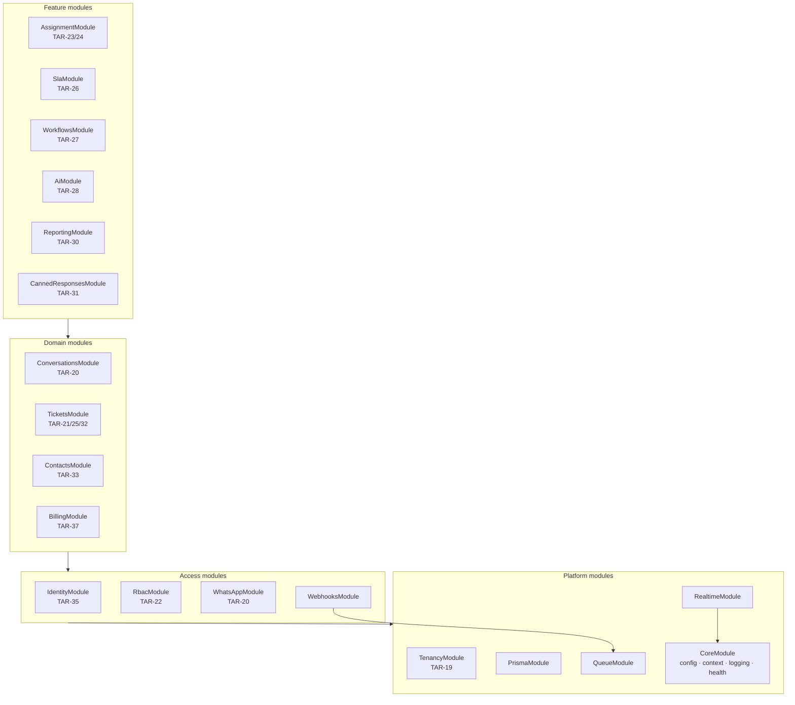
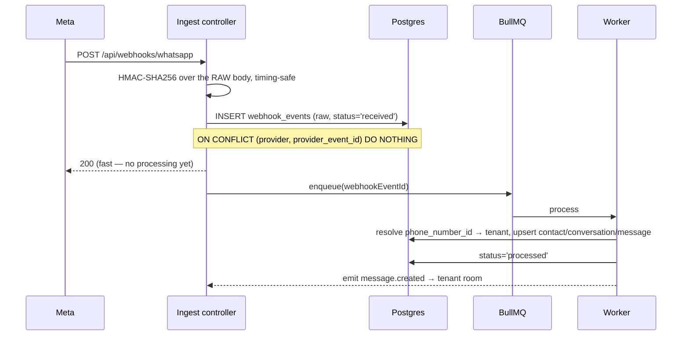

# Architecture and API contract (TAR-39)

Status: proposed · Supersedes nothing · Builds on [ADR 0001 — stack decision](../adr/0001-stack-decision.md)

## Context and Problem

TAR-38 landed a monorepo, a stack, and a `TenantContextService` that holds a `tenantId`
but never resolves one. Fifteen TAR-18 stories are waiting on the answer to three
questions before any of them can be written in parallel:

1. How does a request acquire a tenant, and how does that tenant reach the database?
2. What does an endpoint look like — path, body, error, auth — so that a frontend
   story can be built against an endpoint that does not exist yet?
3. Where do WhatsApp's webhooks land, and what guarantees do they carry?

The constraint that makes this non-trivial is **multi-tenant isolation as a hard
requirement** (TAR-18: "no tenant may reach another tenant's data … enforced at the
data layer, not just the UI") combined with **fifteen stories written by different
agents**. Any mechanism that depends on every future query remembering to filter by
`tenant_id` will fail — not immediately, and not visibly.

## Goals / Non-Goals

**Goals**

- One tenant-scoping mechanism, enforced below the application code that could forget it.
- A published contract concrete enough that backend and frontend stories can proceed
  in parallel without further coordination.
- Webhook ingestion that cannot lose a customer message when Redis is down.
- Billing and usage interfaces that let TAR-37 plug in Polar without leaking it, and
  let per-conversation overage be switched on later without a migration.

**Non-Goals**

- Implementing any of it. This issue publishes the contract; the stories build it.
- Feature-level design for workflows (TAR-27), AI (TAR-28) or reporting (TAR-30).
  Those stories own their internals; this document only fixes the boundaries they
  attach to.
- SSO, SAML and 2FA. Designed around, per TAR-18, not built.
- Per-conversation overage billing. The counters exist; the billing of them does not.

---

## Proposed Architecture

### Module boundaries

Modules are NestJS modules under `apps/api/src`. The layering rule is what keeps this
from collapsing into a ball of mutual imports:

> **A module may import a module below it. Never one beside or above it.**
> Cross-cutting reactions go through domain events, not imports.



**Ownership, one line each**

| Module                | Owns                                                          | Story        |
| --------------------- | ------------------------------------------------------------- | ------------ |
| `CoreModule`          | Config, `TenantContextService`, logging, health, error filter | TAR-38/41    |
| `PrismaModule`        | `TenantPrisma` and `SystemPrisma` clients, RLS wiring         | TAR-19       |
| `QueueModule`         | BullMQ registration, tenant-context propagation into workers  | TAR-41       |
| `RealtimeModule`      | Socket.IO gateway, rooms, handshake auth                      | TAR-20       |
| `TenancyModule`       | Tenant, domains, provisioning, lifecycle state machine        | TAR-19/36    |
| `IdentityModule`      | Users, sessions, invites, password reset, auth guard          | TAR-35       |
| `RbacModule`          | Roles, permissions, teams, permission guard                   | TAR-22       |
| `WhatsAppModule`      | WhatsApp accounts, templates, the Cloud API client            | TAR-20       |
| `WebhooksModule`      | Ingest controllers and processors for WhatsApp and billing    | TAR-20/37    |
| `ContactsModule`      | Contacts, tags, custom fields                                 | TAR-33       |
| `ConversationsModule` | Conversations, messages, internal notes                       | TAR-20       |
| `TicketsModule`       | Tickets, status, priority, the event log                      | TAR-21/25/32 |
| `BillingModule`       | Plans, subscriptions, entitlements, usage counters            | TAR-37       |
| `AssignmentModule`    | Round-robin and the condition-rule engine                     | TAR-23/24    |
| `SlaModule`           | SLA policies and timers                                       | TAR-26       |
| `WorkflowsModule`     | Trigger/condition/action automation                           | TAR-27       |
| `AiModule`            | Chatbot, knowledge base, human handoff                        | TAR-28       |
| `ReportingModule`     | Aggregates and dashboards                                     | TAR-30       |

**Why events rather than imports.** `TicketsModule` must not import `AssignmentModule`,
`SlaModule`, `WorkflowsModule` and `ReportingModule` — that is four imports today and a
cycle the moment assignment needs to read a ticket. Instead `TicketsModule` emits
`ticket.created`; the others subscribe. Adding TAR-27 then touches no existing module.

Two event buses, chosen by durability:

- **In-process** (`@nestjs/event-emitter`) for same-request reactions where loss is
  acceptable — cache busting, realtime fan-out.
- **BullMQ** for anything that must survive a restart — SLA timers, workflow actions,
  outbound sends, usage rollups.

Emit-side rule: a handler that must not be lost publishes to BullMQ, inside the same
transaction as the state change that caused it.

---

## Technology Choices

Everything in ADR 0001 is inherited unchanged. Only decisions this document adds:

| Concern           | Choice                                      | Alternatives considered                  | Rationale                                                                 |
| ----------------- | ------------------------------------------- | ---------------------------------------- | ------------------------------------------------------------------------- |
| Tenant scoping    | Postgres RLS + Prisma client extension      | App-level filter only; schema-per-tenant | Database-enforced; survives a forgotten `where`                           |
| Session           | Opaque server-side session cookie           | JWT access + refresh                     | TAR-18 requires revocation; a JWT denylist is a session table in disguise |
| Tenant resolution | Request host → tenant domain                | Email lookup; tenant picker              | Matches white-label domains; no cross-tenant email enumeration            |
| User identity     | Tenant-scoped users, `UNIQUE(tenant,email)` | Global user + membership join            | One person per client org at v1; migration path recorded below            |
| Browser → API     | Same-origin Next.js proxy                   | Direct CORS calls to the API host        | Custom domains make the session cookie third-party otherwise              |
| Realtime auth     | Single-use handshake ticket                 | Cookie on the WebSocket upgrade          | Same third-party-cookie problem; ticket also caps replay window           |
| API versioning    | URI prefix `/api/v1`                        | `Accept` header versioning               | Visible in logs and CDN rules; boring                                     |
| Write idempotency | `Idempotency-Key` on unsafe POSTs           | Client-generated resource ids            | Works for sends, which have no client-visible id until Meta answers       |
| Usage accounting  | Transactional increment + nightly reconcile | Redis edge counters; pure derivation     | Replay-safe, and wrong numbers here become wrong invoices                 |

### Decision 1 — Tenant scoping: RLS, with the app filter as belt and braces

**Trade-off axis: enforcement strength vs. per-query cost.**

- **Chosen — RLS on every tenant-scoped table, driven by a Prisma client extension.**
  Two layers. The extension injects `tenantId` into every `where` and `data` on
  tenant-scoped models, so ordinary queries are correct and use the `(tenant_id, …)`
  composite indexes. Underneath, RLS is the backstop that catches what the extension
  cannot: hand-written `$queryRaw` for reporting and full-text search, a model added
  without registering it with the extension, an outright bug in the extension.

  Concretely, every query runs as a batched transaction that sets the GUC first:

  ```sql
  -- Statement 1, prepended by the extension
  SELECT set_config('app.tenant_id', $1, true);   -- `true` = transaction-local
  -- Statement 2, the actual query
  ```

  ```sql
  -- Applied per tenant-scoped table by the TAR-19 migration
  ALTER TABLE conversations ENABLE ROW LEVEL SECURITY;
  ALTER TABLE conversations FORCE  ROW LEVEL SECURITY;   -- also applies to the table owner
  CREATE POLICY tenant_isolation ON conversations
    USING      (tenant_id = current_setting('app.tenant_id', true)::uuid)
    WITH CHECK (tenant_id = current_setting('app.tenant_id', true)::uuid);
  ```

  `FORCE` matters: without it the table owner bypasses the policy, and Prisma migrations
  run as the owner. The application connects as a separate role that holds no
  `BYPASSRLS`, so a missing GUC yields **zero rows, not every row** — it fails closed.

  Cost, stated honestly: one extra statement per query, and every query runs in a
  transaction. Both are inside a single batched round trip, but that this is genuinely
  one round trip **needs verification** against Prisma 7 with the chosen driver adapter
  before TAR-19 commits to it. If it turns out to be two, the fallback is a connection
  checked out per unit of work with the GUC set once — more code, same guarantee.

  > **What landed, in TAR-48 and TAR-49.** Three differences from the two paragraphs above,
  > each deliberate. **The extension does not inject `tenantId` into `where`/`data`** — a
  > generic injection has to get nested writes, `connect`, `upsert` and relation filters
  > right or it silently drops rows, and RLS already filters correctly using the same
  > index. RLS is the only layer, not the backstop to a second one. **The policy predicate
  > is `NULLIF(current_setting('app.tenant_id', true), '')::uuid`** — a GUC that was set and
  > has since been reset reads back as the empty string, not NULL, and without the `NULLIF`
  > it reaches the cast and fails the query instead of returning zero rows. **The GUC is set
  > through TAR-51's gate**: `set_config('app.tenant_id', public.assert_tenant_active($1),
true)`, so a deactivated tenant never sets it. The round-trip question is answered in
  > Open Questions, row 1. Full contract:
  > [`docs/guides/tenant-scoped-data-access.md`](../guides/tenant-scoped-data-access.md).

- **Rejected — application-level filtering only.** Cheapest and simplest, and what the
  extension alone would give us. Rejected because it is exactly the "promise every
  future query remembers" that TAR-18's isolation requirement rules out, and because
  reporting will be raw SQL, which an ORM extension cannot see.

- **Rejected — schema-per-tenant or database-per-tenant.** The strongest isolation
  available, and genuinely the right answer for a handful of large enterprise tenants.
  Rejected here: migrations must fan out across every schema, connection pooling
  degrades badly past a few dozen tenants, and cross-tenant platform reporting stops
  being a query. Reconsider only if a client contract demands physical separation.

**Rules that fall out, and are not optional**

1. All tenant data access goes through `TenantPrisma`. `SystemPrisma` — which bypasses
   scoping — is confined to five call sites: tenant provisioning, login (before a tenant
   is known), webhook ingest, the sweeper, and platform reporting. TAR-44 should treat
   any new `SystemPrisma` usage as requiring justification in review.
2. **Every** tenant-scoped table carries a non-null `tenant_id`, even where it is
   reachable by a foreign key. Denormalised on purpose: RLS policies cannot join.
3. Composite indexes lead with `tenant_id`.
4. A test that proves tenant B cannot read tenant A's rows ships with the first
   migration and runs in CI. Isolation regressions are silent otherwise.

### Decision 2 — Sessions and tenant resolution

**Trade-off axis: statelessness vs. revocability.**

- **Chosen — opaque session cookie.** 256 bits of entropy, httpOnly, `Secure`,
  `SameSite=Lax`, backed by a `sessions` row and cached in Redis. Revocation is a
  delete. TAR-18 requires session revocation and role changes that take effect
  immediately; both are free here and awkward with a JWT.
- **Rejected — JWT access + refresh.** Avoids a lookup per request. Rejected because
  revocation requires a denylist checked on every request — the same lookup, plus token
  plumbing — and because a role change would not take effect until the access token
  expired.

**Tenant resolution, in order, on every request:**

1. `Host` header → `tenant_domains.hostname` → candidate tenant. No match →
   `tenant_not_found`.
2. Session cookie → session → user → `user.tenant_id`.
3. **Assert (1) and (2) agree.** Mismatch → `tenant_mismatch`, logged as a security
   event. This is what stops a session issued on `acme.app.example.com` being replayed
   against `globex.app.example.com`.
4. `TenantContextService.setTenant(tenantId, userId)` on the scope the existing
   middleware opened. Downstream code — including `TenantPrisma` — reads only from there.

Non-HTTP entry points resolve the same context differently and then behave identically:

| Entry point      | Tenant comes from                                     |
| ---------------- | ----------------------------------------------------- |
| HTTP request     | Host + session, cross-checked                         |
| WhatsApp webhook | `phone_number_id` → `whatsapp_accounts.tenant_id`     |
| Billing webhook  | Provider customer id → `subscriptions.tenant_id`      |
| Queue job        | `tenantId` on the job payload, set at enqueue time    |
| Socket event     | The session resolved at handshake, held on the socket |

**Why users are tenant-scoped.** `UNIQUE (tenant_id, email)`, not a global unique email.
A person who works for two client organisations gets two accounts. This keeps login
host-resolved and avoids a "which workspace?" screen that would be actively wrong under
white-label branding. If that assumption breaks, the migration is additive: keep `users`
as the tenant-scoped membership, add a global `identities` table, and join. Recorded so
the choice is revisitable rather than accidental.

### Decision 3 — Why the browser never calls the API host directly

White-label tenants get custom domains (TAR-29). If the browser sits on
`support.acme.com` and calls `api.ourplatform.com`, the session cookie is third-party
and modern browsers drop it. So:

- `apps/web` proxies `/api/*` to the API origin via a Next.js rewrite. Every browser
  request is first-party to whatever host the user is on, and cookies simply work.
- The WebSocket cannot be proxied as reliably, so it connects to the realtime origin
  directly using a **single-use ticket** fetched over the proxy. No cookie involved.

`WEB_ORIGIN`/CORS remains configured for local development and for any non-browser
client, but is not load-bearing for the product.

---

## Data Model

Entities, with the tenant-scoping and indexing decisions that matter.

> **Landed in TAR-47 and TAR-52.** `apps/api/prisma/schema.prisma` now holds all of this.
> This table remains the specification and the reasoning; for what the database actually
> contains — every constraint, every enum, and the two places the shipped schema differs
> from the table below — read [`docs/reference/data-model.md`](../reference/data-model.md).

**Scoped** = carries `tenant_id`, RLS-protected.

| Entity                              | Scoped   | Key fields and constraints                                                                                 | Story     |
| ----------------------------------- | -------- | ---------------------------------------------------------------------------------------------------------- | --------- |
| `tenants`                           | —        | `slug` unique; `status`; `trial_ends_at`                                                                   | TAR-19    |
| `tenant_domains`                    | ✓        | `hostname` **globally** unique; `kind`; `verified_at`                                                      | TAR-19/29 |
| `tenant_branding`                   | ✓        | one row per tenant                                                                                         | TAR-29    |
| `tenant_settings`                   | ✓        | one row per tenant; `timezone`, `locale`, `business_hours JSONB` — seeded at provisioning                  | TAR-19    |
| `users`                             | ✓        | `UNIQUE (tenant_id, email)` on `citext`; `role`; `status`; `password_hash`                                 | TAR-35    |
| `sessions`                          | ✓        | `token_hash` unique; `expires_at`; index `(user_id)` for bulk revoke                                       | TAR-35    |
| `invites`                           | ✓        | `token_hash` unique; `expires_at`; `accepted_at`                                                           | TAR-35    |
| `teams`, `team_members`             | ✓        | `UNIQUE (tenant_id, name)`; `(team_id, user_id)`                                                           | TAR-22    |
| `whatsapp_business_accounts`        | ✓        | `waba_id` globally unique; encrypted access token; verification status                                     | TAR-52    |
| `whatsapp_accounts`                 | ✓        | One phone number, child of a WABA. `phone_number_id` **globally** unique — the routing key; quality rating | TAR-52    |
| `message_templates`                 | ✓        | `UNIQUE (tenant_id, whatsapp_business_account_id, name, language)`; approval status — scoped to the WABA   | TAR-52    |
| `contacts`                          | ✓        | `UNIQUE (tenant_id, phone_e164)`; `custom_fields JSONB`; `opted_out_at`                                    | TAR-33    |
| `tags`, `contact_tags`              | ✓        | `UNIQUE (tenant_id, name)`                                                                                 | TAR-33    |
| `custom_field_defs`                 | ✓        | `UNIQUE (tenant_id, key)`                                                                                  | TAR-33    |
| `conversations`                     | ✓        | `UNIQUE (tenant_id, whatsapp_account_id, contact_id)`; `service_window_expires_at`                         | TAR-20    |
| `messages`                          | ✓        | `UNIQUE (tenant_id, provider_message_id)`; `sent_at`; `status`                                             | TAR-20    |
| `message_attachments`               | ✓        | `message_id`; re-hosted `url`                                                                              | TAR-20    |
| `internal_notes`                    | ✓        | `conversation_id`; `mentioned_user_ids`                                                                    | TAR-20    |
| `tickets`                           | ✓        | `UNIQUE (tenant_id, number)`; `status`; `priority`; `conversation_id`                                      | TAR-21/25 |
| `ticket_events`                     | ✓        | append-only; `(tenant_id, ticket_id, created_at)`                                                          | TAR-21/32 |
| `assignment_rules`                  | ✓        | ordered by `position`; `conditions JSONB`                                                                  | TAR-24    |
| `assignment_state`                  | ✓        | round-robin cursor per team                                                                                | TAR-23    |
| `sla_policies`, `sla_timers`        | ✓        | `due_at`; partial index on unresolved timers                                                               | TAR-26    |
| `workflows`, `workflow_runs`        | ✓        | `definition JSONB`                                                                                         | TAR-27    |
| `ai_configs`, `knowledge_documents` | ✓        | per-tenant KB                                                                                              | TAR-28    |
| `canned_responses`                  | ✓        | `UNIQUE (tenant_id, shortcut)`                                                                             | TAR-31    |
| `plans`                             | —        | `key` unique; `entitlements JSONB` — platform-wide, not per tenant                                         | TAR-37    |
| `subscriptions`                     | ✓        | one per tenant; opaque `provider_*` ids; `current_period_*`                                                | TAR-37    |
| `usage_counters`                    | ✓        | `UNIQUE (tenant_id, metric, period_start)`                                                                 | TAR-37    |
| `webhook_events`                    | nullable | `UNIQUE (provider, provider_event_id)`; `status`; **not** RLS-protected — see below                        | TAR-20    |
| `idempotency_keys`                  | ✓        | `UNIQUE (tenant_id, key)`; `request_hash`; `response_body`                                                 | TAR-20    |
| `audit_logs`                        | ✓        | actor, action, target, `(tenant_id, created_at)`                                                           | TAR-22    |

**`webhook_events` is the deliberate exception.** It is written _before_ the tenant is
known — that is the whole point of storing first and routing later — so it cannot carry
a non-null `tenant_id` and cannot be RLS-protected on insert. It is therefore written
only by `SystemPrisma`, from the ingest controller and the sweeper, and never read by
tenant-facing code. `tenant_id` is filled in during processing, for forensics.

**Indexes that are load-bearing, and why**

| Index                                                              | Serves                                  |
| ------------------------------------------------------------------ | --------------------------------------- |
| `messages (tenant_id, conversation_id, sent_at DESC, id DESC)`     | Thread view + keyset pagination         |
| `conversations (tenant_id, status, last_message_at DESC, id DESC)` | The inbox list, the hottest query       |
| `conversations (tenant_id, assigned_user_id, status)`              | An agent's default view                 |
| `tickets (tenant_id, status, priority, created_at DESC)`           | Ticket queues and supervisor dashboards |
| `sla_timers (tenant_id, due_at) WHERE state = 'running'`           | Partial index — the timer sweep         |
| `contacts (tenant_id, phone_e164)` unique                          | Inbound message → contact, per message  |

Sort keys are `(timestamp DESC, id DESC)` throughout, which is what makes UUIDv7 ids
worth having: the id is a stable tie-breaker for two rows in the same millisecond.

> **One of these did not land as written.** The SLA sweep index shipped as
> `sla_timers (tenant_id, state, due_at)`, not as the partial index above: Prisma cannot
> express a `WHERE` on an index, and one created outside the schema shows up as drift the
> next `migrate dev` proposes to drop. Equality on `state` then a range scan on `due_at`
> gives the sweep the same access path, at the cost of also indexing finished timers.
> Revisit as a partial index once timer volume makes the size matter; the query does not
> have to change.

**Cursor encoding.** `base64url(JSON.stringify({ v: 1, k: <sortValue>, id: <uuid> }))`,
opaque to clients. Keyset, never `OFFSET` — an offset page duplicates and skips rows in
a feed that is being appended to while it is read.

---

## Interfaces

### Conventions

| Concern        | Rule                                                                                      |
| -------------- | ----------------------------------------------------------------------------------------- |
| Base path      | `/api/v1`. `/api/health` stays unversioned                                                |
| Resources      | Plural kebab-case nouns: `/conversations`, `/assignment-rules`                            |
| Non-CRUD verbs | Sub-resource POST: `POST /tickets/{id}/assign`. Never a verb in a query parameter         |
| Nesting        | One level maximum: `/conversations/{id}/messages`. Deeper, and it is a filter instead     |
| Bodies         | JSON. `camelCase` keys throughout; SQL stays `snake_case`, mapped by Prisma               |
| Success shape  | The resource itself; lists return `{ items, nextCursor }`. No envelope                    |
| Error shape    | TAR-38's `ApiErrorSchema`, always, with a code from `error-codes.ts`                      |
| Timestamps     | ISO 8601 with offset                                                                      |
| Money          | Integer minor units + ISO 4217 code. Never a float                                        |
| Phone numbers  | E.164                                                                                     |
| Status codes   | 200 read/update · 201 create · 204 delete · error status from the code table              |
| Validation     | Zod from `@whatsappcrm/contracts`, via a global pipe. Unknown keys stripped, not rejected |

**One schema, both sides.** Every request and response shape lives in
`packages/contracts` as a Zod schema, imported by the API for validation and by the web
app for types. A contract change that breaks the frontend fails `pnpm typecheck` in CI,
which is the point.

**Response serialisation.** An interceptor parses outbound payloads against the response
schema. In development and test it throws on mismatch; in production it strips unknown
keys and logs. This is the guard against a `passwordHash` reaching a client because
someone returned a Prisma model directly.

### Request pipeline

Order is not arbitrary — each stage depends on the last:

```
1. TenantContextMiddleware   opens the ALS scope, assigns x-request-id     [TAR-38, exists]
2. HostTenantGuard           Host → tenant; 404 tenant_not_found           [TAR-19]
3. AuthGuard                 cookie → session → principal; cross-checks
                             tenant; calls setTenant()                     [TAR-35]
4. TenantStatusGuard         suspended/cancelled → subscription_inactive   [TAR-36]
5. PermissionGuard           @RequirePermission(...)                       [TAR-22]
6. FeatureGuard              @RequireFeature(...) against entitlements     [TAR-37]
7. ValidationPipe            Zod parse of body, query, params
8. Handler
9. SerializerInterceptor     Zod parse of the response
10. ErrorFilter              maps any throw to the envelope                [TAR-41 wires logging]
```

`@Public()` opts an endpoint out of 3–6: login, password reset, webhooks,
`GET /tenant/public`, health.

### Endpoint surface

Stage-1 stories build against exactly this. Later stories add their own, following the
same conventions.

> The two platform-admin routes below have shipped (TAR-50, TAR-51). Their request and
> response shapes, error cases and idempotency rules are in
> [`docs/reference/admin-api.md`](../reference/admin-api.md).

```
# Auth and session                                                        TAR-35
POST   /api/v1/auth/login                    → SessionResponse   (sets cookie)
POST   /api/v1/auth/logout                   → 204
GET    /api/v1/auth/session                  → SessionResponse
POST   /api/v1/auth/password-reset           → 204               (always 204: no enumeration)
POST   /api/v1/auth/password-reset/confirm   → 204
POST   /api/v1/auth/realtime-ticket          → RealtimeTicketResponse
GET    /api/v1/invites/{token}               → InviteResponse    (public, pre-acceptance)
POST   /api/v1/invites/{token}/accept        → SessionResponse

# Tenant                                                                  TAR-19/29
GET    /api/v1/tenant/public                 → TenantPublicResponse       (public)
GET    /api/v1/tenant                        → TenantResponse
PATCH  /api/v1/tenant                        → TenantResponse             branding:write

# Platform admin — operated by us, never by a customer                    TAR-19
# Bearer PLATFORM_ADMIN_TOKEN, not a session. Opts out of pipeline stages 2-6.
POST   /api/v1/admin/tenants                 → ProvisionedTenantResponse  201 new · 200 existing
POST   /api/v1/admin/tenants/{slug}/deactivate → DeactivatedTenantResponse  always 200

# Users and teams                                                         TAR-22
GET    /api/v1/users                         → CursorPage<UserResponse>   user:read
POST   /api/v1/users/invites                 → InviteResponse             user:invite
PATCH  /api/v1/users/{id}                    → UserResponse               user:update
DELETE /api/v1/users/{id}                    → 204                        user:remove
PATCH  /api/v1/users/me/availability         → UserResponse
GET    /api/v1/teams                         → CursorPage<TeamResponse>   team:read
POST   /api/v1/teams                         → TeamResponse               team:write

# Contacts                                                                TAR-33
GET    /api/v1/contacts                      → CursorPage<ContactResponse>  contact:read
POST   /api/v1/contacts                      → ContactResponse              contact:write
GET    /api/v1/contacts/{id}                 → ContactResponse              contact:read
PATCH  /api/v1/contacts/{id}                 → ContactResponse              contact:write

# Inbox                                                                   TAR-20
GET    /api/v1/conversations                 → CursorPage<ConversationResponse>  conversation:read
GET    /api/v1/conversations/{id}            → ConversationResponse
PATCH  /api/v1/conversations/{id}/status     → ConversationResponse
POST   /api/v1/conversations/{id}/assign     → ConversationResponse   conversation:assign
POST   /api/v1/conversations/{id}/read       → 204
GET    /api/v1/conversations/{id}/messages   → CursorPage<MessageResponse>
POST   /api/v1/conversations/{id}/messages   → MessageResponse        conversation:send
                                                                      Idempotency-Key required
GET    /api/v1/conversations/{id}/notes      → CursorPage<InternalNoteResponse>
POST   /api/v1/conversations/{id}/notes      → InternalNoteResponse   conversation:note
POST   /api/v1/media                         → { mediaId }            multipart

# Tickets                                                                 TAR-21/25/32
GET    /api/v1/tickets                       → CursorPage<TicketResponse>  ticket:read
GET    /api/v1/tickets/{id}                  → TicketResponse
PATCH  /api/v1/tickets/{id}                  → TicketResponse             ticket:update
POST   /api/v1/tickets/{id}/assign           → TicketResponse             ticket:assign
GET    /api/v1/tickets/{id}/events           → CursorPage<TicketEvent>

# Billing                                                                 TAR-37
GET    /api/v1/billing/subscription          → BillingSummaryResponse     billing:read
GET    /api/v1/billing/usage                 → UsageSummaryResponse       billing:read
POST   /api/v1/billing/checkout              → HostedSession              billing:manage
POST   /api/v1/billing/portal                → HostedSession              billing:manage

# Webhooks — public, signature-verified, never cookie-authenticated
GET    /api/webhooks/whatsapp                → hub.challenge echo
POST   /api/webhooks/whatsapp                → 200
POST   /api/webhooks/billing                 → 200
```

### Idempotency

`POST` endpoints that cause external side effects — sends and billing operations —
require an `Idempotency-Key` header (a client-generated UUID).

- First use: process, then store `(tenant_id, key, request_hash, status, response_body)`.
- Replay with the same body: return the stored response. Nothing re-executes.
- Replay with a **different** body: `idempotency_key_reused`, 409.
- Keys expire after 24 hours.

Without this, an agent double-clicking Send during a slow Meta call sends the customer
two messages.

### Rate limiting

Per tenant and per principal, sliding window in Redis. Exceeding it returns
`rate_limited` with `Retry-After`. Webhook endpoints are exempt — throttling Meta causes
retries and, eventually, lost messages. Limits themselves are TAR-41's to set.

### Billing and usage ports

Both are defined as TypeScript interfaces in `packages/contracts`:

- **`BillingProvider`** (`billing.ts`) — the only surface that touches a payment
  provider. Every method speaks our vocabulary (`tenantId`, `planKey`, `seats`); provider
  ids are opaque strings the adapter alone interprets. TAR-37 implements
  `PolarBillingProvider` behind the `BILLING_PROVIDER` token, plus a `FakeBillingProvider`
  so the whole flow is exercisable locally without a sandbox account.
- **`UsageService`** (`usage.ts`) — `increment` / `recordGauge` / `current` / `summary` /
  `reconcile`, keyed on `(tenant_id, metric, period_start)`.

Two rules make usage trustworthy:

1. **Increments happen in the transaction that writes the source row.** A replayed
   webhook hits the `provider_message_id` unique constraint, the transaction rolls back,
   and the increment rolls back with it. Counting in Redis at the edge would double-count
   on every Meta retry — silently, in the subsystem where wrong numbers become wrong
   invoices.
2. **A nightly `reconcile` recomputes from source tables.** A bug then costs one day of
   accuracy rather than a permanently wrong invoice.

Periods are the subscription's own billing period, never the calendar month, so a
counter can never straddle two invoices when a tenant upgrades mid-month. Per-conversation
overage stays a non-goal; `conversations_opened` is recorded from day one so enabling it
later is a pricing change, not a migration.

### Realtime

Rooms are the isolation boundary: `tenant:{id}`, `conversation:{id}`, `user:{id}`. A
socket joins its tenant room from the **server's** view of the session at handshake — a
client-supplied room name is never honoured, since that is the obvious way to leak
another tenant's inbox. `conversation.subscribe` takes a conversation id and the server
authorises it before joining.

Payloads are whole resources, not deltas. A client that misses one event during a
reconnect would otherwise hold corrupt state indefinitely; refetch-on-reconnect plus
full payloads makes recovery trivial.

---

## WhatsApp webhook ingestion

ADR 0001 fixed the durability rule; this is the design that honours it.



**Verification handshake.** `GET` with `hub.mode=subscribe`; compare `hub.verify_token`
against the configured value with a timing-safe comparison and echo `hub.challenge`
verbatim. Wrong token → 403, no echo.

**Signature check.** `X-Hub-Signature-256` is HMAC-SHA256 of the **raw** body with the
Meta app secret. This requires the raw buffer, so the ingest route must be registered
with Nest's `rawBody` option — a JSON-parsed-and-restringified body will not match, and
the failure looks like a config problem rather than what it is. Comparison is
`timingSafeEqual`. Failure → `webhook_signature_invalid`, and the payload is **not**
stored.

**One Meta app serves every tenant.** The app secret and verify token are
platform-level, not per-tenant. Tenant routing is `phone_number_id` →
`whatsapp_accounts` — which is why that column is globally unique. An unknown
`phone_number_id` is still stored, then parked as `failed` with a distinct reason; it
usually means a number was connected before the tenant record existed, and discarding it
would lose real messages.

**Ordering.** Meta does not guarantee delivery order, and the ingest path is concurrent.
Threads therefore sort by the provider's `sent_at`, never by insert order. Status
webhooks may arrive before the message they describe: the writer upserts on
`(tenant_id, provider_message_id)` and applies the status only if it advances
(`isMessageStatusAdvance`), so a late `sent` cannot un-read a message.

**The sweeper.** A repeatable BullMQ job re-enqueues `webhook_events` still in
`received`, or stuck in `processing`, past a threshold. This is what converts a Redis
outage from message loss into message lateness — the single most valuable property in
the design, since ADR 0001 put both realtime and the queue on Redis.

**Outbound.** Sends are queued, not called inline: Meta latency must not become request
latency, and retries need backoff. The message row is created `queued` and returned
immediately, so the agent's UI is optimistic and the socket delivers the status
transitions.

---

## Failure Modes and Operations

| Component             | Down                                                                      | Slow                                                                    | Bad data                                                                    |
| --------------------- | ------------------------------------------------------------------------- | ----------------------------------------------------------------------- | --------------------------------------------------------------------------- |
| RLS GUC not set       | Queries return **zero rows** — fails closed, loudly                       | —                                                                       | The dangerous inverse (returning all rows) is impossible by construction    |
| Session store (Redis) | Falls back to the Postgres `sessions` table; slower, still correct        | Login latency                                                           | A stale cached principal outlives a role change — cache TTL ≤ 60s bounds it |
| Webhook ingest        | Meta retries, then gives up; the sweeper recovers anything already stored | Meta retries on timeout → duplicates, absorbed by the unique constraint | Unknown `phone_number_id` parks as `failed`, never silently dropped         |
| Queue (Redis)         | Inbound is stored but unprocessed; the inbox goes stale, nothing is lost  | SLA timers fire late — this has contractual meaning                     | Jobs must be idempotent; every one is keyed on a durable row id             |
| Billing provider      | Checkout and portal unavailable; existing tenants unaffected              | —                                                                       | Webhook replay is idempotent on `provider_event_id`                         |
| Usage counters        | —                                                                         | —                                                                       | Drift corrected nightly by `reconcile`                                      |

**What should page someone:** any `tenant_mismatch` (a session replayed across tenants),
`webhook_events` in `received` older than five minutes (ingestion is stalled), and a
`reconcile` correction above a threshold (the transactional increment path is broken).
TAR-41 owns wiring these to alerting.

**Scale ceiling.** This design targets the low hundreds of concurrent agents and a
single Postgres primary — correct for a product with zero tenants. The first thing to
break is `messages` insert throughput and inbox-list latency under a large tenant. Next
steps, in order: read replicas for reporting, then partition `messages` by
`(tenant_id, sent_at)`, then a dedicated realtime tier. Do not pre-build any of it.

## Security and Access

- Passwords hashed with Argon2id. Session and invite tokens are stored **hashed**, so a
  database leak does not hand over live sessions.
- Session cookie: httpOnly, `Secure`, `SameSite=Lax`, host-scoped — never a wildcard
  parent domain, which under white-label would share a cookie across tenant domains.
- `not_found` rather than `forbidden` for another tenant's resource. A 403 confirms the
  id exists, which is itself a cross-tenant leak.
- Login, password reset and invite lookup are rate-limited and answer identically for
  known and unknown addresses.
- Permission checks are server-side and independent of the UI. TAR-22's frontend hiding
  a button is presentation, not access control.
- Webhook secrets, the Meta app secret and the billing signing secret come from the
  deployment target's secret store (TAR-41). Never committed; `.env.example` documents
  the keys with no values.
- WhatsApp access tokens are per-tenant credentials stored encrypted at rest, decrypted
  only in the send path.
- Audit log for role changes, invites, session revocation, branding and billing changes.
- No PII in log lines or error-tracker payloads. Message bodies are never logged; the
  `requestId` is the correlation handle.

## Implementation Phases

TAR-18 already carries the story breakdown, so this section maps the contract onto those
stories rather than creating new ones. **No sub-issues are created by this issue.**

| Order | Story                       | Delivers from this contract                                                                    | Unblocks      |
| ----- | --------------------------- | ---------------------------------------------------------------------------------------------- | ------------- |
| 1     | **TAR-19**                  | Prisma models, RLS migration, `TenantPrisma`/`SystemPrisma`, host→tenant guard, isolation test | everything    |
| 1a    | TAR-47 ✅                   | Prisma models and the initial migration — landed on `main`                                     | TAR-48/49     |
| 1b    | **TAR-48**                  | RLS policies, `FORCE ROW LEVEL SECURITY`, the non-`BYPASSRLS` app role, isolation test         | the guarantee |
| 1c    | **TAR-49**                  | `TenantPrisma`/`SystemPrisma` split and the client extension that sets the GUC                 | every query   |
| 1d    | TAR-50/51                   | Tenant provisioning and deactivation flows                                                     | TAR-36        |
| 2     | TAR-35                      | Sessions, login, invites, `AuthGuard`, `setTenant()`                                           | TAR-20/22     |
| 2     | TAR-22                      | Roles, teams, `PermissionGuard`                                                                | TAR-23/24     |
| 3     | TAR-20                      | WhatsApp accounts, ingest + processors, inbox, realtime                                        | TAR-21/28     |
| 3     | TAR-46                      | Seed data against the entities above                                                           | TAR-45        |
| 4     | TAR-21/25/26/32             | Tickets, status, SLA, event log                                                                | TAR-30        |
| 4     | TAR-37                      | `PolarBillingProvider`, plans, entitlements, usage counters                                    | TAR-36        |
| 5     | TAR-23/24/27/28/29/30/31/33 | Feature modules against fixed boundaries                                                       | —             |

The ordering constraint that matters: **TAR-19 is a hard prerequisite for everything
else**, because it lands the schema and the scoping mechanism every other story writes
against. See the note on promotion in the publishing comment.

> **The schema is not the guarantee.** TAR-47 has landed every `tenant_id` column and
> every uniqueness constraint this document specifies — but until **TAR-48** creates the
> policies and **TAR-49** sets the GUC, row-level security is not switched on and tenant
> isolation is enforced by nothing at all. A schema that merely _has_ `tenant_id`
> columns looks identical, in review, to one that enforces them. Any story writing
> queries before those two land must not assume isolation is handled.

## Open Questions and Risks

| #   | Item                                                                                                                                                                                                                                | Severity | Resolution                                                                                                                                                                                     |
| --- | ----------------------------------------------------------------------------------------------------------------------------------------------------------------------------------------------------------------------------------- | -------- | ---------------------------------------------------------------------------------------------------------------------------------------------------------------------------------------------- |
| 1   | ~~**Prisma 7 + RLS ergonomics.**~~ **Answered by TAR-49.** The pattern works; it is **not** one round trip — `BEGIN`, `set_config`, the query and `COMMIT` are four driver calls. Measured locally: 0.7 ms plain, 2.3–3.4 ms scoped | Closed   | Kept, because the guarantee is worth ~2 ms. The fallback shipped alongside it as `$tenantTransaction`, which sets the GUC once per unit of work; use it on any path issuing several statements |
| 2   | **RLS query-plan cost** on `messages` and `conversations` at volume is unmeasured. No benchmark is claimed here                                                                                                                     | Medium   | Measure in **TAR-48** with realistic seed data from TAR-46                                                                                                                                     |
| 3   | **Tenant-scoped users** assumes nobody works for two client organisations                                                                                                                                                           | Medium   | **Assumed, not answered** — see below. Additive migration path recorded above                                                                                                                  |
| 4   | **Custom-domain TLS issuance** (TAR-29) is unspecified and depends on Render's capabilities                                                                                                                                         | Medium   | TAR-41 verifies at provisioning; TAR-29 designs against the answer                                                                                                                             |
| 5   | **Data residency** — inherited, still unanswered. ADR 0001 assumes none required                                                                                                                                                    | High     | Unchanged; TAR-41 provisions dev/staging first                                                                                                                                                 |
| 6   | ~~**WhatsApp templates** are approved per WABA. Whether tenants share one WABA or each brings their own changes the template model~~                                                                                                | Closed   | **Answered by Tarek** — see below. One _or more_ WABAs per tenant; the schema change that follows landed in **TAR-52**                                                                         |
| 7   | **Data retention** on tenant deletion — TAR-18 says 30 days "pending client policy"                                                                                                                                                 | Low now  | Must be settled before TAR-36 ships deletion                                                                                                                                                   |

### Questions 3 and 6 — answered by Tarek

Both are now settled. Recorded here rather than left in a comment thread, because the
first has a consequence the landed schema does not yet satisfy.

**Question 6 — WhatsApp Business Account model: one _or more_ WABAs per tenant.**

Confirmed by Tarek. Each tenant owns its WhatsApp identity — not a shared platform one —
and a single tenant may hold several WABAs, each with one or more phone numbers.
Onboarding is Meta's Embedded Signup with our app acting as Tech Provider.

Tenant-owned rather than platform-shared is the right call on blast radius: Meta rates
quality and sets messaging limits per number and approves templates per WABA, so a shared
WABA would couple every tenant's Meta standing together — one client's policy violation
would throttle everyone else. Tenants here are separate legal businesses messaging their
own customers, so they must carry their own Meta standing.

None of this disturbs ingestion: webhooks still arrive at one callback URL signed with
**our** app secret, and `phone_number_id` is still the routing key regardless of how many
WABAs sit behind it.

What it _does_ change is the entity model, and this is the part that needs action:

> **A WABA is a first-class entity, and templates belong to it — not to the tenant and
> not to the phone number.**

Meta scopes template approval to the WABA and issues access tokens to the business, while
messaging limits and quality ratings attach to the individual phone number. Three levels,
not two:

```
Tenant ──< WhatsAppBusinessAccount (waba_id, access token, verification status)
              └──< WhatsAppAccount (phone_number_id, display number, quality rating)
              └──< MessageTemplate (name, language, approval status)
```

**Done in TAR-52** — migration `20260810160000_whatsapp_business_account_entity`. What
follows is the reasoning that produced it, kept because the constraint it justifies is not
self-evident from the schema. Two notes on what landed against what is written below: the
foreign key is named `whatsapp_business_account_id` rather than `waba_id`, because
`waba_id` is Meta's external string and now lives on the parent row; and `quality_rating`
was added to `whatsapp_accounts`, where Meta puts it. Messaging limits are not modelled
yet — Meta's tier vocabulary is version-dependent, and TAR-20 adds the column once it has
confirmed it.

TAR-47's landed schema collapsed the top two levels into one `whatsapp_accounts` row per
phone number carrying a denormalised `waba_id`. Under a single WABA per tenant that is
harmless. Under Tarek's answer it produces two concrete defects:

1. **`message_templates` is keyed `UNIQUE (tenant_id, name, language)`.** Two WABAs under
   one tenant may each legitimately hold an `order_update` / `en` template — separate
   approvals, possibly different content and status. The second insert fails on the unique
   constraint. Correct key: `(tenant_id, waba_id, name, language)`.
2. **The access token sits on the phone-number row.** It is issued per business, so two
   numbers in one WABA duplicate it, and a rotation has to update N rows that can drift
   apart. It belongs on the WABA.

**This was cheap to fix now and expensive later.** No product data existed, TAR-20 had not
started, and the migration was not yet depended on. Correcting it after real tenants have
connected numbers means a data migration across the most security-sensitive credential in
the system — which is why TAR-52's migration carries a guard that aborts if either table
has a single row, forcing that change down the expand → backfill → contract path instead of
dropping the encrypted token outright.

_Needs verification at implementation time:_ the exact Embedded Signup flow, permission
scopes, and whether template listing is exposed per WABA or per number — against Meta's
current documentation. Not asserted here.

**Question 3 — tenant-scoped users: confirmed as recommended.**

`UNIQUE (tenant_id, email)` stands, as already landed in TAR-47's migration. A person
working for two client organisations gets two accounts with two passwords. No change
needed.

_Trigger to revisit:_ the first real request for one login across two tenants. The
migration is additive — keep `users` as the tenant-scoped membership row, add a global
`identities` table, and join — so this is a change of shape, not a rewrite.
