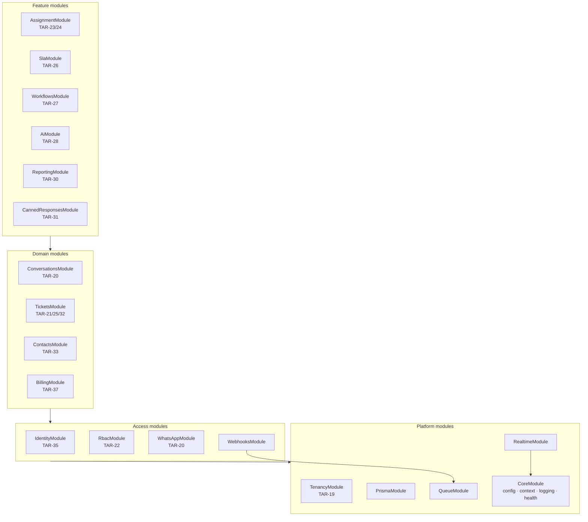
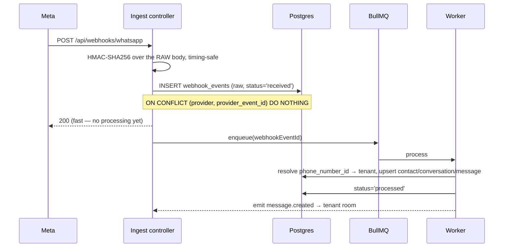

# Architecture and API contract (TAR-39)

Status: proposed · Supersedes nothing · Builds on [ADR 0001 — stack decision](../adr/0001-stack-decision.md) · [Amendments](#amendments): 1

## Context and Problem

TAR-38 landed a monorepo, a stack, and a `TenantContextService` that holds a `tenantId`
but never resolves one. Fifteen TAR-18 stories are waiting on the answer to three
questions before any of them can be written in parallel:

1. How does a request acquire a tenant, and how does that tenant reach the database?
2. What does an endpoint look like — path, body, error, auth — so that a frontend
   story can be built against an endpoint that does not exist yet?
3. Where do WhatsApp's webhooks land, and what guarantees do they carry?

The constraint that makes this non-trivial is **multi-tenant isolation as a hard
requirement** (TAR-18: "no tenant may reach another tenant's data … enforced at the
data layer, not just the UI") combined with **fifteen stories written by different
agents**. Any mechanism that depends on every future query remembering to filter by
`tenant_id` will fail — not immediately, and not visibly.

## Goals / Non-Goals

**Goals**

- One tenant-scoping mechanism, enforced below the application code that could forget it.
- A published contract concrete enough that backend and frontend stories can proceed
  in parallel without further coordination.
- Webhook ingestion that cannot lose a customer message when Redis is down.
- Billing and usage interfaces that let TAR-37 plug in Polar without leaking it, and
  let per-conversation overage be switched on later without a migration.

**Non-Goals**

- Implementing any of it. This issue publishes the contract; the stories build it.
- Feature-level design for workflows (TAR-27), AI (TAR-28) or reporting (TAR-30).
  Those stories own their internals; this document only fixes the boundaries they
  attach to.
- SSO, SAML and 2FA. Designed around, per TAR-18, not built.
- Per-conversation overage billing. The counters exist; the billing of them does not.

---

## Proposed Architecture

### Module boundaries

Modules are NestJS modules under `apps/api/src`. The layering rule is what keeps this
from collapsing into a ball of mutual imports:

> **A module may import a module below it. Never one beside or above it.**
> Cross-cutting reactions go through domain events, not imports.



**Ownership, one line each**

| Module                | Owns                                                          | Story        |
| --------------------- | ------------------------------------------------------------- | ------------ |
| `CoreModule`          | Config, `TenantContextService`, logging, health, error filter | TAR-38/41    |
| `PrismaModule`        | `TenantPrisma` and `SystemPrisma` clients, RLS wiring         | TAR-19       |
| `QueueModule`         | BullMQ registration, tenant-context propagation into workers  | TAR-41       |
| `RealtimeModule`      | Socket.IO gateway, rooms, handshake auth                      | TAR-20       |
| `TenancyModule`       | Tenant, domains, provisioning, lifecycle state machine        | TAR-19/36    |
| `IdentityModule`      | Users, sessions, invites, password reset, auth guard          | TAR-35       |
| `RbacModule`          | Roles, permissions, teams, permission guard                   | TAR-22       |
| `WhatsAppModule`      | WhatsApp accounts, templates, the Cloud API client            | TAR-20       |
| `WebhooksModule`      | Ingest controllers and processors for WhatsApp and billing    | TAR-20/37    |
| `ContactsModule`      | Contacts, tags, custom fields                                 | TAR-33       |
| `ConversationsModule` | Conversations, messages, internal notes                       | TAR-20       |
| `TicketsModule`       | Tickets, status, priority, the event log                      | TAR-21/25/32 |
| `BillingModule`       | Plans, subscriptions, entitlements, usage counters            | TAR-37       |
| `AssignmentModule`    | Round-robin and the condition-rule engine                     | TAR-23/24    |
| `SlaModule`           | SLA policies and timers                                       | TAR-26       |
| `WorkflowsModule`     | Trigger/condition/action automation                           | TAR-27       |
| `AiModule`            | Chatbot, knowledge base, human handoff                        | TAR-28       |
| `ReportingModule`     | Aggregates and dashboards                                     | TAR-30       |

**Why events rather than imports.** `TicketsModule` must not import `AssignmentModule`,
`SlaModule`, `WorkflowsModule` and `ReportingModule` — that is four imports today and a
cycle the moment assignment needs to read a ticket. Instead `TicketsModule` emits
`ticket.created`; the others subscribe. Adding TAR-27 then touches no existing module.

Two event buses, chosen by durability:

- **In-process** (`@nestjs/event-emitter`) for same-request reactions where loss is
  acceptable — cache busting, realtime fan-out.
- **BullMQ** for anything that must survive a restart — SLA timers, workflow actions,
  outbound sends, usage rollups.

Emit-side rule: a handler that must not be lost publishes to BullMQ, inside the same
transaction as the state change that caused it.

The first application of this rule is worked through in
[0003 — ticket auto-linking contract](./0003-ticket-auto-linking-contract.md):
`ConversationsModule` and `TicketsModule` are both L3, so auto-ticket creation crosses that
boundary as a BullMQ job whose payload lives in `packages/contracts`, not as an import.

---

## Technology Choices

Everything in ADR 0001 is inherited unchanged. Only decisions this document adds:

| Concern           | Choice                                      | Alternatives considered                  | Rationale                                                                 |
| ----------------- | ------------------------------------------- | ---------------------------------------- | ------------------------------------------------------------------------- |
| Tenant scoping    | Postgres RLS + Prisma client extension      | App-level filter only; schema-per-tenant | Database-enforced; survives a forgotten `where`                           |
| Session           | Opaque server-side session cookie           | JWT access + refresh                     | TAR-18 requires revocation; a JWT denylist is a session table in disguise |
| Tenant resolution | Request host → tenant domain                | Email lookup; tenant picker              | Matches white-label domains; no cross-tenant email enumeration            |
| User identity     | Tenant-scoped users, `UNIQUE(tenant,email)` | Global user + membership join            | One person per client org at v1; migration path recorded below            |
| Browser → API     | Same-origin Next.js proxy                   | Direct CORS calls to the API host        | Custom domains make the session cookie third-party otherwise              |
| Realtime auth     | Single-use handshake ticket                 | Cookie on the WebSocket upgrade          | Same third-party-cookie problem; ticket also caps replay window           |
| API versioning    | URI prefix `/api/v1`                        | `Accept` header versioning               | Visible in logs and CDN rules; boring                                     |
| Write idempotency | `Idempotency-Key` on unsafe POSTs           | Client-generated resource ids            | Works for sends, which have no client-visible id until Meta answers       |
| Usage accounting  | Transactional increment + nightly reconcile | Redis edge counters; pure derivation     | Replay-safe, and wrong numbers here become wrong invoices                 |

### Decision 1 — Tenant scoping: RLS, with the app filter as belt and braces

**Trade-off axis: enforcement strength vs. per-query cost.**

- **Chosen — RLS on every tenant-scoped table, driven by a Prisma client extension.**
  Two layers. The extension injects `tenantId` into every `where` and `data` on
  tenant-scoped models, so ordinary queries are correct and use the `(tenant_id, …)`
  composite indexes. Underneath, RLS is the backstop that catches what the extension
  cannot: hand-written `$queryRaw` for reporting and full-text search, a model added
  without registering it with the extension, an outright bug in the extension.

  Concretely, every query runs as a batched transaction that sets the GUC first:

  ```sql
  -- Statement 1, prepended by the extension
  SELECT set_config('app.tenant_id', $1, true);   -- `true` = transaction-local
  -- Statement 2, the actual query
  ```

  ```sql
  -- Applied per tenant-scoped table by the TAR-19 migration
  ALTER TABLE conversations ENABLE ROW LEVEL SECURITY;
  ALTER TABLE conversations FORCE  ROW LEVEL SECURITY;   -- also applies to the table owner
  CREATE POLICY tenant_isolation ON conversations
    USING      (tenant_id = current_setting('app.tenant_id', true)::uuid)
    WITH CHECK (tenant_id = current_setting('app.tenant_id', true)::uuid);
  ```

  `FORCE` matters: without it the table owner bypasses the policy, and Prisma migrations
  run as the owner. The application connects as a separate role that holds no
  `BYPASSRLS`, so a missing GUC yields **zero rows, not every row** — it fails closed.

  Cost, stated honestly: one extra statement per query, and every query runs in a
  transaction. Both are inside a single batched round trip, but that this is genuinely
  one round trip **needs verification** against Prisma 7 with the chosen driver adapter
  before TAR-19 commits to it. If it turns out to be two, the fallback is a connection
  checked out per unit of work with the GUC set once — more code, same guarantee.

  > **What landed, in TAR-48, TAR-49 and TAR-51.** Three differences from the two
  > paragraphs above, each deliberate. **The extension does not inject `tenantId` into
  > `where`/`data`** — a generic injection has to get nested writes, `connect`, `upsert` and
  > relation filters right or it silently drops rows, and RLS already filters correctly
  > using the same index. RLS is the only layer, not the backstop to a second one. **The
  > policy predicate is `NULLIF(current_setting('app.tenant_id', true), '')::uuid`** — a GUC
  > that was set and has since been reset reads back as the empty string rather than NULL,
  > and without the `NULLIF` it reaches the cast and fails the query instead of returning
  > zero rows. **The GUC is set through TAR-51's gate**,
  > `set_config('app.tenant_id', public.assert_tenant_active($1), true)`, so a deactivated
  > tenant never sets it. The round-trip question is answered in Open Questions, row 1. Full
  > contract: [`docs/reference/tenancy.md`](../reference/tenancy.md).

- **Rejected — application-level filtering only.** Cheapest and simplest, and what the
  extension alone would give us. Rejected because it is exactly the "promise every
  future query remembers" that TAR-18's isolation requirement rules out, and because
  reporting will be raw SQL, which an ORM extension cannot see.

- **Rejected — schema-per-tenant or database-per-tenant.** The strongest isolation
  available, and genuinely the right answer for a handful of large enterprise tenants.
  Rejected here: migrations must fan out across every schema, connection pooling
  degrades badly past a few dozen tenants, and cross-tenant platform reporting stops
  being a query. Reconsider only if a client contract demands physical separation.

**Rules that fall out, and are not optional**

1. All tenant data access goes through `TenantPrisma`. `SystemPrisma` — which bypasses
   scoping — is confined to a written list of call sites, and TAR-44 should treat any new
   usage as requiring justification in review. The list was five here; TAR-53's
   Amendment 2 revised it and it now reads: tenant provisioning, host→tenant resolution,
   webhook ingest, the sweeper, platform reporting, and `SessionReplayProbe` (TAR-58 —
   read-only, three uuids, nothing returned to a caller, and only on a request already
   being rejected). "Login" left the list under TAR-53's Amendment 1: the tenant is known
   from the `Host` before login runs, so every auth flow reads under RLS.
2. **Every** tenant-scoped table carries a non-null `tenant_id`, even where it is
   reachable by a foreign key. Denormalised on purpose: RLS policies cannot join.
3. Composite indexes lead with `tenant_id`.
4. A test that proves tenant B cannot read tenant A's rows ships with the first
   migration and runs in CI. Isolation regressions are silent otherwise.

### Decision 2 — Sessions and tenant resolution

**Trade-off axis: statelessness vs. revocability.**

- **Chosen — opaque session cookie.** 256 bits of entropy, httpOnly, `Secure`,
  `SameSite=Lax`, backed by a `sessions` row and cached in Redis. Revocation is a
  delete. TAR-18 requires session revocation and role changes that take effect
  immediately; both are free here and awkward with a JWT.
- **Rejected — JWT access + refresh.** Avoids a lookup per request. Rejected because
  revocation requires a denylist checked on every request — the same lookup, plus token
  plumbing — and because a role change would not take effect until the access token
  expired.

**Tenant resolution, in order, on every request:**

1. `Host` header → `tenant_domains.hostname` → candidate tenant. No match →
   `tenant_not_found`.
2. Session cookie → session → user → `user.tenant_id`.
3. **Assert (1) and (2) agree.** Mismatch → `tenant_mismatch`, logged as a security
   event. This is what stops a session issued on `acme.app.example.com` being replayed
   against `globex.app.example.com`.
4. `TenantContextService.setTenant(tenantId, userId)` on the scope the existing
   middleware opened. Downstream code — including `TenantPrisma` — reads only from there.

Non-HTTP entry points resolve the same context differently and then behave identically:

| Entry point      | Tenant comes from                                     |
| ---------------- | ----------------------------------------------------- |
| HTTP request     | Host + session, cross-checked                         |
| WhatsApp webhook | `phone_number_id` → `whatsapp_accounts.tenant_id`     |
| Billing webhook  | Provider customer id → `subscriptions.tenant_id`      |
| Queue job        | `tenantId` on the job payload, set at enqueue time    |
| Socket event     | The session resolved at handshake, held on the socket |

**Why users are tenant-scoped.** `UNIQUE (tenant_id, email)`, not a global unique email.
A person who works for two client organisations gets two accounts. This keeps login
host-resolved and avoids a "which workspace?" screen that would be actively wrong under
white-label branding. If that assumption breaks, the migration is additive: keep `users`
as the tenant-scoped membership, add a global `identities` table, and join. Recorded so
the choice is revisitable rather than accidental.

### Decision 3 — Why the browser never calls the API host directly

White-label tenants get custom domains (TAR-29). If the browser sits on
`support.acme.com` and calls `api.ourplatform.com`, the session cookie is third-party
and modern browsers drop it. So:

- `apps/web` proxies `/api/*` to the API origin via a Next.js rewrite. Every browser
  request is first-party to whatever host the user is on, and cookies simply work.
- The WebSocket cannot be proxied as reliably, so it connects to the realtime origin
  directly using a **single-use ticket** fetched over the proxy. No cookie involved.

`WEB_ORIGIN`/CORS remains configured for local development and for any non-browser
client, but is not load-bearing for the product.

---

## Data Model

Entities, with the tenant-scoping and indexing decisions that matter.

> **Landed in TAR-47, corrected in TAR-52, extended by TAR-80 and TAR-92.**
> `apps/api/prisma/schema.prisma` now holds all of this. The table below stays the
> specification and the reasoning; for what the database actually contains — every
> constraint, every enum, and the places the shipped schema differs from this table — read
> [`docs/reference/data-model.md`](../reference/data-model.md).

**Scoped** = carries `tenant_id`, RLS-protected.

| Entity                              | Scoped   | Key fields and constraints                                                                                                                            | Story     |
| ----------------------------------- | -------- | ----------------------------------------------------------------------------------------------------------------------------------------------------- | --------- |
| `tenants`                           | —        | `slug` unique; `status`; `trial_ends_at`                                                                                                              | TAR-19    |
| `tenant_domains`                    | ✓        | `hostname` **globally** unique; `kind`; `verified_at`                                                                                                 | TAR-19/29 |
| `tenant_branding`                   | ✓        | one row per tenant                                                                                                                                    | TAR-29    |
| `tenant_settings`                   | ✓        | one row per tenant; `timezone`, `locale`, `business_hours JSONB` — seeded at provisioning                                                             | TAR-19    |
| `users`                             | ✓        | `UNIQUE (tenant_id, email)` on `citext`; `role`; `status`; `password_hash`                                                                            | TAR-35    |
| `sessions`                          | ✓        | `token_hash` unique; `expires_at`; index `(user_id)` for bulk revoke                                                                                  | TAR-35    |
| `invites`                           | ✓        | `token_hash` unique; `expires_at`; `accepted_at`                                                                                                      | TAR-35    |
| `teams`, `team_members`             | ✓        | `UNIQUE (tenant_id, name)`; `(team_id, user_id)`                                                                                                      | TAR-22    |
| `whatsapp_business_accounts`        | ✓        | `waba_id` globally unique; encrypted access token; verification status                                                                                | TAR-52    |
| `whatsapp_accounts`                 | ✓        | One phone number, child of a WABA. `phone_number_id` **globally** unique — the routing key; quality rating                                            | TAR-52    |
| `message_templates`                 | ✓        | `UNIQUE (tenant_id, whatsapp_business_account_id, name, language)`; approval status — scoped to the WABA                                              | TAR-52    |
| `contacts`                          | ✓        | `UNIQUE (tenant_id, phone_e164)`; `custom_fields JSONB`; `opted_out_at`                                                                               | TAR-33    |
| `tags`, `contact_tags`              | ✓        | `UNIQUE (tenant_id, name)`                                                                                                                            | TAR-33    |
| `custom_field_defs`                 | ✓        | `UNIQUE (tenant_id, key)`                                                                                                                             | TAR-33    |
| `conversations`                     | ✓        | `UNIQUE (tenant_id, whatsapp_account_id, contact_id)`; `service_window_expires_at`                                                                    | TAR-20    |
| `messages`                          | ✓        | `UNIQUE (tenant_id, provider_message_id)`; `sent_at`; `status`                                                                                        | TAR-20    |
| `message_attachments`               | ✓        | `message_id`; re-hosted `url`; `media_object_id` — [amendment 3](#amendment-3--media-tar-20e)                                                         | TAR-20    |
| `media_objects`                     | ✓        | one stored binary; `UNIQUE (tenant_id, storage_key)` — [amendment 3](#amendment-3--media-tar-20e)                                                     | TAR-20    |
| `internal_notes`                    | ✓        | `conversation_id`; `mentioned_user_ids`                                                                                                               | TAR-20    |
| `tickets`                           | ✓        | `UNIQUE (tenant_id, number)`; `status`; `priority`; `conversation_id`; one active ticket per contact — [0003](./0003-ticket-auto-linking-contract.md) | TAR-21/25 |
| `ticket_counters`                   | ✓        | one row per tenant; the ticket-number allocator — [0003](./0003-ticket-auto-linking-contract.md)                                                      | TAR-21    |
| `ticket_events`                     | ✓        | append-only; `(tenant_id, ticket_id, created_at)`                                                                                                     | TAR-21/32 |
| `assignment_rules`                  | ✓        | ordered by `position`, ties on `id`; `conditions JSONB` — grammar and schema deltas in [0007](./0007-routing-rules-and-assignment-fallback.md)        | TAR-24    |
| `assignment_state`                  | ✓        | round-robin cursor per team                                                                                                                           | TAR-23    |
| `sla_policies`, `sla_timers`        | ✓        | `due_at`; partial index on unresolved timers                                                                                                          | TAR-26    |
| `workflows`, `workflow_runs`        | ✓        | `definition JSONB`                                                                                                                                    | TAR-27    |
| `ai_configs`, `knowledge_documents` | ✓        | per-tenant KB                                                                                                                                         | TAR-28    |
| `canned_responses`                  | ✓        | `UNIQUE (tenant_id, shortcut)`                                                                                                                        | TAR-31    |
| `plans`                             | —        | `key` unique; `entitlements JSONB` — platform-wide, not per tenant                                                                                    | TAR-37    |
| `subscriptions`                     | ✓        | one per tenant; opaque `provider_*` ids; `current_period_*`                                                                                           | TAR-37    |
| `usage_counters`                    | ✓        | `UNIQUE (tenant_id, metric, period_start)`                                                                                                            | TAR-37    |
| `webhook_events`                    | nullable | `UNIQUE (provider, provider_event_id)`; `status`; **not** RLS-protected — see below                                                                   | TAR-20    |
| `idempotency_keys`                  | ✓        | `UNIQUE (tenant_id, key)`; `request_hash`; `response_body`                                                                                            | TAR-20    |
| `audit_logs`                        | ✓        | actor, action, target, `(tenant_id, created_at)`                                                                                                      | TAR-22    |

**`webhook_events` is the deliberate exception.** It is written _before_ the tenant is
known — that is the whole point of storing first and routing later — so it cannot carry
a non-null `tenant_id` and cannot be RLS-protected on insert. It is therefore written
only by `SystemPrisma`, from the ingest controller and the sweeper, and never read by
tenant-facing code. `tenant_id` is filled in during processing, for forensics.

**Indexes that are load-bearing, and why**

| Index                                                                       | Serves                                                                                                                                                                                 |
| --------------------------------------------------------------------------- | -------------------------------------------------------------------------------------------------------------------------------------------------------------------------------------- |
| `messages (tenant_id, conversation_id, sent_at DESC, id DESC)`              | Thread view + keyset pagination                                                                                                                                                        |
| `conversations (tenant_id, status, last_message_at DESC, id DESC)`          | The inbox list, the hottest query                                                                                                                                                      |
| `conversations (tenant_id, assigned_user_id, status)`                       | An agent's default view                                                                                                                                                                |
| `tickets (tenant_id, status, priority, created_at DESC)`                    | Ticket queues and supervisor dashboards                                                                                                                                                |
| `tickets (tenant_id, contact_id) WHERE status IN ('open','pending')` unique | Partial index — the one-active-ticket-per-contact invariant, and the "has this contact an open ticket?" read on every inbound message ([0003](./0003-ticket-auto-linking-contract.md)) |
| `sla_timers (tenant_id, due_at) WHERE state = 'running'`                    | Partial index — the timer sweep                                                                                                                                                        |
| `contacts (tenant_id, phone_e164)` unique                                   | Inbound message → contact, per message                                                                                                                                                 |

Sort keys are `(timestamp DESC, id DESC)` throughout, which is what makes UUIDv7 ids
worth having: the id is a stable tie-breaker for two rows in the same millisecond.

> **One of these did not land as written.** The SLA sweep shipped as
> `sla_timers (tenant_id, state, due_at)`, not as the partial index above: Prisma cannot
> express a `WHERE` on an index, and one created outside the schema shows up as drift that
> the next `migrate dev` proposes to drop. Equality on `state` then a range scan on `due_at`
> gives the sweep the same access path, at the cost of also indexing finished timers.
> Revisit as a partial index once timer volume makes the size matter; the query does not
> have to change. The indexes as they actually exist are in
> [`docs/reference/data-model.md`](../reference/data-model.md).

**Cursor encoding.** `base64url(JSON.stringify({ v: 1, k: [<sortValue>, ...], id: <uuid> }))`,
opaque to clients. Keyset, never `OFFSET` — an offset page duplicates and skips rows in
a feed that is being appended to while it is read.

`k` is **always an array**, one entry per sort column in declared order, with `id` as the
final tie-breaker — `k: [lastMessageAt]` for the inbox, `k: [name, language]` for a
two-column sort. It is an array even at length one, so that adding a second sort column to
a list later is not a cursor format change. Comparison is tuple order: left to right, each
column deciding only when every column before it is equal.

Postgres expresses that resume predicate directly as a row comparison —
`(name, language, id) > ($1, $2, $3)` — which a btree index leading with those columns
serves as a **start condition**: the scan begins at the cursor and reads forward `LIMIT`
rows. Prisma's query API has no row comparison, and the obvious translation is a nested
disjunction:

```sql
-- Correct, and the wrong shape. Do not write this.
name > $1 OR (name = $1 AND (language > $2 OR (language = $2 AND id > $3)))
```

It returns the right rows and loses the property the rule exists for. A planner cannot
turn a nested OR into one index start condition: it either scans the index from the
beginning of the range and applies the disjunction as a filter, or bitmaps the branches
together and sorts the result to restore `ORDER BY`. Either way the work grows with how
far into the list the cursor sits, which is the `OFFSET` cost profile keyset pagination
was chosen to avoid — on `messages` and `conversations`, the two hottest queries in this
document.

**The form to write** puts an inclusive bound on the leading column, which _is_ a start
condition, and subtracts the part of that column's tie group already returned:

```sql
-- (sentAt DESC, id DESC)
sentAt <= $1 AND NOT (sentAt = $1 AND id >= $2)

-- (name ASC, language ASC, id ASC)
name >= $1 AND NOT (name = $1 AND (language < $2 OR (language = $2 AND id <= $3)))
```

Both are expressible in Prisma's fluent API — `NOT` takes a nested `where` — so the typed
client is kept.

**Its breaking point, because it has one.** The rows the `NOT` discards are exactly those
sharing the cursor's leading value and already returned, so the extra work per page is the
size of that one tie group. For a timestamp or a template name that group holds one row or
a handful. For a low-cardinality leading column — a status, a boolean — the group is the
whole partition, the bound rewinds to the start of it on every page, and the form degrades
to precisely the scan it was meant to replace. **No list in this document sorts that way,
and none should start.** If one must, `$queryRaw` with a true row comparison is the
sanctioned escape, on the same footing decision 1 already grants reporting: raw SQL is
safe here because isolation is enforced by the database, not by the query that forgot it.

**Every keyset sort column is `NOT NULL`**, and that is a rule about the schema, not a
detail of the predicate. Three-valued logic makes both sides return `NULL` for a `NULL`
row — `lastMessageAt <= $1` is `NULL`, which is not true — so the row is filtered out of
every page after the first. It appears on page one, where there is no cursor and therefore
no predicate, and never again. That is the same silent-truncation class as comparing only
the leading column: no error, a row that simply stops appearing.

The losing-one-row case is the mild one. Because `NULL` sorts first under `DESC`, the
`NULL` rows are page one, so as soon as a page boundary falls inside that block — at any
`limit`, including 1 — the cursor carries `NULL` as its sort value, the predicate is
`NULL` against every candidate row, and the next page comes back empty. The list does not
lose a row; it **ends there**, with everything past the `NULL` block unreachable and the
client correctly believing it has read to the end.

The cursor format cannot express the value in the first place, which is the same
constraint arriving from the other direction: `KeysetCursor.sortValues` is `string[]`, and
`decodeKeysetCursor` rejects any `k` that is not an array of strings. A `NULL` sort value
either fails to decode — `validation_failed` for a cursor the server itself issued — or
gets serialised to the string `"null"` and compared as text, which is worse for being
plausible. `NOT NULL` is what keeps the wire format honest, not only the query.

`conversations.last_message_at` was the one column in the schema that broke this rule, and
it is the inbox's own sort key. It is `NOT NULL` now, defaulted to the row's creation
time: a conversation with no messages sorts by when it was created, which is where an
operator would look for it anyway. `ConversationResponse.lastMessageAt` is non-nullable
with it — `lastMessagePreview` keeps its own nullability, being no part of any sort. The
reasoning is recorded because the constraint is not self-evident from the column: left
nullable, one message-less conversation would have sat pinned above every active thread on
page one of the inbox, and truncated the inbox at itself for everyone paging past it.

If a column genuinely cannot be `NOT NULL`, it cannot be a keyset sort column either —
sort on a `NOT NULL` surrogate instead. `NULLS LAST` with a two-mode predicate, one for
the non-null region and one for the `NULL` block with the cursor encoding which mode it is
resuming in, does work, and needs the index declared `NULLS LAST` to match. That is a
standing cost in every list implementation, and it is not worth paying for a column that
could have been `NOT NULL`.

Whichever form, verify with `EXPLAIN` that the plan shows an index scan with the predicate
as an index condition rather than a filter, and no sort node. No plan is asserted here.

What is **not** a correct predicate in any form is comparing only the leading column and
the id — `(name, id) > ($1, $3)` — which drops every row sharing a `name` with the page
boundary whose id sorts before it. That failure is silent: no error, a row simply never
appears.

---

## Interfaces

### Conventions

| Concern        | Rule                                                                                      |
| -------------- | ----------------------------------------------------------------------------------------- |
| Base path      | `/api/v1`. `/api/health` stays unversioned                                                |
| Resources      | Plural kebab-case nouns: `/conversations`, `/assignment-rules`                            |
| Non-CRUD verbs | Sub-resource POST: `POST /tickets/{id}/assign`. Never a verb in a query parameter         |
| Nesting        | One level maximum: `/conversations/{id}/messages`. Deeper, and it is a filter instead     |
| Bodies         | JSON. `camelCase` keys throughout; SQL stays `snake_case`, mapped by Prisma               |
| Success shape  | The resource itself; lists return `{ items, nextCursor }`. No envelope                    |
| Error shape    | TAR-38's `ApiErrorSchema`, always, with a code from `error-codes.ts`                      |
| Timestamps     | ISO 8601 with offset                                                                      |
| Money          | Integer minor units + ISO 4217 code. Never a float                                        |
| Phone numbers  | E.164                                                                                     |
| Status codes   | 200 read/update · 201 create · 204 delete · error status from the code table              |
| Validation     | Zod from `@whatsappcrm/contracts`, via a global pipe. Unknown keys stripped, not rejected |

**One schema, both sides.** Every request and response shape lives in
`packages/contracts` as a Zod schema, imported by the API for validation and by the web
app for types. A contract change that breaks the frontend fails `pnpm typecheck` in CI,
which is the point.

**Response serialisation.** An interceptor parses outbound payloads against the response
schema. In development and test it throws on mismatch; in production it strips unknown
keys and logs. This is the guard against a `passwordHash` reaching a client because
someone returned a Prisma model directly.

### Request pipeline

Order is not arbitrary — each stage depends on the last:

```
1. TenantContextMiddleware   opens the ALS scope, assigns x-request-id     [TAR-38, exists]
2. HostTenantGuard           Host → tenant; 404 tenant_not_found           [TAR-19]
3. AuthGuard                 cookie → session → principal; cross-checks
                             tenant; calls setTenant()                     [TAR-35]
4. TenantStatusGuard         suspended/cancelled → subscription_inactive   [TAR-36]
5. PermissionGuard           @RequirePermission(...)                       [TAR-22]
6. FeatureGuard              @RequireFeature(...) against entitlements     [TAR-37]
7. ValidationPipe            Zod parse of body, query, params
8. Handler
9. SerializerInterceptor     Zod parse of the response
10. ErrorFilter              maps any throw to the envelope                [TAR-41 wires logging]
```

**Stages 2, 3 and 5 are installed globally by `RequestPipelineModule` (TAR-58)**, in that
order, as `APP_GUARD` providers. No controller declares them; a route that says nothing is
closed, and `PermissionGuard` refuses a route carrying no `@RequirePermission` /
`@AnyPrincipal` rather than admitting it. Stages 4 and 6 slot into the same module when
TAR-36 and TAR-37 land. Ordering is asserted end to end in
`request-pipeline.http.spec.ts` — an unknown host must answer `tenant_not_found` before it
can answer `unauthenticated` — and every registered route is checked for exactly one
declared posture by `route-posture.spec.ts`, so a new controller that forgets fails in CI
rather than on the first request.

There are exactly **two** opt-outs, and both are decorators a reviewer can see in the diff:

- **`@Public()`** — out of 3–6, **not** out of 2. The tenant is still resolved from the
  host, because login and password reset have to know which tenant they are authenticating
  against. Used by `POST /api/v1/auth/*` (login and the reset pair) and, when they land,
  `GET /tenant/public` and the invite lookup.
- **`@PlatformRoute()`** — out of 2–6 as well. For routes that are not served inside a
  tenant at all: `/api/health`, `/api/webhooks/whatsapp`, and `/api/v1/admin/*`. It removes
  the _tenant_ pipeline and nothing else — each of those routes carries its own
  authentication (the platform-admin bearer token, the webhook HMAC) or is deliberately
  open (the probes). Nothing is left in scope, so `TenantPrisma` refuses every statement and
  a platform route that reaches for tenant data fails closed rather than reading whichever
  tenant the host happened to resolve.

`/api/v1/admin/*` skips stages 2–6. Stage 1 still runs, and must: `TenantContextMiddleware`
is registered at `{*path}` and opens the scope that carries `requestId`, which the error
filter reads to correlate a failure. An admin route exempted from it would still work and
would lose every correlation id it emits. What admin skips is tenant resolution and the
guards above it. It is the **platform-operator** surface — us, not a customer inside a
tenant — and it is authenticated by
`PlatformAdminGuard` (TAR-19, hardened in TAR-51): a fail-closed, timing-safe shared
bearer token, deliberately not a session, because the operator is not a user in any tenant
and provisioning has to work before the first user exists. Stages 2–6 have nothing to
resolve for such a caller. The trade the guard's own comment states plainly: a shared
secret has no per-operator identity, no revocation and no audit trail beyond "someone with
the token" — right-sized for provisioning, and the thing to replace when a platform-admin
identity exists. [Amendment 2](#amendment-2--tenant-self-service-waba-connection-tar-161)
narrows it where it matters most: the credential becomes a set of labelled entries and the
matching label lands on the audit row, so writing a customer's Meta credential is
attributable even though the caller is still not a session.

### Endpoint surface

Stage-1 stories build against exactly this. Later stories add their own, following the
same conventions — and when one does, it is ruled on here rather than left to emerge from
an implementation. See [Amendment 1](#amendment-1--message-templates-tar-20a) for the
first such addition.

```
# Auth and session                                                        TAR-35
POST   /api/v1/auth/login                    → SessionResponse   (sets cookie)
POST   /api/v1/auth/logout                   → 204
GET    /api/v1/auth/session                  → SessionResponse
POST   /api/v1/auth/password-reset           → 204               (always 204: no enumeration)
POST   /api/v1/auth/password-reset/confirm   → 204
POST   /api/v1/auth/realtime-ticket          → RealtimeTicketResponse
GET    /api/v1/invites/{token}               → InviteResponse    (public, pre-acceptance)
POST   /api/v1/invites/{token}/accept        → SessionResponse

# Tenant                                                                  TAR-19/29
GET    /api/v1/tenant/public                 → TenantPublicResponse       (public)
GET    /api/v1/tenant                        → TenantResponse
PATCH  /api/v1/tenant                        → TenantResponse             branding:write

# Users and teams                                                         TAR-22
GET    /api/v1/users                         → CursorPage<UserResponse>   user:read
POST   /api/v1/users/invites                 → InviteResponse             user:invite
PATCH  /api/v1/users/{id}                    → UserResponse               user:update
DELETE /api/v1/users/{id}                    → 204                        user:remove
PATCH  /api/v1/users/me/availability         → UserResponse
GET    /api/v1/teams                         → CursorPage<TeamResponse>   team:read
POST   /api/v1/teams                         → TeamResponse               team:write

# Contacts                                                                TAR-33
GET    /api/v1/contacts                      → CursorPage<ContactResponse>  contact:read
POST   /api/v1/contacts                      → ContactResponse              contact:write
GET    /api/v1/contacts/{id}                 → ContactResponse              contact:read
PATCH  /api/v1/contacts/{id}                 → ContactResponse              contact:write

# Inbox                                                                   TAR-20
GET    /api/v1/conversations                 → CursorPage<ConversationResponse>  conversation:read
GET    /api/v1/conversations/{id}            → ConversationResponse
PATCH  /api/v1/conversations/{id}/status     → ConversationResponse
POST   /api/v1/conversations/{id}/claim      → ConversationResponse   conversation:claim
                                                                      added by amendment 6
POST   /api/v1/conversations/{id}/assign     → ConversationResponse   conversation:assign
POST   /api/v1/conversations/{id}/read       → 204
GET    /api/v1/conversations/{id}/messages   → CursorPage<MessageResponse>
POST   /api/v1/conversations/{id}/messages   → MessageResponse        conversation:send
                                                                      Idempotency-Key required
GET    /api/v1/conversations/{id}/notes      → CursorPage<InternalNoteResponse>
POST   /api/v1/conversations/{id}/notes      → InternalNoteResponse   conversation:note
POST   /api/v1/media                         → { mediaId }            multipart
GET    /api/v1/media/{id}                    → MediaObjectResponse
                                                                      added by amendment 3
GET    /api/v1/media/{id}/content            → the bytes
                                                                      added by amendment 3
GET    /api/v1/message-templates             → CursorPage<MessageTemplateResponse>
                                                                      conversation:send
                                                                      added by amendment 1

# WhatsApp channel (tenant-facing)                                        TAR-161/91
POST   /api/v1/whatsapp/business-accounts    → ConnectedWhatsAppBusinessAccountResponse
                                                                      channel:manage
                                                                      added by amendment 2
GET    /api/v1/whatsapp/message-templates    → CursorPage<MessageTemplateAdminResponse>
                                                                      channel:manage
                                                                      added by amendment 8

# Tickets                                                                 TAR-21/25/32
GET    /api/v1/tickets                       → CursorPage<TicketResponse>  ticket:read
GET    /api/v1/tickets/{id}                  → TicketResponse
PATCH  /api/v1/tickets/{id}                  → TicketResponse             ticket:update
POST   /api/v1/tickets/{id}/assign           → TicketResponse             ticket:assign
GET    /api/v1/tickets/{id}/events           → CursorPage<TicketEvent>

# Assignment rules                                                        TAR-24
# Shapes, condition grammar, evaluation order and the fallback seam:
# docs/architecture/0007-routing-rules-and-assignment-fallback.md
GET    /api/v1/assignment-rules              → AssignmentRuleListResponse assignment_rule:read
POST   /api/v1/assignment-rules              → AssignmentRuleResponse     assignment_rule:write
GET    /api/v1/assignment-rules/{id}         → AssignmentRuleResponse     assignment_rule:read
PATCH  /api/v1/assignment-rules/{id}         → AssignmentRuleResponse     assignment_rule:write
DELETE /api/v1/assignment-rules/{id}         → 204                        assignment_rule:write
POST   /api/v1/assignment-rules/reorder      → AssignmentRuleListResponse assignment_rule:write
                                                                      added by amendment 7

# Billing                                                                 TAR-37
GET    /api/v1/billing/subscription          → BillingSummaryResponse     billing:read
GET    /api/v1/billing/usage                 → UsageSummaryResponse       billing:read
POST   /api/v1/billing/checkout              → HostedSession              billing:manage
POST   /api/v1/billing/portal                → HostedSession              billing:manage

# WhatsApp channel administration                                         TAR-161
POST   /api/v1/whatsapp/business-accounts    → ConnectedWhatsAppBusinessAccountResponse
                                                                      channel:manage
                                                                      201 new · 200 updated
                                                                      no Idempotency-Key
                                                                      added by amendment 2

# Platform operator — PlatformAdminGuard bearer token, never a session   TAR-19/51
# Shapes, errors, idempotency and retention: docs/reference/admin-api.md
POST   /api/v1/admin/tenants                 → ProvisionedTenantResponse   201 new · 200 existing
POST   /api/v1/admin/tenants/{slug}/deactivate → DeactivatedTenantResponse 200

# Webhooks — public, signature-verified, never cookie-authenticated
GET    /api/webhooks/whatsapp                → hub.challenge echo
POST   /api/webhooks/whatsapp                → 200
POST   /api/webhooks/billing                 → 200
```

### Idempotency

`POST` endpoints that cause external side effects — sends and billing operations —
require an `Idempotency-Key` header (a client-generated UUID).

- First use: process, then store `(tenant_id, key, request_hash, status, response_body)`.
- Replay with the same body: return the stored response. Nothing re-executes.
- Replay with a **different** body: `idempotency_key_reused`, 409.
- Keys expire after 24 hours.

Without this, an agent double-clicking Send during a slow Meta call sends the customer
two messages.

### Rate limiting

Per tenant and per principal, sliding window in Redis. Exceeding it returns
`rate_limited` with `Retry-After`. Webhook endpoints are exempt — throttling Meta causes
retries and, eventually, lost messages. Limits themselves are TAR-41's to set.

### Billing and usage ports

Both are defined as TypeScript interfaces in `packages/contracts`:

- **`BillingProvider`** (`billing.ts`) — the only surface that touches a payment
  provider. Every method speaks our vocabulary (`tenantId`, `planKey`, `seats`); provider
  ids are opaque strings the adapter alone interprets. TAR-37 implements
  `PolarBillingProvider` behind the `BILLING_PROVIDER` token, plus a `FakeBillingProvider`
  so the whole flow is exercisable locally without a sandbox account.
- **`UsageService`** (`usage.ts`) — `increment` / `recordGauge` / `current` / `summary` /
  `reconcile`, keyed on `(tenant_id, metric, period_start)`.

Two rules make usage trustworthy:

1. **Increments happen in the transaction that writes the source row.** A replayed
   webhook hits the `provider_message_id` unique constraint, the transaction rolls back,
   and the increment rolls back with it. Counting in Redis at the edge would double-count
   on every Meta retry — silently, in the subsystem where wrong numbers become wrong
   invoices.
2. **A nightly `reconcile` recomputes from source tables.** A bug then costs one day of
   accuracy rather than a permanently wrong invoice.

Periods are the subscription's own billing period, never the calendar month, so a
counter can never straddle two invoices when a tenant upgrades mid-month. Per-conversation
overage stays a non-goal; `conversations_opened` is recorded from day one so enabling it
later is a pricing change, not a migration.

### Realtime

Rooms are the isolation boundary: `tenant:{id}`, `conversation:{id}`, `user:{id}`. A
socket joins its tenant room from the **server's** view of the session at handshake — a
client-supplied room name is never honoured, since that is the obvious way to leak
another tenant's inbox. `conversation.subscribe` takes a conversation id and the server
authorises it before joining.

Payloads are whole resources, not deltas. A client that misses one event during a
reconnect would otherwise hold corrupt state indefinitely; refetch-on-reconnect plus
full payloads makes recovery trivial.

---

## WhatsApp webhook ingestion

ADR 0001 fixed the durability rule; this is the design that honours it.



**Verification handshake.** `GET` with `hub.mode=subscribe`; compare `hub.verify_token`
against the configured value with a timing-safe comparison and echo `hub.challenge`
verbatim. Wrong token → 403, no echo.

**Signature check.** `X-Hub-Signature-256` is HMAC-SHA256 of the **raw** body with the
Meta app secret. This requires the raw buffer, so the ingest route must be registered
with Nest's `rawBody` option — a JSON-parsed-and-restringified body will not match, and
the failure looks like a config problem rather than what it is. Comparison is
`timingSafeEqual`. Failure → `webhook_signature_invalid`, and the payload is **not**
stored.

**One Meta app serves every tenant.** The app secret and verify token are
platform-level, not per-tenant. Tenant routing is `phone_number_id` →
`whatsapp_accounts` — which is why that column is globally unique. An unknown
`phone_number_id` is still stored, then parked as `failed` with a distinct reason; it
usually means a number was connected before the tenant record existed, and discarding it
would lose real messages.

**Ordering.** Meta does not guarantee delivery order, and the ingest path is concurrent.
Threads therefore sort by the provider's `sent_at`, never by insert order. Status
webhooks may arrive before the message they describe: the writer upserts on
`(tenant_id, provider_message_id)` and applies the status only if it advances
(`isMessageStatusAdvance`), so a late `sent` cannot un-read a message.

**The sweeper.** A repeatable BullMQ job re-enqueues `webhook_events` still in
`received`, or stuck in `processing`, past a threshold. This is what converts a Redis
outage from message loss into message lateness — the single most valuable property in
the design, since ADR 0001 put both realtime and the queue on Redis.

**Outbound.** Sends are queued, not called inline: Meta latency must not become request
latency, and retries need backoff. The message row is created `queued` and returned
immediately, so the agent's UI is optimistic and the socket delivers the status
transitions.

---

## Failure Modes and Operations

| Component             | Down                                                                      | Slow                                                                    | Bad data                                                                    |
| --------------------- | ------------------------------------------------------------------------- | ----------------------------------------------------------------------- | --------------------------------------------------------------------------- |
| RLS GUC not set       | Queries return **zero rows** — fails closed, loudly                       | —                                                                       | The dangerous inverse (returning all rows) is impossible by construction    |
| Session store (Redis) | Falls back to the Postgres `sessions` table; slower, still correct        | Login latency                                                           | A stale cached principal outlives a role change — cache TTL ≤ 60s bounds it |
| Webhook ingest        | Meta retries, then gives up; the sweeper recovers anything already stored | Meta retries on timeout → duplicates, absorbed by the unique constraint | Unknown `phone_number_id` parks as `failed`, never silently dropped         |
| Queue (Redis)         | Inbound is stored but unprocessed; the inbox goes stale, nothing is lost  | SLA timers fire late — this has contractual meaning                     | Jobs must be idempotent; every one is keyed on a durable row id             |
| Billing provider      | Checkout and portal unavailable; existing tenants unaffected              | —                                                                       | Webhook replay is idempotent on `provider_event_id`                         |
| Usage counters        | —                                                                         | —                                                                       | Drift corrected nightly by `reconcile`                                      |

**What should page someone:** any `tenant_mismatch` (a session replayed across tenants),
`webhook_events` in `received` older than five minutes (ingestion is stalled), and a
`reconcile` correction above a threshold (the transactional increment path is broken).
TAR-41 owns wiring these to alerting.

**Scale ceiling.** This design targets the low hundreds of concurrent agents and a
single Postgres primary — correct for a product with zero tenants. The first thing to
break is `messages` insert throughput and inbox-list latency under a large tenant. Next
steps, in order: read replicas for reporting, then partition `messages` by
`(tenant_id, sent_at)`, then a dedicated realtime tier. Do not pre-build any of it.

## Security and Access

- Passwords hashed with Argon2id. Session and invite tokens are stored **hashed**, so a
  database leak does not hand over live sessions.
- Session cookie: httpOnly, `Secure`, `SameSite=Lax`, host-scoped — never a wildcard
  parent domain, which under white-label would share a cookie across tenant domains.
- `not_found` rather than `forbidden` for another tenant's resource. A 403 confirms the
  id exists, which is itself a cross-tenant leak.
- Login, password reset and invite lookup are rate-limited and answer identically for
  known and unknown addresses.
- Permission checks are server-side and independent of the UI. TAR-22's frontend hiding
  a button is presentation, not access control.
- Webhook secrets, the Meta app secret and the billing signing secret come from the
  deployment target's secret store (TAR-41). Never committed; `.env.example` documents
  the keys with no values.
- WhatsApp access tokens are per-tenant credentials stored encrypted at rest, decrypted
  only in the send path.
- Audit log for role changes, invites, session revocation, branding and billing changes.
- No PII in log lines or error-tracker payloads. Message bodies are never logged; the
  `requestId` is the correlation handle.

## Implementation Phases

TAR-18 already carries the story breakdown, so this section maps the contract onto those
stories rather than creating new ones. **No sub-issues are created by this issue.**

| Order | Story                       | Delivers from this contract                                                                        | Unblocks      |
| ----- | --------------------------- | -------------------------------------------------------------------------------------------------- | ------------- |
| 1     | **TAR-19**                  | Prisma models, RLS migration, `TenantPrisma`/`SystemPrisma`, host→tenant guard, isolation test     | everything    |
| 1a    | TAR-47 ✅                   | Prisma models and the initial migration — landed on `main`                                         | TAR-48/49     |
| 1b    | **TAR-48**                  | RLS policies, `FORCE ROW LEVEL SECURITY`, the non-`BYPASSRLS` app role, isolation test             | the guarantee |
| 1c    | **TAR-49**                  | `TenantPrisma`/`SystemPrisma` split and the client extension that sets the GUC                     | every query   |
| 1d    | TAR-50/51                   | Tenant provisioning and deactivation flows                                                         | TAR-36        |
| 2     | TAR-35                      | Sessions, login, invites, `AuthGuard`, `setTenant()`                                               | TAR-20/22     |
| 2     | TAR-22                      | Roles, teams, `PermissionGuard`                                                                    | TAR-23/24     |
| 3     | TAR-20                      | WhatsApp accounts, ingest + processors, inbox, realtime                                            | TAR-21/28     |
| 3     | TAR-46                      | Seed data against the entities above                                                               | TAR-45        |
| 4     | TAR-21/25/26/32             | Tickets, status, SLA, event log — contract fixed by [0003](./0003-ticket-auto-linking-contract.md) | TAR-30        |
| 4     | TAR-37                      | `PolarBillingProvider`, plans, entitlements, usage counters                                        | TAR-36        |
| 5     | TAR-23/24/27/28/29/30/31/33 | Feature modules against fixed boundaries                                                           | —             |

The ordering constraint that matters: **TAR-19 is a hard prerequisite for everything
else**, because it lands the schema and the scoping mechanism every other story writes
against. See the note on promotion in the publishing comment.

> **The schema is not the guarantee.** TAR-47 has landed every `tenant_id` column and
> every uniqueness constraint this document specifies — but until **TAR-48** creates the
> policies and **TAR-49** sets the GUC, row-level security is not switched on and tenant
> isolation is enforced by nothing at all. A schema that merely _has_ `tenant_id`
> columns looks identical, in review, to one that enforces them. Any story writing
> queries before those two land must not assume isolation is handled.

## Open Questions and Risks

| #   | Item                                                                                                                                                                                                                                | Severity | Resolution                                                                                                                                                                                     |
| --- | ----------------------------------------------------------------------------------------------------------------------------------------------------------------------------------------------------------------------------------- | -------- | ---------------------------------------------------------------------------------------------------------------------------------------------------------------------------------------------- |
| 1   | ~~**Prisma 7 + RLS ergonomics.**~~ **Answered by TAR-49.** The pattern works; it is **not** one round trip — `BEGIN`, `set_config`, the query and `COMMIT` are four driver calls. Measured locally: 0.7 ms plain, 2.3–3.4 ms scoped | Closed   | Kept, because the guarantee is worth ~2 ms. The fallback shipped alongside it as `$tenantTransaction`, which sets the GUC once per unit of work; use it on any path issuing several statements |
| 2   | **RLS query-plan cost** on `messages` and `conversations` at volume is unmeasured. No benchmark is claimed here                                                                                                                     | Medium   | Measure in **TAR-48** with realistic seed data from TAR-46                                                                                                                                     |
| 3   | **Tenant-scoped users** assumes nobody works for two client organisations                                                                                                                                                           | Medium   | **Assumed, not answered** — see below. Additive migration path recorded above                                                                                                                  |
| 4   | **Custom-domain TLS issuance** (TAR-29) is unspecified and depends on Render's capabilities                                                                                                                                         | Medium   | TAR-41 verifies at provisioning; TAR-29 designs against the answer                                                                                                                             |
| 5   | **Data residency** — inherited, still unanswered. ADR 0001 assumes none required                                                                                                                                                    | High     | Unchanged; TAR-41 provisions dev/staging first                                                                                                                                                 |
| 6   | ~~**WhatsApp templates** are approved per WABA. Whether tenants share one WABA or each brings their own changes the template model~~                                                                                                | Closed   | **Answered by Tarek** — see below. One _or more_ WABAs per tenant; the schema change that follows landed in **TAR-52**                                                                         |
| 7   | **Data retention** on tenant deletion — TAR-18 says 30 days "pending client policy"                                                                                                                                                 | Low now  | Must be settled before TAR-36 ships deletion                                                                                                                                                   |

### Questions 3 and 6 — answered by Tarek

Both are now settled. Recorded here rather than left in a comment thread, because the
first has a consequence the landed schema does not yet satisfy.

**Question 6 — WhatsApp Business Account model: one _or more_ WABAs per tenant.**

Confirmed by Tarek. Each tenant owns its WhatsApp identity — not a shared platform one —
and a single tenant may hold several WABAs, each with one or more phone numbers.
Onboarding is Meta's Embedded Signup with our app acting as Tech Provider.

Tenant-owned rather than platform-shared is the right call on blast radius: Meta rates
quality and sets messaging limits per number and approves templates per WABA, so a shared
WABA would couple every tenant's Meta standing together — one client's policy violation
would throttle everyone else. Tenants here are separate legal businesses messaging their
own customers, so they must carry their own Meta standing.

None of this disturbs ingestion: webhooks still arrive at one callback URL signed with
**our** app secret, and `phone_number_id` is still the routing key regardless of how many
WABAs sit behind it.

What it _does_ change is the entity model, and this is the part that needs action:

> **A WABA is a first-class entity, and templates belong to it — not to the tenant and
> not to the phone number.**

Meta scopes template approval to the WABA and issues access tokens to the business, while
messaging limits and quality ratings attach to the individual phone number. Three levels,
not two:

```
Tenant ──< WhatsAppBusinessAccount (waba_id, access token, verification status)
              └──< WhatsAppAccount (phone_number_id, display number, quality rating)
              └──< MessageTemplate (name, language, approval status)
```

**Done in TAR-52** — migration `20260810160000_whatsapp_business_account_entity`. What
follows is the reasoning that produced it, kept because the constraint it justifies is not
self-evident from the schema. Two notes on what landed against what is written below: the
foreign key is named `whatsapp_business_account_id` rather than `waba_id`, because
`waba_id` is Meta's external string and now lives on the parent row; and `quality_rating`
was added to `whatsapp_accounts`, where Meta puts it. Messaging limits are not modelled
yet — Meta's tier vocabulary is version-dependent, and TAR-20 adds the column once it has
confirmed it.

TAR-47's landed schema collapsed the top two levels into one `whatsapp_accounts` row per
phone number carrying a denormalised `waba_id`. Under a single WABA per tenant that is
harmless. Under Tarek's answer it produces two concrete defects:

1. **`message_templates` is keyed `UNIQUE (tenant_id, name, language)`.** Two WABAs under
   one tenant may each legitimately hold an `order_update` / `en` template — separate
   approvals, possibly different content and status. The second insert fails on the unique
   constraint. Correct key: `(tenant_id, waba_id, name, language)`.
2. **The access token sits on the phone-number row.** It is issued per business, so two
   numbers in one WABA duplicate it, and a rotation has to update N rows that can drift
   apart. It belongs on the WABA.

**This was cheap to fix now and expensive later.** No product data existed, TAR-20 had not
started, and the migration was not yet depended on. Correcting it after real tenants have
connected numbers means a data migration across the most security-sensitive credential in
the system — which is why TAR-52's migration carries a guard that aborts if either table
has a single row, forcing that change down the expand → backfill → contract path instead of
dropping the encrypted token outright.

_Needs verification at implementation time:_ the exact Embedded Signup flow, permission
scopes, and whether template listing is exposed per WABA or per number — against Meta's
current documentation. Not asserted here. The flow shape is ruled in
[Amendment 2](#amendment-2--tenant-self-service-waba-connection-tar-161), which carries its
own — shorter — list of what is still to be confirmed.

**Question 3 — tenant-scoped users: confirmed as recommended.**

`UNIQUE (tenant_id, email)` stands, as already landed in TAR-47's migration. A person
working for two client organisations gets two accounts with two passwords. No change
needed.

_Trigger to revisit:_ the first real request for one login across two tenants. The
migration is additive — keep `users` as the tenant-scoped membership row, add a global
`identities` table, and join — so this is a change of shape, not a rewrite.

## Amendments

Endpoints added after publication are ruled on here. The point of the rule is that an
endpoint every later story consumes should be a decision somebody made, not a shape that
emerged from whichever implementation happened to need it first.

### Amendment 1 — message templates (TAR-20a)

_Revised twice, both times before anything shipped against it. Round one: the send contract
could not carry the header this amendment publishes, the ruled sort key did not fit the
published cursor, and the text claimed the platform-operator surface did not exist when it
is shipped on `main`. Round two: the resume predicate the cursor rule reached for was
correct but not index-served, a static text header was forced to send an empty header
object, `filename` broke the repo's `fileName` spelling, and the button exclusion named no
derivation rule while every other exclusion here has one. Revised in place rather than
superseded — one canonical statement of this contract is worth more than a trail._

The published surface has no way to list templates, and TAR-72's composer cannot work
without one: the moment the 24-hour service window closes, a template is the only thing an
agent can send, and the picker has to be populated from somewhere. TAR-66 proposed the
endpoint; this amendment rules on its shape.

```
GET /api/v1/message-templates   → CursorPage<MessageTemplateResponse>   conversation:send
```

Query — `MessageTemplateListQuerySchema`, extending `CursorPageQuerySchema`:

| Parameter                   | Type               | Notes                                                |
| --------------------------- | ------------------ | ---------------------------------------------------- |
| `whatsappAccountId`         | id, optional       | A **phone number**. The server resolves its WABA     |
| `whatsappBusinessAccountId` | id, optional       | Cross-number administrative read. Excludes the above |
| `q`                         | string 1–120, opt. | Name prefix                                          |

At most one of the two ids; both together is `validation_failed`.

Ordering is `name ASC, language ASC, id ASC`, served by
`message_templates (tenant_id, status, name, language, id)`. An agent scans this picker
looking for `order_update`, not for whatever Meta approved most recently, and a
name-leading index makes `q` a range scan rather than a filter over an already-fetched
page. _Rejected:_ `created_at DESC` with an `order` parameter — no consumer has a basis to
choose, and a parameter nobody should vary is a decision left lying on the floor.

**Approved templates only, and deliberately not a filter.** Meta refuses a send on a
`pending`, `rejected`, `paused` or `disabled` template, so offering one produces a failed
send and a confused agent. There is no `status` parameter, because one would make that
state reachable by accident. Template _administration_, which does need to show the
rejected ones, is a separate surface under `channel:manage` — never a widening of this
route. Ruled and built in
[Amendment 8](#amendment-8--the-template-administration-surface-tar-91).

**`conversation:send`, and no new permission.** `rbac.ts` grows no `template:*`: a new
permission costs TAR-22 a matrix change and buys no separation, since anyone who may read
this list may already send from it.

`MessageTemplateResponseSchema` carries these fields, derived server-side from Meta's
component tree in one pass, alongside the verbatim `components` passthrough:

| Field                      | Type                                                     | Why                                                                    |
| -------------------------- | -------------------------------------------------------- | ---------------------------------------------------------------------- |
| `bodyText`                 | string \| null                                           | The BODY text with `{{n}}` placeholders intact, for the preview        |
| `parameterCount`           | int ≥ 0                                                  | Exactly the length `SendTemplateInput.variables` must have — BODY only |
| `headerFormat`             | `text`\|`image`\|`video`\|`document`\|`location` \| null | What the header expects, if anything                                   |
| `headerParameterCount`     | int ≥ 0                                                  | Placeholders in a `text` header; `0` for every other format            |
| `requiresButtonParameters` | boolean                                                  | Any button needs a send-time parameter — the v1 exclusion predicate    |

`SendTemplateInputSchema.variables` is a _positional_ array. With `components` as the only
source, every consumer — the composer, the AI chatbot, the workflow builder — walks Meta's
tree itself to learn how many inputs to render, in an unversioned client-side parser; and
the send path cannot check arity, so a wrong `variables.length` surfaces as an opaque
provider error instead of a `validation_failed` before the call. Derived in the response
mapper rather than stored: pages are capped at 100 rows, so this needs no migration and
leaves nothing to drift. `components` itself stays unvalidated — its shape is Meta's to
change, and a schema that guessed at it would reject valid templates the first time Meta
added a field.

**Publishing `headerFormat` obliges the send contract to carry a header.**
`SendTemplateInputSchema` is `{ type, templateName, languageCode, variables }` — one flat
positional array, with nowhere to put the image an `image`-header template requires. Left
there, an approved template with an IMAGE header and two BODY placeholders passes the
approved-only filter, renders two inputs, satisfies the arity check, and fails at Meta:
the opaque provider error `parameterCount` was added to prevent, reached through the field
added to prevent it. `SendTemplateInput` therefore gains an optional header slot,
discriminated on the same `headerFormat` vocabulary:

```ts
header:
  | { format: 'text'; variables: string[] }                                  // headerParameterCount long
  | { format: 'image' | 'video' | 'document'; mediaId: Id; fileName?: string } // fileName: documents only
  | { format: 'location'; latitude: number; longitude: number; name?: string; address?: string }
```

Required when the header takes a parameter — `image`, `video`, `document` and `location`
always do, `text` only when `headerParameterCount > 0` — forbidden otherwise, and its
`format` must equal the template's. A static text header is approved with its text fixed,
so it needs nothing at send time; requiring an empty `header` for it would invite a mapper
to emit an empty Meta `header` component, which is not what a static header expects. All
three rules are checkable server-side before the Cloud API call, which is the whole point.
`parameterCount` keeps its published meaning: BODY placeholders, matching
`variables`. Header placeholders are counted separately in `headerParameterCount` rather
than folded into one total, because they are supplied through a different slot and a
single number could not say which.

_Rejected:_ scoping header templates out of v1 and filtering them from the list. It is the
smaller change, but it means a tenant whose approved templates all carry a logo header
opens the picker and finds it empty, with nothing in the product explaining why. The send
endpoint that would have to grow the slot is TAR-68, unbuilt — this is as cheap as it will
ever be.

**Buttons that take a send-time parameter are out of scope for v1**, and the list excludes
them. They need composer UX that nothing in TAR-20 designs, and unlike headers there is no
confirmed demand to design it against. Excluded rather than listed-and-unsendable, for the
same reason unapproved templates are.

The predicate is `requiresButtonParameters`, and it is stated as an invariant rather than
as a list of Meta's button types: **a template is excluded when any button in its `BUTTONS`
component requires a parameter in the send call.** A button whose behaviour is fixed at
approval — a static URL, a phone number — changes nothing about what the send path must
supply and does not exclude anything. Nothing else about a `BUTTONS` component matters.

Both ways of getting this wrong fail silently, so the derivation **fails closed**: a button
type it does not recognise counts as requiring a parameter. The two errors are not
symmetric. Too narrow and an unsendable template reaches the picker — the exact failure
approved-only exists to prevent, surfacing as a send that fails at Meta. Too broad and a
sendable template goes missing, which is visible to the tenant, explainable on the
administration surface, and fixed by widening the predicate. When Meta adds a button type,
the second is the one to be holding.

_Needs verification at implementation time,_ against Meta's current documentation and not
asserted here: exactly which button types require a send-time parameter. A dynamic URL
suffix does — identifiable by the `example` Meta attaches to that button — and a static URL
or phone number does not. **Quick replies are the one to check first**, because the answer
decides whether this exclusion is a rare edge or a common hole: quick-reply templates are
one of the most common utility shapes, and excluding all of them would drop far more from
the picker than this ruling intends. Because the predicate is the invariant and not a type
list, whatever verification finds is a change to the derivation, not to this contract.

_Verification status, TAR-91 (2026-08-13):_ **still open, and now recorded rather than
pending.** Meta's template-components page is reachable and settles what a `quick_reply` and
a `voice_call` button carry at _creation_; the send-side guide, which is the only page
stating whether a `button` component is _required in a send_, has answered HTTP 500 on every
attempt across four builds. The question is narrower than the documentation makes it look —
this product consumes no quick-reply payload, so widening the list means sending with the
button component omitted, and only Meta's acceptance of that matters. It is settleable by one
live send against a connected WABA and by nothing else; the test, the reading of each
outcome, and `voice_call`'s status as a deliberate accepted fail-open are written where the
allowlist is (`apps/api/src/whatsapp/message-template-components.ts`).

The cost is the one just rejected for headers, accepted here only because the case is
expected to be rarer: such a template is missing from the picker with no in-product
explanation. `requiresButtonParameters` is published rather than kept internal so the
mitigation can work — the template-administration surface under `channel:manage` shows
every template and is where "approved by Meta, not yet sendable from this product"
belongs, and it cannot say that about a template it cannot identify. On this list the field
is `false` for every row by construction. That surface now exists
([Amendment 8](#amendment-8--the-template-administration-surface-tar-91)), so the mitigation
this paragraph leans on is code rather than an intention. _Triggers to revisit:_ the first
tenant with a dynamic URL button, or verification finding that quick replies fall inside the
predicate.

**Cursor.** `(name, language, id)` is the contract's first multi-column sort, and the
worked example under [Cursor encoding](#data-model): `k: [name, language]`, `id` last,
resumed with the inclusive-bound form given there. Comparing `name` and `id` alone silently
drops one language of a two-language template at a page boundary, which is the normal case
here — `UNIQUE (tenant_id, whatsapp_business_account_id, name, language)` exists precisely
so one name spans languages. Templates sharing a name are few, so the tie group the
predicate rescans is small; that is the condition the form depends on, and it holds here.

The filter takes a phone number rather than a business account because
`ConversationResponse` publishes `whatsappAccountId` and nothing maps one to the other.
The composer holds a number; asking it for a WABA would make it either call unfiltered —
offering templates unsendable on that number, the exact failure the approved-only rule
exists to prevent — or block on a lookup that does not exist. _Rejected:_ adding
`whatsappBusinessAccountId` to `ConversationResponse`, which puts Meta's account hierarchy
into every inbox row to serve one consumer, and contradicts the principle the send path
already follows: the server resolves the WABA, the caller does not name it.

_Still open:_ TAR-66 also introduces `POST /api/v1/admin/tenants/{slug}/whatsapp/business-accounts`
and its `template-sync` sibling. The platform-operator surface those follow is real and
shipped — `PlatformAdminGuard`, `admin.ts`, `admin-tenants.controller.ts`, from TAR-19 and
TAR-51 — and this revision records it in the endpoint surface and the request pipeline,
where it had been omitted. TAR-66 is following that convention, not proposing one.

What was open — whether a tenant may connect its own WABA, the audit record that guard
needs, and the missing code-exchange endpoint — is **answered in
[Amendment 2](#amendment-2--tenant-self-service-waba-connection-tar-161)**.

### Amendment 2 — tenant self-service WABA connection (TAR-161)

**Answered by Tarek: a tenant connects its own WABA.** Amendment 1 left three things open
together — the path shape, the audit record, and the fact that `0002` records Embedded
Signup as the onboarding path while TAR-66 accepts a pasted `accessToken` with no
code-exchange endpoint anywhere in the contract. They are ruled here as one, because the
answer to the first decides what the other two are attached to.

The operator path stays. `POST /api/v1/admin/tenants/{slug}/whatsapp/business-accounts` is
the support and manual-onboarding fallback — a tenant whose Embedded Signup run fails at
Meta still has to be got onto the platform by someone. What changes about it is the audit
record, below, which it needs whether or not the tenant-facing route exists.

#### The route

```
POST /api/v1/whatsapp/business-accounts    → ConnectedWhatsAppBusinessAccountResponse
                                             channel:manage · 201 new · 200 updated
```

Tenant-facing, so it never names its own tenant in the path (decision 2), and it sits
inside the ordinary request pipeline: `HostTenantGuard`, `AuthGuard`, `PermissionGuard`.
No `@PlatformRoute()`, no second authentication scheme. A caller without `channel:manage`
is `forbidden` by stage 5 before the handler exists, which is the same tenant-isolation
guarantee every other tenant-scoped route gets, from the same mechanism.

The request body is **not** a WABA payload:

```ts
{
  code: string,          // Meta's exchangeable token code, from the browser
  wabaId: string,        // what Embedded Signup told the browser it granted
  phoneNumberId?: string // ditto; a hint, not the source of truth
}
```

`accessToken` does not appear, and no tenant-facing schema in `whatsapp.ts` will ever
publish one. The browser never holds a WABA token: Embedded Signup hands it a code, the
code goes to us, and the exchange is server-to-server with the app secret — which is the
whole reason the flow returns a code rather than a token.

`ConnectWhatsAppBusinessAccountInputSchema` is unchanged and stays the **operator** input.
Two schemas rather than one union with an either-`code`-or-`accessToken` refinement: they
are different credentials arriving from different principals through different guards, and
collapsing them would put "a pasted token is acceptable here" one boolean away from a
tenant-facing route.

#### The code has a 30-second life, and that shapes the endpoint

_Verified against Meta's documentation on 2026-08-11; re-verify at implementation time._
The exchangeable token code has a **time-to-live of 30 seconds**. Three consequences, none
of them optional:

- **Nothing queues.** The exchange happens inside the request, synchronously. A job that
  picks the code up two seconds later is a job that sometimes picks it up thirty-one
  seconds later, and the tenant sees a connection that failed for no reason they can see.
- **The `POST` is not retryable and takes no `Idempotency-Key`.** Replaying it replays a
  spent code, which fails at Meta. The retry unit is the _flow_, not the request: the
  console re-runs Embedded Signup and gets a new code. That is what the error taxonomy
  below has to say, because "try again" pointed at the wrong thing is worse than nothing.
- **The underlying operation is still idempotent on `wabaId`.** Connecting the same WABA
  twice through two completed flows updates one row, exactly as the operator path does —
  which is also how a tenant rotates a credential Meta has invalidated.

#### What the server trusts, and what it verifies

`wabaId` arrives from the browser, and the browser is not an authority on which WABA a
token covers. It is treated as an assertion and checked: the server exchanges the code,
then reads that WABA back **with the token it just received**. A token that cannot read
the WABA the caller named ends the request — no row, no stored credential.

The phone numbers are then read from Meta rather than accepted from the request. This is
not only a trust argument: `display_phone_number`, `verified_name` and the WABA's own name
and verification status are fields `ConnectBusinessAccountCommand` requires and the browser
does not have. One authority for what was connected, and it is the same authority that
issued the token.

_Rejected — take `{ code }` alone and discover the WABA from the token._ Meta exposes the
granted target ids on the token, so this is possible, and it is the shape to move to if the
`wabaId` assertion turns out to be unreliable. Rejected for now because it needs a
verification pass of its own on a documented-but-unconfirmed response shape, and it removes
nothing: the read-back calls happen either way, to hydrate the row.

_Rejected — let the browser post the whole payload it observed._ It is one call cheaper and
it makes the most sensitive row in the schema describable by a client.

#### Failure leaves nothing behind

Every Meta call — exchange, read-back, number list — happens **before**
`WhatsAppBusinessAccountConnectionService.connect()` is entered. The transaction, the
advisory lock on `wabaId`, the encryption and the audit row are untouched by this
amendment: they run once there is a verified token and a hydrated payload, or they do not
run at all. A failed exchange leaves no partial WABA row because there was never a
transaction to leave one in.

That is why `connect()`'s "it does not call Meta" property survives this. It was written
about a **connection**, and it holds: what calls Meta here is the code exchange, which is
by definition a Meta operation and cannot be made independent of Meta's availability.

The failures are published rather than folded into `validation_failed`, because the
console's next action differs per case and a single code cannot carry it:

| `code`                   | `details.reason`           | What the console does                       |
| ------------------------ | -------------------------- | ------------------------------------------- |
| `whatsapp_signup_failed` | `code_expired`             | Re-run Embedded Signup — do not retry this  |
| `whatsapp_signup_failed` | `code_invalid`             | Re-run Embedded Signup                      |
| `whatsapp_signup_failed` | `insufficient_permissions` | Re-run and grant the missing permissions    |
| `whatsapp_signup_failed` | `waba_mismatch`            | Support: the grant does not cover this WABA |
| `conflict`               | —                          | That WABA is connected elsewhere            |
| `rate_limited`           | —                          | Meta throttled us; wait                     |
| `upstream_unavailable`   | —                          | Meta is down; retry the flow later          |

`whatsapp_send_failed` is deliberately not reused: nothing was sent, and an operator
reading it in a log would go looking for a message. Adding a code is safe by construction —
`ApiErrorSchema.code` is a plain string precisely so yesterday's bundle does not hard-fail
on today's value.

#### Webhook subscription is part of connecting

A WABA connected without `POST /{waba-id}/subscribed_apps` receives nothing: no inbound
message ever reaches `/api/webhooks/whatsapp`, and the row looks perfectly healthy while
the inbox stays empty. The operator path gets away with not calling it because an operator
doing manual onboarding is standing in Meta's UI anyway. **In self-service there is nobody
to do it**, so the subscription is part of this endpoint's work, on the token it just
obtained, before the transaction opens.

_Deferred, and flagged rather than assumed:_ registering the phone number for Cloud API use
(`POST /{phone-number-id}/register`, `messaging_product` and a six-digit `pin`). It needs a
PIN, which is a credential of its own with its own storage and rotation question, and the
answer may be that the tenant supplies it in the console rather than that we generate one.
Until that is ruled, a self-service connection can receive and read but a number that was
never registered cannot send — which is a visible, explainable state, unlike a silent
inbox.

#### The audit record — who, on both paths

TAR-66 already writes an `audit_logs` row on connection. What it cannot write is **who**:
`actor_user_id` is null on the operator path because the operator is not a user in the
tenant, and `PlatformAdminGuard` is one shared secret with no identity behind it. "Someone
with the token connected a customer's Meta credential" is not an audit trail.

Three changes, and they apply to both paths:

1. **`audit_logs` gains `actor_type` and `actor_label`.** `actor_type` is
   `user | platform_operator | system | unattributed`; `actor_label` names the operator
   credential when `actor_type` is `platform_operator`, and is null otherwise. Existing
   rows backfill to `user` where `actor_user_id` is set and to `unattributed` where it is
   not — honest about the fact that nothing recorded who, rather than back-dating an
   attribution nobody made. New code never writes `unattributed`.

   _Rejected — put the actor in `metadata`._ It is additive and needs no migration, and it
   makes "everything this operator did" a `jsonb` scan of the one table an auditor filters
   for a living. Columns, indexed with `(tenant_id, actor_type, created_at DESC)`.

2. **Platform-admin credentials get names.** `PLATFORM_ADMIN_TOKEN` becomes a set of
   `label:secret` entries; the guard compares the presented value against every entry —
   without an early exit, so which one matched is not timing-observable — and publishes the
   matching label on the request scope. Everything the guard's own comment promises stays:
   fail-closed with nothing configured, constant-time comparison, no session.

   _Rejected — accept the unlabelled form during a transition._ It keeps the exact hole
   this closes open for an unbounded window. The variable is set by us, in environments
   with no live tenants, and a boot that refuses an unlabelled token is one deploy.

3. **The write goes through `AuditService`.** TAR-66 calls `tx.auditLog.create` directly
   with a locally-declared action string, which is how a closed vocabulary stops being
   closed. `whatsapp.business_account.connected` moves into `AUDIT_ACTIONS` **at the same
   string value** — rows carrying it already exist and an auditor filtering the history has
   to keep finding them — `targetType` widens to include `whatsapp_business_account`, and
   the actor comes from the request scope rather than from an argument, which is the rule
   that stops a service attributing a change to the wrong person.

What the row records is unchanged in one respect, stated because it is the point: **never
the token, encrypted or not, and never the code.**

#### Configuration

| Variable                         | Status | Purpose                                                     |
| -------------------------------- | ------ | ----------------------------------------------------------- |
| `META_APP_ID`                    | new    | `client_id` on the exchange                                 |
| `WHATSAPP_APP_SECRET`            | reuse  | `client_secret` on the exchange                             |
| `META_EMBEDDED_SIGNUP_CONFIG_ID` | new    | The Facebook Login for Business config the console launches |

`WHATSAPP_APP_SECRET` is reused rather than duplicated: it is the same Meta app secret that
verifies `X-Hub-Signature-256`, and a second variable holding the same value is a rotation
that silently half-applies. Both new variables are optional in the schema and fail closed
at the route — an environment without them answers `whatsapp_signup_failed` /
`insufficient_permissions` on this endpoint and is otherwise unaffected, the same shape
`WHATSAPP_TOKEN_ENCRYPTION_KEY` already uses. The exchange itself is
`GET /oauth/access_token` with `client_id`, `client_secret` and `code`, and no
`redirect_uri` — it is the JS-SDK flow, not a redirect flow.

The console's half is `FB.login` with `config_id`, `response_type: 'code'` and
`override_default_response_type: true`, plus a `message` listener for
`{ type: 'WA_EMBEDDED_SIGNUP', event: 'FINISH' | 'CANCEL' | 'ERROR', data: { waba_id,
phone_number_id, ... } }`. `META_APP_ID` and `META_EMBEDDED_SIGNUP_CONFIG_ID` reach the
browser as public configuration — neither is a secret — and Meta's SDK origin has to be
allowed by the console's `script-src`.

_Needs verification at implementation time, against Meta's current documentation and not
asserted here:_

- **The permission scopes on the Login-for-Business configuration.** The expected set is
  WhatsApp business management and messaging plus business management, and the exact names
  and access levels are Meta's to state.
- **Whether `appsecret_proof` is required** on calls made with the business token. It
  depends on an app-level setting, and a wrong answer fails every Graph call in this path.
- **Whether the business integration system user token expires.** The schema has no
  `token_expires_at` column and the send path assumes a credential that keeps working. If
  verification says otherwise, that column and a refresh path are a follow-up story, not a
  detail — flag it rather than absorbing it.
- **The `FINISH` variants.** `FINISH_ONLY_WABA` and `FINISH_WHATSAPP_BUSINESS_APP_ONBOARDING`
  are documented alongside `FINISH`; which of them this product accepts decides what the
  console does with a run that ends in one.

### Amendment 3 — media (TAR-20e)

_Numbered 3 rather than 2 because amendment 2 is already spoken for twice over: the WABA
connection path above, and the `conversations.last_message_at` nullability clause ruled in
the TAR-20 thread and shipped as `20260811120000_conversations_last_message_at_not_null`.
Taking the next free number is cheaper than renumbering a migration comment and a branch._

`POST /api/v1/media` has been in the endpoint surface since publication. Nothing else about
media has, and three things turned out to be missing rather than merely unstated.

**A stored binary is an entity, and `message_attachments` cannot be it.** The published
endpoint returns a `mediaId` **before** any message exists — that is the whole point of it,
because the composer attaches a file and then sends. `message_attachments.message_id` is
`NOT NULL` and half of the composite foreign key to `messages`, so no row there can
represent a file that has not been sent yet. `media_objects` is therefore added to the
entity table: one row per stored binary, tenant-scoped, RLS-protected like every other
scoped table, with `message_attachments` becoming the join between a message and one.

_Rejected:_ making `message_id` nullable. It is additive, and it makes "an attachment
attached to nothing" a legal state every later reader has to handle, with an upload that
was never sent living permanently in the message-attachment table. _Also rejected:_
returning the storage key as the `mediaId`, which would make the id a path the client
supplies on the next request — a traversal and a cross-tenant read waiting to happen. Ids
are opaque row ids, always.

**Two read routes.** A media object that can be created and never read is not a feature,
and `MessageAttachmentSchema.url` has published a re-hosted URL since TAR-39 with nothing
serving one. `GET /api/v1/media/{id}` returns the metadata — the composer needs to render
"invoice.pdf, 240 KB" after an upload without downloading the file back — and
`GET /api/v1/media/{id}/content` streams the bytes. Both are session-authenticated and
tenant-scoped: the id resolves through `TenantPrisma`, the storage key is read off the row
that resolved, and another tenant's id is `not_found` rather than `forbidden`, per the
security section. There is no route from a request to a storage location.

_Rejected for now:_ short-lived signed URLs. They are the right answer once there is an
object store to sign against, and the wrong thing to reach for first — a signing scheme
with nowhere to keep keys, no revocation and no expiry policy is a cross-tenant leak with a
nicer interface. `MediaStorage` is the port a signed-URL adapter attaches to later.

**`attachments[].url` is stored as a path and published as a URL.** The column holds
`/api/v1/media/{id}/content`; the response mapper makes it absolute against the request's
own origin. A stored absolute URL would name whichever host was configured the day the row
was written, and the same row is served through a tenant's platform subdomain and through
its custom domain (TAR-29). `MessageAttachmentSchema.url` is unchanged — still an absolute
URL, still nullable — and gains `kind` and `downloadState` alongside it, because an inbound
download runs off the ingest path and the inbox has to render the interval in which a
message exists and its picture does not.

**Limits are Meta's, published, and enforced twice.** `WHATSAPP_MEDIA_LIMITS` in
`@whatsappcrm/contracts` states the accepted media types and the size ceiling per kind, so
the composer can refuse a 40 MB photo before spending the upload. The API enforces the same
numbers: an unsupported type is `validation_failed`, an oversize one is `payload_too_large`.
The kind is resolved from the _bytes_ before the size is checked — Meta's document ceiling
is twenty times its image ceiling, and a check made before the kind was known would let a
90 MB video through as a document.

**Storage is a port with one adapter, and that is a known gap.** ADR 0001 chose Render and
took no decision on object storage; TAR-41 provisions infrastructure and has not landed. So
`MediaStorage` ships with a filesystem adapter, and `MEDIA_STORAGE_ROOT` must point at a
durable shared volume until an S3-compatible adapter replaces it. On a container's writable
layer, media is lost on every deploy while the rows naming it survive, and a second replica
cannot read what the first wrote. Recorded here rather than only in a comment, because it is
the one way to deploy this and be wrong.

### Amendment 4 — the shared inbox (TAR-68)

The Inbox endpoints have been in the surface since publication, and implementing them
turned up four questions the surface does not answer. Each is ruled here rather than left
to emerge from the implementation, which is what this section is for.

**Four routes carry no permission in the table, and every one of them takes
`conversation:read`.** `GET /conversations/{id}`, `PATCH /conversations/{id}/status`,
`POST /conversations/{id}/read` and `GET /conversations/{id}/messages` name none, and
`PermissionGuard` refuses a route that declares nothing (TAR-58) — so this had to be
decided rather than defaulted. Resolving a thread and marking it read are things the agent
handling it does dozens of times an hour, the matrix has no `conversation:update` to ask
for, and adding one would be a change to 0004 for no separation anybody wants. What bounds
these routes is not the permission but the **visibility** check each of them makes: a
thread the caller may not see answers `not_found`, whatever their role.

**An unclaimed conversation is visible to every agent on the tenant.** This is the one
place TAR-68 widens a rule 0004 already shipped. `visibility.ts` says unclaimed work is
invisible without `_all`, and its own comment argues that widening it "would expose the
whole tenant backlog". That argument holds for tickets, where the backlog is work somebody
has already triaged. It does not hold for conversations, because a conversation is not
created by an agent — it is created by a **customer writing in** — so an unclaimed one is
by construction visible to nobody, and a shared inbox in which an arriving message can be
seen by no one is not an isolation property but an unanswered customer.

So the widening is exactly one branch, bounded to this entity, and written beside the rule
it differs from as `isVisibleOrUnclaimed`/`sharedInboxFilter`. `isVisible` is unchanged and
stays the rule for tickets. Nothing else moves: a conversation claimed by somebody else, or
routed to a team the principal is not in, stays invisible without `conversation:read_all`,
and `scope=all` for an agent narrows to "mine ∪ my teams' ∪ unclaimed" rather than being
rejected — the "narrow, never reject" rule, applied to a wider set.

The consequence to state plainly: **claiming still needs `conversation:assign`**, which an
agent does not hold. An agent can see and read unclaimed work and cannot take it; a
supervisor, an assignment rule (TAR-24) or round-robin (TAR-23) routes it. If agents should
self-serve, the answer is a `conversation:claim` permission bounded to unassigned records —
a change to 0004, not to this.

**A contact who has opted out is refused with `conflict`.** `ContactResponseSchema.optedOutAt`
says an opt-out "blocks every outbound send, including templates", and the taxonomy has no
code for it. `conflict` is the honest existing answer — the request conflicts with the
resource's state, the same family `whatsapp_window_expired` sits in — and inventing
`contact_opted_out` here would make `error-codes.ts` something an implementation edits
rather than something this document rules. A dedicated code is a contract change worth
making when a client needs to branch on it; until then the refusal is honoured and the code
is approximate, which is the right way round.

**`conversation_status` gains `closed`.** `CONVERSATION_STATUSES` has published four values
since TAR-39 and the enum carried three, so a status update the published schema calls
valid reached the database as an invalid label. Added additively in
`20260811170000_conversation_status_closed`. `resolved` and `closed` are not
interchangeable — `resolved` is "handled, and I expect this to come back", `closed` is
"finished" — which is why the answer is to add the label rather than narrow the contract,
and it is the same pair `ticket_status` already carries.

### Amendment 5 — the realtime fan-out is the visibility rule (TAR-69)

The Realtime section publishes three rooms — `tenant:{id}`, `conversation:{id}`, `user:{id}`
— and the ingestion sequence says "emit `message.created` → tenant room". Implementing it
showed that those two statements together describe an authorization bypass, so the fan-out
is ruled here rather than left as published.

**The tenant room is not the audience for a message.** `tenant:{id}` is every socket in the
tenant, and a relayed payload is a whole `MessageResponse` — body, provider id, absolute
attachment URLs. An agent with no `conversation:read_all`, holding no relevant assignment,
therefore received the full content of conversations `GET /conversations/{id}` answers
`not_found` for, on the same principal, in the same tenant. The socket was strictly wider
than the REST surface, and the widening was the customer's message text. Nothing in the
implementation was wrong; the published fan-out was, which is why this is an amendment and
not a bug fix note.

**The rule: one room per branch of `isVisibleOrUnclaimed`.** The room vocabulary gains two
names, and the audience of a conversation event is derived from that conversation's
**current** assignment:

| Branch of the read rule       | Room                               |
| ----------------------------- | ---------------------------------- |
| holds `conversation:read_all` | `tenant:{id}:conversation-readers` |
| assigned to me                | `user:{assignedUserId}`            |
| assigned to a team I am in    | `team:{assignedTeamId}`            |
| unclaimed                     | `tenant:{id}`                      |

`conversationAudienceRooms` in `packages/contracts/src/realtime.ts` is that table as code,
published so the server that emits and the client that reasons about what it will receive
read one rule rather than two descriptions of it. `tenant:{id}` keeps its meaning and keeps
a job: amendment 4 rules that an unclaimed conversation is visible to every agent, so while
a thread is unclaimed the tenant-wide room is exactly right.

**The audience is computed per emit, not joined once.** A socket joins the rooms its
_principal_ qualifies for at handshake; the publisher then names the rooms the _record_
qualifies for at the moment it publishes. That is what makes a thread changing hands change
audience on the very next event, with no stale membership to reconcile — and it is why
`conversation:{id}` is deliberately **not** in the audience. A subscription was authorised
when it was made, and an authorisation from a moment ago is not one now: leaving it in the
fan-out would keep publishing a claimed thread to whoever happened to be watching it while
it was unclaimed. `conversation.subscribe` remains in the contract and remains authorised —
it is how a client declares interest for the per-conversation events (`agent.typing`,
`note.created`) whose audience genuinely is "whoever is looking at this thread".

**A revoked session must reach the socket.** `session.revoked` → `user:{id}` was already
published "so an open tab logs out rather than sitting on a dead session"; nothing emitted
it. A WebSocket authenticates once and has no next request to be refused on, so without a
producer an agent an admin suspends keeps a live socket until the tab closes — which
contradicts what session revocation states it is for. Any path that revokes now announces
it, and the gateway re-reads each of that user's sockets and closes the ones whose session
is gone. Re-reading rather than trusting the announcement is load-bearing: a signed-in
password change spares one session and `DELETE /auth/sessions/{id}` kills exactly one
device, so "this user had a revocation" is not the same question as "is _this_ socket still
good".

### Amendment 6 — the claim, and why the shared pool is read-only (TAR-186)

Amendment 4 widened the read rule so an unclaimed conversation is visible to every agent on
the tenant, and stated the consequence it left open: claiming still needed
`conversation:assign`, which an agent does not hold. Implementing TAR-68 that way turned out
to carry a second consequence nobody wrote down — **every agent could also write into the
shared pool.**

**The failure.** Two agents both see the same arriving conversation under
`scope=unassigned`, both open it, both reply. The customer gets two answers from two people
who each believed they were the one handling it. `Idempotency-Key` cannot catch this: each
agent sends a distinct request with a distinct key, and both are legitimate. Nothing took
the thread out of the pool, because the only thing that could was a permission agents do not
have.

**The rule: an unclaimed conversation is readable by everyone and writable by nobody.**
`POST /conversations/{id}/messages`, `POST /conversations/{id}/notes` and
`PATCH /conversations/{id}/status` all refuse a conversation with no assignee and no team,
with `conflict`. The list, `GET /conversations/{id}`, the message history and
`POST /conversations/{id}/read` are unchanged — reading the pool is the whole point of
amendment 4, and a read receipt reaches nobody.

Uniform across roles, deliberately. A supervisor replying into the pool produces the same
two answers; they hold `conversation:assign` and can take the thread in the same click, and
a role branch inside a write path is what 0004 exists to forbid.

**The claim: `POST /conversations/{id}/claim`, on a new `conversation:claim` every role
holds.** This is the change to 0004 that amendment 4 said would be needed if agents should
self-serve — recorded there as open item 2, now resolved. It takes no body: the assignee is
the session's own principal, so the route can never be a re-assignment wearing a smaller
permission. It is a **compare-and-set** — `UPDATE … WHERE id = ? AND assigned_user_id IS
NULL` — so of two agents claiming at the same moment PostgreSQL picks the winner and the
other is refused. The holder re-claiming their own thread answers 200 with it, so a
double-click is not a lie.

The loser sees one of two refusals, and which is a matter of microseconds: `conflict` when
their visibility read still admitted the thread, `not_found` when the winner committed
first, because by then the thread is the winner's and invisible to them like any other
claimed conversation. Both are refusals and neither is a write. Reporting the conflict in
both cases would mean answering from a read that bypassed visibility, which is the
id-enumeration this contract refuses everywhere else.

Bounded to records nobody is personally on, which is `assigned_user_id IS NULL` rather than
"no assignee and no team". A conversation routed to a team is work waiting for one of its
members, so a member claiming it is the queue working, and the team assignment is left
alone. The other half of "bounded to the caller's teams" is the visibility check the route
makes first: a team-routed conversation answers `not_found` to an agent outside that team.

`conversation:assign` keeps everything else — routing to a team, handing to a named agent,
releasing back to the pool, and taking a thread off the colleague working it. That last one
is deliberately still a blind write: an assignment that refused an already-held thread could
not do the job it exists for. The console puts a confirmation in front of it instead.

**No new error code.** Both refusals are `conflict`, on the reasoning amendment 4 gave for
`contact_opted_out`: the request conflicts with the state of the resource, and inventing a
code here would make `error-codes.ts` something an implementation edits. A published code
the composer could branch on — to offer "Claim" in place of "Retry" — is a contract change
worth making when the console needs more than the message, and is recorded as a follow-up
rather than taken now.

**What is still open.** Two members of the _same team_ can both reply to a thread routed to
that team. It is the same shape of conflict at a smaller blast radius, and a supervisor or a
rule put that thread in front of that team on purpose, so it is left as the team queue's own
coordination problem rather than widened into this rule. TAR-23/24's routing is where it
would be closed.

### Amendment 7 — assignment rules (TAR-24)

The published surface has no way to author a routing rule, and TAR-24's supervisor cannot
work without one. The endpoints are ruled on here; everything they carry — the condition
grammar, the evaluation order and its tie-break, the schema delta against TAR-47's
`assignment_rules`, and the seam TAR-24's "no rule matched" path calls into TAR-23 — is in
[0007 — routing rules and the assignment-fallback seam](./0007-routing-rules-and-assignment-fallback.md),
because it is a contract between four stories rather than a note about six routes.

```
GET    /api/v1/assignment-rules            → AssignmentRuleListResponse   assignment_rule:read
POST   /api/v1/assignment-rules            → AssignmentRuleResponse       assignment_rule:write
GET    /api/v1/assignment-rules/{id}       → AssignmentRuleResponse       assignment_rule:read
PATCH  /api/v1/assignment-rules/{id}       → AssignmentRuleResponse       assignment_rule:write
DELETE /api/v1/assignment-rules/{id}       → 204                          assignment_rule:write
POST   /api/v1/assignment-rules/reorder    → AssignmentRuleListResponse   assignment_rule:write
```

**`assignment_rule:read` / `assignment_rule:write`, and no new permission.** `rbac.ts` has
carried both since TAR-39, granted to supervisor and admin, and `apps/web`'s
`/settings/assignment` already gates on the read half. TAR-22's third acceptance criterion
puts assignment settings in a supervisor's hands, so gating routing on admin-only
`channel:manage` would be a narrowing, not a tightening.

**The list does not paginate, which is the one convention this amendment breaks.** Rules are
capped per tenant, the evaluation engine loads the whole active set for every ticket anyway,
and a cap the server enforces is a bound it can actually promise a client —
`TeamListQuerySchema`'s "few today is not a property the API can promise" does not apply where
the API enforces the number. The response keeps `CursorPage`'s shape with `nextCursor` fixed
at `null`, so pagination stays addable without a breaking change. The reasoning, and why
keyset on a `position` column defaulting to `0` would land on the low-cardinality degradation
this document warns about, is in 0006.

**No new error code.** `validation_failed`, `not_found`, `conflict` and `forbidden` cover
every refusal. One additive contract change lands outside `assignment.ts`:
`assignment_deferred` joins `TICKET_EVENT_TYPES`, for the ticket that matched no rule and
found no available agent. `ticket_events.type` is text for exactly this reason, so it is not
a migration.

### Amendment 8 — the template administration surface (TAR-91)

Amendment 1 accepts two silent exclusions on `GET /api/v1/message-templates` — templates
Meta has not approved, and templates whose buttons take a send-time parameter — and
justifies both on one promise: "the template-administration surface under `channel:manage`
shows every template with its status, so this is visible to the tenant, not silently
missing." That surface had no route, no schema and no story. Until it did, an accepted gap
was mitigated by a sentence.

```
GET /api/v1/whatsapp/message-templates → CursorPage<MessageTemplateAdminResponse>  channel:manage
```

Query — `MessageTemplateAdminListQuerySchema`, extending `CursorPageQuerySchema`:

| Parameter                   | Type                 | Notes                              |
| --------------------------- | -------------------- | ---------------------------------- |
| `whatsappBusinessAccountId` | id, optional         | Omitted, the page spans every WABA |
| `status`                    | template status, opt | Narrows; it can never widen        |
| `q`                         | string 1–120, opt.   | Name prefix                        |

`MessageTemplateAdminResponseSchema` **extends** `MessageTemplateResponseSchema` rather than
restating it, with two fields added:

| Field          | Type                           | Why                                            |
| -------------- | ------------------------------ | ---------------------------------------------- |
| `sendable`     | boolean                        | Whether an agent can send it from this product |
| `sendBlockers` | send-blocker[], possibly empty | Which of amendment 1's exclusions apply        |

`MESSAGE_TEMPLATE_SEND_BLOCKERS` is `meta_not_approved` and `button_parameters_required` —
amendment 1's two exclusions, named. A row carries **both** where both apply: a pending
template with a dynamic-URL button stays out of the picker after Meta approves it, and an
administrator told only about the approval would be waiting for something that does not
finish the job. `sendable` is derivable from `sendBlockers` and is published anyway, because
it is the question a client asks; the schema refines on `sendable === (sendBlockers.length
=== 0)` so the redundancy cannot become a disagreement, in either direction.

**A separate route, and never a `status` parameter on the composer's list.** Amendment 1
fixes that filter with nothing that can reach past it, precisely so a picker cannot offer a
send that fails at Meta. A parameter relaxing it would put the two surfaces one query string
apart. _Rejected:_ exactly that, for the saving of one route. The path sits under
`whatsapp/`, where this tenant's channel configuration already lives.

**`channel:manage`, and no new permission.** This is the channel's configuration, beside the
WABA connection amendment 2 put under the same permission. An agent who may send does not
thereby need to see a rejected template, and `rbac.ts` grows nothing.

**Filters by WABA, not by phone number.** Templates are approved per WABA and shared by every
number behind it, so a number filter would be a longer way of naming the same set. Amendment
1 already reserves `whatsappBusinessAccountId` for this "cross-number administrative read",
and an administrator holds a WABA — it is what they connected.

**Ordering is amendment 1's, unchanged**, so both lists put the same template in the same
place and the cursor is the same keyset. It needs its own index:
`message_templates (tenant_id, name, language, id)`, added by
`20260813120000_message_template_administration_index`. The composer's index puts `status`
second because that endpoint pins it to one value; with that column left free the index no
longer yields rows in sort order, so the plan would be a sort over every template the tenant
holds. Both indexes are kept — neither is a prefix of the other, and the table is written
only by the template sync.

Unlike the composer's list, this page is never shortened after the read: `limit` items means
`limit` items, because nothing is excluded.

**The derivation is shared, not restated.** `messageTemplateSendBlockers` is one function;
the picker filters on `blockers.length === 0` and this surface publishes the blockers. Two
copies would eventually disagree, and the silent direction is the dangerous one — a template
missing from the picker and reported here as sendable tells an administrator that what they
are looking at is fine.

**Read-only.** Authoring, editing and submitting templates for approval stay in Meta's own
tooling. This surface explains what is there; it does not change it.

**One acceptance criterion of TAR-91 describes a gap that had already closed.** It names a
third reason a template might be unsendable — "a media/location header type not yet supported
by the composer" — written when `SendTemplateInput` was still a flat variables array.
Amendment 1 gave the send contract its header slot and TAR-72 built the fields for all five
formats, so no header format is excluded from the picker and there is no such state to
report. It is deliberately **not** in the blocker vocabulary: a blocker that can never fire
is a promise that this list is complete, kept by a branch nothing reaches.

### Amendment 9 — the ticket queue and the status write (TAR-25)

The endpoint table above already publishes `GET /api/v1/tickets`,
`GET /api/v1/tickets/{id}` and `PATCH /api/v1/tickets/{id}`, and TAR-284 implemented them.
**No route is added or changed here.** What this amendment records is the behaviour a client
cannot read off the table and would otherwise have to discover — ruled in full by
_0006 — ticket status, priority and auto-reopen_, TAR-278's decision record.

⚠️ That document is not in this repository yet: it is published as an attachment on TAR-278
and its own number collides with
[0006 — SLA timers and supervisor alerts](./0006-sla-timers-and-supervisor-alerts.md).
Renumbering somebody else's ADR is theirs to do, so this amendment cites it by title and the
link lands when it is filed.

**`GET /api/v1/tickets` defaults to the active queue.** With no `status` parameter it returns
`status IN ('open','pending')`, ordered `priority DESC, created_at DESC, id DESC`, with no
sort parameter. Three consequences worth stating rather than leaving to be found:

- Resolving a ticket removes it from the list with no client change, which is what makes
  TAR-25's first acceptance criterion true. A client that wants a finished ticket asks for
  `status=resolved` or `status=closed`.
- There is deliberately no way to ask for _every_ status at once. Widening
  `TicketListQuerySchema.status` to an array, or adding `status=all`, is additive and is the
  recorded follow-up for when a "closed tickets" view is asked for.
- `priority DESC` is urgent-first because `ticket_priority` is declared
  `low, normal, high, urgent` and Postgres orders an enum by declaration order. Reordering
  those labels inverts the queue silently; `schema.prisma` carries the warning and
  `ticket-queue.int-spec.ts` asserts the ordering.

**`PATCH /api/v1/tickets/{id}` requires `ticket:close` in addition to `ticket:update`** for a
transition into `resolved` or `closed`. Checked in the service rather than in the guard,
because the guard is per-route and this is per-body — the same endpoint re-prioritises a
ticket, and that needs `ticket:update` alone. Both permissions are already in
`AGENT_PERMISSIONS`, so no role's behaviour changes; what it buys is a future triage-only
role that may re-prioritise without finishing somebody's work.

**The transition table is published as code, not prose.** `TICKET_STATUS_TRANSITIONS` and
`canAgentTransition` in `packages/contracts/src/tickets.ts` are the single copy, so the
console disables what the API refuses rather than keeping a second table in step —
the same argument `rbac.ts` makes for permissions. `resolved` and `closed` are
terminal-for-active: re-activating either is `conflict`, because
`tickets_one_active_per_contact` would refuse the row anyway and 0003 has no reopen window
at v1.

**Setting the value a ticket already has is a 200 no-op, not a `conflict`,** and it writes no
`ticket_events` row. A double-clicked button and a retry after a dropped response both arrive
as "set resolved" on a ticket that is already resolved; `PATCH` is defined by the target
state, and the repo already ruled this shape in `ConversationCommandService.claim`.

**No new error code.** `not_found`, `conflict`, `forbidden` and `validation_failed` cover
every refusal, including the lost compare-and-set that answers `conflict` when a customer's
reply reopened the ticket underneath the request. One additive contract change lands in
`tickets.ts`: `cause` joins `TicketEventSchema`, carrying `TICKET_EVENT_CAUSES`
(`agent`, `inbound_message`, `automation`, `sla`) — which is how a client tells an agent
reopening a ticket by hand from the customer reopening it by replying. `ticket_events.data`
is JSON for exactly this reason, so it is not a migration.
