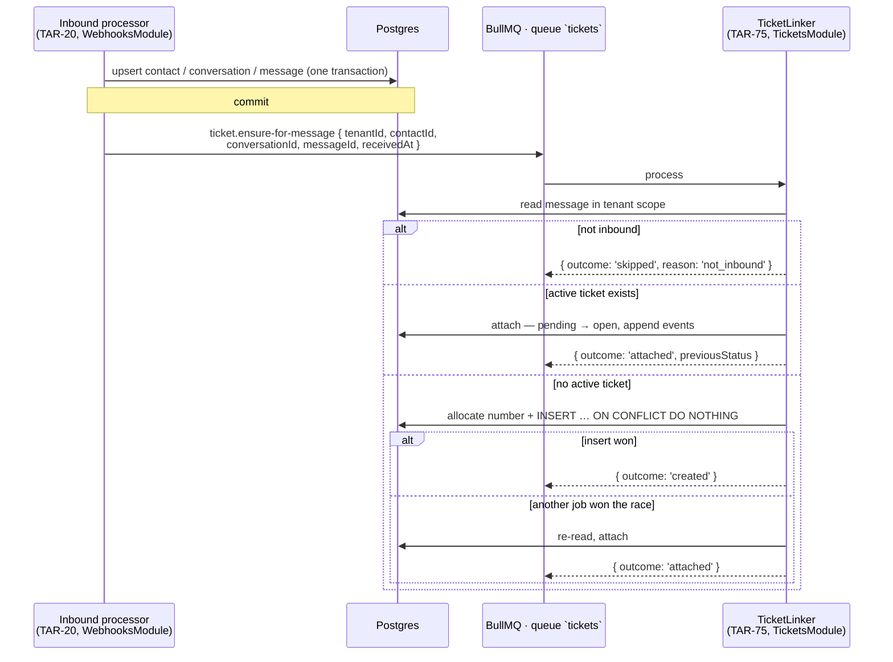

# Ticket auto-linking contract and concurrency approach (TAR-73)

Status: proposed · Builds on [0002 — architecture and API contract](./0002-architecture-and-api-contract.md)

## Context and Problem

TAR-21 wants one thing: every inbound WhatsApp message ends up on a ticket, and a
contact who is already being helped does not sprout a second one. The trigger for
that is inbound-conversation handling — TAR-20's scope, and TAR-20 has not started.

So the ticket-linking logic cannot be written against the real pipeline yet, but it
can be written against a fixed shape. This document fixes that shape, and settles the
one question the implementation cannot answer for itself: **what stops two inbound
messages from the same contact, processed concurrently, from creating two tickets?**

Three facts constrain the answer, all inherited from 0002 and TAR-47's landed schema:

1. `ConversationsModule` and `TicketsModule` are both L3 domain modules. 0002's layering
   rule — _a module may import a module below it, never one beside or above it_ —
   forbids conversations from importing tickets. The two sides meet over an event, or
   they do not meet.
2. Ingest is already concurrent by design. Meta does not guarantee delivery order, the
   webhook processor runs in parallel workers, and a customer sending three messages in
   a row produces three near-simultaneous jobs for the same contact.
3. `TenantPrisma` (TAR-49) does _not_ inject `tenantId` into `where` or `data`. RLS
   filters reads; a write must supply `tenant_id` itself. Any solution here is written in
   tenant scope or it is written wrong.

## Goals / Non-Goals

**Goals**

- A trigger contract TAR-20 can emit against without reading the ticket module.
- A service interface TAR-75 can implement and unit-test today, with no live pipeline.
- A concurrency mechanism that holds when the application forgets to check — the same
  standard 0002 applied to tenant isolation.
- The schema delta needed to make ticket creation possible at all, specified precisely
  enough for TAR-74 to write the migration without a second conversation.

**Non-Goals**

- Implementing any of it. TAR-75 implements the service, TAR-74 the migration, TAR-77
  the wiring.
- Ticket assignment, SLA attachment, priority. `ticket.created` is emitted; TAR-23/26
  subscribe. This document does not design their side.
- Reopening a resolved ticket on a late reply. See open question 1.
- Manual ticket creation (TAR-25) and the ticket REST surface, already fixed by 0002.

---

## Proposed Architecture



### Decision 1 — The trigger is a queue job, not a call and not an in-process event

**Trade-off axis: atomicity with the message write vs. blast radius of a ticket-module failure.**

- **Chosen — a BullMQ job on the `tickets` queue, enqueued after the message transaction
  commits.** 0002 already routes anything that must survive a restart through BullMQ, and
  the inbound path is _already_ asynchronous: webhook → store raw → enqueue → worker. One
  more hop is the shape the pipeline already has. Retries with backoff come free, and the
  layering rule is satisfied without either module importing the other — they share the
  payload schema in `packages/contracts`, which is where 0002 puts every shared shape.

  The decisive argument is blast radius. The customer's message is the thing that must
  never be lost. If ticket creation runs inside the message transaction, a bug in the
  ticket module rolls back the customer's message — the exact failure the ingest design
  exists to prevent. Separating them means a broken ticket module produces tickets late,
  not messages lost.

  Cost, stated plainly: the ticket is eventually consistent with the message. Normally
  sub-second; during a Redis outage, as late as the sweeper. The inbox therefore shows a
  message before its ticket exists, and any UI that assumes otherwise is wrong. The
  `ticket.created` realtime event to the tenant room is what closes that gap without a
  refetch.

- **Rejected — a direct call through an injected `TICKET_LINKER` token, inside the
  message transaction.** Atomic, synchronous, trivially testable, and it dodges the
  eventual-consistency caveat entirely. Rejected on blast radius, above; and because
  making it atomic means passing the Prisma transaction client across the module
  boundary, which turns a shared _shape_ into a shared _data layer_.

- **Rejected — `@nestjs/event-emitter`.** 0002 reserves the in-process bus for reactions
  where loss is acceptable — cache busting, realtime fan-out. A message that never
  becomes a ticket is a support request nobody sees. Not acceptable.

**Delivery is at-least-once, and that is fine.** The enqueue happens after commit, so a
crash in between loses the job; the webhook sweeper re-runs the inbound processor, which
enqueues unconditionally — even when the message upsert is a replay no-op. That is safe
precisely because `ensureTicketForMessage` is idempotent. `ticketEnsureJobId()` gives a
stable `jobId` so a Meta retry collapses while the first job is still queued, but that is
an optimisation; the handler's idempotency is the correctness mechanism. The id is
hyphen-separated — `ticket-ensure-<tenantId>-<messageId>` — because BullMQ rejects a custom
job id containing `:`.

**Emitted for inbound messages only,** and for every one of them — not just the first in a
conversation. Filtering to "first message" would mean a contact whose ticket was resolved
last week never gets a new one when they write back. The steady-state cost is one indexed
read per inbound message, which is what makes it affordable.

### Decision 2 — One _active_ ticket per contact, enforced by a partial unique index

TAR-21 assumes "one active ticket per contact per tenant at a time". Two things need
pinning down before that becomes a constraint.

**What counts as active: `open` _and_ `pending`.** TAR-74's issue text proposes
`WHERE status = 'open'`. That is too narrow. `pending` means waiting on the customer
(0002/`tickets.ts`: it pauses SLA timers). A `pending` ticket is still the live thread for
that contact — when the customer finally replies, the reply belongs to it. Indexing on
`open` alone would give every `pending` conversation a duplicate ticket on the customer's
very next message, which is the exact defect TAR-21 exists to prevent. `resolved` and
`closed` stay terminal: a contact writing back after resolution gets a new ticket.

**Trade-off axis: enforcement strength vs. write contention.**

- **Chosen — a partial unique index, and an insert that tolerates losing the race.**

  ```sql
  CREATE UNIQUE INDEX CONCURRENTLY tickets_one_active_per_contact
    ON tickets (tenant_id, contact_id)
    WHERE status IN ('open', 'pending');
  ```

  The create path is one statement that cannot produce a duplicate:

  ```sql
  WITH allocated AS (
    INSERT INTO ticket_counters (tenant_id, next_number) VALUES ($1, 2)
    ON CONFLICT (tenant_id) DO UPDATE SET next_number = ticket_counters.next_number + 1
    RETURNING next_number - 1 AS number
  )
  INSERT INTO tickets (id, tenant_id, number, status, conversation_id, contact_id, created_at, updated_at)
  SELECT $2, $1, allocated.number, 'open', $3, $4, now(), now() FROM allocated
  ON CONFLICT (tenant_id, contact_id) WHERE status IN ('open', 'pending') DO NOTHING
  RETURNING id, number;
  ```

  Zero rows returned means another job won. The service opens a **new** transaction,
  re-reads, and attaches. It must be a new transaction: a conflict aborts the current one
  in Postgres, and Prisma's interactive transactions expose no savepoint to roll back to.
  Bounded at three attempts — a second failure means the winner was resolved in between,
  a third is not a race any more.

  This is the same argument 0002 made for RLS: the database enforces it, so a future call
  site that forgets to check cannot break the invariant. `tenant_id` leads the index, so a
  conflict is never cross-tenant and the constraint leaks nothing between tenants.

- **Rejected — `SELECT … FOR UPDATE` on the contact row.** Serialises correctly and needs
  no new index. Rejected because it protects only the paths that remember to take the
  lock, and because it locks a row nothing else in the request wants to write, so an
  unrelated contact update blocks ticket creation.

- **Rejected — `pg_advisory_xact_lock(hash(tenant_id, contact_id))`.** Strictly the lowest
  contention of the three: the per-contact critical section is serialised before any index
  is touched, so no transaction ever waits on an uncommitted insert. Rejected as premature
  — it is a second mechanism to reason about, and it still needs the index underneath it as
  the durable guarantee. It is the documented next step if the convoy below becomes real.

- **Rejected — application-level check-then-insert.** The race, unmitigated. It is what
  the constraint exists to catch.

**The known cost, named honestly.** The counter row is locked from allocation until
commit, and an insert conflicting with an _uncommitted_ row waits for that transaction to
resolve. So two messages from the same contact can briefly convoy every other ticket
creation in that tenant behind them. The window is one insert plus a commit — single-digit
milliseconds — and it is bounded by keeping the create path to that single statement.
**Breaking point:** a tenant sustaining more than a few ticket creations per second, most
plausibly a broadcast that makes hundreds of customers reply at once. The next step is the
advisory lock above, not a redesign.

### Decision 3 — Ticket numbers need an allocator, and there isn't one

`tickets.number` is `NOT NULL` with `UNIQUE (tenant_id, number)` and no default. TAR-47's
comment says "TAR-21 owns how it is allocated" — this is that decision, and without it
TAR-75 cannot insert a row at all.

**Trade-off axis: contention vs. schema surface.**

- **Chosen — a `ticket_counters` row per tenant, incremented by the upsert above.**
  Self-provisioning: the first ticket for a tenant inserts the row, every later one takes
  the `DO UPDATE` branch. No change to TAR-50's provisioning flow. Numbers are unique and
  monotonic; they are **not** gapless, because a data-modifying CTE still increments when
  the outer insert loses the race. Ticket numbers with gaps are normal and nothing depends
  on density.

- **Rejected — `SELECT coalesce(max(number), 0) + 1` with retry on conflict.** No schema
  change, and cheap via a backward scan of the existing unique index. Rejected because
  the retry rate scales with tenant-wide concurrent creation, not per-contact: the
  broadcast scenario above turns into hundreds of transactions aborting against each other,
  which is quadratic wasted work. A row lock queues; a unique-constraint retry storm does
  not.

- **Rejected — a Postgres sequence per tenant.** No contention at all, and gaps are
  already acceptable. Rejected because it is DDL per tenant at provisioning time, sequences
  are not reachable by RLS, and the name is guessable — so the app role could burn another
  tenant's numbers. A residual exposure to buy a contention win the product does not need.

- **Rejected — a counter column on `tenants`.** `tenants` has no RLS policy and
  `TenantPrisma` refuses writes to it by design (TAR-49, `MODEL_POLICIES`). It would force
  ticket creation onto `SystemPrisma`, which 0002 confines to five call sites for good
  reason.

### Decision 4 — "Attach" does not write to the message

0002 and `tickets.ts` already fix the relationship: _a ticket is a unit of work on a
conversation, not a copy of it; messages stay on the conversation so the thread is never
split across tickets._ There is no `messages.ticket_id` column and this design does not add
one.

Attaching therefore means: this message's ticket is the one that already exists. Concretely,
the attach path writes only to the ticket and its event log:

| Condition                                  | Effect                                                                           |
| ------------------------------------------ | -------------------------------------------------------------------------------- |
| Ticket is `open`                           | No state change. No event.                                                       |
| Ticket is `pending`                        | → `open`; `status_changed` event, `data: { from, to, cause: 'inbound_message' }` |
| Ticket's `conversation_id` ≠ the trigger's | `conversation_linked` event; `conversation_id` is left alone                     |

The `pending → open` transition is also TAR-26's cue to resume a paused SLA timer, which is
why `previousStatus` is on the result rather than being something the caller has to infer.

The third row only occurs for a tenant running more than one WhatsApp number, since
`conversations` is unique on `(tenant_id, whatsapp_account_id, contact_id)` while the ticket
invariant is per contact. Recording it rather than acting on it is deliberate: if the
one-active-ticket-per-contact assumption turns out to be wrong for real tenants, the
evidence is already in the log. See open question 2.

---

## Data Model

### Delta against TAR-47's `tickets`

The existing model covers status, priority, contact linkage, conversation linkage and the
`(tenant_id, …)` indexes. Three additions are required; none is a column change to
`tickets` itself.

| #   | Change                                                                                                                                | Owner                              |
| --- | ------------------------------------------------------------------------------------------------------------------------------------- | ---------------------------------- |
| 1   | `CREATE UNIQUE INDEX tickets_one_active_per_contact ON tickets (tenant_id, contact_id) WHERE status IN ('open','pending')`            | TAR-74                             |
| 2   | New table `ticket_counters` — see below                                                                                               | TAR-74                             |
| 3   | `TicketResponseSchema`: `subject`, `conversationId`, `contactId` become nullable; `conversation_linked` added to `TICKET_EVENT_TYPES` | TAR-73 (landed with this document) |

**`contact_id` stays nullable, and that is load-bearing.** Postgres does not collide NULLs
in a unique index, so a manually created ticket with no contact (TAR-25) never conflicts
with anything. Making the column `NOT NULL` to "tidy" it would break that.

```prisma
/// Per-tenant ticket-number allocator (TAR-73). One row per tenant, created
/// lazily by the first ticket rather than at provisioning, so TAR-50 needs no
/// change. Holds the *next* number to hand out.
model TicketCounter {
  tenantId   String   @id @map("tenant_id") @db.Uuid
  nextNumber Int      @default(1) @map("next_number")
  updatedAt  DateTime @updatedAt @map("updated_at") @db.Timestamptz(3)

  tenant Tenant @relation(fields: [tenantId], references: [id], onDelete: Cascade)

  @@map("ticket_counters")
}
```

**The migration is not finished when the table exists.** `ticket_counters` is a
tenant-scoped table, so it needs `ENABLE`/`FORCE ROW LEVEL SECURITY` and a
`tenant_isolation` policy in the same migration, and `prisma/sql/app-roles.sql` must be
re-run afterwards for its grants and its `system_unrestricted` policy.
`prisma/sql/verify-tenant-isolation.sql` derives its table list from the catalog, so it
fails until both are in place — which is the intended safety net, not an obstacle.

**Index build.** `CONCURRENTLY` cannot run inside Prisma's migration transaction. With no
production data this is moot and a plain `CREATE UNIQUE INDEX` is correct; TAR-74 should
state which it used and why. If it ever has to be applied to a populated table, it must be
built concurrently outside the transaction _and_ the build will fail if duplicates already
exist — which is the right failure, but needs a cleanup step in front of it.

### Access patterns this adds

| Query                                                                    | Index used                       |
| ------------------------------------------------------------------------ | -------------------------------- |
| "Is there an active ticket for this contact?" — once per inbound message | `tickets_one_active_per_contact` |
| Number allocation — once per ticket created                              | `ticket_counters` primary key    |

The read is a single-row index-only lookup on the same partial index that enforces the
invariant, so the hot path costs one extra indexed read per inbound message.

---

## Interfaces

Published in `packages/contracts/src/ticket-linking.ts`, exported from the package index.
Both sides import the shape; neither imports the other's module.

```ts
export const TICKET_QUEUE = 'tickets';
export const TICKET_ENSURE_JOB = 'ticket.ensure-for-message';

export const InboundMessageTicketTriggerSchema = z.object({
  tenantId: IdSchema,
  contactId: IdSchema,
  conversationId: IdSchema,
  messageId: IdSchema,
  receivedAt: TimestampSchema,
});

export function ticketEnsureJobId(trigger: InboundMessageTicketTrigger): string;

export const TICKET_LINK_OUTCOMES = ['created', 'attached', 'skipped'] as const;
export const TICKET_LINK_SKIP_REASONS = ['not_inbound'] as const;

export const TicketLinkResultSchema = z.object({
  outcome: TicketLinkOutcomeSchema,
  ticketId: IdSchema.nullable(),
  ticketNumber: z.int().positive().nullable(),
  previousStatus: TicketStatusSchema.nullable(),
  reason: TicketLinkSkipReasonSchema.nullable(),
});

export interface TicketLinker {
  ensureTicketForMessage(trigger: InboundMessageTicketTrigger): Promise<TicketLinkResult>;
}

export const TICKET_LINKER: unique symbol;
```

**Five fields and no more.** Everything else a consumer could want is reachable from
`messageId` and `conversationId`, and a wider payload is a wider thing to keep in step with
the schema. The consumer re-reads the message through `TenantPrisma` rather than trusting
the payload, because a queue payload is unauthenticated input and the read must happen in
tenant scope regardless.

### Result matrix

| Situation                                     | `outcome`  | `ticketId` | `previousStatus` | `reason`      |
| --------------------------------------------- | ---------- | ---------- | ---------------- | ------------- |
| No active ticket for the contact              | `created`  | the new id | `null`           | `null`        |
| Active ticket, already `open`                 | `attached` | its id     | `open`           | `null`        |
| Active ticket, `pending` → reopened to `open` | `attached` | its id     | `pending`        | `null`        |
| Lost the insert race, attached to the winner  | `attached` | winner id  | `open`           | `null`        |
| The message is outbound                       | `skipped`  | `null`     | `null`           | `not_inbound` |

### Errors

Skips are reserved for states that are correct and will never change on retry. Everything
else throws, and the job's retry policy decides what happens next.

| Condition                                          | Behaviour                                                                                                                                                                                             |
| -------------------------------------------------- | ----------------------------------------------------------------------------------------------------------------------------------------------------------------------------------------------------- |
| Message not visible in tenant scope                | **Throws, retryable.** The realistic cause is commit-visibility timing or a sweeper replay ahead of a rollback; retry fixes it. Exhausting the budget lands it in the failed set, which is monitored. |
| No tenant in scope                                 | `MissingTenantContextError` (TAR-49). A programming error — the processor must set tenant context from `job.data.tenantId` before calling. Non-retryable.                                             |
| Tenant deactivated                                 | `TenantNotActiveError` (TAR-51). Non-retryable — discard, do not burn the retry budget on a tenant that is gone.                                                                                      |
| Create/attach race unresolved after three attempts | Throws, retryable. Should be unreachable; if it fires, the invariant or the constraint is wrong and it should be alerted on, not silently retried forever.                                            |
| Database unavailable                               | Throws, retryable.                                                                                                                                                                                    |

**No new API error codes.** This service is not HTTP-facing. If TAR-25 ever exposes it
behind an endpoint, `conflict`, `not_found` and `internal_error` from
`packages/contracts/src/error-codes.ts` already cover it, and 0002's rule that a handler
throws a code from that list is unaffected.

### Rules the implementation must follow

1. All access through `TenantPrisma`. `SystemPrisma` is not one of the five call sites 0002
   permits, and is not needed here.
2. The create path runs in `$tenantTransaction` — several statements, so the batched
   per-statement path would open a transaction per statement.
3. `tenant_id` is supplied explicitly on every write. TAR-49's extension does not inject it;
   RLS's `WITH CHECK` will reject the row if it is wrong, which is the backstop, not the
   mechanism.
4. `TicketsModule` emits `ticket.created` on the `created` path only. It does not import
   `AssignmentModule` or `SlaModule`.
5. Job ids on this queue are hyphen-separated. `:` is reserved by BullMQ's Redis key
   structure and a colon-bearing custom id is rejected at `add()` time — inside
   `QueueService.enqueue`, which logs rather than throws, so a violation stops ticket
   creation without erroring (TAR-249).

---

## Failure Modes and Operations

| Component                  | Down                                                                                                                        | Slow                                                             | Bad data                                                                                           |
| -------------------------- | --------------------------------------------------------------------------------------------------------------------------- | ---------------------------------------------------------------- | -------------------------------------------------------------------------------------------------- |
| BullMQ / Redis             | Messages arrive and persist; tickets are not created until Redis returns. Nothing is lost.                                  | Tickets appear late. The inbox shows a message with no ticket.   | A malformed payload fails schema validation and the job fails loudly rather than writing garbage.  |
| `TicketLinker`             | Inbound messages are unaffected — that separation is the point of decision 1.                                               | Queue depth grows; the message write path is untouched.          | A wrong `contactId` cannot cross tenants: RLS filters the read and `WITH CHECK` rejects the write. |
| Partial unique index       | Cannot be "down" — if it is missing, duplicates appear silently. TAR-74's verification is the only thing that catches that. | —                                                                | A pre-existing duplicate blocks the index build. That failure is correct and must not be forced.   |
| `ticket_counters` row lock | —                                                                                                                           | Tenant-wide ticket creation convoys behind one contact's insert. | A number gap. Harmless.                                                                            |

**What should be monitored:** `ticket.ensure-for-message` jobs in the failed set (a message
that never became a ticket is a support request nobody sees), and any occurrence of the
"race unresolved after three attempts" error, which means the constraint and the code
disagree. TAR-41 owns wiring these to alerting; this document only names them.

**What is deliberately not monitored:** attach-vs-create ratio, ticket-number gaps. Both are
normal.

## Security and Access

Nothing here widens the tenant boundary. The trigger carries a `tenantId` that ingest
resolved from `phone_number_id` → `whatsapp_accounts.tenant_id` (0002, non-HTTP entry
points), the processor sets it on `TenantContextService`, and every statement runs under
RLS from there. Three specific points:

- **The payload is not trusted.** `contactId` and `conversationId` are re-read in tenant
  scope. A forged or stale job cannot reach another tenant's rows — the read returns zero
  rows and the job fails.
- **The unique index leads with `tenant_id`,** so a constraint violation can never be caused
  by another tenant's row. A unique index is not RLS-aware; leading with `tenant_id` is what
  makes that irrelevant here.
- **No PII in job payloads or log lines.** The trigger carries ids and a timestamp, never
  message bodies or phone numbers — which is also why `contactId` is a uuid rather than the
  E.164 number ingest already has in hand.

## Implementation Phases

Already broken out as sub-issues of TAR-21; this maps the contract onto them.

| Phase  | Delivers from this document                                                                   | Blocked by |
| ------ | --------------------------------------------------------------------------------------------- | ---------- |
| TAR-73 | This document; `ticket-linking.ts`; the `tickets.ts` nullability and event-type delta         | — (done)   |
| TAR-74 | `tickets_one_active_per_contact`, `ticket_counters` + its RLS policy, re-run `app-roles.sql`  | TAR-73     |
| TAR-75 | `TicketLinker` implementation against this interface, unit-tested with fixture triggers       | TAR-73/74  |
| TAR-76 | Test plan from TAR-21's acceptance criteria, executed at the fixture level                    | TAR-73/75  |
| TAR-77 | TAR-20's inbound processor enqueues the job; requires `QueueModule`, which does not exist yet | TAR-20/75  |
| TAR-78 | End-to-end verification against live webhook traffic                                          | TAR-77     |

`QueueModule` is TAR-41's to build and is not in `apps/api/src` today. That does not block
TAR-74, TAR-75 or TAR-76: the service takes a plain payload object, so a fixture is a
literal and no queue is needed to test it. It does block TAR-77, on top of TAR-20.

## Open Questions and Risks

| #   | Item                                                                                                                                                                                                                       | Severity | Resolution                                                                                                                                                                                                                                                        |
| --- | -------------------------------------------------------------------------------------------------------------------------------------------------------------------------------------------------------------------------- | -------- | ----------------------------------------------------------------------------------------------------------------------------------------------------------------------------------------------------------------------------------------------------------------- |
| 1   | **No reopen window.** A customer replying two minutes after a ticket is resolved gets a brand-new ticket, which will read as noise to agents and inflates ticket counts in TAR-30's reporting.                             | Medium   | Deliberate at v1, and it matches TAR-76's written acceptance criteria. Revisit when an agent complains, or when reporting shows a spike of same-contact tickets minutes apart. A reopen window is additive: widen the index predicate and add a `reopened` event. |
| 2   | **One active ticket per contact vs. per conversation.** For a tenant running several WhatsApp numbers, one ticket can span two conversations and its `conversation_id` will not be the conversation of the latest message. | Medium   | Following TAR-21's stated assumption. The `conversation_linked` event exists to make the real frequency measurable before anyone changes the invariant to `(tenant_id, conversation_id)`.                                                                         |
| 3   | **Convoy on `ticket_counters`** under a burst of concurrent replies. Not measured — no benchmark is claimed.                                                                                                               | Low      | Measure in TAR-76's concurrency case. Next step is the advisory lock in decision 2, which is additive.                                                                                                                                                            |
| 4   | **`firstResponseAt` (Prisma) vs. `firstRespondedAt` (contract)** are a straight naming mismatch in TAR-47's schema. Not this story's field, but it will bite whoever maps `TicketResponse` first.                          | Low      | TAR-25's to settle. Flagged, not changed here.                                                                                                                                                                                                                    |
| 5   | **`TicketResponseSchema.sla`** is required and non-nullable, but no SLA timer exists for an auto-created ticket until TAR-26 attaches one.                                                                                 | Low      | TAR-26's to settle when it maps the response. An auto-created ticket maps to `firstResponseState: 'not_applicable'` until then.                                                                                                                                   |
