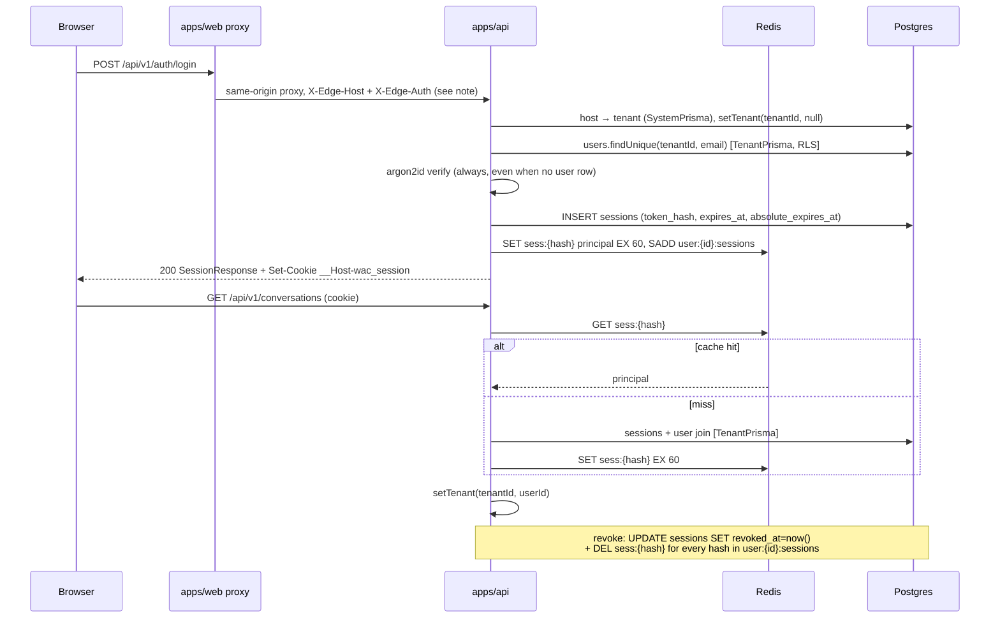

# Authentication, sessions, invites and password reset (TAR-53)

Status: proposed · Supersedes nothing · **Amends** `0002-architecture-and-api-contract.md` (TAR-39)
in the three places marked **Amendment** below.

Revision 2 folds in the review on PR #17: the `tenant_mismatch` security event moves out of
`audit_logs` (Decision 2), invite creation becomes an upsert so a lapsed invite cannot make
an address un-invitable (`Changed: invites`), lockout state moves behind a permission gate,
and the `owner` and `last_admin_required` items are reconciled against what TAR-79 and
TAR-80 landed on `main` in the meantime.

## Context and Problem

TAR-39 fixed the platform baseline: opaque server-side session cookies, tenant scoping by
Postgres RLS plus a Prisma client extension, `/api/v1` as the URI prefix, and an endpoint
surface with eight auth routes on it. It stopped there deliberately — it was a
platform-wide document, and the auth-specific numbers were not its job.

Everything in stage 2 of TAR-35 now needs those numbers. TAR-54 cannot cut migrations
without knowing which tables exist and what a reset token looks like; TAR-56 cannot issue
a session without a lifetime; TAR-58 cannot write the guard without knowing which client
reads the session row; TAR-59 cannot enforce a lockout without a threshold; TAR-63 cannot
write test cases against "TAR-53's contract" until it exists.

The constraint that makes this non-trivial is that **auth is the one subsystem that runs
before tenant scoping is established, in a system whose entire isolation guarantee is
tenant scoping.** Every other module can assume a tenant is in scope. Login cannot assume
a user. The design below closes that gap without introducing a second, weaker path to the
data — which is the failure mode that would quietly undo TAR-48 and TAR-49.

Three things already shipped and are treated as fixed input, not open questions:

- `users`, `sessions`, `invites` and `audit_logs` exist in `schema.prisma` (TAR-47) and
  carry RLS policies (TAR-48).
- `TenantPrisma` sets `app.tenant_id` through `assert_tenant_active()` on every statement,
  and `SystemPrisma` bypasses it (TAR-49, TAR-51).
- `packages/contracts/src/auth.ts` and `rbac.ts` already carry the session principal, the
  role→permission table and most request DTOs (TAR-39).

This document changes as little of that as it can, and says plainly where it must change
something.

## Goals / Non-Goals

**Goals**

- One published contract for invite-accept, login, session read/refresh/revoke, logout,
  password reset request/confirm, password change and admin deactivation.
- Session mechanics precise enough that "revoked immediately, not on next expiry" is a
  property of the design rather than an aspiration.
- Token design (invite, reset, realtime ticket) with generation, storage, single-use
  enforcement and expiry pinned to numbers.
- Password hashing algorithm and parameters named.
- Lockout policy with a threshold, a window, and a defined way a tenant admin sees it.
- A single tenant-scoping enforcement point for auth-guarded routes, expressed against
  TAR-39's existing mechanism.
- The exact schema delta TAR-54 must ship, including the drift between what TAR-47 landed
  and what `packages/contracts` says.

**Non-Goals**

- SSO / SAML / OIDC. Out of scope per TAR-35.
- Two-factor authentication. TAR-35 requires that adding it later is not a migration
  nightmare; §"2FA readiness" shows why no column is needed today.
- Platform super-admin identity. `PLATFORM_ADMIN_TOKEN` (TAR-50) stays the placeholder.
- Customer-facing (WhatsApp end-user) authentication. Customers are phone numbers.
- Choosing an email delivery vendor. This document specifies the port; TAR-41 picks the
  adapter. See Open Questions.
- Implementation. No NestJS services, guards or controllers are written here — only the
  Zod contract in `packages/contracts`, which is where TAR-39 put the same kind of
  artefact.

---

## Proposed Architecture

### Where auth sits in the request pipeline

TAR-39 fixed the order. This document fills in stages 2 and 3 and changes **who calls
`setTenant()`**.

```
1. TenantContextMiddleware   opens the ALS scope, assigns x-request-id      [TAR-38, exists]
2. HostTenantGuard           Host → tenant; setTenant(tenantId, null)       [TAR-19]  ← amended
3. AuthGuard                 cookie → session → principal; setTenant(tenantId, userId)
4. TenantStatusGuard         suspended/cancelled → subscription_inactive    [TAR-36]
5. PermissionGuard           @RequirePermission(...)                        [TAR-22]
6. FeatureGuard              @RequireFeature(...)                           [TAR-37]
7. ValidationPipe            Zod parse of body, query, params
8. Handler
9. SerializerInterceptor     Zod parse of the response
10. ErrorFilter              maps any throw to the envelope
```

**Amendment 1 to TAR-39 — `HostTenantGuard` puts the tenant in scope, not `AuthGuard`.**

TAR-39 has `AuthGuard` calling `setTenant()`, and lists "login (before a tenant is known)"
as one of five permitted `SystemPrisma` call sites. Both fall out of an assumption that is
not true in this design: the tenant _is_ known before login, because it is resolved from
the request `Host`, which stage 2 already does for every request including `@Public()`
ones.

So stage 2 calls `setTenant(tenantId, null)` and stage 3 upgrades the same ALS store with
the user id. The consequence is the point of the change:

> **No auth flow uses `SystemPrisma`.** Login, invite lookup, invite acceptance, password
> reset request and reset confirmation all read and write through `TenantPrisma`, under
> RLS, exactly like every other query in the system.

That removes a whole class of bug before anyone can write it. An unscoped
`user.findUnique({ where: { email } })` during login would otherwise return the _first_
matching user across all tenants — and since email is unique per tenant and not globally,
a person with accounts at two client organisations would log into whichever row the
planner returned first. Under RLS that query is structurally incapable of doing so.

The cost is one behavioural change: a `pending` or `suspended` tenant now fails at
`assert_tenant_active()` inside `TenantPrisma` rather than at stage 4. `HostTenantGuard`
therefore reads `tenants.status` during host resolution — it is already reading the row —
and answers `tenant_not_found` for `pending` (the tenant is not yet a thing a user can log
into) and `subscription_inactive` for `suspended`/`cancelled`. `TenantNotActiveError` from
the extension is a fallback, mapped to `subscription_inactive`, and reaching it means the
guard's read and the database disagreed — which is a race, not a normal path, and is
logged as one.

Host resolution itself stays a `SystemPrisma` read: `tenant_domains` is RLS-protected and
there is no tenant in scope yet, by definition. That was always one of the five call sites;
it just wasn't named as such.

### Session lifecycle



> **Correction (TAR-64): `Host` is not preserved, and cannot be.** This diagram originally
> assumed the proxy passed the tenant's `Host` through untouched. It does not, and the
> assumption was unimplementable in every deployed environment:
>
> - Render routes by `Host` at its edge. A request reaches the API service only if `Host`
>   names _that_ service, and a tenant's custom domain (TAR-29) is attached to the web
>   service — so `request.hostname` inside the API can never be a tenant hostname.
> - Next's rewrite proxy hardcodes `changeOrigin: true`, so it replaces `Host` with the API
>   origin and puts the browser's host in `x-forwarded-host`. `rewrites()` exposes no option
>   that changes it.
> - `fetch` derives `Host` from the URL and silently drops a caller-supplied one, so a
>   server-rendered call cannot set it either.
>
> **Decision:** the tenant host travels in `x-edge-host`, and the API honours it only
> when the request also presents `x-edge-auth` carrying `TRUSTED_PROXY_SECRET` — the same
> fail-closed, timing-safe shared secret `PlatformAdminGuard` already uses. Without a
> matching secret the guard falls back to `Host` exactly as before, never to the forwarded
> value, so a missing or rotated secret degrades to a uniform `tenant_not_found` rather than
> to an attacker-chosen tenant. Express `trust proxy` stays off: turning it on would make
> `req.hostname` honour the forwarded header _ungated_, which is the spoof the guard exists
> to prevent. `apps/web` sends the pair on both paths — `lib/api/tenant-host.ts` for server
> rendering, `proxy.ts` for the browser's calls through the `/api/*` rewrite.
>
> **Why a private header name (TAR-148).** Both halves of the pair are names nothing on the
> path has an opinion about, and `x-forwarded-host` is deliberately not read by the guard,
> gated or otherwise. The web tier does not reach the API over a private network — it calls
> `https://whatsappcrm-api-<env>.onrender.com`, so the request leaves Render and re-enters
> through TLS-terminating proxies that populate `x-forwarded-*` as a matter of course. An
> intermediary that rewrote the standard header would leave every tenant route answering a
> uniform `tenant_not_found` while both services still logged the feature as enabled. The
> two names are declared once in `@whatsappcrm/contracts` so a rename cannot reach one
> service and not the other, and `apps/web/proxy.int-test.ts` asserts the pair end to end
> through a real build against a probe, which is what would catch such a drift.
>
> Residual risk, stated plainly: a leaked secret lets its holder name any _verified_ tenant
> hostname. On authenticated routes `PrincipalGuard` still cross-checks the session's tenant
> and answers `tenant_mismatch`, so the secret alone yields no data; on `@Public()` routes —
> login, password reset, invite lookup — there is no session to cross-check, so a leak does
> expose those surfaces. Hence per-environment, rotatable, and never `NEXT_PUBLIC_`.

### Components and responsibilities

All of this lands inside `IdentityModule` (TAR-39's L2 access layer). Nothing here imports
`RbacModule`; the role→permission expansion is a pure function in `packages/contracts`
(`permissionsForRole`), which is why the principal can carry materialised permissions
without a module dependency.

| Component               | Owns                                                                         | Built by |
| ----------------------- | ---------------------------------------------------------------------------- | -------- |
| `SessionService`        | Issue, resolve, slide, revoke-one, revoke-all-for-user. Owns the Redis cache | TAR-56   |
| `PrincipalGuard`        | Cookie → principal → `setPrincipal()`. Global, `@Public()` opts out          | TAR-58   |
| `SessionReplayProbe`    | Classifies a zero-row session read: replay, or an ordinary stale cookie      | TAR-58   |
| `PasswordService`       | argon2id hash/verify, dummy verify, parameter config                         | TAR-56   |
| `LoginThrottleService`  | Per-account counters in Postgres, per-IP window in Redis                     | TAR-59   |
| `InviteService`         | Create, resend, revoke, look up, accept                                      | TAR-55   |
| `PasswordResetService`  | Request, confirm, session invalidation on success                            | TAR-57   |
| `MailerPort` + adapters | Transactional email. Console adapter in dev                                  | TAR-55   |

---

## Technology Choices

| Concern                    | Choice                                                              | Alternatives considered                                     | Rationale                                                                                          |
| -------------------------- | ------------------------------------------------------------------- | ----------------------------------------------------------- | -------------------------------------------------------------------------------------------------- |
| Password hash              | argon2id, `m=19456 KiB, t=2, p=1`                                   | bcrypt cost 12; scrypt                                      | Memory-hard; OWASP's documented minimum config. bcrypt truncates at 72 bytes and is GPU-friendlier |
| argon2 binding             | `@node-rs/argon2`                                                   | `argon2` (node-gyp); `hash-wasm`                            | Prebuilt binaries — no compiler in the Docker image; native, so not on the JS thread               |
| Session token              | 32 random bytes, base64url, stored as SHA-256 hex                   | Signed/HMAC token; argon2-hashed token                      | 256 bits of uniform entropy is not brute-forceable — a slow KDF would tax every request            |
| Session lookup cache       | Shared Redis, 60 s TTL, explicit delete on revoke                   | In-process LRU; no cache                                    | Shared store makes revocation global and immediate; in-process would need N-node invalidation      |
| Session refresh            | Sliding `expires_at` + hard `absolute_expires_at`                   | Refresh-token pair; token rotation per request              | No second credential to store or leak; the absolute cap is what bounds a stolen cookie             |
| Cookie name                | `__Host-wac_session` (`wac_session` when `SESSION_COOKIE_SECURE=0`) | Plain name always                                           | `__Host-` makes cookie shadowing from a sibling tenant subdomain impossible, not merely unlikely   |
| Invite / reset token       | 32 random bytes, base64url, SHA-256 at rest, single-use             | Signed stateless token (JWT/PASETO)                         | Single-use and revocable require state anyway; a stateless token needs a consumed-list to match    |
| Token delivery in the link | URL **fragment** (`/invite#token=…`)                                | Query string; path segment                                  | A fragment is never sent to a server — stays out of access logs, proxies and `Referer`             |
| Token in the API call      | Request **body**, on `POST`                                         | Path segment (`/invites/{token}/accept`, TAR-39's spelling) | Same reason. A `GET` with a secret in the path is logged by every hop                              |
| Lockout counter            | Durable columns on `users` + Redis per-IP and per-email windows     | Redis-only counters                                         | Redis-only loses the lockout on restart and cannot be shown to an admin or audited                 |
| Lockout response           | Existing `rate_limited` (429) + `Retry-After`                       | New `account_locked` code                                   | A distinct code confirms the account exists — and so does a 429 only a real one can reach          |
| Bad token response         | New `token_invalid` (410) with `details.reason`                     | Reuse `not_found`                                           | The frontend must offer "request a new link", which needs to be distinguishable from a 404 page    |
| CSRF defence               | `SameSite=Lax` + `Origin`/`Sec-Fetch-Site` check on unsafe methods  | Double-submit CSRF token                                    | A token adds a whole endpoint and state; Lax already blocks cross-site form POSTs                  |

### Decision 1 — Sliding expiry, not a refresh-token pair

**Trade-off axis: number of credentials in flight vs. how tightly a stolen one is bounded.**

- **Chosen — one opaque session token with a sliding idle window and an absolute cap.**
  `expires_at` starts at `now() + 12h`. On a request that finds the session valid and
  `expires_at` more than 5 minutes away from its maximum, the guard extends it — but
  writes at most once every 5 minutes per session, so an active agent costs one `UPDATE`
  per 5 minutes rather than one per request. `absolute_expires_at` is set once at issue to
  `now() + 30d` and never moves; `expires_at` is never extended past it. An agent working a
  normal shift is never logged out mid-conversation, and an unattended browser is dead
  after 12 hours.

- **Rejected — access token + refresh token.** Two credentials, two lifetimes, a rotation
  protocol, and a reuse-detection scheme to make rotation meaningful. That machinery buys
  statelessness for the access token — which we already gave up in TAR-39 for revocation.
  Paying its complexity while keeping a server-side session table is the worst of both.

- **Rejected — rotating the session token on every request.** Bounds a stolen cookie
  tightly, and breaks the moment two browser tabs issue concurrent requests: one gets the
  new token, the other presents the old one and is logged out. Solvable with an acceptance
  window, but the bug reports arrive before the fix does.

**The write-throttle is load-bearing, not an optimisation.** Extending `expires_at` on
every request would put a row update on the hot path of every API call in the product,
against a table every request already reads. Once per 5 minutes makes the idle window
"12 hours, ±5 minutes", which is a distinction with no product meaning.

### Decision 2 — Where the session row is read from, and how `tenant_mismatch` survives it

**Trade-off axis: fail-closed reads vs. keeping the security signal TAR-39 wants paged.**

The session is looked up under `TenantPrisma` with the tenant already in scope from the
`Host`. So a session issued for tenant A, replayed against tenant B's domain, matches zero
rows: RLS _is_ the cross-tenant replay defence, not a comparison someone might forget to
write.

That creates one problem. TAR-39 says any `tenant_mismatch` should page someone — it means
a session is being replayed across tenants. But a zero-row result is indistinguishable
from an expired or unknown cookie, so the naive implementation answers `unauthenticated`
and the alert never fires.

- **Chosen — classify the rejection with a probe, never with an access path.** On a
  zero-row result _only_, run one `SystemPrisma` read:
  `SELECT id, tenant_id, user_id FROM sessions WHERE token_hash = $1 AND revoked_at IS NULL AND expires_at > now()`.
  A row means a live session for another tenant → answer `tenant_mismatch` (401) and emit
  the security event. No row → `unauthenticated`. The probe returns three uuid columns,
  none of them a credential, grants nothing, and runs only on a path that has already
  decided to reject.

**The security event is a log line and a metric, not an `audit_logs` row.** This is a
correction: an earlier draft of this decision said "write an `audit_logs` row against the
session's tenant", and that is not implementable under the RLS this same document mandates.
At that moment the ALS scope holds the _host's_ tenant (B) while the row would have to
carry the _session's_ tenant (A), and `audit_logs` carries
`FORCE ROW LEVEL SECURITY` with `WITH CHECK (tenant_id = current_setting('app.tenant_id'))`
(`20260810140000_tenant_isolation_rls`). The insert is refused, the rejection path throws,
the 401 becomes a 500, and the alert this decision exists to preserve never fires.

Two ways out; the second is chosen.

- **Rejected — widen Amendment 2 to allow one audit-only `SystemPrisma` insert.** It keeps
  the row. Rejected because this path is reachable by any unauthenticated caller presenting
  any cookie value, so it would hand an anonymous attacker a write primitive against a
  tenant-scoped table they cannot otherwise touch — unbounded row growth in the table
  auditors read, driven from outside the tenant. Amendment 2's "read-only" bar exists for
  exactly this case.
- **Chosen — emit out-of-band.** A structured log line at `warn`
  (`{ requestId, event: 'auth.tenant_mismatch', hostTenantId, sessionTenantId, sessionId, userId, ip }`)
  plus a counter `auth_tenant_mismatch_total`, carrying no tenant label so an attacker
  cannot inflate metric cardinality. TAR-41 wires the alert to the counter. Nothing about
  this weakens the signal: an `audit_logs` row pages nobody, and a replay attempt by an
  unauthenticated third party is platform security telemetry, not a record of something a
  principal inside tenant A did.

The token and its hash never appear in either. TAR-58 implements this; it is decided here
rather than discovered there.

- **Rejected — read the session under `SystemPrisma` and compare tenants in code.** One
  query instead of two, and the mismatch check is explicit. Rejected because it makes the
  single hottest read in the product bypass RLS, and its correctness then rests on a
  hand-written `if` — precisely the "promise every future query remembers" that TAR-39
  ruled out for tenant scoping generally.

- **Rejected — drop the distinction and always answer `unauthenticated`.** Simplest, one
  query, no extra `SystemPrisma` call site. Rejected because it deletes the only signal
  that would tell us someone is replaying sessions across tenant domains, and TAR-39
  explicitly wants that paged.

**Amendment 2 to TAR-39 — the `SystemPrisma` call-site list.** It becomes: tenant
provisioning, host→tenant resolution, webhook ingest, the sweeper, platform reporting, and
this classification probe. "Login" leaves the list (Amendment 1); the probe joins it. TAR-44
should hold new entries to the same bar: **read-only**, no rows returned to a caller, and
written down here first. The bar is unchanged by this decision — which is precisely why the
audit row above had to go somewhere else.

### Decision 3 — Durable lockout state, not a Redis counter

**Trade-off axis: cost per attempt vs. whether an admin can ever see the result.**

- **Chosen — two layers.** Per account, three columns on `users`
  (`failed_login_attempts`, `last_failed_login_at`, `locked_until`) updated inside the
  login transaction. Per IP, a sliding window in Redis keyed
  `authfail:{tenantId}:{ip}`. The account layer is durable, tenant-scoped by RLS for free,
  visible on `GET /api/v1/users` and auditable. The IP layer is the only thing that can
  throttle an attacker spraying addresses that have **no user row to count on** — which is
  what credential stuffing actually looks like.

- **Rejected — Redis-only.** Cheaper and needs no migration. Rejected on TAR-35's own
  acceptance criterion: the lockout must be _observable to a tenant admin_. A counter that
  vanishes on a Redis restart, lives outside RLS and never reaches the audit log cannot
  satisfy that.

- **Rejected — a `login_attempts` table, one row per attempt.** Better forensics. Rejected
  because it is an unbounded write-heavy table whose only consumer is a `COUNT(*)` the
  three columns answer in one index lookup, and because it is a free place for an attacker
  to make us write rows.

Every key is tenant-scoped, so tenant A's attacker cannot lock out or throttle tenant B's
agents — TAR-59's fourth acceptance criterion, satisfied by the key shape rather than by a
check.

**Amendment (TAR-64 review) — a third layer, keyed by the typed email.** As built, the two
layers above left the 429 itself as a per-tenant existence oracle:
`LOGIN_IP_THROTTLE_ENABLED` defaults to off, so in the shipped configuration a lockout was
the _only_ producer of a 429 on login, and a lockout is reachable only for an `active`
account that has a password hash. Eleven wrong passwords therefore answered 429 for a real
address and 401 for one with no account — a difference the identical bodies and the dummy
verify do nothing about.

The fix is a Redis lockout keyed by the **address that was typed** rather than by a row:
`emailfail:{tenantId}:{sha256(email)}` counts, and `emaillock:{tenantId}:{sha256(email)}`
holds the lock. It deliberately reuses `loginFailureThreshold` and `loginLockoutMs`, so an
address with no account locks on the same attempt and for the same duration as one with an
account, and the two answers are identical in code, body and `Retry-After`. It is checked
before the account lookup, so they cost the same too. It carries no feature flag and needs
none: the email comes from the request body, so it identifies one attempt's target however
many proxies the request crossed, and the only address an attacker can lock with it is one
they can already lock durably through the account layer.

It fails open like every other Redis path here, and the cost of that is stated rather than
hidden: while Redis is unreachable the durable lockout is again the only producer of a 429,
and the oracle is open with it. The addresses are hashed because an email is PII and
`redis-cli KEYS` is not a list of who has an account here — and because free text from a
request body must not reach a key verbatim. Both keys are cleared wherever
`failed_login_attempts = 0` is written — a successful sign-in, an admin unlock, a completed
reset, a password change and an accepted invite — since an unlock that left the account
refused by a layer no admin can see would not be an unlock, and a reset that still ended at
a 429 would not be a way back in. The IP window is cleared by none of them: it belongs to
whoever was guessing rather than to the account they were guessing at.

**What this does not yet close, and why the word is "narrowed" rather than "closed"
(TAR-154).** The two counters lock on the same attempt, for the same duration, through the
same reset paths — but they **forget on different clocks**. The email key carries
`loginLockoutMs` as its TTL; `failed_login_attempts` carries none and only ever returns to
zero through one of the five paths above. Nine failures, a sixteen-minute pause and two
more attempts therefore put them out of step: the email counter has expired and is back at
one, the durable counter reaches ten and locks, and attempt eleven answers 429 for a real
address and 401 for one with no account. That is the oracle again, at the cost of one wait,
and cheaper still against an address whose durable count is already warm from its owner's
own typos. The layer closes the eleven-request version outright, which is why it ships, but
the honest claim is that a paced attacker can still tell the two apart. TAR-154 windows the
durable count inside the statement that already writes `last_failed_login_at`, making the
retention identical by construction rather than by two numbers somebody has to keep equal —
which is the principle the threshold and the duration already follow.

---

## Data Model

Everything below is a delta on what TAR-47 landed. TAR-54 ships it as one migration.

### New: `password_reset_tokens`

Tenant-scoped, RLS-protected, single-use.

| Column         | Type               | Notes                                                      |
| -------------- | ------------------ | ---------------------------------------------------------- |
| `id`           | `uuid` PK          | UUIDv7                                                     |
| `tenant_id`    | `uuid` NOT NULL    | RLS predicate column                                       |
| `user_id`      | `uuid` NOT NULL    | Composite FK `(tenant_id, user_id) → users(tenant_id, id)` |
| `token_hash`   | `text` UNIQUE      | SHA-256 hex of the token. The token itself is never stored |
| `expires_at`   | `timestamptz`      | `now() + 60 minutes`                                       |
| `consumed_at`  | `timestamptz` NULL | Set by the conditional update that redeems it              |
| `requested_ip` | `inet` NULL        | Forensics only                                             |
| `created_at`   | `timestamptz`      | Default `now()`                                            |

Indexes: `(tenant_id, user_id)` for the invalidate-on-new-request path, `(expires_at)` for
the cross-tenant sweep, and the unique on `token_hash`.

Why a table rather than a signed stateless token: single-use is state, and expiry alone
does not give it. A stateless token needs a consumed-list to be single-use, which is this
table with extra steps.

### New: `invite_teams`

`InviteCreateInputSchema` already carries `teamIds`, and nothing in the schema holds them.

| Column      | Type                              | Notes                                                        |
| ----------- | --------------------------------- | ------------------------------------------------------------ |
| `tenant_id` | `uuid` NOT NULL                   |                                                              |
| `invite_id` | `uuid` NOT NULL                   | Composite FK → `invites(tenant_id, id)`, `ON DELETE CASCADE` |
| `team_id`   | `uuid` NOT NULL                   | Composite FK → `teams(tenant_id, id)`, `ON DELETE CASCADE`   |
| PK          | `(tenant_id, invite_id, team_id)` |                                                              |

A `uuid[]` column on `invites` would be one fewer table and cannot express a foreign key,
so a team deleted between invite and acceptance would leave a dangling id that surfaces as
a 500 during onboarding. `invites` gains `@@unique([tenantId, id])` to be referenceable,
per the schema's composite-FK convention.

### Changed: `invites`

| Change                                                                                       | Why                                                                                                         |
| -------------------------------------------------------------------------------------------- | ----------------------------------------------------------------------------------------------------------- |
| `+ revoked_at timestamptz NULL`                                                              | An admin must be able to cancel a pending invite. `accepted_at` cannot express it                           |
| `+ @@unique([tenantId, id])`                                                                 | Referenced by `invite_teams`                                                                                |
| `+ partial unique index (tenant_id, email) WHERE accepted_at IS NULL AND revoked_at IS NULL` | Two live invites for one address means two accounts. Raw SQL — Prisma cannot express a partial unique index |

**The index predicate has no expiry term, and cannot have one.** An expired invite is still
`accepted_at IS NULL AND revoked_at IS NULL`, so it still occupies the index — and
`AND expires_at > now()` is not available as a fix, because Postgres requires an index
predicate to be `IMMUTABLE`. Left there, that is a trap: an admin invites `bob@acme.com`,
nobody accepts, the invite lapses after seven days, and the admin's next attempt to invite
Bob passes the service-level check (there is no _live_ invite) and then violates the index.
Bob becomes un-invitable by any self-service path until someone finds and revokes a dead
row they cannot see.

So **invite creation reuses an existing unaccepted, unrevoked row rather than inserting
beside it** — expired or not, it is the same path resend already takes: new `token_hash`,
new `expires_at`, and `role`/`invite_teams` updated to what the admin just asked for, since
that is their current intent. `201` when a row was created, `200` when one was reused,
matching the convention `POST /admin/tenants` already set for an idempotent create.

The consequence is that `conflict` is **never** returned for an existing invite, live or
expired — only for an address that already has an `active` user. Re-inviting is always
something an admin can do, which is the only behaviour that does not require them to
diagnose invisible state. Resend keeps its own endpoint because it carries no role or team
changes and reads as a different intent in the audit log.

### Changed: `users`

| Change                                                                           | Why                                                                  |
| -------------------------------------------------------------------------------- | -------------------------------------------------------------------- |
| `+ failed_login_attempts int NOT NULL DEFAULT 0`                                 | Lockout counter, Decision 3                                          |
| `+ last_failed_login_at timestamptz NULL`                                        | Shown to admins; distinguishes "locked now" from "locked last March" |
| `+ locked_until timestamptz NULL`                                                | The lockout itself                                                   |
| ~~`- role: 'owner'` from the `user_role` enum~~                                  | **Already landed by TAR-80.** See "Role vocabulary" below            |
| `+ @@index([tenantId, lockedUntil])` (partial, `WHERE locked_until IS NOT NULL`) | So the admin list can surface locked accounts without a seq scan     |

### Changed: `sessions`

| Change                                       | Why                                                                                                                                                                     |
| -------------------------------------------- | ----------------------------------------------------------------------------------------------------------------------------------------------------------------------- |
| `+ absolute_expires_at timestamptz NOT NULL` | The cap the sliding window may not cross. Stored, not derived, so the sweep is one index scan                                                                           |
| `+ revoked_reason text NULL`                 | `logout` / `logout_all` / `password_change` / `password_reset` / `deactivation` / `admin`. The audit trail is otherwise unable to say _why_ every session died at 14:03 |
| `+ @@index([absoluteExpiresAt])`             | Sweep                                                                                                                                                                   |

`token_hash`, `revoked_at`, `last_seen_at`, `ip_address`, `user_agent` and the
`(tenant_id, user_id)` index already exist and are exactly right.

### Role vocabulary — resolved on `main` while this was in review

> **Landed.** TAR-80 (`f99ba45`, #25) shipped `enum UserRole { admin supervisor agent }`.
> The type swap below is **done and out of TAR-54's scope**; Open Question 3 is closed, and
> so is the escalation asking Tarek whether a distinct owner concept was wanted — `main`
> answered it the way this section argued for. The reasoning is kept because the invariant
> that replaces the role is still TAR-55's and TAR-58's to enforce.

When this was written, `schema.prisma` had `user_role = owner | admin | supervisor | agent`
while `packages/contracts/src/rbac.ts` had `TENANT_ROLES = agent | supervisor | admin`. They
had been out of step since TAR-47, and TAR-53's own acceptance criterion names three roles.

**Decision: three roles. `owner` is dropped from the enum.**

What `owner` was reaching for is real — a tenant must not be able to lock itself out by
demoting or removing its last administrator. But that is an _invariant_, not a role, and
expressing it as a role has two costs: a fourth entry in `ROLE_PERMISSIONS` that is either
identical to `admin` (in which case it means nothing to a guard) or subtly different (in
which case TAR-22's guards start branching on role, which `rbac.ts` explicitly forbids).

So instead:

> **Invariant, enforced in `UserService`:** a tenant must always retain at least one `admin`
> whose `status` is `active`. A role change, status change or removal that would violate it
> is rejected with `last_admin_required` — TAR-79 added that code for exactly this, so it is
> no longer the `conflict` this document originally specified. The check runs inside the
> same transaction as the change, against `TenantPrisma`, so two concurrent demotions cannot
> both pass it.

Dropping a Postgres enum value needed a type swap (`CREATE TYPE user_role_new`, `ALTER TABLE
… USING`, `DROP TYPE`, rename), cheap only while no `owner` rows existed. TAR-80 took that
window. TAR-54 has nothing to do here.

If a distinct owner concept is ever wanted, the additive path is a nullable
`tenants.owner_user_id`, which carries the meaning without touching the permission model.

### Other contract drift TAR-54 and TAR-55 must know about

| Item               | `schema.prisma`                             | `packages/contracts`                       | Resolution                                                                                                                                                                                                                                                                        |
| ------------------ | ------------------------------------------- | ------------------------------------------ | --------------------------------------------------------------------------------------------------------------------------------------------------------------------------------------------------------------------------------------------------------------------------------- |
| Display name       | `users.name`                                | `displayName` on every DTO                 | **Keep both.** Column stays `name`; the DTO stays `displayName`. Mapped in the service layer. Renaming either breaks the other for no gain — but it is a trap, so it is written here                                                                                              |
| User status        | `invited \| active \| suspended \| removed` | `invited \| active \| suspended`           | **Closed by TAR-79 on `main`**, the same way this document proposed: the contract gained `removed`, because removal is a status change, not a delete (schema convention 4)                                                                                                        |
| Status transitions | —                                           | `UserUpdateInputSchema.status` accepts any | **Closed by TAR-79**, and narrower than proposed here: `USER_WRITABLE_STATUSES` is `active \| suspended` only. `removed` belongs to admin-only `DELETE /users/{id}`, so a supervisor holding `user:update` cannot remove an account through a `PATCH` body. TAR-79's version wins |
| Lockout visibility | —                                           | flat fields on `UserResponse`              | **Changed after review.** `lockedUntil` and `failedLoginAttempts` moved into a nullable `security` object, so one check gates both. `user:read` is an agent permission — flat fields would show every agent how close a named colleague is to lockout                             |

### 2FA readiness

TAR-35 requires that adding 2FA later is not a painful migration. Nothing is added now,
because nothing needs to be:

- A `user_mfa_factors` table (`tenant_id`, `user_id`, `kind`, `secret_encrypted`,
  `confirmed_at`) is purely additive.
- `sessions` gains a nullable `mfa_verified_at`; a null in existing rows correctly means
  "issued before 2FA existed".
- The login endpoint gains a second response variant (`{ challenge: 'totp', challengeId }`)
  alongside `SessionResponse`. `SessionResponseSchema` is already an object with a single
  `user` key, so widening it to a discriminated union is a contract change the frontend's
  typecheck catches rather than a runtime surprise.

The one thing that _would_ have hurt — a stateless token whose claims are baked at issue —
is exactly what TAR-39 already rejected.

---

## Interfaces

### Endpoint surface

Amends TAR-39's `# Auth and session` block. `Δ` marks a change from what TAR-39 published;
the rest is confirmation.

```
# Public — no session required (@Public)
POST   /api/v1/auth/login                    → SessionResponse         sets cookie
POST   /api/v1/auth/password-reset           → 204                     always 204
POST   /api/v1/auth/password-reset/confirm   → 204
Δ POST /api/v1/invites/lookup                → InvitePreviewResponse    was GET /invites/{token}
Δ POST /api/v1/invites/accept                → SessionResponse          was POST /invites/{token}/accept, sets cookie

# Authenticated — own session and credentials
GET    /api/v1/auth/session                  → SessionResponse
POST   /api/v1/auth/logout                   → 204                     clears cookie
Δ POST /api/v1/auth/password                 → 204                     change own password
Δ GET  /api/v1/auth/sessions                 → SessionSummary[]         own sessions, no cursor: bounded set
Δ DELETE /api/v1/auth/sessions/{id}          → 204                     revoke one of own
POST   /api/v1/auth/realtime-ticket          → RealtimeTicketResponse

# Tenant administration
POST   /api/v1/users/invites                 → InviteResponse           user:invite
Δ GET  /api/v1/users/invites                 → CursorPage<InviteResponse>  user:read
Δ POST /api/v1/users/invites/{id}/resend     → InviteResponse           user:invite
Δ DELETE /api/v1/users/invites/{id}          → 204                      user:invite
PATCH  /api/v1/users/{id}                    → UserResponse             user:update
DELETE /api/v1/users/{id}                    → 204                      user:remove
Δ POST /api/v1/users/{id}/unlock             → UserResponse             user:update

# Platform administration — PLATFORM_ADMIN_TOKEN, not a session
Δ POST /api/v1/admin/tenants/{id}/invites    → InviteResponse           bootstrap the first admin
```

`POST /invites/lookup` puts a verb in a path segment, which TAR-39's conventions table
otherwise avoids. It is deliberate: the alternative that satisfies the convention is a
`GET` with the token in the path, and that writes a live credential into every access log,
proxy log and `Referer` header between the browser and the handler. A named lookup action
is the smaller violation. Recorded so TAR-44 does not read it as drift.

`POST /admin/tenants/{id}/invites` exists because tenant provisioning (TAR-50) deliberately
creates no users, so a freshly provisioned tenant has nobody who could send the first
invite. Kept off `POST /admin/tenants` so provisioning stays idempotent on `slug` alone and
so an owner invite can be re-sent without re-provisioning.

### Request and response shapes

Zod, in `packages/contracts/src/auth.ts`. Signatures, not descriptions of signatures:

```ts
// Already published by TAR-39, unchanged
LoginInputSchema                = { email, password }
LogoutInputSchema               = { allSessions?: boolean = false }
PasswordResetRequestInputSchema = { email }
PasswordResetConfirmInputSchema = { token, password }
InviteCreateInputSchema         = { email, role, teamIds?: Id[] = [] }
InviteAcceptInputSchema         = { token, displayName, password }
SessionPrincipalSchema          = { userId, tenantId, email, displayName, role,
                                    permissions, teamIds, sessionId, expiresAt }
SessionResponseSchema           = { user: SessionPrincipal }
RealtimeTicketResponseSchema    = { ticket, expiresAt, realtimeUrl }

// Added by TAR-53
PasswordChangeInputSchema       = { currentPassword: string, newPassword: Password }
InviteLookupInputSchema         = { token: string }
InvitePreviewResponseSchema     = { email, role, expiresAt, invitedByName: string | null,
                                    tenantName: string }
SessionSummarySchema            = { id, createdAt, lastSeenAt: Timestamp | null,
                                    expiresAt, ipAddress: string | null,
                                    userAgent: string | null, current: boolean }
AUTH_POLICY                     = frozen object of every lifetime and threshold below
sessionCookieName(secure)       = '__Host-wac_session' | 'wac_session'
SESSION_COOKIE_ATTRIBUTES       = { httpOnly, secure, sameSite: 'lax', path: '/' }
```

`InvitePreviewResponse` returns `tenantName` and the inviter's display name and nothing
else about the tenant — enough for "Alice invited you to join Acme Support", not enough to
be a tenant-enumeration oracle for anyone holding a random string.

`PasswordChangeInput` requires `currentPassword` even though the caller holds a valid
session. A session cookie proves the browser has a cookie; it does not prove the person at
the keyboard is the account holder. Without it, an unlocked laptop is a permanent account
takeover.

### `AUTH_POLICY` — every number in one exported object

Exported from `packages/contracts` so the API, the frontend copy ("try again in 15
minutes") and TAR-63's tests all read the same constant instead of three drifting literals.

| Key                            | Value  | Rationale                                                                                      |
| ------------------------------ | ------ | ---------------------------------------------------------------------------------------------- |
| `sessionIdleMs`                | 12 h   | Longer than a shift, shorter than a weekend                                                    |
| `sessionAbsoluteMs`            | 30 d   | Hard cap; a stolen cookie cannot outlive a month whatever the browser does                     |
| `sessionSlideThrottleMs`       | 5 min  | Bounds the `UPDATE` rate on the hottest table read in the product                              |
| `sessionCacheTtlMs`            | 60 s   | TAR-39's stated bound on a stale principal after a role change                                 |
| `inviteTtlMs`                  | 7 d    | Long enough to survive a holiday, short enough that a forwarded email goes stale               |
| `passwordResetTtlMs`           | 60 min | The user is at the keyboard now. Anything longer is a window, not a convenience                |
| `realtimeTicketTtlMs`          | 60 s   | Fetched immediately before the socket connects                                                 |
| `loginFailureThreshold`        | 10     | Well above a human fat-fingering a password, well below a useful guessing rate                 |
| `loginLockoutMs`               | 15 min | 10 guesses per 15 min ≈ 960/day — useless against a 12-character password, painless for a user |
| `ipFailureThreshold`           | 20     | Per tenant, per IP, per window. Catches spraying at unknown addresses                          |
| `ipFailureWindowMs`            | 15 min |                                                                                                |
| `resetRequestsPerEmailPerHour` | 5      | Stops mailbox flooding via the reset form                                                      |
| `resetRequestsPerIpPerHour`    | 20     |                                                                                                |
| `passwordMinLength`            | 12     | Already in `PasswordSchema`; restated so one source governs                                    |
| `passwordMaxLength`            | 256    | argon2id has no bcrypt-style truncation; the cap is a DoS bound on hash input                  |

These are starting values, chosen to be defensible rather than measured. TAR-59 may move
`loginFailureThreshold` and `loginLockoutMs` on evidence; moving them means editing one
object.

### Error codes

One code is added to `error-codes.ts`:

| Code            | Status | Meaning                                                                |
| --------------- | ------ | ---------------------------------------------------------------------- |
| `token_invalid` | 410    | An invite or reset token is unknown, expired, already used, or revoked |

`details` carries `{ kind: 'invite' \| 'password_reset', reason: 'unknown' \| 'expired' \| 'consumed' \| 'revoked' }`.
One code for both flows rather than two, because the taxonomy's own comment says codes are
stable forever and the frontend branches identically for both ("this link no longer works —
request a new one"). `reason` is safe to expose: the tokens are 256-bit random, so telling
a holder that theirs is expired reveals nothing they did not already have.

Existing codes carry the rest, with no additions:

| Condition                                      | Code                           | Note                                                           |
| ---------------------------------------------- | ------------------------------ | -------------------------------------------------------------- |
| Wrong password, unknown email, inactive user   | `invalid_credentials`          | Identical response and timing for all three                    |
| Account locked, or IP window exceeded          | `rate_limited` + `Retry-After` | No `account_locked` code: it would confirm the account exists  |
| No cookie, expired, revoked                    | `unauthenticated`              |                                                                |
| Live session belonging to another tenant       | `tenant_mismatch`              | Log line + counter, no `audit_logs` row — see Decision 2       |
| Host resolves to no tenant, or a `pending` one | `tenant_not_found`             |                                                                |
| Host resolves to a suspended/cancelled tenant  | `subscription_inactive`        |                                                                |
| Last active admin would be demoted or removed  | `last_admin_required`          | TAR-79 added the code after this document was first written    |
| An `active` user already exists for that email | `conflict`                     | An existing invite is reused, never a conflict — see `invites` |

### Flow contracts

**Login** — `POST /api/v1/auth/login`

1. IP window check (`authfail:{tenantId}:{ip}`). Over → 429 `rate_limited`.
2. Email lockout check (`emaillock:{tenantId}:{sha256(email)}`). Over → 429 `rate_limited`.
   Before the lookup and for every address, whether or not it names an account — see the
   TAR-64 amendment under decision 3.
3. `users.findUnique({ tenantId_email })` under `TenantPrisma`.
4. If no row, or `password_hash IS NULL`, or `status ≠ 'active'`: run argon2id verify
   against a **fixed dummy hash**, then answer `invalid_credentials`. The dummy verify is
   not optional — without it, response time separates "no such user" from "wrong password"
   and the endpoint becomes a user-enumeration oracle.
5. If `locked_until > now()`: 429 with `Retry-After` = seconds remaining. No password
   verification is performed.
6. Verify. On failure: `failed_login_attempts += 1`, `last_failed_login_at = now()`; if the
   new count is a positive multiple of `loginFailureThreshold`, set
   `locked_until = now() + loginLockoutMs`, write an `auth.lockout` audit row, and send the
   `account_locked` email. Increment the IP window **and the email counter** — the latter
   for every rejection, including step 4's, which is the case no per-account counter can
   see. Answer `invalid_credentials`.
   **The email fires on the transition into lockout, not on each failed attempt** — that is
   what bounds an unauthenticated caller to at most one message per `loginLockoutMs` per
   address, and it is also the only moment the notification carries information the account
   holder can act on. This is the sole producer of the `account_locked` template.
7. On success, in one `$tenantTransaction`: reset `failed_login_attempts = 0`,
   `locked_until = NULL`, set `last_login_at`, insert the session row. Then index the hash
   in `user:{id}:sessions` and — only if that landed — populate the Redis cache. Clear the
   email counter and lock. Answer `SessionResponse` + `Set-Cookie`.
8. If `password_hash` was produced with parameters older than the current `AUTH_POLICY`,
   re-hash and store it inside the same transaction. Free upgrade path when the parameters
   are raised; costs one comparison of the encoded parameter string.

**Invite create** → `POST /api/v1/users/invites` (`user:invite`)

Generates the token, stores its SHA-256, sets `expires_at = now() + 7d`, writes
`invite_teams`, emits `invite.created` for the mailer, audit-logs `invite.created`. The
plaintext token is returned to **nobody** — not in the response body, not in the log. It
exists only inside the email. `InviteResponse` deliberately has no token field, which is
why TAR-39's schema does not have one.

Written as an upsert on the partial unique key, in one `$tenantTransaction`, so the row the
index protects and the row the service writes cannot disagree under concurrency:

```sql
INSERT INTO invites (…) VALUES (…)
ON CONFLICT (tenant_id, email) WHERE accepted_at IS NULL AND revoked_at IS NULL
DO UPDATE SET token_hash = EXCLUDED.token_hash,
              expires_at = EXCLUDED.expires_at,
              role       = EXCLUDED.role
RETURNING *, (xmax = 0) AS inserted;   -- `inserted` picks 201 vs 200
```

`invite_teams` is then replaced wholesale for that invite, matching the "membership is not
a delta" rule teams already follow.

Inviting an address that already has an `active` user → `conflict`. An address with a
`removed` user → allowed; acceptance reactivates that row rather than creating a second,
preserving the audit trail and the `(tenant_id, email)` unique constraint. An address with
any existing unaccepted invite, live or lapsed → the upsert above, never an error.

**Invite accept** — `POST /api/v1/invites/accept`

One `$tenantTransaction`:

```sql
UPDATE invites SET accepted_at = now()
 WHERE token_hash = $1 AND accepted_at IS NULL AND revoked_at IS NULL AND expires_at > now()
 RETURNING *;
```

Zero rows → `token_invalid` (410). The conditional `UPDATE … RETURNING` **is** the
single-use enforcement: two concurrent acceptances of the same link, the second gets zero
rows. A read-then-write would let both through. The same shape applies to reset
confirmation, and TAR-63 should test it with concurrent requests, not sequential ones.

Then: upsert the user (`status = 'active'`, `password_hash = argon2id(password)`, role from
the invite), insert `team_members` from `invite_teams`, issue a session, audit-log
`invite.accepted`.

**Password reset request** — `POST /api/v1/auth/password-reset`

Always 204, always in comparable time, whether or not the address exists. Per-email and
per-IP throttles apply and are also invisible in the response — the throttle's job is to
stop mailbox flooding, and reporting it would reinstate the enumeration oracle the 204
exists to prevent. When a matching `active` user exists: invalidate that user's outstanding
unconsumed tokens, insert a new one, emit `password_reset.requested`. Users whose status is
`invited`, `suspended` or `removed` get no email; an invited user's route back is the
invite, not a reset.

**Password reset confirm** — `POST /api/v1/auth/password-reset/confirm`

Conditional `UPDATE … SET consumed_at = now() WHERE token_hash = $1 AND consumed_at IS NULL
AND expires_at > now() RETURNING user_id`. Zero rows → `token_invalid`. Then, in the same
transaction: write the new hash, and **revoke every session for that user**
(`revoked_reason = 'password_reset'`) — TAR-35 requires it, and the person resetting may not
be the person holding the other sessions. No session is issued: the user logs in fresh with
the new password, which also proves the reset did what they think it did.

**Password change** — `POST /api/v1/auth/password`

Verify `currentPassword`, write the new hash, revoke **every session except the current
one** (`revoked_reason = 'password_change'`). Keeping the caller signed in is the expected
behaviour; killing the others is what makes a change useful after a suspected compromise.

**Deactivation** — `PATCH /api/v1/users/{id}` with `status: 'suspended'`, or `DELETE
/api/v1/users/{id}` (→ `removed`)

Both revoke every session for that user in the same transaction as the status change, with
`revoked_reason = 'deactivation'`, then purge the cache (see below). Both check the
last-active-admin invariant first. Both write an audit row.

**Logout** — `POST /api/v1/auth/logout`

Revokes the current session, or all of them when `allSessions` is true. Always clears the
cookie and always answers 204, including when the session was already gone — a logout that
can fail is a logout button that sometimes leaves people logged in.

### Session cache and immediate revocation

Two Redis keys, both shared across API instances:

- `sess:{tokenHash}` → serialised `SessionPrincipal`, TTL `min(60s, time until expiry)`.
- `user:{userId}:sessions` → SET of that user's live `tokenHash`es, TTL 30 d.

Revocation is:

```
1. read the hash set for the user
2. DEL every sess:{hash}                 ← before the commit
3. UPDATE sessions SET revoked_at = now(), revoked_reason = $1 ...  (commit)
4. DEL every sess:{hash} again, and the set itself   ← after the commit
```

The second purge is what closes the gap: between step 2 and the commit, an in-flight
request can miss the cache, read the still-unrevoked row and repopulate it. Purging again
after the commit evicts anything written in that window. Purging _before_ as well means the
common case is already cold by the time the transaction lands.

If Redis is unreachable entirely, the guard falls back to reading `sessions` directly
(TAR-39's failure table), and that row is revoked — so revocation stays immediate even
during a cache outage. The property TAR-35 asks for holds in every ordering: **the database
is the source of truth and it is updated transactionally; the cache can only ever be
stale-positive for less than 60 seconds, and only if both purges fail.**

A role change (TAR-22) does **not** revoke sessions — forcing a logout because someone was
promoted is hostile — but it does purge the cache, so materialised `permissions` are correct
on the next request rather than up to 60 seconds later.

**Amendment (TAR-64 review) — the index write comes first, and gates the cache write.** Step
1 above can only find what the SET names, so an entry written while the `SADD` failed is
unreachable by every revocation path and answers for the rest of its TTL. Both writers —
login and session resolution — therefore `SADD` first and write `sess:{tokenHash}` only if
that landed. The two commands go in one `MULTI` for the same reason, so an `SADD` whose
`PEXPIRE` never ran cannot leave the index with no TTL at all. The failure is realistic
rather than theoretical: the auth Redis client has a 500 ms command timeout and one retry,
and it swallows its own failures by design. Skipping the cache write costs one Postgres read
per request for up to 60 seconds; caching an un-purgeable entry costs a revocation.

### Cookie

```
Set-Cookie: __Host-wac_session=<43-char base64url>; HttpOnly; Secure; SameSite=Lax; Path=/; Max-Age=2592000
```

- **No `Domain` attribute, ever.** A cookie scoped to `app.example.com` would be sent to
  every tenant's subdomain under it. The `__Host-` prefix makes that a browser-enforced
  rule rather than a code-review convention: a browser rejects a `__Host-` cookie that
  carries `Domain`, or is missing `Secure`, or has a `Path` other than `/`. It also blocks
  cookie shadowing — a compromised `evil.app.example.com` cannot set a `__Host-` cookie
  that the browser would send to `acme.app.example.com`.
- **`SESSION_COOKIE_SECURE=0`** (development only) drops the prefix and the `Secure` flag,
  because Safari does not treat plain-HTTP localhost as a secure context. The name is
  therefore a function, not a constant, and both spellings are exported so the API, the
  Next.js proxy and the tests cannot disagree.
- `Max-Age` tracks `sessionAbsoluteMs`, so the browser drops a cookie the server would
  reject anyway.
- **CSRF:** `SameSite=Lax` blocks cross-site form POSTs. As belt and braces, unsafe methods
  whose `Origin` header is present and does not equal the request host are rejected with
  `forbidden`. Both are free; neither requires a CSRF token endpoint. The Next.js proxy
  makes every browser request same-origin, so the check never fires in normal use.

### `MailerPort`

Invite and reset are useless without email, and no provider has been chosen anywhere in the
repository. Rather than block, TAR-53 fixes the seam:

```ts
export interface OutboundEmail {
  to: string;
  template: 'invite' | 'password_reset' | 'password_changed' | 'account_locked';
  tenantId: string;
  /** Template variables. Never a raw token — see `linkPath`/`token` below. */
  data: Record<string, string>;
}

export interface MailerPort {
  send(message: OutboundEmail): Promise<void>;
}
```

`ConsoleMailer` logs the rendered link in development so TAR-55 and TAR-57 are testable
end-to-end with no vendor account, exactly as `FakeBillingProvider` does for TAR-37. The
real adapter is TAR-41's to choose and wire behind the `MAILER` token.

Link shapes, fixed here so the frontend and the mailer agree:

```
https://{tenantHost}/invite#token={token}
https://{tenantHost}/reset-password#token={token}
```

`{tenantHost}` is the tenant's **primary** domain, resolved server-side — never taken from
the request `Host`, which an attacker controls and could use to point a genuine invite email
at their own host.

The fragment is what keeps the token out of server logs: browsers never send a fragment to
the server, so the token exists only in the address bar until the page's client-side code
reads it and POSTs it. The cost is that both pages must be client-rendered; the reset page
must also clear the fragment (`history.replaceState`) after reading, so a screenshot or a
shared URL does not carry a live token.

---

## Failure Modes and Operations

| Component                | Down                                                                   | Slow                                                                                   | Bad data                                                                                                     |
| ------------------------ | ---------------------------------------------------------------------- | -------------------------------------------------------------------------------------- | ------------------------------------------------------------------------------------------------------------ |
| Redis session cache      | Falls back to `sessions` in Postgres. Correct, one extra read per call | Adds a round trip to every authenticated request                                       | Stale principal ≤ 60 s; revocation purges twice, so a stale _revoked_ one needs both purges to fail          |
| Redis IP-throttle        | Per-IP throttling stops; per-account lockout is unaffected             | —                                                                                      | Fails **open** — deliberate: a Redis blip must not lock every tenant out of login                            |
| argon2id CPU             | —                                                                      | Logins queue on libuv's threadpool (default 4). Only logins, not authenticated traffic | A hash produced with different parameters is verified correctly and re-hashed on next login                  |
| Mailer                   | Invites and resets are created but never delivered                     | Delivery lag looks identical to a lost email to the user                               | A bounced address is invisible to us at v1 — an admin sees `acceptedAt: null` and resends                    |
| `sessions` table growth  | —                                                                      | —                                                                                      | Expired rows accumulate without the sweep; the `absolute_expires_at` index makes it a cheap delete           |
| Clock skew between nodes | —                                                                      | —                                                                                      | All expiry comparisons use the database's `now()`, not the node's, so skew cannot resurrect an expired token |

**Sweeps** (BullMQ repeatable jobs, `SystemPrisma`, cross-tenant): delete `sessions` past
`absolute_expires_at`, `password_reset_tokens` past `expires_at`, and `invites` past
`expires_at` that were never accepted. Hourly is enough; none of them is a correctness
mechanism, because every read filters on expiry anyway.

**What should page someone**

- Any `tenant_mismatch` — TAR-39 already says this, and Decision 2 is what keeps it
  emittable.
- A per-tenant login failure rate above baseline: credential stuffing in progress.
- A lockout rate above baseline across many accounts in one tenant, which looks different
  from one user forgetting their password.
- argon2id verify p99 above ~1 s: the threadpool is saturated or the parameters are wrong
  for the instance.

**What is logged, and what is not.** Every login attempt logs `{ requestId, tenantId, ip,
outcome }` — never the email on a failed attempt (it is PII, and a log of attempted
addresses is a target). Successes log `userId`. Tokens, hashes and passwords are never
logged in any form, including truncated. Audit rows are written for `auth.login_failed`
(aggregated on lockout, not per attempt), `auth.lockout`, `auth.unlock`,
`auth.sessions_revoked`, `invite.created`, `invite.accepted`, `invite.revoked`,
`password.reset_completed`, `password.changed`, `user.deactivated`.

**Scale ceiling.** The design assumes the low hundreds of concurrent agents TAR-39 targets.
The first thing to break is argon2id throughput during a login storm — 19 MiB and ~2 CPU
passes per attempt, on a threadpool of 4. At that point: raise `UV_THREADPOOL_SIZE`, then
cap concurrent hashes with a semaphore that sheds with 429 rather than queueing unboundedly.
Session _reads_ do not break — they are one Redis GET.

---

## Security and Access

Everything in TAR-39's security section still applies. What this document adds:

- **Passwords:** argon2id, `m=19456 KiB, t=2, p=1`, 16-byte random salt, 32-byte tag, stored
  in the standard PHC encoded string so parameters travel with the hash and can be upgraded
  in place. Never bcrypt (72-byte truncation), never a plain hash with a pepper.
- **Tokens at rest:** session, invite and reset tokens are stored as SHA-256 hex, never
  plaintext. A database leak yields no usable session or link. SHA-256 rather than argon2id
  is correct _here specifically_ because the input is 256 bits of uniform entropy, not a
  human-chosen password — there is no dictionary to slow down, and a KDF on the session
  hash would tax every authenticated request in the product.
- **Constant-ish responses:** login, reset request and invite lookup answer identically for
  known and unknown inputs, and login performs a dummy hash verify so timing does not leak
  existence.
- **Enumeration:** no endpoint distinguishes "no such user" from "wrong password"; the
  lockout answers 429 rather than a code that would confirm the account exists; and an
  address with **no** account reaches that same 429, on the same attempt and for the same
  duration, so the status is not the answer the body refuses to give. The last part is the
  per-email lockout added by the TAR-64 review — without it the 429 was itself the oracle,
  because only a real account could produce one.
- **The tenant is never client-supplied.** It comes from the `Host` and is cross-checked
  against the session. There is no tenant id in any auth request body, header or query
  parameter — including for the platform-admin bootstrap invite, where it is a path
  parameter guarded by `PLATFORM_ADMIN_TOKEN`.
- **Single enforcement point.** `PrincipalGuard` is global (installed by
  `RequestPipelineModule`, TAR-58); `@Public()` opts out of stages 3–6 only — stage 2 still
  resolves the tenant, so even a public endpoint runs with the tenant in scope. New
  endpoints are guarded by default, which is TAR-58's fourth acceptance criterion, and
  `route-posture.spec.ts` fails CI for a route that declared no posture at all.
  `@PlatformRoute()` is the second and last opt-out, for the non-tenant surface —
  health, the Meta webhook and `/api/v1/admin/*` — and it is not an auth surface: nothing
  under `/api/v1/auth` may ever wear it.
- **Secrets** — `SESSION_COOKIE_SECURE`, mailer credentials, `PLATFORM_ADMIN_TOKEN` — come
  from the deployment secret store and are declared in `env.schema.ts` with no values in
  `.env.example`. No value appears in this document.

---

## Implementation Phases

Maps onto the sub-issues that already exist under TAR-35. No new issues are created here.

| Order | Issue            | Delivers from this contract                                                                                                                                                                                          | Unblocks         |
| ----- | ---------------- | -------------------------------------------------------------------------------------------------------------------------------------------------------------------------------------------------------------------- | ---------------- |
| 1     | **TAR-54**       | `password_reset_tokens`, `invite_teams`, the `users`/`sessions`/`invites` deltas, RLS policies on both new tables, the partial unique index, reversible `down.sql`. **Not** the `user_role` swap — TAR-80 shipped it | everything below |
| 2     | **TAR-56**       | `SessionService`, `PasswordService`, login/logout/session/refresh, the Redis cache and the double purge                                                                                                              | TAR-58, TAR-57   |
| 2     | **TAR-55**       | `InviteService`, `MailerPort` + `ConsoleMailer`, invite create (as an upsert) / resend / revoke / lookup / accept                                                                                                    | TAR-60           |
| 3     | **TAR-58**       | Global `AuthGuard`, `HostTenantGuard` amendment, `tenant_mismatch` probe and its log-plus-counter event                                                                                                              | TAR-22, TAR-62   |
| 3     | **TAR-57**       | Reset request/confirm, password change, session invalidation on both                                                                                                                                                 | TAR-61           |
| 3     | **TAR-59**       | Lockout counters, IP window, `POST /users/{id}/unlock`, the `security` object on `UserResponse` gated on `user:update`                                                                                               | —                |
| 4     | **TAR-60/61/62** | Themeable screens and route guards against the contract above                                                                                                                                                        | —                |
| ∥     | **TAR-63**       | Test plan, written from this document in parallel with the above                                                                                                                                                     | TAR-65           |

Two ordering constraints that matter:

1. **TAR-54 before anything else.** Every service below writes columns it adds.
2. **TAR-56 before TAR-58.** The guard has nothing to resolve until sessions exist. TAR-58
   is where the pipeline amendment lands, so until it does, `@Public()` is the whole surface.

The contract in `packages/contracts` ships with **this** issue, ahead of all of them, so
every task above builds against types rather than against prose.

---

## Open Questions and Risks

| #   | Item                                                                                                                                                 | Severity | Resolution                                                                                                                                                                                                  |
| --- | ---------------------------------------------------------------------------------------------------------------------------------------------------- | -------- | ----------------------------------------------------------------------------------------------------------------------------------------------------------------------------------------------------------- |
| 1   | **argon2id parameters are unmeasured.** `m=19456, t=2, p=1` is a documented minimum, not a measurement on our instance size. No benchmark is claimed | Medium   | **TAR-56** measures verify latency on the target instance and tunes for roughly 100–250 ms, raising `m` first. Parameters live in `AUTH_POLICY`, and the PHC string makes an in-place upgrade free          |
| 2   | **No email provider is chosen anywhere in the repository.** Invite and reset are undeliverable in any deployed environment until one exists          | High     | `MailerPort` + `ConsoleMailer` unblocks TAR-55/57 immediately. **TAR-41** picks and wires the adapter before TAR-65 can sign off — this is the one dependency outside TAR-35 that can block sign-off        |
| 3   | ~~**Dropping `owner` from `user_role`** is a type swap. Free today, expensive once accounts exist~~                                                  | Closed   | **Done by TAR-80** (`f99ba45`, #25) while this document was in review — three roles, exactly as argued. Out of TAR-54's scope                                                                               |
| 4   | **The `tenant_mismatch` probe adds a sixth `SystemPrisma` call site**                                                                                | Low      | Justified in Decision 2 and named here so **TAR-44** reviews it as a recorded decision rather than drift                                                                                                    |
| 5   | **Token-in-fragment requires client-rendered invite and reset pages**, and the reset page must clear the fragment after reading it                   | Low      | **TAR-60/61** implement it; **TAR-63** asserts the token never appears in a server log line                                                                                                                 |
| 6   | **No breached-password check.** A 12-character minimum does not stop `Password1234`                                                                  | Low      | Fast-follow. A k-anonymity range query against a breach corpus fits behind `PasswordService` with no contract change                                                                                        |
| 7   | **No account-recovery path that does not go through email.** If a tenant's only admin loses their mailbox, the tenant is locked out                  | Medium   | Today the answer is the platform-admin bootstrap invite (`POST /admin/tenants/{id}/invites`), which is a manual operator action. Adequate at this scale; revisit when tenant count makes it a queue         |
| 8   | **Session absolute cap of 30 days is a guess** at what agents will tolerate                                                                          | Low      | One constant in `AUTH_POLICY`. Revisit after the first real deployment                                                                                                                                      |
| 9   | **The lockout email is reachable by an unauthenticated caller.** Ten failed attempts against a known address sends its owner a message               | Low      | Bounded to one per `loginLockoutMs` per account by firing on the lockout transition rather than per attempt. If it becomes a nuisance vector, the answer is to drop the template, not to soften the lockout |
