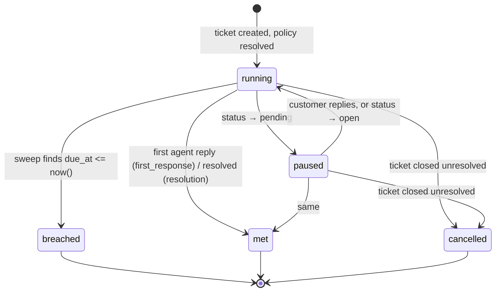
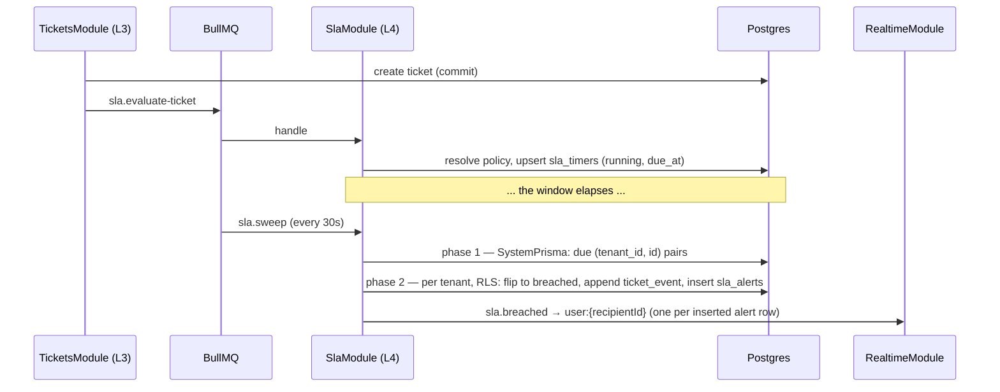

# SLA timers and supervisor alerts (TAR-269)

Status: proposed · Builds on [0002 — architecture and API contract](./0002-architecture-and-api-contract.md),
[0003 — ticket auto-linking contract](./0003-ticket-auto-linking-contract.md),
[0004 — RBAC permission matrix](./0004-rbac-permission-matrix.md) · Owns the design for TAR-26

Reader: engineer. This is the contract TAR-270 (schema), TAR-280 (backend) and TAR-281
(frontend) build against.

## Context and Problem

TAR-26 asks for two things: a ticket with no agent reply inside the tenant's window is
flagged overdue in the queue, and the assigned agent's supervisor is notified when it
happens.

This is not a green field. TAR-47 already landed `sla_policies` and `sla_timers`, TAR-73
already published `TicketSlaSchema`, `TICKET_STATUS_PAUSES_SLA`,
`TicketListQuery.breachedOnly` and the `sla_breached` ticket event type. Nothing reads or
writes any of it — there is no `SlaModule`, no timer is ever created, and
`tickets.first_response_at` has never been written by any code path. So this document
decides the mechanism, names the deltas to what shipped, and fixes the surface, rather
than inventing a model that already exists.

The constraint that makes it non-trivial: **a breach is a time becoming true, not a
request arriving.** Nothing calls us. Something has to notice, exactly once per
transition, across replicas, restarts and a Redis outage — while every read and write
stays inside one tenant.

## Goals / Non-Goals

**Goals**

- One overdue-detection mechanism, self-healing after an outage, with a stated detection
  latency.
- Tenant-wide SLA configuration: a platform default window, overridable per tenant,
  scoped by row-level security (RLS) like everything else.
- Exactly one supervisor alert per breach — not per poll cycle, per replica or per retry.
- A supervisor-alert delivery path that survives the supervisor being offline.
- Data shapes published now, so TAR-281 can build before TAR-280 finishes.

**Non-Goals**

- Per-customer SLA contracts. TAR-26 puts them out of scope; the tenant-wide policy is v1.
- **Business-hours accounting.** `sla_policies.business_hours_only` exists and stays
  `false`. Turning it on means a per-tenant holiday calendar and timezone arithmetic, and
  the moment it is on, `due_at` stops being a timestamp you can compare and becomes a
  function. Recorded as risk 1, not designed here.
- Escalation by email, WhatsApp or push. The transport below is shaped so adding a channel
  is one subscriber, and no more.
- SLA aggregates and dashboards — TAR-30.
- Resolution SLAs as a shipped default. The model carries them; the seeded policy leaves
  `resolution_minutes` null, so only the first-response timer exists at v1.

---

## Proposed Architecture

A new L4 `SlaModule`, per 0002's module table. It may import L3 (`TicketsModule`); nothing
below it may import it, which is why every trigger reaching it is a queue job rather than
a call.

| Component          | Responsibility                                                              |
| ------------------ | --------------------------------------------------------------------------- |
| `SlaPolicyService` | Resolves the policy applying to a ticket; reads and updates policies        |
| `SlaTimerService`  | Starts, pauses, resumes and stops timers. The only writer of `sla_timers`   |
| `SlaSweepService`  | Detects breaches, writes alerts. The subject of decisions 1–3               |
| `SlaAlertService`  | Resolves recipients, reads and acknowledges alerts                          |
| `SlaQueueRunner`   | BullMQ registration — the only file in the module that knows a queue exists |
| `SlaController`    | `/api/v1/sla-policies`, `/api/v1/sla-alerts`                                |

### Lifecycle



`breached` is terminal. A ticket answered after it breached still stamps
`tickets.first_response_at` and stops accruing, but the timer stays `breached` — the
supervisor's record of the miss is not erased by a late reply.

### Triggers

Every trigger is a durable BullMQ job. `domain-events.ts` says so in as many words about
the in-process bus: _"A subscriber for which loss is not acceptable — TAR-23's assignment,
TAR-26's SLA timers — needs a durable trigger of its own."_ This is that trigger.

| When                                      | Enqueued by                                            | Effect                                                            |
| ----------------------------------------- | ------------------------------------------------------ | ----------------------------------------------------------------- |
| A ticket is created                       | `TicketLinkerService`, after commit                    | Start the timers the resolved policy defines                      |
| An outbound message from a person commits | `MessageSendService`, after commit                     | Stop `first_response` as `met`; stamp `tickets.first_response_at` |
| A ticket's status changes                 | TAR-25's ticket command service                        | Pause, resume, stop or cancel per `TICKET_STATUS_PAUSES_SLA`      |
| A customer replies to a `pending` ticket  | `TicketLinkerService` (`previousStatus === 'pending'`) | Resume                                                            |
| Every `SLA_SWEEP_INTERVAL_MS`             | The repeatable scheduler                               | Breach detection (decision 1)                                     |

All four ticket-level triggers enqueue **the same job**, `sla.evaluate-ticket`, carrying
`{ tenantId, ticketId, reason }`. The handler re-derives the whole timer state for that
ticket from the row rather than trusting `reason`; `reason` exists for logs.

That is the property that makes at-least-once delivery safe here: the handler is a
reconciler, so a job that is lost, duplicated, or arrives out of order converges on the
same state. A set of five specialised jobs would each have to be correct about ordering
against the other four.



---

## Decisions

### Decision 1 — Overdue detection: a periodic sweep, not a job scheduled per timer

**Trade-off axis: detection precision vs. durability of the deadline.**

**Chosen — one repeatable BullMQ job, every `SLA_SWEEP_INTERVAL_MS` (default 30 000),
installed with `QueueService.schedule` under the key `sla-sweep`.** That method wraps
`upsertJobScheduler`, which is idempotent on the key, so a rolling deploy replaces the
schedule rather than accumulating one per replica. Each run queries `sla_timers` for rows
that are `running` and due, and flips them.

Four reasons, in order of weight:

1. **The deadline lives in Postgres, and Redis is treated as losable in this codebase.**
   0002 describes the webhook sweeper as the design's single most valuable property
   precisely because it "converts a Redis outage from message loss into message lateness".
   A delayed job per timer is a deadline stored in Redis: a flush loses breaches with no
   error, no retry and no failed set — just an alert that never comes. 0002's own failure
   table already records that late SLA timers "have contractual meaning"; silently absent
   ones are worse.
2. **`due_at` moves.** It moves on every pause and resume, and it will move again when
   TAR-25's priority change re-selects a policy. A scheduled job would need a
   cancel-and-reschedule on each, and a stale job that escapes cancellation fires early —
   a _false_ breach alert, which is more damaging than a late one.
3. **Catch-up is free.** The predicate is `due_at <= now()`, not "due since the last
   tick". After any outage of any length, the first sweep drains the whole backlog with no
   re-arming step and no bookkeeping of what was missed.
4. **One thing to monitor.** A repeatable job has a duration, a batch size and a failed
   set. N delayed jobs are a Redis keyspace.

Cost, stated plainly: detection latency is bounded by the interval plus queue wait — 30 s
against a 60-minute window is 0.8% of it, and the flag is a queue badge rather than a
pager. The query runs whether or not anything is due.

**Its breaking point.** Sweep cost grows with the number of _running_ timers across all
tenants, not with the number due, because the scan stops at the first row not yet due. At
the low hundreds of concurrent agents 0002 targets, that is thousands of rows behind an
index range scan. It stops being free when a full batch (`SLA_SWEEP_BATCH`, 200) comes
back on consecutive sweeps — the signal to raise the batch, shorten the interval, or shard
the phase-1 query by `tenant_id`. Do not pre-build any of it. TAR-280 logs the batch size
so the signal exists.

⚠️ **Amended by TAR-381.** "It stops being free" understated it: a full batch is not only a
capacity signal, it is a _starvation_ signal, because the batch can be filled indefinitely
by a single tenant. See Amendment 1.

**Rejected — a delayed BullMQ job per timer, fired at `due_at`.** Precise to the second,
no polling, no wasted queries; genuinely the better mechanism if the deadline were durable
where the job is. Rejected on 1 and 2 above. Reconsider only if sub-30-second precision
becomes contractual, and then as a _hybrid_: the delayed job for precision with the sweep
kept as the backstop, which is what makes losing one harmless.

**Rejected — `pg_cron`, or a Postgres trigger with `LISTEN`/`NOTIFY`.** Puts the schedule
next to the data it reads, which is the appeal. Rejected: it is a second scheduler to
operate and monitor with none of BullMQ's retry, backoff or failed-set semantics;
extension availability on the managed Postgres **needs verification** rather than
assumption; and the notification work is TypeScript regardless, so it moves the trigger
without moving the job.

**Rejected — `setInterval` in the API process.** No dependency at all. It runs once per
replica with no coordination, has no retry, and dies with the event loop it lives on.

### Decision 2 — The sweep is two-phase: a system-scoped read, then tenant-scoped work

**Trade-off axis: one cross-tenant query vs. the blast radius of `SystemPrisma`.**

The sweep must find due timers across every tenant, and no request context exists inside a
queue worker beyond what the job payload names. 0002 confines `SystemPrisma` to a written
list of call sites, and `docs/reference/tenancy.md` records that a sixth needs a
justification in review. This is that justification.

**Chosen — split it.**

_Phase 1, `SystemPrisma`, read-only, two columns:_

```sql
SELECT tenant_id, id
FROM sla_timers
WHERE state = 'running' AND due_at <= now()
ORDER BY due_at
LIMIT 200;
```

It returns uuid pairs. No ticket, no contact, no message, nothing that is a tenant's data,
and nothing that reaches a caller — the same shape of narrow, justified exception that
0002 already granted `SessionReplayProbe`.

⚠️ **Amended by TAR-381.** This statement is unfair across tenants and was replaced by a
per-tenant `LATERAL` with the same output shape and the same `SystemPrisma` justification.
See Amendment 1 for the query as built.

_Phase 2, per tenant, under RLS._ Group the pairs by `tenant_id` and process one tenant per
`$tenantTransaction`. Every read and every write in phase 2 is scoped, so a bug there
writes into the tenant in scope or nowhere.

⚠️ **Amended by TAR-381**: one transaction per tenant became one per **chunk** of
`SLA_SWEEP_TENANT_CHUNK` timers, so partial progress commits. See Amendment 1.

**Rejected — run the whole sweep on `SystemPrisma`.** One query, no grouping, no
per-tenant transaction. Rejected because the writes are the dangerous half: an alert row
inserted with the wrong `tenant_id` under the system role is a cross-tenant leak that RLS
would otherwise have refused, and the sweep writes to three tables.

**Rejected — iterate every tenant and run a scoped query for each.** No `SystemPrisma` at
all, which is the cleanest possible story. Rejected on cost: it is one transaction per
tenant per 30 seconds, almost all returning nothing, growing linearly with tenants that
have no due work.

**`assert_tenant_active` applies.** A deactivated tenant's `$tenantTransaction` throws
`TenantNotActiveError` (TAR-51). Handle it as `TicketQueueRunner` already does: log, skip
that tenant, continue — deactivation is a state an operator created, not a fault to alert
on. It must not fail the sweep for every other tenant, so phase 2 catches per tenant.

### Decision 3 — Idempotency: a conditional UPDATE is the mechanism, everything else is optimisation

The sweep runs every 30 seconds, on every replica holding a worker, and a job may be
retried. A ticket must produce one supervisor alert per breach.

**Chosen — the state transition is the guard.** Phase 2 is a single transaction per
tenant, three statements:

```sql
-- 1. Claim. Only rows this statement moved are alerted.
WITH due AS (
  SELECT id FROM sla_timers
  WHERE id = ANY($1::uuid[]) AND state = 'running' AND due_at <= now()
  FOR UPDATE SKIP LOCKED
)
UPDATE sla_timers t
   SET state = 'breached', breached_at = now()
  FROM due
 WHERE t.id = due.id
RETURNING t.id, t.ticket_id, t.kind, t.due_at;
```

```sql
-- 2. Audit, in the same transaction as the flip, which is what bounds it to one.
INSERT INTO ticket_events (id, tenant_id, ticket_id, type, actor_user_id, data, created_at)
VALUES (..., 'sla_breached', NULL, '{"kind":"first_response"}'::jsonb, now());
```

```sql
-- 3. Deliver. One row per recipient; the unique index is the second guard.
INSERT INTO sla_alerts (id, tenant_id, sla_timer_id, ticket_id, recipient_user_id, kind, created_at)
VALUES (...)
ON CONFLICT (tenant_id, sla_timer_id, recipient_user_id) DO NOTHING
RETURNING id, recipient_user_id;
```

Three independent layers, each covering a different failure:

| Layer                                                 | Covers                                                                      |
| ----------------------------------------------------- | --------------------------------------------------------------------------- |
| `WHERE state = 'running'` in the UPDATE               | Two replicas sweeping the same timer. One gets the row; the other gets none |
| `UNIQUE (tenant_id, sla_timer_id, recipient_user_id)` | A retry after a partial failure re-inserts nothing                          |
| BullMQ `jobId` (`sla-evaluate-{tenantId}-{ticketId}`) | Collapses a duplicate enqueue while the first is still queued               |

Only the first is load-bearing. The `jobId` is an optimisation and is documented as one in
`ticket-linking.ts`; BullMQ forgets a completed job's id, so it can never be the mechanism.
Hyphens, never a colon — TAR-249's lesson, which cost a release of silently uncreated
tickets.

⚠️ **Amended by TAR-380.** `WHERE state = 'running'` is not self-sufficient: the only thing
that moved a met timer out of `running` was a job the queue is allowed to drop, so a
dropped trigger became a permanent false breach. A **statement 0** now re-derives every due
ticket before the claim reads its state, in the same transaction, and the guard above is
load-bearing only because of it. See Amendment 2.

**`ticket_events` has no unique constraint**, and cannot easily grow one on an append-only
log. That is exactly why statement 2 lives in the same transaction as statement 1 rather
than in a downstream notification job: the `state = 'running'` guard is what makes it run
at most once. Writing the audit row anywhere else would reintroduce the duplicate this
decision exists to prevent.

**The realtime emit happens after commit**, addressed only to the rows statement 3
actually returned. If the process dies between commit and emit, the alert row exists and
the supervisor sees it on the next page load — the row is the record, the socket is an
accelerator. That asymmetry is deliberate and is the reason decision 5 writes a row at all.

**Every comparison uses Postgres `now()`, never a node clock.** Same rule the schema
already states for `users.locked_until`: skew between API instances must not be able to
breach a timer early or hold one open.

**Rejected — read the timer, check "due and not yet notified" in TypeScript, then
write.** The window between the read and the write is exactly the window two replicas
race in, and the bug it produces — a duplicate alert every 30 seconds — is the one TAR-282
is chartered to catch.

### Decision 4 — Resolving the assigned agent's supervisor

**Trade-off axis: an explicit hierarchy vs. deriving one from the model that exists.**

TAR-22's model has roles (`agent`, `supervisor`, `admin`) and teams (`teams`,
`team_members`). It has **no manager link**: nothing says which supervisor a given agent
reports to.

**Chosen — derive the recipients, narrowing by team, with a tenant-wide fallback.**

1. The **responsible party** is `tickets.assigned_user_id`, or `tickets.assigned_team_id`
   when no user holds it, or nobody.
2. **Candidates** are the tenant's users with `role IN ('supervisor','admin')` and
   `status = 'active'` — which is the same population as "holds `ticket:read_all`", per
   0004's nested matrix.
3. **Narrow** to candidates who share a team with the responsible party: a row in
   `team_members` for a team the assigned user is also in, or membership of the assigned
   team.
4. **Fall back** to every candidate in the tenant when step 3 yields nobody — the agent is
   in no team, no supervisor shares one, or the ticket is unassigned. A broad alert is
   worse than a narrow one; an alert delivered to no one is worse than both.
5. If the tenant has no active supervisor or admin at all, write no alert rows and log a
   warning naming the ticket. The ticket still shows overdue in the queue. This is
   theoretical rather than real: `last_admin_required` (0004, delta 3) guarantees every
   tenant keeps one active admin.

The assigned agent is **not** excluded from the candidate set when they are themselves a
supervisor. A supervisor working a queue wants to know their own ticket breached, and the
special case would buy nothing but a branch.

`team_members (tenant_id, user_id, team_id)` already exists and is documented as serving
"which teams is this user in", so step 3 is two index reads.

**Rejected — an explicit `teams.supervisor_user_id` or `users.manager_user_id`.** A real
hierarchy, unambiguous, and the right answer for an organisation with shift structure.
Rejected for v1: it is a migration plus a management UI plus an "no manager set" empty
state that every other feature then has to handle, for tenants with a handful of
supervisors; and one named manager is a single point of failure — on holiday, the alert
goes nowhere. Reconsider when a tenant runs more than a handful of supervisors or asks for
routing by shift. The recipient rule is one function, so that change is local.

### Decision 5 — Alert transport: a durable row, pushed over the existing socket

**Trade-off axis: immediacy vs. a supervisor who is not looking.**

**Chosen — write `sla_alerts`, then emit `sla.breached` to `user:{recipientId}`.**

- The **row** is the record. It survives a restart, a missed socket, and a supervisor who
  was asleep. It carries `acknowledged_at`, so the console can show an unread count that
  means something, and it is the idempotency ledger from decision 3.
- The **socket** is the immediacy. One emit per row that was actually inserted, addressed
  to that recipient's user room. `userRoom` already exists and `session.revoked` already
  uses it for a per-user, non-conversation event, so this needs no new room concept.
- The **`sla_breached` ticket event** is the audit trail, and is what TAR-32's escalation
  log and TAR-30's cycle-time reporting read.

Deliberately **not** `tenantReadersRoom`. The realtime contract's own amendment says a
fan-out that does not match the read rule is an authorization bypass; here the read rule
is "you are a named recipient", the rows say who that is, and the emit must equal them.

The ticket's own queue row also changes, so the sweep additionally emits the existing
`ticket.updated` event with the full `TicketResponse`, addressed by
`conversationAudienceRooms({ tenantId, assignedUserId, assignedTeamId })` read off the
**ticket**. That function is structural rather than tied to a row type — its own docblock
says so — and reusing it is what keeps the ticket queue's live audience identical to the
inbox's rule instead of a second one drifting beside it.

**Rejected — realtime only, no table.** Cheapest, and the shared-inbox channel already
exists. Rejected because a supervisor offline at 02:14 never learns, and TAR-26's
acceptance criterion is "the supervisor is notified", not "a message was emitted". It also
leaves nothing to make delivery idempotent with.

**Rejected — a general `notifications` table now.** Mentions in internal notes and
assignment hand-offs will both want one, and building it once is tempting. Rejected as
scope: a generic notification centre needs a type taxonomy, per-type preferences and a
read model, none of which TAR-26 asks for. `sla_alerts` is a purpose-built table with four
meaningful columns; when the second notification type arrives, generalising it is a rename
and a `type` column, and the alternative is designing for two callers while having one.

### Decision 6 — Configuration: a seeded `sla_policies` row, not settings columns

**Trade-off axis: the simplest thing that stores one number vs. the model already shipped.**

**Chosen — the platform default is a seed value; the per-tenant override is a
`sla_policies` row.**

- `SLA_DEFAULTS` in `packages/contracts/src/sla.ts` holds
  `{ firstResponseMinutes: 60, resolutionMinutes: null }` — TAR-26's stated assumption,
  "first response within 1 hour".
- Provisioning (TAR-50) seeds one row per tenant: `name: 'Default'`, `priority: null`,
  `isActive: true`, the values above. A backfill migration creates it for tenants that
  already exist.
- A tenant edits that row through `PATCH /api/v1/sla-policies/{id}`, which supervisors can
  already reach — they hold `sla:write` in the shipped matrix.
- **Policy resolution for a ticket:** among the tenant's active policies, prefer
  `priority = ticket.priority`, then `priority IS NULL`, oldest `created_at` breaking a
  tie. No active policy → no timers, and `TicketSla.*State` reports `not_applicable`.
- **A tenant with no policy row at all** gets one created lazily from `SLA_DEFAULTS` on
  first resolution — the same lazy-creation shape `ticket_counters` already uses, so a
  tenant provisioned before this story still gets its default.
- **A tenant whose only policy is `isActive: false` has deliberately turned SLA off**, and
  that is honoured. The platform default is a seed, not a runtime fallback that would
  override a tenant's own decision.

**Rejected — `sla_first_response_minutes` on `tenant_settings`.** Two columns, no join, no
CRUD surface, and `tenant_settings` is documented as the place feature stories add their
own columns. Rejected because `sla_policies` already exists with priority scoping,
`is_active` and the business-hours flag; a settings column would have to be migrated into
it as soon as a tenant asks for "urgent tickets get 15 minutes", which is the first thing
they ask for. It would also need a sentinel value to express "SLA off", where `is_active`
says it plainly.

---

## Technology Choices

Everything in ADR 0001 and 0002 is inherited unchanged. Only what this document adds:

| Concern               | Choice                                           | Alternatives considered                         | Rationale                                                         |
| --------------------- | ------------------------------------------------ | ----------------------------------------------- | ----------------------------------------------------------------- |
| Breach detection      | Repeatable BullMQ sweep, 30 s                    | Delayed job per timer; `pg_cron`; `setInterval` | The deadline is in Postgres; Redis is losable                     |
| Cross-tenant read     | `SystemPrisma`, two uuid columns, phase 1 only   | Whole sweep on `SystemPrisma`; per-tenant loop  | Narrowest possible hole; every write stays under RLS              |
| Duplicate suppression | Conditional `UPDATE ... WHERE state = 'running'` | Read-check-write; a `notified` boolean          | Atomic; correct across replicas by construction                   |
| Alert record          | `sla_alerts` row per recipient                   | Realtime only; a generic `notifications` table  | Survives an offline supervisor; doubles as the idempotency ledger |
| Alert push            | `sla.breached` → `user:{id}` room                | `tenant:{id}` broadcast                         | The socket audience must equal the rows written                   |
| Supervisor resolution | Role + shared team, tenant-wide fallback         | Explicit manager column                         | Uses TAR-22's model as it is; no single point of failure          |
| Config storage        | Seeded `sla_policies` row                        | `tenant_settings` columns                       | The table exists and already scopes by priority                   |
| Pause accounting      | Move `due_at` forward on resume                  | Store elapsed and compute due at read time      | Keeps the sweep predicate a single comparison                     |

---

## Data Model

`apps/api/prisma/schema.prisma` stays the source of truth; this is the delta TAR-270
applies. Everything below is tenant-scoped and RLS-protected, per 0002's rule 2.

### `sla_timers` — extended

| Change                                   | Why                                                                                |
| ---------------------------------------- | ---------------------------------------------------------------------------------- |
| `sla_timer_state` gains `paused`         | The contract's `SLA_STATES` already publishes `paused`; the database enum does not |
| `+ paused_at timestamptz(3) null`        | When the current pause started. Null while running                                 |
| `+ paused_ms integer not null default 0` | Accumulated paused time, for reporting and for explaining a moved `due_at`         |
| `+ breached_at timestamptz(3) null`      | When the sweep flipped it. `stopped_at` is overloaded across met/cancelled         |
| `+ @@index([state, dueAt])`              | Phase 1 of the sweep. See the note below                                           |

**The new index does not lead with `tenant_id`, and that is deliberate.** 0002's rule 3
says composite indexes lead with `tenant_id`; the existing
`(tenant_id, state, due_at)` serves every tenant-scoped read and stays. The sweep's phase-1
query carries no tenant predicate at all, so that index leaves the planner a full scan.
This is the same kind of stated exception as `webhook_events` being the one table without
RLS: one cross-tenant query, named here, indexed for.

**Pause and resume arithmetic.** `due_at` is the single authoritative wall-clock deadline.

```sql
-- pause
UPDATE sla_timers SET state = 'paused', paused_at = now()
 WHERE id = $1 AND state = 'running';

-- resume
UPDATE sla_timers
   SET state    = 'running',
       due_at   = due_at + (now() - paused_at),
       paused_ms = paused_ms + (extract(epoch from now() - paused_at) * 1000)::int,
       paused_at = NULL
 WHERE id = $1 AND state = 'paused';
```

Keeping the deadline in `due_at` rather than deriving it from an elapsed counter is what
lets the sweep stay one comparison against one index. `paused_ms` is never read by the
sweep.

**The enum value needs its own migration file.** Postgres refuses to _use_ an enum value
in the same transaction that added it, and Prisma runs each migration in one transaction.
`ALTER TYPE sla_timer_state ADD VALUE 'paused';` therefore lands alone, ahead of anything
that writes it. Getting this wrong fails the deploy, not production — but it fails it at
the worst moment.

### `sla_alerts` — new

One row per recipient per breached timer. The delivery record, the read model, and the
idempotency ledger.

- **Tenant-scoped:** yes. `tenant_id` non-null, RLS policy identical to every other table.
- **Model:** `SlaAlert`
- **Unique:** `(tenant_id, sla_timer_id, recipient_user_id)` — the second idempotency layer
- **Indexes:** `(tenant_id, recipient_user_id, created_at DESC, id DESC)` — the recipient's
  alert list and its keyset pagination; `(tenant_id, ticket_id)` — "what alerts did this
  ticket raise"
- **Relations:** `tenant`, `sla_timer` (cascade), `ticket` (cascade), `recipient` → `users`
  (`NoAction`, matching every other user reference in the schema)
- **Owned by:** TAR-26

| Column            | Type            | Notes                                                                                            |
| ----------------- | --------------- | ------------------------------------------------------------------------------------------------ |
| `id`              | uuid v7         | Stable keyset tie-breaker, per 0002                                                              |
| `kind`            | `SlaTargetKind` | Denormalised from the timer so the list needs no join                                            |
| `due_at`          | timestamptz(3)  | The deadline that was missed, copied at write time. A later policy edit must not rewrite history |
| `created_at`      | timestamptz(3)  | When the breach was detected, not when it was due. `NOT NULL` — it is a keyset sort column       |
| `acknowledged_at` | timestamptz(3)? | Set by the acknowledge endpoint. First write wins                                                |

### `tickets` — one column, already present

`tickets.first_response_at` exists and has never been written. TAR-280 writes it.

**TAR-270 must not add overdue columns to `tickets`.** Its own acceptance criteria suggest
`first_response_due_at` and an overdue flag; that predates this decision. The deadline and
the state live on `sla_timers`, and duplicating them on `tickets` creates a second source
of truth that pause/resume would have to keep in step. The `breachedOnly` filter is an
`EXISTS` against `sla_timers`, served by the existing unique
`(tenant_id, ticket_id, kind)`.

That also means this story issues **no `ALTER TABLE` against `tickets`**, which answers
TAR-270's coordination check against TAR-25 outright: there is nothing to collide with.
`sla_alerts` is a new table, and `sla_timers` is empty in every environment today, so the
migration's lock impact is nil at current row counts.

### Seed and demo data

TAR-46's demo dataset gains a default policy per tenant and at least one already-breached
ticket, so TAR-281 has something to render before TAR-280's sweep runs anywhere.

---

## Interfaces

### New contracts file — `packages/contracts/src/sla.ts`

```ts
/** Platform default, seeded per tenant at provisioning. TAR-26's stated assumption. */
export const SLA_DEFAULTS = {
  firstResponseMinutes: 60,
  resolutionMinutes: null,
} as const;

/** BullMQ queue owned by SlaModule. */
export const SLA_QUEUE = 'sla';

/** Reconcile every timer on one ticket. Idempotent; the handler re-derives from the row. */
export const SLA_EVALUATE_TICKET_JOB = 'sla.evaluate-ticket';

/** The repeatable breach sweep. Installed under the scheduler key `sla-sweep`. */
export const SLA_SWEEP_JOB = 'sla.sweep';

export const SLA_EVALUATE_REASONS = [
  'ticket_created',
  'agent_replied',
  'status_changed',
  'customer_replied',
] as const;

export const SlaEvaluateTicketTriggerSchema = z.object({
  tenantId: IdSchema,
  ticketId: IdSchema,
  /** For logs only. The handler reconciles from the row and never branches on this. */
  reason: z.enum(SLA_EVALUATE_REASONS),
});
export type SlaEvaluateTicketTrigger = z.infer<typeof SlaEvaluateTicketTriggerSchema>;

/** Hyphens, never a colon — BullMQ rejects a colon in a custom id (TAR-249). */
export function slaEvaluateJobId(t: SlaEvaluateTicketTrigger): string {
  return `sla-evaluate-${t.tenantId}-${t.ticketId}`;
}

export const SLA_TARGET_KINDS = ['first_response', 'resolution'] as const;
export const SlaTargetKindSchema = z.enum(SLA_TARGET_KINDS);

export const SlaPolicyResponseSchema = z.object({
  id: IdSchema,
  name: z.string().min(1).max(100),
  /** Null means "any priority" — the catch-all the default row uses. */
  priority: TicketPrioritySchema.nullable(),
  firstResponseMinutes: z.int().min(1).max(43_200).nullable(),
  resolutionMinutes: z.int().min(1).max(43_200).nullable(),
  /** Modelled, not implemented at v1. Always false; see risk 1. */
  businessHoursOnly: z.boolean(),
  isActive: z.boolean(),
  createdAt: TimestampSchema,
  updatedAt: TimestampSchema,
});

export const SlaPolicyUpdateInputSchema = z
  .object({
    name: z.string().min(1).max(100).optional(),
    firstResponseMinutes: z.int().min(1).max(43_200).nullable().optional(),
    resolutionMinutes: z.int().min(1).max(43_200).nullable().optional(),
    isActive: z.boolean().optional(),
  })
  .refine((v) => Object.keys(v).length > 0, { message: 'Provide at least one field' });

export const SlaAlertResponseSchema = z.object({
  id: IdSchema,
  ticketId: IdSchema,
  ticketNumber: z.int().positive(),
  slaTimerId: IdSchema,
  kind: SlaTargetKindSchema,
  /** The deadline that was missed, as it stood when the breach was detected. */
  dueAt: TimestampSchema,
  /** Who was holding the ticket. Null when nobody was — the fallback branch of decision 4. */
  assignedUserId: IdSchema.nullable(),
  assignedTeamId: IdSchema.nullable(),
  acknowledgedAt: TimestampSchema.nullable(),
  createdAt: TimestampSchema,
});

export const SlaAlertListQuerySchema = CursorPageQuerySchema.extend({
  /** Default true: the supervisor's landing view is what still needs attention. */
  unacknowledgedOnly: z.boolean().default(true),
});
```

`43_200` is 30 days in minutes — an upper bound that rejects a typo without pretending to
know a tenant's business.

### Endpoint surface

Following 0002's conventions exactly: `/api/v1`, plural kebab-case nouns, sub-resource
POST for a non-CRUD verb, `{ items, nextCursor }` for lists, `ApiErrorSchema` for failures.

```
# SLA policies                                                            TAR-26
GET    /api/v1/sla-policies                  → CursorPage<SlaPolicyResponse>   sla:read
GET    /api/v1/sla-policies/{id}             → SlaPolicyResponse               sla:read
PATCH  /api/v1/sla-policies/{id}             → SlaPolicyResponse               sla:write

# SLA alerts — always scoped to the calling principal
GET    /api/v1/sla-alerts                    → CursorPage<SlaAlertResponse>    ticket:read
POST   /api/v1/sla-alerts/{id}/acknowledge   → SlaAlertResponse                ticket:read
```

**No POST or DELETE on `sla-policies` at v1.** The seeded row satisfies TAR-26, and a
create surface is only meaningful alongside the per-priority policy UI that is not in
scope. Turning SLA off is `PATCH { isActive: false }`, which mirrors how a tenant is
deactivated rather than deleted.

**`GET /api/v1/sla-alerts` needs no `_all` permission.** Every row names its recipient, and
the query adds `recipient_user_id = principal.userId` on top of RLS. An agent may call it
and gets an empty page. That is the whole of TAR-281's role-scoping requirement, enforced
server-side.

**Acknowledging is idempotent.** A second call returns the same row with the original
`acknowledged_at`; nothing is 409.

### Ticket queue — no contract change required

`TicketSlaSchema` as published carries everything the queue badge needs. This is the
mapping TAR-280 implements; the shape does not move.

| `sla_timers` row for `kind = 'first_response'` | `TicketSla.firstResponseState` | `firstResponseDueAt` |
| ---------------------------------------------- | ------------------------------ | -------------------- |
| absent                                         | `not_applicable`               | `null`               |
| `running`                                      | `running`                      | `due_at`             |
| `paused`                                       | `paused`                       | `due_at`             |
| `met`                                          | `met`                          | `due_at`             |
| `breached`                                     | `breached`                     | `due_at`             |
| `cancelled`                                    | `not_applicable`               | `null`               |

The resolution timer maps identically onto `resolutionState` / `resolutionDueAt`.
`TicketSla.policyId` is the policy the timers were started under.

"How overdue" is `now - firstResponseDueAt`, computed client-side. The API publishes the
deadline, never a duration that is stale the moment it is serialised.

`TicketResponse.firstRespondedAt` maps from `tickets.first_response_at`. The names differ;
that is the mapper's business and not a schema change.

`GET /api/v1/tickets?breachedOnly=true` — already in `TicketListQuerySchema` — filters to
tickets with an `EXISTS` row in `sla_timers` where `state = 'breached'`.

### Realtime

One new member of `ServerEventSchema`:

```ts
z.object({
  event: z.literal('sla.breached'),
  alert: SlaAlertResponseSchema,
  ticket: TicketResponseSchema,
}),
```

Emitted to `userRoom(alert.recipientUserId)`, once per row the alert insert returned. The
existing `ticket.updated` is emitted alongside it to
`conversationAudienceRooms({ tenantId, assignedUserId, assignedTeamId })` read off the
ticket, so the queue badge moves for everyone entitled to see the ticket without a refetch.

Payloads are whole resources, per 0002.

### Error codes

**No new entry in `error-codes.ts`.** The existing taxonomy covers every failure this
surface has:

| Condition                                         | Code                | Status |
| ------------------------------------------------- | ------------------- | ------ |
| Unknown policy or alert id, or another tenant's   | `not_found`         | 404    |
| A window outside 1–43 200, or an empty patch body | `validation_failed` | 400    |
| Caller lacks `sla:write`                          | `forbidden`         | 403    |
| An alert belonging to another principal           | `not_found`         | 404    |

The last row matters: another principal's alert answers 404, not 403, on 0002's rule that
a 403 confirms the id exists.

---

## Failure Modes and Operations

| Component                | Down                                                                                                                                                                                                                                         | Slow                                                                                                                     | Bad data                                                                                                            |
| ------------------------ | -------------------------------------------------------------------------------------------------------------------------------------------------------------------------------------------------------------------------------------------- | ------------------------------------------------------------------------------------------------------------------------ | ------------------------------------------------------------------------------------------------------------------- |
| Redis / BullMQ           | No sweep, no timers started. **Nothing is lost** — deadlines are in Postgres, the first sweep after recovery drains the backlog, and a trigger dropped while Redis was away is re-derived by statement 0 rather than becoming a false breach | Alerts are late by the backlog, never absent                                                                             | Payloads are re-validated; a malformed one is `UnrecoverableError`, as elsewhere                                    |
| Postgres                 | Everything is down                                                                                                                                                                                                                           | A sweep overruns its interval and the next tick overlaps — harmless, the conditional UPDATE gives the second one nothing | —                                                                                                                   |
| Socket delivery          | The supervisor sees the alert on next load or via `GET /sla-alerts`. The row is the record                                                                                                                                                   | —                                                                                                                        | —                                                                                                                   |
| A tenant is deactivated  | `assert_tenant_active` throws; that tenant is skipped with a warning and the sweep continues                                                                                                                                                 | —                                                                                                                        | —                                                                                                                   |
| Clock skew               | —                                                                                                                                                                                                                                            | —                                                                                                                        | Not reachable: every comparison is Postgres `now()`                                                                 |
| No active supervisor     | No alert rows; a warning names the ticket; the queue still shows it overdue                                                                                                                                                                  | —                                                                                                                        | —                                                                                                                   |
| Policy edited mid-flight | —                                                                                                                                                                                                                                            | —                                                                                                                        | Running timers keep the `due_at` they started with. Editing the window changes future tickets, never past deadlines |

**What should page someone**

- The `sla.sweep` job failing on consecutive runs — detection has stopped, and nothing
  else will notice.
- A full batch (200) returned on consecutive sweeps — detection is falling behind, per
  decision 1's breaking point.
- The same tenant in the `failed` count on consecutive sweeps — that tenant's backlog is
  not draining, and only its own share of the batch is being spent on discovering that
  (TAR-381).
- A sweep whose elapsed time approaches `SLA_SWEEP_INTERVAL_MS` — logged as `in Xms` since
  TAR-381, and the earliest visible form of risk 4 below.
- Any timer still `running` whose `due_at` is more than ten sweep intervals in the past —
  the sweep is running but not draining, which no other signal above would show.

TAR-41 owns wiring these to alerting, as it does for the webhook sweeper.

**Scale ceiling.** The design targets 0002's stated scale: low hundreds of concurrent
agents, one Postgres primary. The first thing to break is phase 1's scan as the count of
`running` timers grows. Next steps, in order: raise `SLA_SWEEP_BATCH` and
`SLA_SWEEP_TENANT_BATCH` together, then make the index partial (`WHERE state = 'running'`,
outside the Prisma schema and therefore with the drift caveat the `sla_timers` docblock
already records), then shard phase 1 by `tenant_id` across replicas. Do not pre-build any
of it.

---

## Security and Access

- Every read and write is under `TenantPrisma` or `$tenantTransaction`, except phase 1 of
  the sweep. That call site returns two uuid columns, is read-only, and reaches no caller —
  decision 2 is the justification `docs/reference/tenancy.md` requires for a sixth
  `SystemPrisma` use, and the list there should gain a sixth row when TAR-280 lands.
- `sla_policies`, `sla_timers` and `sla_alerts` are all tenant-scoped with the standard
  `tenant_isolation` policy. The isolation test that ships with every migration covers
  `sla_alerts`.
- `GET /api/v1/sla-alerts` narrows to `recipient_user_id = principal.userId` on top of RLS.
  Two layers, and the outer one is what stops one supervisor reading another's queue.
- **No change to `rbac.ts`.** `sla:read` and `sla:write` already exist and are already
  granted to supervisor and admin; `ticket:read` is held by every role. This story adds no
  permission and moves no grant.
- Alerts carry no message content — a ticket number, a deadline and ids. Nothing in the
  push or the row is PII beyond what the ticket queue already shows the same principal.
- The sweep logs ticket ids and counts, never subjects or message bodies.

---

## Implementation Phases

TAR-26 already carries its sub-issues. **This document creates none**; it says what each
existing one builds.

| Order | Story       | Delivers from this document                                                                                                                                                                                               | Unblocks        |
| ----- | ----------- | ------------------------------------------------------------------------------------------------------------------------------------------------------------------------------------------------------------------------- | --------------- |
| 1     | **TAR-270** | The enum value in its own migration; `sla_timers` columns and the `(state, due_at)` index; the `sla_alerts` table; the provisioning seed and its backfill; TAR-46 demo data. **No `ALTER TABLE tickets`**                 | 280, 281        |
| 2     | **TAR-280** | `packages/contracts/src/sla.ts`; `SlaModule`; timer lifecycle and the four triggers; the sweep (decisions 1–3); recipient resolution (decision 4); the endpoints; `tickets.first_response_at`; the realtime event         | 281 wiring, 282 |
| 2     | **TAR-281** | Overdue badge on the ticket queue from `TicketResponse.sla`; supervisor alert surface from `GET /api/v1/sla-alerts` and `sla.breached`. **Can start as soon as TAR-270 lands** — every shape it needs is in this document | 282             |
| 3     | TAR-282     | QA against the boundary cases below                                                                                                                                                                                       | 283             |
| 4     | TAR-283     | Review, with decision 3 as the checklist for the duplicate-alert criterion                                                                                                                                                | 287             |
| 5     | TAR-287     | Operator and tenant-user documentation                                                                                                                                                                                    | —               |

**Tests that must exist, because the failure they catch is silent**

1. Two concurrent sweeps over the same due timer produce exactly one `sla_alerts` row per
   recipient and exactly one `sla_breached` ticket event.
2. A reply landing one second inside the window leaves the timer `met` and raises no alert;
   one second outside raises exactly one.
3. Tenant B's sweep never writes into tenant A — the isolation test 0002 requires with
   every migration, extended to `sla_alerts`.
4. A ticket paused in `pending` for an hour and resumed has its `due_at` moved forward by
   that hour, and does not breach in between.
5. Redis stopped for the length of a window, then started: the first sweep raises the
   alert, once.
6. An agent replies inside the window and the `agent_replied` enqueue is dropped: the next
   sweep leaves the timer `met`, alerts nobody, stamps `first_response_at`, and the timer
   does not reappear in the following batch (TAR-380).

---

## Open Questions and Risks

| #   | Item                                                                                                                                                                                                                                                           | Severity | Resolution                                                                                                                                                                                 |
| --- | -------------------------------------------------------------------------------------------------------------------------------------------------------------------------------------------------------------------------------------------------------------- | -------- | ------------------------------------------------------------------------------------------------------------------------------------------------------------------------------------------ |
| 1   | **Business hours are modelled, not implemented.** A wall-clock timer started at 17:30 breaches overnight, and a supervisor is alerted about a window nobody was working in                                                                                     | High     | Confirm with Tarek whether any target tenant's SLA is contractual against business hours. If yes it is its own story — a holiday calendar and timezone arithmetic, not a flag flip         |
| 2   | **Does a chatbot reply count as a first response?** Proposed: **no** — only an outbound message with a non-null `sender_user_id` stops the timer                                                                                                               | Medium   | Confirm before TAR-28 builds the chatbot. Recorded here so it is a decision rather than an accident of whichever code path writes the message                                              |
| 3   | **Multi-number tenants.** 0003 allows a contact's messages to land on a second conversation while one ticket stays active. v1 detects the first response on `tickets.conversation_id` only, so a reply sent on the other conversation would not stop the timer | Medium   | Accepted for v1: it needs a tenant with two WABAs and the same contact on both. The wider query reads `conversation_linked` ticket events; TAR-280 records the gap rather than building it |
| 4   | **The 30-second interval is an assumption, not a measurement.** No benchmark is claimed                                                                                                                                                                        | Low      | TAR-280 logs sweep duration and batch size; TAR-282 confirms the observed detection latency against the 30 s claim                                                                         |
| 5   | **`sla_alerts` retention is unset** and the table grows without bound                                                                                                                                                                                          | Low now  | Propose sweeping acknowledged alerts older than 90 days. Must be settled before the first large tenant, and it belongs with the wider retention question 0002 left open                    |
| 6   | **`ALTER TYPE ... ADD VALUE` behaviour** must be confirmed against the Postgres version in the Compose stack before TAR-270 writes the migration                                                                                                               | Low      | Cheap to verify locally; the mitigation — the value in its own migration file — is free and should be applied regardless                                                                   |

---

## Amendments

### Amendment 1 — one tenant could starve every other tenant's detection (TAR-381)

Post-merge review of TAR-280 (#97) found that decisions 1 and 2, as specified here and as built,
share a livelock. Both halves of it are corrected inline above and both are defects in this
document rather than in the PR, which implemented what was written.

**The shape.** The predicate that makes catch-up free — `due_at <= now()`, oldest first — is also
what makes a stuck tenant contagious. A timer that is not claimed only gets _older_, so it sorts to
the head of the _next_ batch too, and of every batch after it. Decision 2 already recognised one
instance of this and closed it: a deactivated tenant's timers can never be claimed, so phase 1
joins `tenants` and excludes them. Nothing guarded the general case, and the general case is an
**active** tenant whose phase 2 keeps failing.

**How it triggers without anybody doing anything wrong.** A tenant recovering from an outage with
≥200 due timers fills the whole batch. `claimAndAlert` issues roughly four sequential round trips
per claimed timer inside one transaction, so a full batch is ~800 statements against a 20-second
`SLA_SWEEP_TENANT_TIMEOUT_MS`. At ~25 ms per round trip that transaction times out, rolls back
**entirely**, and the identical 200 rows lead the next sweep into the identical timeout. Meanwhile
no other tenant's breaches are examined at all, and the only symptom is one
`SLA sweep failed for tenant …` line per tick — a warning that reads like one tenant's problem
while the platform has stopped detecting breaches.

**Fix, part 1 — phase 1 shares the batch by construction.** The global `ORDER BY due_at LIMIT 200`
became a bounded per-tenant probe, with the same two output columns and therefore the same
`SystemPrisma` justification:

```sql
SELECT d."tenantId", d.id
FROM tenants n
CROSS JOIN LATERAL (
  SELECT t.tenant_id AS "tenantId", t.id, t.due_at
  FROM sla_timers t
  WHERE t.tenant_id = n.id AND t.state = 'running' AND t.due_at <= now()
  ORDER BY t.due_at
  LIMIT 50                      -- SLA_SWEEP_TENANT_BATCH
) d
WHERE n.status = 'active'
ORDER BY d.due_at
LIMIT 200;                      -- SLA_SWEEP_BATCH
```

At 50 against 200, **at least four tenants are served by every sweep** whatever any one of them is
doing. This is the half that survives a tenant which fails permanently — no amount of chunking
helps a tenant whose every transaction is refused, and something still has to stop it owning the
batch.

The access path changes with it: one bounded index probe per **active tenant** on
`sla_timers (tenant_id, state, due_at)`, rather than one range scan on
`sla_timers_state_due_at_idx`. That costs a lookup per tenant with no due work — almost all of
them, on almost every tick — against a `tenants` table that is small by definition, and in exchange
the rows materialised before the outer sort are bounded by `active tenants × 50` rather than by the
platform's whole backlog. The outer `ORDER BY due_at` is unchanged, so the oldest deadline is still
processed first _within_ the batch.

The cost worth stating plainly is drain rate: a single large tenant now takes 50 timers per sweep
rather than 200, so a 10 000-timer backlog drains in ~100 minutes rather than ~25. Against a batch
that previously committed **nothing**, that is a trade worth making — and the escalation order in
the scale ceiling above raises both constants together.

**Fix, part 2 — phase 2 commits in chunks.** One transaction per tenant became one per
`SLA_SWEEP_TENANT_CHUNK` (25) timers. Each committed chunk takes its timers out of the candidate
set for good, so a tenant that overruns on its third chunk keeps the first two and starts the next
sweep that much further ahead; the constant is sized so a chunk is ~100 statements rather than
~800. The first chunk to fail ends that tenant's turn — whatever refused it will refuse the chunk
behind it, and proving that costs every tenant later in the loop their detection for this tick.
`SLA_SWEEP_TENANT_TIMEOUT_MS` was renamed `SLA_SWEEP_CHUNK_TIMEOUT_MS` to match what it now bounds;
the value is unchanged.

`failedTenants` still counts tenants rather than chunks, so the log line means what it always meant.

**Why both.** Chunking alone leaves the batch fillable by one tenant, which is the criterion the
regression test asserts against; the per-tenant cap alone leaves a full rollback discarding work
that had already succeeded. Neither is redundant.

**What this says about the original specification.** Decision 1 named a full batch on consecutive
sweeps as a _capacity_ signal — "raise the batch, shorten the interval, or shard phase 1". It is
also a **fairness** signal, and the two have opposite remedies: raising the batch makes a starving
tenant wait longer, not less. A design that bounds a shared resource per tick should say, in the
same breath, how that resource is divided when demand exceeds it.

**Also in this change (minor, same review).** The sweep logged `due`/`breached`/`alerted` but not
elapsed time, though risk 4 names sweep duration as TAR-280's deliverable. The log line now carries
`in Xms` off `process.hrtime.bigint()`, so a sweep drifting towards the 30-second interval is
visible before it becomes an overlap.

### Amendment 2 — a dropped trigger became a permanent false breach (TAR-380)

The same post-merge review of TAR-280 (#97) found a second defect in decision 3, and again in this
document rather than in the PR: the claim's `WHERE state = 'running'` was specified as sufficient,
and it is not.

**The shape.** That predicate only reads as "not yet met" if something reliably moves a met timer
out of `running` the moment its target is achieved. The only thing that did was the
`sla.evaluate-ticket` job — and `QueueService.enqueue` is contractually allowed to report `failed`
or `unavailable` and drop it, which `MessageSendService` logs and returns from with nothing
re-enqueuing. So the sweep's "has this been answered?" question was really "did a queue job
survive?".

**How it triggers without anybody doing anything wrong.** Redis is unreachable for longer than the
remaining window — a two-second `PRODUCER_COMMAND_TIMEOUT_MS` breach is enough for one ticket. An
agent replies at minute 40 of a 60-minute window; the `agent_replied` enqueue fails; Redis returns;
the first sweep flips the timer to `breached`, writes the `sla_breached` ticket event and alerts a
supervisor about a ticket answered twenty minutes early. `breached` is not in `MUTABLE_STATES`, so
a later evaluation stamps `first_response_at` and **cannot** undo the state — the false breach is
permanent, and it is the exact inverse of TAR-26's second acceptance criterion. It also contradicted
this document's own failure table: "Redis down — **nothing is lost**".

**Fix — the sweep re-derives, in the transaction it claims in.** A statement 0 reads the tickets
carrying a due timer, and each is put through `SlaTimerService.reconcile` — the body `evaluate`
runs, now callable against a caller's transaction — before the claim looks at any state:

```sql
-- 0. Re-derive. Inside the chunk transaction, so the claim reads what this wrote.
SELECT DISTINCT ticket_id FROM sla_timers
WHERE id = ANY($1::uuid[]) AND state = 'running' AND due_at <= now()
ORDER BY ticket_id;
```

**Why not a second predicate on the claim.** The obvious patch is
`AND NOT EXISTS (… tickets.first_response_at IS NOT NULL)`. It does not work: `first_response_at`
is written **only** by `stampFirstResponse`, so in the dropped-enqueue case that column is null
too. The check has to derive from the messages — and writing that derivation a second time, in the
claim's SQL, would mean two implementations of "has a person replied" that can drift. Calling the
reconciler is one implementation, and it fixes the whole class rather than the first-response case:
a dropped `status_changed` on a resolved or closed ticket, and a dropped pause, were the same bug.

**Why it settles rather than skips.** A timer the claim merely declined would stay `running` and
past due, and an unclaimed timer only gets older, so it would lead its tenant's slice of every
subsequent batch for ever. Amendment 1's per-tenant cap contains that to one tenant instead of the
platform, which makes it quieter rather than better: `SLA_SWEEP_TENANT_BATCH` permanently-declined
timers would consume the whole allowance and that tenant's real breaches would never be examined,
reported as nothing at all.

**Cost, on each of two paths.** A ticket that really is overdue — the overwhelming majority, since a
dropped trigger is the exception — costs three reads and issues no write, so a 25-timer chunk goes
from ~100 statements to ~175, still well inside `SLA_SWEEP_CHUNK_TIMEOUT_MS`. Measured against a
real database before Amendment 1 landed, a full 200-timer single-tenant batch went from 1047 ms to
1594 ms.

A ticket that needs repairing **writes, and therefore holds row locks on `tickets` and `sla_timers`
until the chunk commits**. Stated plainly because the obvious reading of "the sweep only reads" is
wrong on exactly the path this amendment exists to add. It is also why the scan carries
`ORDER BY ticket_id`: `DISTINCT` guarantees no ordering, and `reconcile` locks one ticket's rows in
a fixed sequence, so ordering the tickets makes the loop's lock order total. Without it two sweeps
whose chunks overlap on the same two tickets can take them in opposite orders and deadlock —
Postgres kills one, the chunk rolls back, and the tenant is counted as a failure for that tick. The
ordering is needed against the repair path only; the claim uses `FOR UPDATE SKIP LOCKED` and steps
aside rather than waiting.

That clause is **untested, deliberately, and must not be removed on the strength of an `EXPLAIN`.**
Postgres plans this `DISTINCT` as `Sort → Unique` keyed on `ticket_id` today, so the rows arrive
ordered with or without it and no test can be made to fail when it is deleted; `HashAggregate` is an
equally valid plan for the same query, returns groups unordered, and is chosen on row-count
estimates and `work_mem`. Provoking the deadlock itself would need two sweeps interleaved on a
schedule a test cannot impose. So this is a case where the argument is the evidence, and it is
recorded here rather than left to a comment somebody trims.

**What this says about the original specification.** Decision 3 called the conditional UPDATE "the
mechanism" and everything else "optimisation", and that framing hid an assumption: a state
predicate is only a guard if the state is maintained by something at least as durable as the guard.
Here it was maintained by the one component this document elsewhere insists is losable. When a
design leans on a column to mean something, it should name what writes that column and what happens
when that writer does not run.

**Not repaired.** Timers already sitting at a false `breached` from before this change are left
alone. `breached` is terminal by design and unwinding it is a data decision rather than a code one.
