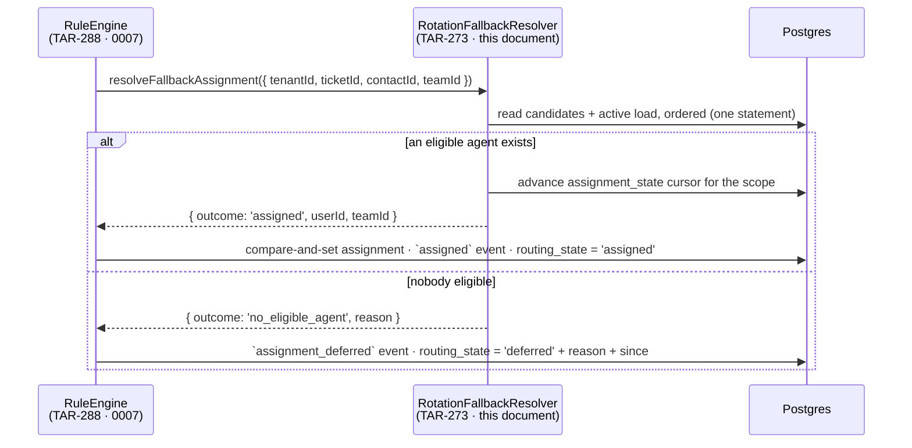

# Assignment rotation, workload limits and the supervisor's deferred queue (TAR-271)

Status: proposed · Builds on [0002 — architecture and API contract](./0002-architecture-and-api-contract.md), [0003 — ticket auto-linking contract](./0003-ticket-auto-linking-contract.md), [0004 — RBAC permission matrix](./0004-rbac-permission-matrix.md) · **Fills in the resolver behind the seam published by [0007 — routing rules and the assignment-fallback seam](./0007-routing-rules-and-assignment-fallback.md) (TAR-279)** · Consumed by TAR-272 (schema), TAR-273 (backend), TAR-274 (frontend), TAR-275 (QA), TAR-277 (documentation)

> **Read 0007 first.** It owns the routing pipeline this document plugs into, and the two are only
> comprehensible together: 0007 says who calls rotation and what it does with the answer, this one
> says how rotation reaches it. Where they could disagree, 0007 wins — it published the seam first
> and this document adopts it unchanged.

## Context and Problem

TAR-23 asks for two behaviours:

> Given a new unassigned ticket with no matching rule, when it's created, then it's
> assigned to the next available agent in rotation.
>
> Given all agents on a team are at their workload limit or offline, when a new ticket
> arrives, then it stays unassigned and is flagged for supervisor attention.

**Half of this is already decided, and this document does not re-decide it.** TAR-279 published the
routing pipeline — the queue, the trigger payload, the rule engine, the compare-and-set that writes
the assignment, the `assignment_deferred` event — and it fixed the seam rotation plugs into:

```ts
resolveFallbackAssignment(
  request: FallbackAssignmentRequest,
): Promise<FallbackAssignmentDecision>;
```

It also says, in as many words, that _"this file is the single definition of the seam, and TAR-271
adopts it"_, and lists exactly what it left open: **who is eligible, what the concurrent-ticket
limit is and where it is configured, how the `assignment_state` cursor advances, and how the
supervisor's flagged-ticket view is built.** Those four things are this document, plus one thing
0007 could not have known it needed — the state that makes the fourth queryable.

Everything else is inherited and constrains the answer:

1. **`assignment_state` already exists** (TAR-47) as a round-robin cursor keyed per team. Nothing has
   ever read or written it. It cannot express a tenant with no teams, which is decision 3's problem.
2. **`users.availability` already exists**, and `users.ts` already documents it as the field
   round-robin skips on, set explicitly by the agent and never inferred from socket presence.
3. **`users.last_seen_at` already exists**, denormalised from `sessions` and maintained by the
   session-touch path at roughly one write per user per minute.
4. **There is no per-agent workload limit anywhere.** TAR-23 calls it "a configurable max concurrent
   ticket count" and nothing in the schema, the contract or the console has one.
5. **RLS is the only tenant binding point** (0002 decision 1, as amended by TAR-48/49/51). Nothing
   here adds a second, and nothing here needs `SystemPrisma`.

The question that turns out to be hardest is not the algorithm. It is **what a ticket nobody can
take looks like in the database** — because 0007 writes an `assignment_deferred` event and stops
there, and an event is not something TAR-274 can filter a list on.

## Goals / Non-Goals

**Goals**

- A selection rule that is deterministic, unit-testable without a clock or an RNG, and reproducible
  in an assertion.
- An eligibility definition precise enough that TAR-275 can construct each failing predicate.
- "Flagged for supervisor attention" as a single indexed predicate, so TAR-274's view is a filter on
  the ticket list rather than a new subsystem.
- Where the workload limit lives, what its default is, and which permission may change it.
- The exact schema delta, stated precisely enough that TAR-272 writes the migration without a second
  conversation.
- One clearly-bounded obligation on 0007's writer, small enough to review in a line.

**Non-Goals**

- Implementing any of it. TAR-272 migrates, TAR-273 builds the resolver, TAR-274 builds the view.
- Anything 0007 decided: the queue, the job, the trigger payload, rule evaluation, the assignment
  compare-and-set, the ticket-event shapes, `TicketsModule`'s enqueue.
- Rule matching. TAR-24 owns the grammar; the seam is already published.
- Skill-, tag- or language-based routing. TAR-23 puts it out of scope explicitly.
- Rebalancing. Nothing takes work off an agent who went offline holding six tickets — open
  question 3.
- Retrying a deferred ticket when capacity frees. Open question 4 specifies the mechanism and
  explains why it is not here.
- Conversation assignment. `POST /conversations/{id}/assign` and `conversation:claim` (TAR-186/198)
  are landed and untouched; this routes **tickets**.

---

## Proposed Architecture

The pipeline is 0007's, and only the resolver's half of it is drawn here — 0007 has the full
sequence, including rule evaluation and the skip branches. `RotationFallbackResolver` is the one
participant this document designs.



**The resolver writes one row and only one:** the rotation cursor. It does not touch `tickets`, per
0007 decision 5. The consequence for the cursor is decision 5 below.

### Decision 1 — Eligibility is four predicates, and one of them is not in TAR-23's text

TAR-23's assumption is _"available means logged in and under a configurable max concurrent ticket
count"_. Taken literally that is two predicates. It needs four.

| #   | Predicate                                                      | Why                                                                                                                                      |
| --- | -------------------------------------------------------------- | ---------------------------------------------------------------------------------------------------------------------------------------- |
| 1   | `users.status = 'active'`                                      | `invited`, `suspended` and `removed` accounts cannot log in. Routing to one is routing into a void.                                      |
| 2   | `users.availability = 'available'`                             | The explicit signal. `away` and `offline` are both excluded — `users.ts` already documents this field as the thing round-robin skips on. |
| 3   | `users.last_seen_at > now() - presenceWindow` (default 15 min) | **The predicate TAR-23 does not name.** See below.                                                                                       |
| 4   | active assigned ticket count `<` effective cap                 | The load limit. "Active" is `open` or `pending` — the same `TICKET_ACTIVE_STATUSES` the one-ticket-per-contact invariant already uses.   |

**Why predicate 3 exists.** `availability` is written by exactly one route,
`PATCH /users/me/availability`, and `users.ts` argues correctly that inferring it from socket
presence would stop routing work to somebody whose WiFi blinked. The consequence nobody has had to
face yet is the other direction: an agent who sets `available` on Monday and shuts the laptop stays
`available` for ever, and rotation cheerfully feeds them a share of every ticket into a black hole.
That is the worse failure, because it is silent — the tickets look assigned.

`users.last_seen_at` is the right signal and costs nothing. It is already denormalised onto `users`
precisely so that reading it per row is not an aggregate over `sessions`, it is already maintained
by the session-touch path, and it is already rate limited to roughly one write per user per minute
by the principal cache TTL. The window is 15 minutes: comfortably longer than
`AUTH_POLICY.sessionSlideThrottleMs` (5 min), so a working agent can never age out between two
writes of their own session; short enough that a closed laptop stops receiving work inside one
coffee break.

**Effective cap** is `coalesce(users.max_concurrent_tickets, tenant_settings.default_max_concurrent_tickets)`
— per-agent override over tenant default, both new (decision 4). The floor is 1, not 0: "route
nothing to me" is what `availability = 'away'` already means, and a second way to say it is a second
thing to keep in step.

**Who is in the candidate pool at all** is decided by `FallbackAssignmentRequest.teamId`:

| `teamId`                                                                                                    | Candidate pool                            |
| ----------------------------------------------------------------------------------------------------------- | ----------------------------------------- |
| A team id (0007 passes one when a team rule matched, or when the ticket already carries `assigned_team_id`) | Members of that team, whatever their role |
| `null` — the tenant pool                                                                                    | Users with `role = 'agent'` only          |

Restricting the tenant pool to `agent` is a judgement call and worth stating: a supervisor holds
every agent permission, so without it every tenant's supervisor is silently placed in the rotation
and starts receiving customer tickets between doing their own job. A supervisor who genuinely works
a queue is put in the team that owns it — explicit, audited, and a mechanism TAR-22 already ships.
Inside a team, membership is the statement of intent and role is not re-checked.

### Decision 2 — Least-loaded first, rotation as the tie-break

**Trade-off axis: even load at any instant vs. fair turn-taking over time.**

TAR-23's title says "round-robin / load-based" and its acceptance criterion says _"the next available
agent in rotation"_ while making the load limit part of eligibility. Those pull in different
directions, and picking one and calling it the answer would be wrong.

- **Chosen — order eligible candidates by active ticket count ascending; break ties by rotation
  position after the cursor; break what remains by `users.id`.** One `ORDER BY`, one row:

  ```sql
  ORDER BY active_count ASC,                      -- load-based
           coalesce(u.id > $cursor, false) DESC,  -- round-robin, with wraparound
           u.id ASC                               -- a total order, always
  ```

  The second key is the entire rotation, expressed without a loop: candidates sorting after the
  cursor come first, so each pick advances around the ring; when none do, every row is `false`, the
  third key applies, and the ring wraps to the lowest id. A `NULL` cursor — a scope's first ever
  assignment — makes the comparison `NULL`, the `coalesce` makes it `false` for everyone, and the
  ring starts at the lowest id. No special case in the service, and no branch for TAR-275 to miss.

  The ring order is `users.id` ascending, and that is not arbitrary: ids are uuid v7, so ascending id
  is the order people joined the tenant. Rotation therefore reads as "round the team in join order",
  which is what a supervisor watching it would expect, and it is stable under a rename.

  What the composition buys: with everyone at equal load — the ordinary morning — the first key is a
  no-op and this is pure round-robin, which is the acceptance criterion's literal text. The moment
  loads diverge, because one agent's tickets are slow to resolve, work goes to whoever has least,
  which is what "load-based" is for. Neither mode needs a flag, and no configuration chooses between
  them.

- **Rejected — pure round-robin, cursor only, capacity as a filter.** Simplest, and exactly the
  acceptance criterion's words. Rejected because it distributes _arrivals_ evenly, not _work_: an
  agent whose tickets each take an hour and one whose take five minutes receive the same number, and
  the first is at the cap by 10am while the second idles. The cap then converts that imbalance into
  deferred tickets, so TAR-23's second acceptance criterion starts firing for a tenant that has
  plenty of capacity — the feature reporting a staffing problem it caused itself.

- **Rejected — pure least-loaded, no cursor.** Balances best and makes `assignment_state` dead
  weight. Rejected on determinism: with a fresh team everybody sits at zero, so the tie-break _is_
  the algorithm, and any stable tie-break that is not a rotation — lowest id, alphabetical — hands
  the first N tickets of every morning to the same person.

- **Rejected — weighted random.** Self-balancing, no cursor, no ordering to get right, and genuinely
  the right answer at large fleet sizes. Rejected because a random assignment is not reproducible,
  and TAR-275 has to assert "these four tickets went to these four agents in this order" without
  stubbing an RNG in a service that should not have one.

**Cursor scope.** One cursor per routing scope, and a scope is a team **or the tenant pool**.
`assignment_state.team_id` is `NOT NULL` today and cannot express the second; decision 6 widens it.

### Decision 3 — Deferred is a column, not only an event

0007's `deferred` branch appends an `assignment_deferred` ticket event and leaves the ticket
unassigned. That is the right audit record and it is not a flag: TAR-274 has to render _the set of
tickets that are currently stuck_, and "the newest routing event for this ticket is a deferral" is a
correlated subquery over an append-only log on every load of a supervisor's landing page.

**Trade-off axis: queryability vs. schema surface.**

- **Chosen — a `routing_state` enum column on `tickets`, plus a reason and a timestamp.**

  ```
  routing_state           ticket_routing_state           NOT NULL DEFAULT 'pending'
  routing_deferred_reason ticket_routing_deferred_reason NULL
  routing_deferred_since  timestamptz(3)                 NULL
  ```

  | `routing_state` | Meaning                                                                                                          |
  | --------------- | ---------------------------------------------------------------------------------------------------------------- |
  | `pending`       | Created; the routing job has not reached a conclusion. The column default, so no create path writes it.          |
  | `assigned`      | Routing placed it — by rule (0007 `routed`) or by rotation (0007 `fallback_assigned`). The event log says which. |
  | `deferred`      | Routing ran and nobody was eligible. **This is TAR-23's flag.**                                                  |
  | `manual`        | A human assigned, reassigned or released it. Routing never touches it again.                                     |

  TAR-274's landing query is then one indexed predicate and the reason renders straight from the row.
  Nothing is derived, aggregated or joined.

  The column is coarser than 0007's four outcomes on purpose. It answers _"may routing still act, and
  if not, why"_ — one fact, four values. _"How did this get here"_ is the event log's job, and 0007
  already puts the rule id and the rule name there.

  `manual` is load-bearing and not obvious: without it, a future re-route would overrule a
  supervisor who deliberately parked or reassigned a ticket, and a background job beating a person's
  decision is the kind of thing that gets a feature switched off. Any write through
  `POST /tickets/{id}/assign` sets `manual` and clears the two deferred columns in the same statement.

  `routing_deferred_since` is a third column and has to earn it: it is what the supervisor list sorts
  by (oldest stuck first), what an ageing alert reads, and the one value that cannot be recovered
  afterwards. `created_at` is not a substitute — a ticket that was assigned, released and then
  deferred would report an age that is a lie.

- **Rejected — the `assignment_deferred` event and nothing else.** Zero schema change, and 0007
  already writes it. Rejected on the subquery above. An event records _that it happened_; a column
  records _that it is still true_, and TAR-274 needs the second. **Both are written** — the event is
  0007's and stays exactly as published.

- **Rejected — a new `TicketStatus` value, e.g. `unassigned`.** No new columns, and it appears in
  every existing status filter for free. Rejected because `status` is the ticket's **lifecycle**, and
  overloading it with a routing outcome breaks three things that read it: `TICKET_STATUS_IS_ACTIVE`
  (the one-active-ticket-per-contact invariant), `TICKET_STATUS_PAUSES_SLA` (TAR-26), and every status
  filter and report bucket. It is also an `ALTER TYPE` plus a matching widening of the contract's
  `TICKET_STATUSES`, for a fact that is not about lifecycle at all.

- **Rejected — a `ticket_routing` side table, one row per deferred ticket.** Keeps `tickets` narrow,
  and the deferred set is literally the table. Rejected for the join on every ticket read, a second
  write path to keep consistent with the assignment columns it shadows, and a second table needing an
  RLS policy and grants — for three columns.

**The reason vocabulary is 0007's, unchanged.** `FALLBACK_ASSIGNMENT_REASONS` already publishes the
three values, and the Postgres enum takes them verbatim so the column, the decision object and the
event's `reason` are one vocabulary rather than three that must be mapped:

| Reason              | Fires when                                                           | Who fixes it                                                        |
| ------------------- | -------------------------------------------------------------------- | ------------------------------------------------------------------- |
| `all_at_capacity`   | Candidates exist and are present; every one is at their cap          | Wait, raise a cap, or take it yourself                              |
| `none_available`    | Candidates exist in the scope; none is `available` and recently seen | A staffing problem                                                  |
| `no_candidate_pool` | The scope holds no active user who could ever be a candidate         | A configuration problem — an empty team, or a tenant with no agents |

TAR-274's acceptance criterion asks for "at-capacity vs offline"; those are the first two.
The third exists because "nobody is online" and "nobody was ever put in this team" need different
people to act, and collapsing them sends a supervisor hunting for absent colleagues who were never
configured.

**Precedence when the truth is mixed** — some candidates at capacity, others away. Evaluated in this
order, first match wins:

1. any present, available candidate exists → `all_at_capacity`
2. any active user is in the scope → `none_available`
3. otherwise → `no_candidate_pool`

`all_at_capacity` wins the first tie because it is the state that resolves itself as tickets close,
and therefore the more useful thing to tell somebody staring at the queue.

### Decision 4 — Where the cap lives, and who may change it

**Two columns, not one.**

- `tenant_settings.default_max_concurrent_tickets INT NOT NULL DEFAULT 5` — the tenant-wide default,
  so a new tenant routes correctly with nothing configured.
- `users.max_concurrent_tickets INT NULL` — a per-agent override. `NULL` means inherit.

Nullable-means-inherit rather than copying the default onto every user at creation: a supervisor
raising the tenant default should move everyone who has not been singled out, and a copied value
silently would not. The cost is a `coalesce` in one query.

Five is a starting value chosen to be defensible, **not a measured one**. It belongs in the
`assignment.ts` policy constant beside 0007's `ROUTING_RULE_LIMITS`, on `AUTH_POLICY`'s precedent
(TAR-53): three consumers must agree on these numbers — the API enforces them, the console renders
copy from them, TAR-275 asserts against them — and three literals in three packages drift.

**The permission is `assignment_rule:write`, for both.** Not `user:update`, and not
`tenant:settings`.

Setting a colleague's cap is deciding how much work reaches them, which is the same act as writing a
routing rule; `assignment_rule:write` is already the supervisor-and-above permission for that
(0004), and 0007 has just confirmed it as the gate for the whole assignment surface. Routing it
through `user:update` would mean anyone who may edit a display name may also quietly stop work
reaching a colleague — the identical concern `users.ts` records when it makes
`PATCH /users/me/availability` self-only, and structurally the same as TAR-79 splitting `role` out
of `user:update`. The field therefore rides on `UserUpdateInput` but is enforced separately: a body
carrying `maxConcurrentTickets` additionally requires `assignment_rule:write`, and a caller without
it is **refused**, not silently stripped — a privilege-shaped change that appears to succeed is worse
than a refusal.

`tenant:settings` is wrong for the tenant default for the opposite reason: it is admin-only, and
tuning workload is a supervisor's daily job. Behind the admin permission it never gets tuned.

### Decision 5 — The resolver advances the cursor, and the cursor is a hint

0007 decision 5 splits deciding from writing: the resolver returns a `FallbackAssignmentDecision` and
the engine performs the compare-and-set. That is right, and it leaves one write with no obvious
owner — the rotation cursor.

**Chosen — the resolver advances `assignment_state` before it returns**, in its own transaction.

The consequence, stated rather than hidden: the engine's compare-and-set can fail after the cursor
has moved, because a supervisor assigned the ticket by hand in the intervening milliseconds. The
cursor then names somebody who was never actually given that ticket, and the next assignment starts
one place further round the ring than it strictly should.

That is acceptable, and it is worth being explicit about why: **the cursor is a fairness hint, not a
ledger.** It exists so that equally-loaded agents take turns. One person's turn being skipped, in the
rare case where a human intervened inside the same second, is invisible at any timescale a fairness
property is measured over — and the load key in decision 2 corrects for it on the next ticket anyway.

- **Rejected — the engine advances the cursor after a successful compare-and-set.** Exactly correct,
  no drift. Rejected because it puts rotation's state machine inside TAR-24's writer: the engine
  would have to know that a cursor exists, what a scope is, and how `NULL` team ids key it — which is
  the leak the seam was drawn to prevent, and it would make every future change to rotation a change
  to 0007's code.

- **Rejected — the resolver returns the intended cursor value for the engine to write.** Same leak,
  one indirection further away, plus a field on the decision object that exists only to be handed
  back.

### Decision 6 — The scope key admits the tenant pool, and needs `NULLS NOT DISTINCT`

`assignment_state.team_id` is `NOT NULL` with a single-column `@unique`, so there can be a cursor per
team and no cursor for a tenant that has not created one. A tenant with no teams is the ordinary
starting state and must rotate.

**Chosen — `team_id` becomes nullable, `NULL` meaning the tenant pool**, with the uniqueness restated:

```sql
ALTER TABLE assignment_state DROP CONSTRAINT assignment_state_team_id_key;
CREATE UNIQUE INDEX assignment_state_tenant_scope_key
  ON assignment_state (tenant_id, team_id) NULLS NOT DISTINCT;
```

`NULLS NOT DISTINCT` is the whole point of the delta and is easy to omit. Postgres treats NULLs as
distinct in a unique index by default, so the plain form would hold five tenant-pool cursors for one
tenant quite happily, and rotation would read a different one each time — which does not fail, it
just silently stops rotating. It is Postgres 15+; the cluster is pinned to 16 in `docker-compose.yml`
and `render.yaml`.

The single-column `assignment_state_team_id_key` is dropped rather than kept: it is redundant with
the composite today (team ids are globally unique) and outright wrong once the column is nullable.

- **Rejected — a synthetic "default team" row per tenant.** Keeps the column `NOT NULL` and needs no
  Postgres 15 feature. Rejected because it is a `teams` row that appears in every team picker, every
  membership list and every report, invented to satisfy a constraint.

- **Rejected — a separate `tenant_assignment_state` table for the pool cursor.** One column type
  simpler; two tables holding one concept, and every read becomes a branch.

---

## Data Model

### Delta against the landed schema

Additive except row 6, which widens a column nothing has ever written. Nothing here collides with
0007's five deltas: those are all on `assignment_rules`, which this document does not touch.

| #   | Change                                                                                                                                                         | Owner   |
| --- | -------------------------------------------------------------------------------------------------------------------------------------------------------------- | ------- |
| 1   | `CREATE TYPE ticket_routing_state AS ENUM ('pending','assigned','deferred','manual')`                                                                          | TAR-272 |
| 2   | `CREATE TYPE ticket_routing_deferred_reason AS ENUM ('all_at_capacity','none_available','no_candidate_pool')` — 0007's `FALLBACK_ASSIGNMENT_REASONS`, verbatim | TAR-272 |
| 3   | `tickets`: `+ routing_state NOT NULL DEFAULT 'pending'`, `+ routing_deferred_reason NULL`, `+ routing_deferred_since timestamptz(3) NULL`                      | TAR-272 |
| 4   | `users`: `+ max_concurrent_tickets INT NULL`, `CHECK (max_concurrent_tickets IS NULL OR max_concurrent_tickets BETWEEN 1 AND 1000)`                            | TAR-272 |
| 5   | `tenant_settings`: `+ default_max_concurrent_tickets INT NOT NULL DEFAULT 5`, `CHECK (BETWEEN 1 AND 1000)`                                                     | TAR-272 |
| 6   | `assignment_state.team_id` → nullable; drop the single-column unique; `UNIQUE NULLS NOT DISTINCT (tenant_id, team_id)`                                         | TAR-272 |
| 7   | Partial index `tickets_routing_deferred_idx` — below                                                                                                           | TAR-272 |
| 8   | Consistency `CHECK` tying `routing_state = 'deferred'` to the two nullable columns — below                                                                     | TAR-272 |
| 9   | The contract delta in Interfaces                                                                                                                               | TAR-273 |

```prisma
enum TicketRoutingState {
  pending
  assigned
  deferred
  manual

  @@map("ticket_routing_state")
}

/// The values of `FALLBACK_ASSIGNMENT_REASONS` (0007), as a Postgres type. One
/// vocabulary across the decision object, this column and the
/// `assignment_deferred` event — not three that have to be mapped.
enum TicketRoutingDeferredReason {
  all_at_capacity
  none_available
  no_candidate_pool

  @@map("ticket_routing_deferred_reason")
}

model Ticket {
  // … existing fields unchanged …

  /// Whether routing may still act on this ticket, and if not, why. Coarser
  /// than 0007's four outcomes on purpose: *how* it got here is the event log's
  /// job, and 0007 already puts the rule id and name there.
  ///
  /// `manual` is terminal for routing. A human decided, and no background job
  /// may overrule that.
  routingState          TicketRoutingState           @default(pending) @map("routing_state")
  /// Non-null exactly when `routingState = 'deferred'`. This is TAR-23's
  /// "flagged for supervisor attention", and what TAR-274 renders.
  routingDeferredReason TicketRoutingDeferredReason? @map("routing_deferred_reason")
  /// When the flag was raised. Not derivable from `created_at` — a ticket that
  /// was assigned, released and then deferred would report the wrong age.
  routingDeferredSince  DateTime?                    @db.Timestamptz(3) @map("routing_deferred_since")

  /// The supervisor's landing query. Partial, so it holds only the deferred
  /// set — small by definition, and if it is not, the tenant has a staffing
  /// problem its supervisor can already see. Lives in raw SQL: Prisma cannot
  /// express an index predicate.
}

model User {
  // … existing fields unchanged …

  /// Per-agent override of `tenant_settings.default_max_concurrent_tickets`.
  /// Null means inherit, so raising the tenant default moves everyone who has
  /// not been singled out. Floor of 1: "route nothing to me" is what
  /// `availability = 'away'` already means.
  maxConcurrentTickets Int? @map("max_concurrent_tickets")
}

model TenantSettings {
  // … existing fields unchanged …

  defaultMaxConcurrentTickets Int @default(5) @map("default_max_concurrent_tickets")
}

/// Round-robin cursor, one row per **routing scope** — a team, or the tenant
/// pool when `teamId` is null (decision 6).
model AssignmentState {
  id                 String   @id @default(uuid(7)) @db.Uuid
  tenantId           String   @map("tenant_id") @db.Uuid
  teamId             String?  @map("team_id") @db.Uuid
  lastAssignedUserId String?  @map("last_assigned_user_id") @db.Uuid
  updatedAt          DateTime @updatedAt @map("updated_at") @db.Timestamptz(3)

  // Relations unchanged; `team` becomes optional. The single-column
  // `@unique` on `teamId` is removed — redundant with the composite today,
  // and wrong once the column is nullable.

  @@index([tenantId, lastAssignedUserId])
  @@map("assignment_state")
}
```

### What Prisma cannot express, and therefore must be raw SQL in the migration

This repository has been bitten by this twice — `tickets_one_active_per_contact` (TAR-74) and
`users_tenant_id_locked_until_idx` (TAR-53) — and both carry a comment saying that nothing
regenerates them from `schema.prisma`. Three more join them, and they must be written by hand in the
migration:

```sql
-- 1. The supervisor's landing query, and the only index this story adds.
CREATE INDEX tickets_routing_deferred_idx
  ON tickets (tenant_id, routing_deferred_since)
  WHERE routing_state = 'deferred';

-- 2. The flag and its reason cannot disagree. Without this, a partial write leaves a
--    ticket deferred for no reason, or carrying a reason while assigned — and the
--    supervisor view renders one of the two.
ALTER TABLE tickets ADD CONSTRAINT tickets_routing_deferred_consistent CHECK (
  (routing_state = 'deferred') = (routing_deferred_reason IS NOT NULL) AND
  (routing_state = 'deferred') = (routing_deferred_since  IS NOT NULL)
);

-- 3. Exactly one cursor per scope, including the tenant pool. See decision 6 for why
--    the default NULL semantics silently break rotation rather than failing.
ALTER TABLE assignment_state DROP CONSTRAINT assignment_state_team_id_key;
CREATE UNIQUE INDEX assignment_state_tenant_scope_key
  ON assignment_state (tenant_id, team_id) NULLS NOT DISTINCT;
```

`CONCURRENTLY` cannot run inside Prisma's migration transaction. With no production data a plain
`CREATE INDEX` is correct; TAR-272 should state which it used and why, as TAR-74 was asked to.

### Backfill, and the trap in the `down`

**Backfill is required and is one statement.** The column default makes every existing ticket
`pending`, which is a lie for one a human already assigned:

```sql
UPDATE tickets
   SET routing_state = 'manual'
 WHERE assigned_user_id IS NOT NULL OR assigned_team_id IS NOT NULL;
```

**The `down` migration fails without a cleanup.** Restoring `assignment_state.team_id` to `NOT NULL`
cannot succeed while a tenant-pool cursor exists, so the down must delete them first:

```sql
DELETE FROM assignment_state WHERE team_id IS NULL;
```

Deleting a cursor is safe — it is a rotation position, not data — and the next assignment recreates
it.

**No new tables, so no new RLS policy and no re-run of `app-roles.sql`.** Every column added here
lives on a table that already carries `ENABLE`/`FORCE ROW LEVEL SECURITY`, a `tenant_isolation`
policy and grants; a new column inherits all three.
`prisma/sql/verify-tenant-isolation.sql` derives its table list from the catalog and keeps passing,
which here is correct rather than a gap.

### The candidate query

One statement, returning the whole candidate set with its load rather than just the winner — because
when nobody is eligible the same rows decide the reason (decision 3), and a second query to work that
out would be a second query on the failure path.

```sql
WITH cap_default AS (
  -- coalesce, not a join: TAR-50's provisioning does not guarantee a
  -- tenant_settings row, and a missing one must not stop routing.
  SELECT coalesce(
    (SELECT ts.default_max_concurrent_tickets FROM tenant_settings ts WHERE ts.tenant_id = $1),
    $2::int                                        -- ASSIGNMENT_POLICY.defaultMaxConcurrentTickets
  ) AS value
),
candidates AS (
  SELECT u.id,
         coalesce(u.max_concurrent_tickets, d.value) AS cap
    FROM users u
    CROSS JOIN cap_default d
    LEFT JOIN team_members tm
           ON tm.tenant_id = u.tenant_id AND tm.user_id = u.id AND tm.team_id = $3::uuid
   WHERE u.tenant_id = $1
     AND u.status = 'active'
     AND u.availability = 'available'
     AND u.last_seen_at > now() - ($4 || ' milliseconds')::interval
     AND CASE WHEN $3::uuid IS NULL THEN u.role = 'agent' ELSE tm.id IS NOT NULL END
)
SELECT c.id,
       c.cap,
       (SELECT count(*) FROM tickets t
         WHERE t.tenant_id = $1
           AND t.assigned_user_id = c.id
           AND t.status IN ('open','pending')) AS active_count
  FROM candidates c
 ORDER BY active_count ASC,
          coalesce(c.id > $5::uuid, false) DESC,
          c.id ASC;
```

The resolver takes the first row with `active_count < cap`. If there is none, the reason follows from
what came back, and only the `none_available` / `no_candidate_pool` split needs one extra count — of
active users in the scope, ignoring availability and presence.

`tenant_id` is supplied explicitly on every predicate even though RLS filters anyway: the rule 0003
states as non-optional, and here it is also what makes the planner use the `(tenant_id, …)` composite
indexes.

### Access patterns this adds

| Query                             | Index used                               | Rows touched                     |
| --------------------------------- | ---------------------------------------- | -------------------------------- |
| Candidate scan                    | `users (tenant_id, status)`              | The tenant's active users — tens |
| Per-candidate active ticket count | `tickets_tenant_assigned_user_queue_idx` | ≤ cap rows per candidate         |
| Cursor read and advance           | `assignment_state_tenant_scope_key`      | 1                                |
| Supervisor's deferred list        | `tickets_routing_deferred_idx`           | The deferred set                 |

**No new index on `users`.** At tens-to-low-hundreds of users per tenant, the existing
`(tenant_id, status)` index plus a filter is cheaper than maintaining another index on a table
written on every session touch. **Breaking point:** a tenant past roughly a thousand users, where the
candidate scan starts to dominate; the next step is a partial index on
`(tenant_id, availability, last_seen_at) WHERE status = 'active'`, which is additive.

**The load count is derived, not denormalised.** A counter column on `users` would make selection a
single scan, and it is the obvious optimisation. Rejected for v1 because it has to be maintained by
every path that assigns, unassigns, resolves, closes or reopens a ticket — and more arrive with
TAR-26 and TAR-27 — and a counter that drifts is a cap that is silently wrong, which is the failure
this whole design exists to make visible. **Breaking point:** tens of thousands of concurrently
active assigned tickets in one tenant; the next step is a counter maintained by a database trigger,
not by application code, so it cannot drift.

---

## Interfaces

Everything here is a **delta on the `packages/contracts/src/assignment.ts` that 0007 specifies** and
on `tickets.ts`. The seam itself — `FallbackAssignmentRequest`, `FallbackAssignmentDecision`,
`FALLBACK_ASSIGNMENT_REASONS`, `FallbackAssignmentResolver`, `FALLBACK_ASSIGNMENT_RESOLVER` — is
adopted verbatim and is not restated. This document lands no code.

**`assignment.ts` does not exist on `main` yet.** PR #87 landed 0007 as a document only, so the file
is still ahead of both stories: whichever of TAR-288 and TAR-273 creates it writes 0007's half and
this document's half together, and the other reviews. That is one file created once rather than one
created and then widened.

### The implementation behind the token

```ts
// AssignmentModule, TAR-288 (0007) — while TAR-23 is being built
{ provide: FALLBACK_ASSIGNMENT_RESOLVER, useClass: NullFallbackAssignmentResolver }

// AssignmentModule, TAR-273 — the swap, and the whole integration
{ provide: FALLBACK_ASSIGNMENT_RESOLVER, useClass: RotationFallbackResolver }
```

`RotationFallbackResolver implements FallbackAssignmentResolver`, honours the three obligations 0007
places on it — returns a decision rather than writing to `tickets`, throws for infrastructure
failure, names a reason on every `no_eligible_agent` — and adds nothing to the signature. TAR-288's
tests keep using `NullFallbackAssignmentResolver` and do not change.

**The seam needed no widening.** `FallbackAssignmentRequest.teamId` already carries the scope, which
is the field decision 1's candidate pool turns on, and `FALLBACK_ASSIGNMENT_REASONS` already
enumerates exactly the three states decision 3 distinguishes. 0007 invited a revision if the shape
could not carry rotation's outputs; it can, and this is the confirmation it asked for. The one
consequence of the shape that does need recording is concurrency — see failure modes.

### New — the policy constant

Beside `ROUTING_RULE_LIMITS` in the same file, on `AUTH_POLICY`'s precedent:

```ts
export const ASSIGNMENT_POLICY = {
  /** Tenant default when `tenant_settings` has no row yet. */
  defaultMaxConcurrentTickets: 5,
  /** Bounds on both the tenant default and a per-agent override. */
  minMaxConcurrentTickets: 1,
  maxMaxConcurrentTickets: 1000,
  /**
   * How stale `users.last_seen_at` may be and still count as present. Longer
   * than `AUTH_POLICY.sessionSlideThrottleMs` (5 min), so a working agent can
   * never age out between two writes of their own session.
   */
  presenceWindowMs: 15 * 60 * 1000,
} as const;
```

### Delta to `packages/contracts/src/tickets.ts`

0007 already adds `assignment_deferred` to `TICKET_EVENT_TYPES`; that is not repeated here.

```ts
export const TICKET_ROUTING_STATES = ['pending', 'assigned', 'deferred', 'manual'] as const;

/** Nested rather than flattened, matching `sla` and `UserResponse.security`. */
export const TicketRoutingSchema = z.object({
  state: TicketRoutingStateSchema,
  /** Non-null exactly when `state` is `deferred`. A `FallbackAssignmentReason`. */
  deferredReason: FallbackAssignmentReasonSchema.nullable(),
  deferredSince: TimestampSchema.nullable(),
});

// TicketResponseSchema gains:
routing: TicketRoutingSchema,

// TicketListQuerySchema gains — TAR-274's landing query is
// `?scope=unassigned&routingState=deferred`:
routingState: TicketRoutingStateSchema.optional(),
```

`routing` is required and non-nullable on `TicketResponse`, which would be a breaking change if
anything mapped it. **Nothing does**: there is no ticket mapper and no ticket controller in
`apps/api/src/tickets` today, and `TicketResponse` is referenced only by
`packages/contracts/src/realtime.ts`. Whoever writes the first mapper carries the field from the
start rather than retrofitting it.

### The one obligation this document places on 0007's writer

0007's router already writes the assignment and the ticket event in each of its four branches. It
gains one column write per branch, and nothing else:

| 0007 outcome                | `routing_state` | Deferred columns                                            |
| --------------------------- | --------------- | ----------------------------------------------------------- |
| `routed`                    | `assigned`      | cleared                                                     |
| `fallback_assigned`         | `assigned`      | cleared                                                     |
| `deferred`                  | `deferred`      | `= decision.reason`, `= now()` **on first transition only** |
| `skipped` (either reason)   | untouched       | untouched                                                   |
| `POST /tickets/{id}/assign` | `manual`        | cleared                                                     |

"On first transition only" mirrors the discipline 0003 uses for its reopen: the guard is in the
`WHERE` clause, so `routing_deferred_since` records when the ticket first became stuck rather than
when it was last looked at, and a redelivered job does not reset the supervisor's ageing column.

Whichever of TAR-273 and TAR-288 lands the router first implements this; the other reviews it.

### REST

No new resource for the supervisor view — it is a filter on the ticket list 0002 already publishes,
and both permissions are supervisor-and-above already (0004):

```
GET  /api/v1/tickets?scope=unassigned&routingState=deferred  → CursorPage<TicketResponse>  ticket:read_all
POST /api/v1/tickets/{id}/assign                             → TicketResponse              ticket:assign
                                                               [exists; gains the routing_state = 'manual' write]
```

**Specified, and required by no acceptance criterion** — the cap-editing surface. Recorded so nobody
has to invent it, and so it is clear it is _not_ in TAR-273's or TAR-274's scope:

```
GET   /api/v1/assignment-settings   → { defaultMaxConcurrentTickets }   assignment_rule:read
PATCH /api/v1/assignment-settings   → { defaultMaxConcurrentTickets }   assignment_rule:write
PATCH /api/v1/users/{id}            → maxConcurrentTickets on the body  assignment_rule:write, in addition to user:update
```

Until they exist, the tenant default is the column default, which is a working system.

### Realtime

`ticket.updated` already exists as a `ServerEvent` carrying a whole `TicketResponse`, so a routing
change has an event to travel on. It needs a room set, and it must not borrow the conversation one:

```ts
/** Sockets whose principal holds `ticket:read_all`. */
export function ticketReadersRoom(tenantId: string): string {
  return `tenant:${tenantId}:ticket-readers`;
}

export function ticketAudienceRooms(audience: TicketAudience): string[];
```

Branch for branch the same construction as `conversationAudienceRooms`, with `ticketReadersRoom` in
place of `tenantReadersRoom`. Reusing `tenantReadersRoom` would publish ticket bodies to the
`conversation:read_all` audience — the same two permissions and the same people today, but 0002's
own TAR-69 amendment establishes that a room fan-out which does not match the read rule is an
authorization bypass, and that it being the published shape made it a spec defect rather than an
implementation slip. Not repeating that.

**Emitting it is not in this story.** TAR-274's view refetches
`?scope=unassigned&routingState=deferred`, which is correct and enough. The rooms are specified here
so the push is additive rather than a redesign later.

---

## Failure Modes and Operations

0007's table covers the queue, the engine and rule data. This one covers the resolver and the state
it reads.

| Component                                   | Down                                                                                                              | Slow                                        | Bad data                                                                                                                                       |
| ------------------------------------------- | ----------------------------------------------------------------------------------------------------------------- | ------------------------------------------- | ---------------------------------------------------------------------------------------------------------------------------------------------- |
| `RotationFallbackResolver`                  | Throws; 0007's job retries. The ticket stays `pending` and unassigned, visible in the unassigned queue.           | Holds the routing worker slot for the call. | A decision violating its own invariants fails the response schema in dev and test (0007).                                                      |
| `assignment_state` cursor                   | A missing row is created on first assignment.                                                                     | —                                           | A cursor naming a departed user is harmless: it is only ever compared with `>`, never dereferenced.                                            |
| `users.last_seen_at`                        | If the session-touch path stops writing it, every agent ages out and **everything defers with `none_available`**. | —                                           | The loudest failure in this design, deliberately — see below.                                                                                  |
| `tenant_settings` row missing               | Routing continues on `ASSIGNMENT_POLICY.defaultMaxConcurrentTickets`.                                             | —                                           | —                                                                                                                                              |
| A cap lowered below an agent's current load | —                                                                                                                 | —                                           | The agent is skipped until they close down to the new cap. No ticket is taken off them. Correct, and worth saying because it looks like a bug. |

### The cap is exact at worker concurrency 1, and only there

0007 decision 5 has the resolver decide and the engine write. Those are two steps, and no lock can
span them: the resolver returns before the engine's compare-and-set runs, and the signature carries
no transaction. Two routing jobs running at the same instant can therefore both see an agent at
cap − 1 and both assign, putting that agent one over.

**Resolution: the `assignment` worker runs at `concurrency: 1`**, which is the repo default and the
same choice `TicketQueueRunner` already made for the analogous reason (0003's convoy). Under it there
is no concurrency to lose to, and the cap is exact.

Stated so the next person does not have to rediscover it: **raising that concurrency, or running two
API processes, makes the cap approximate** — overshoot bounded by the number of concurrent routing
workers minus one, per agent, and self-correcting on the next ticket. If the cap must stay exact at
that point, the fix is a revision to 0007 rather than a patch here: either move the compare-and-set
into the resolver, or have the engine's `UPDATE` carry the cap as an extra predicate. Both are
changes to a document, not to a schema.

An advisory lock inside the resolver was considered and rejected for being worse than useless — it
would serialise the decision, release at the resolver's commit, and leave the write it was supposed
to protect outside the critical section, while looking as though the problem were solved.

### What should be monitored

- **`routing_state = 'deferred'` count per tenant, and its age.** This is the product signal, not
  merely an ops one: a tenant whose deferred count is persistently non-zero is understaffed or
  mis-capped, and it is the number worth surfacing before a customer notices. It complements 0007's
  "rate of `deferred` outcomes" — that is a flow, this is the standing backlog.
- **Tenant-wide `none_available` with a non-zero live session count.** The specific shape of the
  `last_seen_at` failure above: agents are demonstrably logged in and routing believes nobody is
  there. It means the presence signal has broken, not that the office is empty.

**What is deliberately not monitored:** per-agent assignment counts (TAR-30's reporting, not an
alert) and cursor movement.

TAR-41 owns wiring these to alerting; this document only names them.

## Security and Access

Nothing here widens the tenant boundary, and there is no second binding point — RLS through
`TenantPrisma` remains the only one. 0007's rules 1–6 apply unchanged; three points are specific to
this half.

- **`SystemPrisma` is not used and is not needed.** The resolver reads `users`, `team_members`,
  `tickets` and `tenant_settings`, all tenant-scoped, in a scope `QueueService` opened from
  `job.data.tenantId`. Every design here that would have needed a cross-tenant sweep was rejected —
  see open question 4.
- **Capacity is a permissioned field, not an ordinary one.** `maxConcurrentTickets` requires
  `assignment_rule:write` even on `PATCH /users/{id}`, because setting a colleague's cap to 1 is
  being able to route work off them. Decision 4 gives the full argument. A caller without it is
  refused, not silently stripped.
- **The candidate scan cannot see another tenant.** `users`, `team_members` and `tenant_settings`
  are all RLS-protected and every predicate carries `tenant_id` explicitly, so a candidate list is
  filtered by the policy even before the `WHERE` clause is considered.
- **No PII anywhere in this path.** The resolver reads ids, an enum, a timestamp and a count; a log
  line names a user id and an outcome.

## Implementation Phases

Already broken out as sub-issues of TAR-23; this maps the contract onto them. Ordering against
TAR-24's chain is stated where it matters.

| Phase   | Delivers from this document                                                                                                                                                                                         | Blocked by       |
| ------- | ------------------------------------------------------------------------------------------------------------------------------------------------------------------------------------------------------------------- | ---------------- |
| TAR-271 | This document                                                                                                                                                                                                       | — (this issue)   |
| TAR-272 | Deltas 1–8 as one reversible migration, with the backfill and the `assignment_state` cleanup in the `down`; `verify-tenant-isolation` re-run to prove nothing regressed                                             | TAR-271          |
| TAR-273 | `ASSIGNMENT_POLICY` and the `tickets.ts` delta; `RotationFallbackResolver` bound behind `FALLBACK_ASSIGNMENT_RESOLVER`; the `routing_state` writes in the router's four branches and on `POST /tickets/{id}/assign` | TAR-271, TAR-272 |
| TAR-274 | Supervisor view over `?scope=unassigned&routingState=deferred`, rendering `deferredReason`, with manual assign. Mocks this contract; does not wait for TAR-273                                                      | TAR-271          |
| TAR-275 | Test plan and execution — the five cases below                                                                                                                                                                      | TAR-273, TAR-274 |
| TAR-276 | Review of both PRs against this contract and 0007                                                                                                                                                                   | TAR-275          |
| TAR-277 | API reference, the algorithm and the deferred fallback, changelog, and the relationship to TAR-24                                                                                                                   | TAR-276          |

**Where this chain meets TAR-24's.** TAR-273 and TAR-288 both touch `AssignmentModule`, and both
write `routing_state`. Whichever lands first implements the router's column writes from the table
above; the other reviews them. Nothing else overlaps: TAR-272's migration touches `tickets`, `users`,
`tenant_settings` and `assignment_state`, TAR-285's touches `assignment_rules`, and the two do not
meet. **TAR-273 does not have to wait for TAR-288** — `RotationFallbackResolver` is a plain class
behind a token, unit-testable with a literal request, exactly the property 0003 relied on for
TAR-75.

**The five cases TAR-275's plan must cover**, stated here because they are TAR-23's acceptance
criteria expressed against this design:

1. **Rotation** — four equally-loaded eligible agents, four tickets, one each, in ascending
   `users.id` order starting after the cursor, wrapping at the end.
2. **Load limit** — an agent at their cap is skipped and the ticket goes to the next in rotation;
   the cursor does not stall on the skipped agent.
3. **Load precedence** — an agent with fewer active tickets wins over one earlier in the rotation.
   This is the case that distinguishes this design from pure round-robin, and the one most likely to
   be got wrong.
4. **Deferral, all three reasons** — everyone at cap → `routing_state = 'deferred'`,
   `deferredReason = 'all_at_capacity'`, one `assignment_deferred` event; everyone `away`, or
   everyone stale past the presence window → `none_available`; an empty team, and a tenant with no
   agents → `no_candidate_pool`.
5. **Tenant isolation** — a candidate scan in tenant A never returns a user of tenant B, and a
   forged trigger naming tenant B's ticket routes nothing.

A sixth needs a real database rather than a unit test: two resolutions racing on a scope with one
free slot, asserted at `concurrency: 1`. It belongs beside `ticket-active-uniqueness.int-spec.ts`.

## Open Questions and Risks

| #   | Item                                                                                                                                                                                                                        | Severity | Resolution                                                                                                                                                                                                                                                                                                                                                                           |
| --- | --------------------------------------------------------------------------------------------------------------------------------------------------------------------------------------------------------------------------- | -------- | ------------------------------------------------------------------------------------------------------------------------------------------------------------------------------------------------------------------------------------------------------------------------------------------------------------------------------------------------------------------------------------ |
| 1   | **The presence window is invented.** TAR-23 says "logged in"; decision 1 reads that as `available` plus 15 minutes of `last_seen_at` freshness. Too short a window defers tickets for agents who are at their desk reading. | Medium   | Ship at 15 min and watch the `none_available` rate against live session counts. It is one number in `ASSIGNMENT_POLICY`. **Worth putting to Tarek before TAR-273 merges** — it is the only product-visible number this design invents.                                                                                                                                               |
| 2   | **The cap is exact only at worker concurrency 1.** Analysed in failure modes. Horizontal scaling of the API silently makes it approximate.                                                                                  | Medium   | Accepted at v1, with the concurrency pinned and the reason written down. The two fixes are both revisions to 0007 decision 5, not to this schema. Raise it if TAR-41's infrastructure work moves to more than one worker process.                                                                                                                                                    |
| 3   | **An agent who goes offline holding six tickets keeps them.** Nothing rebalances, and the customer waiting on those tickets is invisible.                                                                                   | Medium   | Out of scope by design — taking work off a person is a supervisor's decision, not a background job's. Visible today via `?assignedUserId=`. A "stale assignment" report is TAR-30's natural home.                                                                                                                                                                                    |
| 4   | **A deferred ticket never retries.** It waits for a human even if capacity frees a minute later, so a busy hour buries the supervisor in work the system could have done.                                                   | Medium   | Matches the acceptance criterion exactly, and kept out on purpose: every retry design adds an obligation to a writer TAR-24 owns. The cheapest additive version needs no payload change and no new column — the router re-enqueues its own trigger with a delay and stops once `routing_deferred_since` is older than a bound. Build it when a supervisor says a minute is too long. |
| 5   | **No routing team means the whole tenant is one pool, and the pool excludes supervisors.** A tenant that never creates a team gets a single global rotation with no way to scope it.                                        | Medium   | Correct for a small tenant, and the reason the tenant-pool cursor exists at all. The escape hatch is creating a team, which TAR-22 ships. Revisit if a tenant wants a default team without putting it on every ticket.                                                                                                                                                               |
| 6   | **`TicketResponse.routing` is required on a schema nothing maps yet.** If a mapper lands from another story between TAR-271 and TAR-273, it breaks.                                                                         | Low      | Verified against `main` today: no ticket mapper or controller exists and `TicketResponse` is referenced only by `realtime.ts`. Whoever writes the first mapper owns the field.                                                                                                                                                                                                       |
| 7   | **The cursor can drift by one** when the engine's compare-and-set loses to a manual assignment after the resolver advanced it (decision 5).                                                                                 | Low      | Accepted and argued there: the cursor is a fairness hint, not a ledger, and decision 2's load key corrects for it on the next ticket.                                                                                                                                                                                                                                                |
| 8   | **Load is counted per candidate on every routing decision**, and no benchmark is claimed for the correlated subquery at a hundred candidates.                                                                               | Low      | Measure in TAR-275's concurrency case. The next step is a trigger-maintained counter, named in access patterns, and it is additive.                                                                                                                                                                                                                                                  |
| 9   | **`assignment_state.last_assigned_user_id` can name a removed user.** The relation is `onDelete: NoAction` and users are soft-removed to `status = 'removed'`, so the row survives.                                         | Low      | Harmless by construction: the cursor is only ever compared with `>`, never dereferenced. Recorded so nobody "fixes" it into a join.                                                                                                                                                                                                                                                  |
