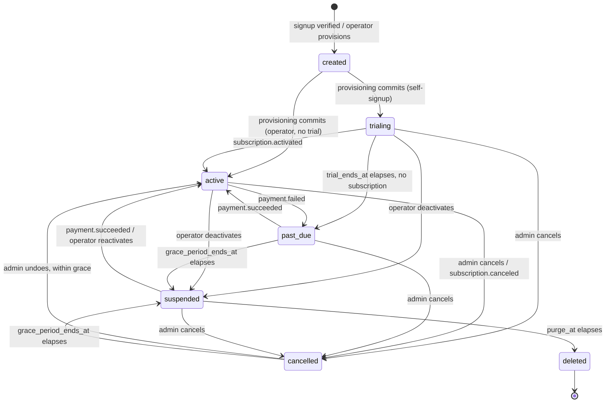

# Tenant lifecycle, self-signup and the retention contract (TAR-397)

Status: proposed · Builds on [0002 — architecture and API contract](./0002-architecture-and-api-contract.md), [0004 — RBAC permission matrix](./0004-rbac-permission-matrix.md), [0005 — authentication, sessions, invites and password reset](./0005-auth-session-and-invite-contract.md) · **Amends** 0002 (request pipeline stage 4, endpoint surface, the `SystemPrisma` call-site list) and 0005 (`MailerPort`, the login status gate) · Consumed by TAR-403 (schema), TAR-404 (lifecycle engine), TAR-405 (signup and provisioning), TAR-407 (onboarding UI), TAR-409 (org settings UI), TAR-412 (QA), TAR-414 (documentation)

> **This document reconciles three status vocabularies that have been drifting since TAR-47.**
> `packages/contracts/src/admin.ts` names TAR-36 as the owner of that reconciliation in as many
> words, and `contract.test.ts` pins the gap so it cannot widen. Decision 1 closes it. Nothing
> downstream should start until that decision is read, because every other sub-task writes
> against the vocabulary it fixes.

## Context and Problem

TAR-36 asks for a tenant that can arrive, sign itself up, run out of money, be locked out, come
back, and eventually be erased — with no operator in the loop for any of it. Six things already
on `main` constrain how that can be built, and four of them are in tension with each other.

1. **The status column and the published contract disagree, and both are shipped.** The
   `tenant_status` enum in `apps/api/prisma/schema.prisma` is
   `pending | active | suspended | cancelled`. `TENANT_STATUSES` in
   `packages/contracts/src/tenant.ts` is
   `trialing | active | past_due | suspended | cancelled | deleted`. `admin.ts` publishes a third
   name, `PROVISIONED_TENANT_STATUSES`, for the first set, with a comment recording the drift as
   deliberate and deferred to this story.

2. **The data layer refuses every status except `active`.** `public.assert_tenant_active` (TAR-51,
   hardened by TAR-64) runs inside the `set_config` statement that every `TenantPrisma` query
   sends, and raises `TN001` unless `tenants.status = 'active'`. A `trialing` tenant — the state
   every self-signed-up tenant starts in — would today reach no row in the database at all. This
   is the single hardest constraint in the story, and decision 2 is entirely about it.

3. **`TENANT_STATUS_EFFECTS` says a suspended tenant keeps API access; TAR-36 says its agents
   cannot log in.** The contract's table has `suspended: { apiAccess: true, inboundAccepted: true,
outboundAllowed: false }` and `contract.test.ts` pins the last two. TAR-36's fourth acceptance
   criterion reads "agents cannot log in, inbound WhatsApp messages are still received and stored,
   and no data is destroyed". Those cannot both hold.

4. **Provisioning exists and is admin-only.** `TenantProvisioningService` (TAR-50) is idempotent on
   `slug`, transactional, writes four rows and commits the tenant as `active`. Its own comment says
   it "never reactivates a suspended tenant — a reactivation is TAR-36's". `TenantDeactivationService`
   (TAR-51) writes `status = 'suspended'` plus one `audit_logs` row, and its comment says the
   inverse deliberately does not live there. Both are seams left open for this document; neither is
   to be rewritten.

5. **Billing is specified and not built.** `packages/contracts/src/billing.ts` publishes
   `PlanLimitsSchema`, `PlanEntitlementsSchema`, the `BillingProvider` port and a normalised
   `BillingEvent` union, and states that the tenant lifecycle consumes only that union. TAR-37 —
   which implements it against Polar.sh — is in `backlog`. So this document has to enforce plan
   limits with no billing provider, without inventing a shape TAR-37 then has to migrate away from.

6. **The request pipeline already has a slot for this.** 0002 reserves stage 4,
   `TenantStatusGuard`, "suspended/cancelled → `subscription_inactive`", explicitly marked
   `[TAR-36]`, and `request-pipeline.module.ts` carries the comment saying it slots in here. Login
   already maps `TenantNotActiveError` to `subscription_inactive` in `identity.http.ts`.

The question this document has to answer that none of the above settles is **where access control
lives when there are two different questions being asked.** "May this tenant's rows be touched at
all?" and "may this person reach the API right now?" have different answers in `suspended` — the
webhook ingest path must keep writing while every human is locked out — and today one function
answers both.

## Goals / Non-Goals

**Goals**

- One status vocabulary, spelled once, with every legal transition, its guard and its trigger.
- A data-layer gate that admits a trialing tenant and a suspended tenant's inbound traffic while
  refusing a cancelled or deleted one, without adding a `SystemPrisma` write path.
- Retention windows with named numbers, and an exact list of what a hard delete destroys and what
  survives it permanently.
- Plan limits enforced at write time against a database-backed configuration TAR-37 can replace
  without an API shape change.
- A signup flow that cannot be used to squat platform subdomains or enumerate tenants.
- A notification contract precise enough that TAR-404 can implement it without asking which email
  fires when.

**Non-Goals**

- **Pricing, checkout, invoices and the Polar.sh adapter.** TAR-37. This document consumes
  `BillingEvent` and writes nothing to a provider.
- **The onboarding checklist's own state.** TAR-407 owns the checklist, its steps and its
  persistence. This document defines only the lifecycle state the checklist runs inside.
- **A cross-tenant platform admin console.** TAR-18 puts it out of scope; the operator surface here
  stays four `PLATFORM_ADMIN_TOKEN` routes.
- **Per-conversation overage billing.** TAR-18's stated non-goal. The conversation cap gates and
  warns; it never bills.
- **SSO, 2FA and social signup.** Email and password, per TAR-18 assumption 8.
- **Re-deciding the routing, SLA or assignment contracts.** Nothing here touches 0006, 0007 or 0008.

## Proposed Architecture

Four components, three of which are new.

| Component                   | Responsibility                                                                                                                                                                        | Lives in                                |
| --------------------------- | ------------------------------------------------------------------------------------------------------------------------------------------------------------------------------------- | --------------------------------------- |
| `TenantLifecycleService`    | The only writer of `tenants.status`. Validates the transition, writes the status, the timer columns and the `lifecycle_events` row in one transaction, then enqueues the notification | `apps/api/src/tenancy/lifecycle/`       |
| `TenantStatusGuard`         | Pipeline stage 4. Decides whether _this principal_ may reach _this route_ given the tenant's status                                                                                   | `apps/api/src/common/request-pipeline/` |
| `TenantSignupService`       | The public signup, its verification token, and the handover to `TenantProvisioningService`                                                                                            | `apps/api/src/tenancy/signup/`          |
| `assert_tenant_serviceable` | Renamed and widened `assert_tenant_active`. Decides whether _any_ statement may touch this tenant's rows                                                                              | `apps/api/prisma/migrations/`           |



Three properties of this graph are load-bearing and are the reason it looks the way it does.

**Everything funnels through `suspended` before `deleted`.** There is no `cancelled → deleted`
edge, even though the map on `main` has one today. `purge_at` is set on entry to `suspended` and
nowhere else, so there is exactly one timer, one sweep branch and one code path that can destroy
data. A second road to `deleted` would be a second deletion path with its own clock, and deletion
paths are the one thing worth having exactly one of.

**`deleted` has no outbound edge**, which `contract.test.ts` already asserts for every status. A
tenant that came back from `deleted` would be a tenant whose rows were not actually deleted.

**Every edge is triggered by exactly one of three things** — a user or operator action, a
`BillingEvent`, or a timer elapsing — and the transition function refuses an edge whose trigger is
not the one recorded for it. `active → past_due` from a UI button is a bug, not a shortcut.

## Technology Choices

| Concern                | Choice                                                                                 | Alternatives considered                                                       | Rationale                                                                                                                                                                                                                                                        |
| ---------------------- | -------------------------------------------------------------------------------------- | ----------------------------------------------------------------------------- | ---------------------------------------------------------------------------------------------------------------------------------------------------------------------------------------------------------------------------------------------------------------- |
| Status storage         | One `tenant_status` PostgreSQL enum, seven values                                      | Two columns (`provisioning_state` + `billing_state`); a `text` column         | An enum is what is already there, and the drift this document exists to close was caused by having two vocabularies rather than one. Two columns would recreate it with a schema blessing                                                                        |
| Transition enforcement | Application-side, in one service, against the exported `TENANT_STATUS_TRANSITIONS` map | A database trigger on `tenants`                                               | The map is already published and consumed by the frontend; a trigger would be a second copy in a language the contract package cannot import. The single-writer rule is enforced by review, and by the fact that `TenantPrisma` refuses to write `Tenant` at all |
| Timers                 | Repeatable BullMQ job every 5 minutes over `SystemPrisma`                              | `pg_cron`; per-tenant delayed jobs                                            | The SLA sweep (0006) already establishes this shape, including the per-tenant transaction split that keeps writes under row-level security. Per-tenant delayed jobs lose their schedule when Redis is flushed; a sweep over a column recovers by itself          |
| Trial plan limits      | A seeded `plans` row with `key = 'trial'`                                              | A `TRIAL_LIMITS` constant in the contract package; a new `trial_limits` table | `subscriptions.plan_id` is already a non-null foreign key into `plans`, and TAR-37's `FeatureGuard` already reads `plans.entitlements`. A constant would need a second read path and a nullable `plan_id`; a new table would be one TAR-37 deletes               |
| Verification token     | 256-bit random, SHA-256 at rest, in a URL fragment                                     | A signed JWT                                                                  | Exactly what 0005 chose for invites and password resets, for the same reasons: revocable, no key rotation problem, and the fragment keeps it out of every access log on the path                                                                                 |
| Signup email delivery  | The existing `MailerPort` with two new templates                                       | A separate transactional-email seam for signup                                | One seam, one adapter for TAR-41 to wire. Widening the port is one nullable field                                                                                                                                                                                |

### Decision 1 — One vocabulary of seven, and `pending` becomes `created`

`tenant_status` becomes:

```
created | trialing | active | past_due | suspended | cancelled | deleted
```

`TENANT_STATUSES` in `tenant.ts` becomes the same seven values in the same order.
`PROVISIONED_TENANT_STATUSES` in `admin.ts` is **deleted**, and
`ProvisionedTenantResponseSchema.status` refers to `TenantStatusSchema` instead. The drift
assertion in `contract.test.ts` (the block that computes `onlyProvisioning` and
`onlyCustomerFacing`) is replaced by an equality assertion between the contract enum and the
Prisma enum, so the two can never separate again.

**`pending` is renamed to `created`, not dropped.** The value is the column's default and it is the
fail-closed state of a row written by anything other than `TenantProvisioningService` — a fixture,
a partially-applied migration, a future provisioning path that is not one transaction. Today no
tenant is ever _observable_ in it, because provisioning commits `active` inside the transaction
that inserts the row, and that stays true: `created` is a state a tenant is only ever in
mid-transaction or by accident, and no tenant is ever served in it. Keeping it is what makes
`assert_tenant_serviceable` refusing it meaningful.

The rename is `ALTER TYPE "tenant_status" RENAME VALUE 'pending' TO 'created'` — catalogue-only,
no table rewrite, no lock on `tenants` beyond the type's own. The three new values are appended
with `ADD VALUE`. Both are irreversible in the same migration, which is why `down.sql` for TAR-403
recreates the type rather than reversing the statements; the down migration is worth writing
carefully and worth testing, and `pnpm db:rollback` is the check.

The alternatives, and why not:

- **Keep `pending`, add `created` as an eighth value.** Two spellings of one state is the disease
  this decision is treating.
- **Keep `pending` and read TAR-397's `created` as a synonym.** Defensible, and it costs no
  migration. Rejected because `pending` reads as "waiting for something to happen to it" and
  `created` reads as "the row exists and nothing else does" — the second is what the value means,
  and the acceptance criteria name it. The cost of being wrong here is a word; the cost of leaving
  it is that every future reader re-derives which of the two words the column means.

The one API-visible consequence: `POST /api/v1/admin/tenants` can return `status: "created"` where
it previously could have returned `"pending"`. It never does in practice — the comment on
`PROVISIONED_TENANT_STATUSES` already says "never returned by a successful provision" — so nothing
that exists today reads it.

### Decision 2 — Two gates, because there are two questions

`public.assert_tenant_active` is replaced by `public.assert_tenant_serviceable`, and stage 4 of the
request pipeline gets `TenantStatusGuard`. They answer different questions and must not be
collapsed.

**The database gate — may any statement touch this tenant's rows?**

```sql
CREATE OR REPLACE FUNCTION "public"."assert_tenant_serviceable"(tenant_id text)
```

Identical to the function it replaces — same signature, same `STABLE`, same pinned `search_path`,
same `TN001`, same refusal of a null, a non-UUID and an unknown id, same deliberate inability to
tell the caller which — with one line changed:

```sql
IF current_status NOT IN ('trialing', 'active', 'past_due', 'suspended') THEN
    RAISE EXCEPTION 'TENANT_NOT_SERVICEABLE: tenant % is %', tenant_id, current_status
        USING ERRCODE = 'TN001';
END IF;
```

`suspended` is admitted, and that is the decision. **Inbound WhatsApp messages must still be
received and stored while a tenant is suspended** — TAR-36's fourth acceptance criterion, and Meta's
own retry behaviour makes the alternative worse than it sounds: refusing the webhook makes Meta
retry and then drop real customer messages. The ingest path writes `conversations` and `messages`
through `TenantPrisma`, under row-level security. If the database gate refused a suspended tenant,
that write would have to move to `SystemPrisma`, which would be a _writing_ unscoped call site in
the highest-volume path in the product — the exact shape the tenancy contract calls the dangerous
half, and the one an integration test had to be written to catch for the SLA sweep.

`cancelled` and `deleted` are refused, as today. `created` is refused, which is new only in name.

The error class and its `kind` discriminator keep their names — `TenantNotActiveError`,
`TENANT_NOT_ACTIVE_ERROR` — and stay outside the `TenantPrismaError` family. A rename would touch
`identity.http.ts`, `prisma.errors.ts` and their tests for no behavioural gain, and the error's
meaning is unchanged: an operator or a timer did this, it is not a bug, and it reports as
`subscription_inactive`.

**The HTTP gate — may this principal reach this route right now?**

`TenantStatusGuard` runs at stage 4, after `AuthGuard` has resolved a principal and before
`PermissionGuard`. It reads the tenant status already loaded by `HostTenantGuard` and applies:

| Status      | Agent / supervisor               | Admin                       | Note                                                                         |
| ----------- | -------------------------------- | --------------------------- | ---------------------------------------------------------------------------- |
| `created`   | refused                          | refused                     | Unreachable: `HostTenantGuard` answers `tenant_not_found` first              |
| `trialing`  | full                             | full                        |                                                                              |
| `active`    | full                             | full                        |                                                                              |
| `past_due`  | full                             | full                        | Dunning is a banner, not an outage — `TENANT_STATUS_EFFECTS` already says so |
| `suspended` | refused, `subscription_inactive` | **recovery allowlist only** |                                                                              |
| `cancelled` | refused                          | recovery allowlist only     |                                                                              |
| `deleted`   | —                                | —                           | Unreachable: `HostTenantGuard` answers `tenant_not_found`                    |

The recovery allowlist is four routes and exists so a suspended tenant is not a tenant that cannot
pay its way out:

```
GET    /api/v1/auth/session
POST   /api/v1/auth/logout
GET    /api/v1/tenant
GET    /api/v1/tenant/lifecycle
GET    /api/v1/billing/*
```

Anything else answers `403 subscription_inactive` for an admin and the same for everyone else. The
allowlist is a decorator, `@AvailableWhileSuspended()`, so it is visible in the diff on the route
rather than assembled from a path list in a guard — a path list is a place a wildcard eventually
opens something nobody meant.

**Login is the one place this gets subtle.** TAR-36 says agents cannot log in. A blanket refusal
locks the admin out too, and reactivation at v1 is driven by a payment webhook or an operator —
neither of which the admin can trigger from outside the product. So `POST /api/v1/auth/login`
against a `suspended` or `cancelled` tenant:

1. Runs the **entire** existing login flow first — IP window, lockout, user lookup, the fixed dummy
   argon2id verify on a miss, the real verify — unchanged.
2. Only once a principal is resolved, checks its role. `admin` gets a session, confined by the
   allowlist above. `agent` and `supervisor` get `403 subscription_inactive` and no session.

The ordering is not cosmetic. Checking the status before authenticating turns the endpoint into a
role oracle: an unauthenticated caller could learn, per email address, whether that address is an
admin of the tenant, by watching which of two errors comes back. Authenticating first means the
answer only differs for someone who already holds the password.

This amends 0005's error table, whose row reads "Host resolves to a suspended/cancelled tenant →
`subscription_inactive`". That stays true for agents and supervisors and becomes false for admins.

**What this decision changes in the published contract.** `TENANT_STATUS_EFFECTS` gains a `created`
row and `suspended.apiAccess` changes from `true` to `false`.

> I disagree with the acceptance criterion that produced this, and record it once. "Agents cannot
> log in" is a heavier hammer than the outcome needs: a suspended tenant whose agents can read the
> history but not send loses nothing a reseller cares about, keeps the tenant's own record of its
> customers in front of it, and is what `outboundAllowed: false` already described. Locking
> everyone out also means a suspended tenant's supervisor cannot answer "what did we tell this
> customer last week" during the very conversation where they are deciding whether to pay.
> TAR-36's criterion is explicit, TAR-412 will test it, and this document designs to it. If Tarek
> would rather have read-only-while-suspended, it is a one-line change to the table above and
> nothing else in this document moves.

### Decision 3 — Signup provisions nothing until the email is verified

`POST /api/v1/signup` writes one row to a new `tenant_signups` table and sends one email. No
tenant, no user, no domain, no subscription. `POST /api/v1/signup/verify` consumes the token and,
in one transaction, calls `TenantProvisioningService.provision()`, creates the first `admin` user,
attaches the trial subscription, transitions `created → trialing` and issues a session.

Provisioning before verification would mean any script that can POST a form can burn platform
subdomains — `hostname` is globally unique on `tenant_domains`, so a squatted slug is permanently
unavailable to the customer who wanted it — and would fill `tenants` with a row per bot.

That creates the problem it solves: the form has to tell someone their slug is taken _before_ they
go and check their inbox, or verification fails at the last step with the one error they cannot fix
without starting over. So a signup row is a **soft reservation**:

- `UNIQUE (desired_slug) WHERE consumed_at IS NULL` — a partial unique index, so a consumed signup
  releases nothing (the tenant now holds the slug) and an unconsumed one holds it.
- The insert path deletes expired unconsumed rows for that slug inside its own transaction before
  inserting, so an abandoned signup releases the name after `signupTokenTtlMs`. A partial index
  cannot express `AND expires_at > now()` — `now()` is not immutable — and the delete-then-insert
  is what stands in for it.
- `GET /api/v1/signup/slug-available` checks `tenants.slug` and live reservations together.

Slug availability is an enumeration oracle for which tenants exist. That is acceptable and needs
saying once: the platform subdomain is a public DNS name, so anybody who wants the list can get it
from DNS. Email is not an oracle here at all, and for a reason worth recording — identity is
tenant-scoped (`UNIQUE (tenant_id, email)`, 0002 decision 2), so the same address signing up twice
is two unrelated accounts and "is this email known" has no global answer to leak.

The verification link points at the **platform** host, not a tenant host, because at that moment
there is no tenant and therefore no tenant hostname:

```
https://{platformHost}/verify#token={token}
```

The fragment is 0005's mechanism, unchanged and for the same reason: browsers never send a
fragment, so the token exists only in the address bar until client-side code reads it and POSTs it.
The verify page clears it with `history.replaceState` after reading.

`SIGNUP_ENABLED` (boolean, default `true`) implements TAR-36's assumption that a deployment can
turn self-signup off and fall back to the operator-provisioned path. When false, all four signup
routes answer `404` rather than `403` — a disabled feature that advertises itself is a feature
somebody probes.

**Rate limits**, in the same shape as `AUTH_POLICY` and for the same reason — one object, three
readers:

| Key                        | Value | Rationale                                                                                     |
| -------------------------- | ----- | --------------------------------------------------------------------------------------------- |
| `signupsPerIpPerHour`      | 5     | A person signs up once. Five allows a shared office NAT and a couple of mistakes              |
| `signupsPerEmailPerDay`    | 3     | Bounds mailbox flooding via the signup form, as `resetRequestsPerEmailPerHour` does for reset |
| `slugChecksPerIpPerMinute` | 30    | The form checks as you type; this is a debounce backstop, not a security control              |

### Decision 4 — Retention is two columns and two windows

| Column on `tenants`    | Set when                           | Read by   | Meaning                                                     |
| ---------------------- | ---------------------------------- | --------- | ----------------------------------------------------------- |
| `trial_ends_at`        | entering `trialing`                | the sweep | Trial expiry. Already exists                                |
| `grace_period_ends_at` | entering `past_due` or `cancelled` | the sweep | When the tenant becomes `suspended`                         |
| `purge_at`             | entering `suspended`               | the sweep | When the tenant becomes `deleted` and its data is destroyed |
| `suspended_at`         | entering `suspended`               | reporting | Already exists, written by TAR-51                           |

All three forward-looking columns are cleared on any transition that leaves the state that set
them. A `past_due` tenant that pays has `grace_period_ends_at` set back to `NULL` in the same
transaction as the status write, because a stale timer is a tenant that gets suspended a fortnight
after it paid.

`LIFECYCLE_POLICY`, exported from `packages/contracts/src/tenant.ts` alongside `AUTH_POLICY`'s
precedent:

| Key                       | Value | Rationale                                                                                                                                            |
| ------------------------- | ----- | ---------------------------------------------------------------------------------------------------------------------------------------------------- |
| `trialDays`               | 14    | Long enough to connect a WABA and run real conversations through it, which is what a trial has to prove. Two weekends                                |
| `pastDueGraceDays`        | 14    | A card retry cycle. Polar retries a failed charge over roughly this window, so suspending sooner suspends tenants whose payment was going to succeed |
| `cancelledGraceDays`      | 7     | An accidental or regretted cancellation is discovered within a week. `cancelled → active` exists for exactly this                                    |
| `purgeAfterSuspendedDays` | 30    | TAR-18's stated default, "pending client policy"                                                                                                     |
| `deletionReminderDays`    | 7     | One email before the point of no return, while there is still time to act                                                                            |
| `trialEndingReminderDays` | 3     |                                                                                                                                                      |
| `signupTokenTtlMs`        | 24 h  | Longer than `passwordResetTtlMs`, shorter than `inviteTtlMs`: the person is at the keyboard now, but they may check that mailbox tomorrow            |

These are defensible starting values, not measured ones, and moving one means editing one object.
`purgeAfterSuspendedDays` is the one that needs a decision rather than a default — see open
question 1.

**Worked example.** An `active` tenant's card fails on 1 March. `payment.failed` writes
`past_due` and `grace_period_ends_at = 15 March`. Nothing about the product changes; the console
shows a banner. On 15 March the sweep writes `suspended`, `suspended_at = 15 March` and
`purge_at = 14 April`. Agents stop being able to log in; Meta's webhooks are still accepted and
stored. On 7 April a deletion reminder goes out. On 14 April the purge runs. Total elapsed from
first failed charge to data loss: 44 days.

### Decision 5 — What a hard delete destroys, and what outlives it

**The `tenants` row is not deleted.** `status` becomes `deleted`, `purge_at` and
`grace_period_ends_at` are cleared, and `deleted_at` is stamped. Everything with a `tenant_id`
cascading from it is deleted.

Keeping the row is what keeps the slug claimed. Releasing `acme` would let a new tenant take
`acme.app.example.com` and inherit the previous one's bookmarks, cached sessions, and — the case
that actually matters — any Meta webhook still routing a `phone_number_id` that used to belong to
the dead tenant. The cost is that a customer who deletes and later returns cannot reuse their own
name. That is the right trade and it is worth stating to the customer in the deletion confirmation.

| Table                                                                                | Hard delete                                                                                  | Why                                                                                                                                                                                                    |
| ------------------------------------------------------------------------------------ | -------------------------------------------------------------------------------------------- | ------------------------------------------------------------------------------------------------------------------------------------------------------------------------------------------------------ |
| `tenants`                                                                            | **retained**, redacted to `id`, `slug`, `status`, `created_at`, `deleted_at`. `name` is kept | The slug tombstone. `name` is a business name, not personal data, and the lifecycle trail is unreadable without it                                                                                     |
| `tenant_domains`                                                                     | **deleted**                                                                                  | Frees the customer's own custom domain so they can point it elsewhere. Also what makes `HostTenantGuard` answer `tenant_not_found` on the platform subdomain                                           |
| `tenant_settings`, `tenant_branding`                                                 | deleted                                                                                      |                                                                                                                                                                                                        |
| `users`, `sessions`, `invites`, `invite_teams`, `password_reset_tokens`              | deleted                                                                                      | Names, email addresses, password hashes. The whole point                                                                                                                                               |
| `contacts`, `contact_tags`, `tags`, `custom_field_defs`                              | deleted                                                                                      | The tenant's customers. The most sensitive data in the system                                                                                                                                          |
| `conversations`, `messages`, `message_attachments`, `internal_notes`                 | deleted                                                                                      |                                                                                                                                                                                                        |
| `media_objects`                                                                      | deleted, **and the blobs behind them**                                                       | See failure modes: the object store is not in the transaction                                                                                                                                          |
| `tickets`, `ticket_events`, `ticket_counter`                                         | deleted                                                                                      |                                                                                                                                                                                                        |
| `teams`, `team_members`, `assignment_rules`, `assignment_state`                      | deleted                                                                                      |                                                                                                                                                                                                        |
| `sla_policies`, `sla_timers`, `sla_alerts`                                           | deleted                                                                                      |                                                                                                                                                                                                        |
| `workflows`, `workflow_runs`, `ai_config`, `knowledge_documents`, `canned_responses` | deleted                                                                                      |                                                                                                                                                                                                        |
| `whatsapp_business_accounts`, `whatsapp_accounts`, `message_templates`               | deleted                                                                                      | Contains `access_token_encrypted`. Deleting it is the point                                                                                                                                            |
| `subscriptions`                                                                      | deleted                                                                                      | The provider-side record is TAR-37's to cancel; this is only our mirror                                                                                                                                |
| `usage_counters`                                                                     | deleted                                                                                      | Billing is closed by the time a purge runs                                                                                                                                                             |
| `audit_logs`                                                                         | **deleted**                                                                                  | Tenant-scoped operational audit — role changes, invites, branding edits — with a foreign key into `users`. It is the tenant's data, and it is what `lifecycle_events` exists so we do not have to keep |
| `webhook_events`                                                                     | `tenant_id` set to `NULL`                                                                    | Already nullable and already `onDelete: SetNull`. Meta's payloads are retained for platform forensics, unlinked                                                                                        |
| `idempotency_keys`                                                                   | deleted                                                                                      | Rows expire after 24 hours anyway                                                                                                                                                                      |
| `lifecycle_events`                                                                   | **retained permanently**                                                                     | The audit trail TAR-36's sixth criterion asks for                                                                                                                                                      |

**`lifecycle_events` is deliberately not `audit_logs`.** It is a platform-level table: no
`tenant_isolation` policy, no foreign key to `tenants` and none to `users`, written and read only
through `SystemPrisma`. Three consequences, and each is why it is built this way rather than as
rows in the table that already exists:

1. **It survives the purge**, because nothing cascades into it.
2. **It is readable after the tenant is no longer serviceable.** A row under
   `tenant_isolation` needs the `app.tenant_id` GUC, and setting that GUC runs
   `assert_tenant_serviceable`, which refuses `cancelled` and `deleted`. An audit trail you cannot
   read once the thing it describes has been shut off is not an audit trail. This is the whole
   argument, and it is why row-level security is the wrong tool for this one table.
3. **Its actor is a label, not a foreign key**, so deleting every user does not orphan it and does
   not require relaxing the `audit_logs_actor_attribution` check constraint.

Row shape, matching `AuditActorType`'s existing vocabulary:

```
id, tenant_id (uuid, no FK), from_status, to_status, trigger, actor_type,
actor_user_id (uuid, no FK), actor_label, reason, metadata, notified_at, occurred_at
```

`trigger` is `user_action | operator_action | billing_event | timer | system`, and is what makes
the "no `active → past_due` from a button" rule assertable rather than aspirational.

### Decision 6 — The trial plan is a `plans` row, seeded by migration

TAR-37 is in `backlog`, so nothing writes `plans` outside the demo seeder. This document seeds one
row in a migration, not a fixture:

```
key                'trial'
name               'Trial'
price_minor_units  0
interval           month
is_active          true
entitlements       { features: ['assignment_rules', 'sla_policies'],
                     limits: { seats: 3, conversationsPerPeriod: 1000,
                               whatsappNumbers: 1, teams: 2, knowledgeDocuments: 10 } }
```

Signup writes a `subscriptions` row against it with `status: 'trialing'`, `seats: 1`,
`current_period_start = now()`, `current_period_end = trial_ends_at`. TAR-37 replaces the row's
contents, adds real plans, and points the subscription somewhere else. **No API shape changes**,
because `BillingSummaryResponseSchema` and `PlanEntitlementsSchema` already describe exactly this
and are already published.

**A drift TAR-403 must close on the way past.** The seeded plans in
`apps/api/src/seed/demo-dataset.ts` carry `entitlements: { seats: 3, conversationsPerPeriod: 1000 }`
— flat — and `PlanEntitlementsSchema` is `{ features: [...], limits: { ... } }`. The seeded rows do
not validate against the published schema, and nothing has read the column yet so nothing has
noticed. The trial row is written in the published shape and the three demo rows are migrated to
match it in the same change.

**Enforcement points.** "Enforced, not merely displayed" is TAR-36's second acceptance criterion,
so each limit has a named write path that refuses:

| Limit                    | Refused at                                      | Code                  | Note                                                                                                                                                                                                                                                                       |
| ------------------------ | ----------------------------------------------- | --------------------- | -------------------------------------------------------------------------------------------------------------------------------------------------------------------------------------------------------------------------------------------------------------------------- |
| `seats`                  | `POST /users/invites` **and** invite acceptance | `plan_limit_exceeded` | Both, deliberately. Creation is where the admin finds out; acceptance is the guarantee. `billing.ts` says acceptance, TAR-405 says creation, and enforcing only one of them either surprises the admin a week later or lets two simultaneous acceptances overshoot the cap |
| `conversationsPerPeriod` | outbound send, once the counter is over         | `plan_limit_exceeded` | **Never inbound.** A customer's message is accepted and stored whatever the counter says; what the cap withholds is the tenant's ability to reply. Dropping inbound to enforce a quota loses a real person's message to fix a billing problem                              |
| `whatsappNumbers`        | WABA connect                                    | `plan_limit_exceeded` |                                                                                                                                                                                                                                                                            |
| `teams`                  | team create                                     | `plan_limit_exceeded` |                                                                                                                                                                                                                                                                            |
| `knowledgeDocuments`     | document create                                 | `plan_limit_exceeded` |                                                                                                                                                                                                                                                                            |
| features                 | `@RequireFeature`, stage 6                      | `feature_not_in_plan` | TAR-37's guard. Not built here; the entitlements it reads are                                                                                                                                                                                                              |

The seat count is `users` where `status = 'active'`, plus `invites` still pending. Counting only
active users lets an admin mint unlimited pending invites and blow past the cap the moment a
mailout lands.

### Decision 7 — Notifications fire after the commit, from the audit row

The transition transaction writes `tenants` and `lifecycle_events` and **does not send an email**.
It enqueues `tenant.notify` on the existing queue, with the `lifecycle_events` row id as the BullMQ
job id.

A mailer outage that rolled back a suspension would leave a tenant that should have been locked out
still running, which is the wrong failure. And the job id being the audit row id is what makes a
redelivery a no-op: BullMQ answers `duplicate` for an id it already holds.

If Redis is down, `enqueue` returns `unavailable` or `failed`, the transaction has already
committed, and the lifecycle sweep re-enqueues any `lifecycle_events` row with
`notified_at IS NULL` older than a minute. This is the same durability shape as webhook ingest:
the row is the truth, the queue is an accelerator.

`OutboundEmail` gains one nullable field and nine templates:

```ts
export interface OutboundEmail {
  to: string;
  template: OutboundEmailTemplate;
  /** Null for the two signup templates: no tenant exists yet. */
  tenantId: string | null;
  data: Record<string, string>;
}
```

| Transition or event                                             | Template              | To                                  | Timing                                                    |
| --------------------------------------------------------------- | --------------------- | ----------------------------------- | --------------------------------------------------------- |
| `POST /signup`                                                  | `signup_verification` | the signup address                  | immediate, link on the **platform** host                  |
| `POST /signup/resend`                                           | `signup_verification` | the signup address                  | immediate                                                 |
| `created → trialing`                                            | `tenant_welcome`      | the first admin                     | immediate, on the **tenant** host                         |
| `trial_ends_at` − 3 d                                           | `trial_ending`        | all active admins                   | timer, not a transition                                   |
| `trialing → past_due`                                           | `trial_expired`       | all active admins                   | immediate                                                 |
| `active → past_due`                                             | `payment_failed`      | all active admins                   | immediate. Carries `grace_period_ends_at`                 |
| `* → cancelled`                                                 | `tenant_cancelled`    | all active admins                   | immediate. Carries `grace_period_ends_at` and how to undo |
| `* → suspended`                                                 | `tenant_suspended`    | all active admins                   | immediate. Carries `purge_at`                             |
| `purge_at` − 7 d                                                | `deletion_reminder`   | all active admins                   | timer                                                     |
| `* → deleted`                                                   | `tenant_deleted`      | addresses read **before** the purge | last statement before the purge begins                    |
| `suspended → active`, `past_due → active`, `cancelled → active` | `tenant_reactivated`  | all active admins                   | immediate                                                 |

`tenant_deleted` is the one that needs care: it goes to addresses in a table the same job is about
to destroy. The recipient list is read and the job enqueued in the transaction that stamps
`purge_started_at`, before the first `DELETE`.

Recipients are `users` with `role = 'admin'` and `status = 'active'`, except `tenant_welcome`,
which goes to the signup user alone — at that instant they are the only user there is.

`ConsoleMailer` renders all nine, so TAR-405 and TAR-404 are testable end to end with no vendor
account, exactly as it does for invites today.

## Data Model

Deltas against what is on `main`. TAR-403 owns the migration; this is what it must contain.

### Changed: `tenant_status`

```sql
ALTER TYPE "tenant_status" RENAME VALUE 'pending' TO 'created';
ALTER TYPE "tenant_status" ADD VALUE 'trialing' AFTER 'created';
ALTER TYPE "tenant_status" ADD VALUE 'past_due' AFTER 'active';
ALTER TYPE "tenant_status" ADD VALUE 'deleted';
```

Declaration order is `created, trialing, active, past_due, suspended, cancelled, deleted`, which is
lifecycle order. That matters for the same reason it does on `ticket_priority`: PostgreSQL sorts an
enum by declaration order, so `ORDER BY status` on an operator's tenant list reads as a funnel.

On PostgreSQL 16 — what `docker-compose.yml` runs — `ADD VALUE` may run inside a transaction block,
so this is one migration and not four. It still cannot be reversed by reversing its statements:
the `down.sql` recreates the type and rewrites the column, and `pnpm db:rollback` is where that gets
proven rather than assumed.

### Changed: `tenants`

| Column                 | Change                                                                                                                   |
| ---------------------- | ------------------------------------------------------------------------------------------------------------------------ |
| `status`               | Default stays `created` (was `pending`)                                                                                  |
| `grace_period_ends_at` | **new**, `timestamptz(3)` null                                                                                           |
| `purge_at`             | **new**, `timestamptz(3)` null                                                                                           |
| `purge_started_at`     | **new**, `timestamptz(3)` null. Set when the first purge batch begins, so a crashed purge resumes rather than restarting |
| `deleted_at`           | **new**, `timestamptz(3)` null                                                                                           |
| `plan_limits_note`     | not added — limits live in `plans.entitlements`                                                                          |

Index: `(status, grace_period_ends_at)` and `(status, purge_at)`, both partial on the status the
sweep actually scans, so the five-minute sweep stays an index scan as the tenant count grows:

```sql
CREATE INDEX tenants_grace_due ON tenants (grace_period_ends_at)
  WHERE status IN ('past_due', 'cancelled') AND grace_period_ends_at IS NOT NULL;
CREATE INDEX tenants_purge_due ON tenants (purge_at)
  WHERE status = 'suspended' AND purge_at IS NOT NULL;
```

Prisma cannot express a partial index with an `IN` predicate, so these are raw SQL in the migration
— the same arrangement as the predicated indexes on `users` and `tickets`, and not drift.

### New: `lifecycle_events`

**Not tenant-scoped.** No `tenant_isolation` policy, no foreign keys. Decision 5 says why. It joins
`tenants`, `plans` and `webhook_events` on the list of tables `TenantPrisma` refuses, with rule
`system-only` — reads and writes both refused, as `WebhookEvent` already is. TAR-403 must add it to
`tenant-scope.extension.ts`'s table, and `pnpm db:verify:rls` must be taught that this is the
fourth deliberate exception rather than a missing policy.

| Column          | Type                     | Note                                                                     |
| --------------- | ------------------------ | ------------------------------------------------------------------------ |
| `id`            | uuid v7                  |                                                                          |
| `tenant_id`     | uuid, **no FK**          | Survives the tenant's purge                                              |
| `from_status`   | `tenant_status` null     | Null only for the first row of a tenant's life                           |
| `to_status`     | `tenant_status`          |                                                                          |
| `trigger`       | `lifecycle_trigger` enum | `user_action \| operator_action \| billing_event \| timer \| system`     |
| `actor_type`    | `audit_actor_type`       | Reuses the existing enum                                                 |
| `actor_user_id` | uuid null, **no FK**     |                                                                          |
| `actor_label`   | text null                | The operator credential label, or the admin's email at the time          |
| `reason`        | text null                | Free text. Never rendered to the tenant, never a credential              |
| `metadata`      | jsonb null               | `provider_event_id` for a billing trigger, the elapsed timer for a timer |
| `notified_at`   | timestamptz(3) null      | The notification backstop reads this                                     |
| `occurred_at`   | timestamptz(3)           | Database `now()`, read once and shared with the `tenants` write          |

Indexes: `(tenant_id, occurred_at DESC, id DESC)` for the read endpoint's keyset pagination, and
`(notified_at)` partial on `notified_at IS NULL` for the notification sweep.

Append-only: no `updated_at`, and `notified_at` is the single exception — a one-way null-to-value
stamp, which is why it is a column here rather than a second table.

### New: `tenant_signups`

Also not tenant-scoped, for the obvious reason. `system-only` under `TenantPrisma`.

| Column                     | Type                | Note                                                                         |
| -------------------------- | ------------------- | ---------------------------------------------------------------------------- |
| `id`                       | uuid v7             |                                                                              |
| `email`                    | citext              |                                                                              |
| `desired_slug`             | citext              |                                                                              |
| `tenant_name`              | text                |                                                                              |
| `admin_name`               | text                |                                                                              |
| `password_hash`            | text                | argon2id, taken at signup so verification is one click and not a second form |
| `token_hash`               | bytea               | SHA-256 of a 256-bit random token. The token itself is never stored          |
| `timezone`, `locale`       | text                | Seeds `tenant_settings`                                                      |
| `expires_at`               | timestamptz(3)      | `now() + signupTokenTtlMs`                                                   |
| `consumed_at`              | timestamptz(3) null |                                                                              |
| `tenant_id`                | uuid null, no FK    | Filled on consumption, for forensics                                         |
| `created_at`, `ip_address` |                     | Rate limiting and abuse review                                               |

```sql
CREATE UNIQUE INDEX tenant_signups_slug_reserved
  ON tenant_signups (desired_slug) WHERE consumed_at IS NULL;
CREATE UNIQUE INDEX tenant_signups_token ON tenant_signups (token_hash);
```

Storing `password_hash` before the address is verified is a deliberate call. The alternative —
collect the password on the verify page — means the credential travels with the token in the same
form POST, and means an abandoned signup leaves nothing to clean up. The reason it goes here
instead: a verify page that asks for a password is a page an attacker who intercepted the link can
complete, whereas one that only confirms is not. The hash is argon2id at the same cost parameters
as `users.password_hash`, and an unconsumed row is deleted by the expiry sweep.

### Changed: `plans`

The three demo rows move from `{ seats, conversationsPerPeriod }` to the published
`PlanEntitlementsSchema` shape, and a fourth row, `trial`, is seeded by the migration rather than by
the demo seeder — the demo dataset is optional and the trial plan is not.

## Interfaces

### Endpoint surface

Amends 0002's `# Tenant` and `# Platform operator` blocks.

```
# Public — no session, no tenant host. @PublicPlatformRoute(), rate-limited
POST   /api/v1/signup                          → 202 SignupAcceptedResponse
POST   /api/v1/signup/verify                   → 201 SignupCompletedResponse   sets cookie
POST   /api/v1/signup/resend                   → 202
GET    /api/v1/signup/slug-available?slug=     → SlugAvailabilityResponse

# Tenant admin — session, tenant host
GET    /api/v1/tenant/lifecycle                → TenantLifecycleResponse       tenant:settings
GET    /api/v1/tenant/lifecycle/events         → CursorPage<TenantLifecycleEvent>  tenant:settings
POST   /api/v1/tenant/cancel                   → TenantLifecycleResponse       billing:manage
POST   /api/v1/tenant/cancel/undo              → TenantLifecycleResponse       billing:manage
POST   /api/v1/tenant/delete                   → TenantLifecycleResponse       billing:manage

# Platform operator — PLATFORM_ADMIN_TOKEN, not a session
POST   /api/v1/admin/tenants/{slug}/deactivate → DeactivatedTenantResponse     exists (TAR-51)
POST   /api/v1/admin/tenants/{slug}/reactivate → AdminTenantLifecycleResponse
POST   /api/v1/admin/tenants/{slug}/cancel     → AdminTenantLifecycleResponse
POST   /api/v1/admin/tenants/{slug}/delete     → AdminTenantLifecycleResponse
GET    /api/v1/admin/tenants/{slug}/lifecycle  → CursorPage<TenantLifecycleEvent>
```

Three notes a reviewer will otherwise ask about.

**`deactivate` keeps its name.** `docs/STYLE.md` fixes _deactivate_ as the operator's verb for this
operation and forbids _suspend_ as a synonym. The lifecycle _state_ is `suspended` and the
_operation_ is `deactivate`, which is exactly what `TenantDeactivationService` already does — it
writes `status: 'suspended'`. Renaming the route to match the state would break the style guide's
one fixed-vocabulary row about this endpoint and would break a published operator API for nothing.
`reactivate` is its inverse and takes the same shape.

**`POST /tenant/delete` schedules; it does not delete.** It transitions to `cancelled` with
`grace_period_ends_at` set, which reaches `suspended` and then `purge_at`. TAR-36's criterion is
"when the retention window elapses, then tenant data is permanently deleted", and an endpoint that
destroyed data synchronously would have no window. The operator route
`POST /admin/tenants/{slug}/delete` is the same, and the only way to skip a window is a
`force: true` body field on the operator route, which is audited with `trigger: operator_action`
and exists for a right-to-erasure request that cannot wait 44 days.

**`@PublicPlatformRoute()` is a new posture**, and it needs to be. `route-posture.spec.ts` asserts
every route declares exactly one, and signup is genuinely both — out of tenant resolution (there is
no tenant host) and unauthenticated (there is no session). Composing `@Public()` and
`@PlatformRoute()` would break that spec's invariant; a third named posture keeps it, and puts
"this is open to the internet with no session and no tenant" in the diff where a reviewer sees it.

### Shapes

New, in `packages/contracts/src/tenant.ts` and a new `signup.ts`:

```ts
// signup.ts — public, pre-tenant
SignupInputSchema            = { email, password: Password, adminName: string,
                                 tenantName: TenantName, slug: TenantSlug,
                                 timezone?: IanaTimezone, locale?: Locale }
SignupAcceptedResponseSchema = { email: string, expiresAt: Timestamp }
SignupVerifyInputSchema      = { token: string }
SignupCompletedResponseSchema= { tenant: TenantResponse, user: SessionPrincipal,
                                 primaryHostname: string }
SignupResendInputSchema      = { email }
SlugAvailabilityQuerySchema  = { slug: TenantSlug }
SlugAvailabilityResponseSchema = { slug: string, available: boolean }

// tenant.ts — additions
TENANT_STATUSES              = ['created','trialing','active','past_due',
                                'suspended','cancelled','deleted']
LIFECYCLE_TRIGGERS           = ['user_action','operator_action','billing_event',
                                'timer','system']
LIFECYCLE_POLICY             = frozen object of every window in decision 4
TenantLifecycleEventSchema   = { id, fromStatus: TenantStatus | null, toStatus: TenantStatus,
                                 trigger: LifecycleTrigger, actorType: AuditActorType,
                                 actorLabel: string | null, reason: string | null,
                                 occurredAt: Timestamp }
TenantLifecycleResponseSchema= { status: TenantStatus, trialEndsAt: Timestamp | null,
                                 gracePeriodEndsAt: Timestamp | null,
                                 purgeAt: Timestamp | null,
                                 plan: { key, name, entitlements: PlanEntitlements },
                                 usage: { seatsUsed, seatsPending, conversationsThisPeriod } }
TenantCancelInputSchema      = { reason?: string }
TenantDeleteInputSchema      = { confirmSlug: TenantSlug, reason?: string }
```

`TenantDeleteInput.confirmSlug` must equal the tenant's own slug. Typing the name of the thing you
are destroying is the cheapest possible guard against the one irreversible action in the product,
and it is the frontend's job to make it feel like one.

`TenantLifecycleResponse` is what TAR-409's plan-status panel renders, and it is deliberately not
`BillingSummaryResponse`: that one is TAR-37's and describes a subscription. This one describes a
lifecycle, and the two coexist — a tenant with no subscription still has a lifecycle.

### The transition seam

One function, one writer:

```ts
export interface TenantTransition {
  tenantId: string;
  to: TenantStatus;
  trigger: LifecycleTrigger;
  actor: AuditActor;
  reason?: string;
  metadata?: Record<string, string>;
}

export interface TenantLifecycleService {
  /**
   * Applies a transition, or throws `InvalidTenantTransitionError`. Writes
   * `tenants`, `lifecycle_events` and the timer columns in one transaction,
   * then enqueues the notification. Idempotent on `(tenantId, to)` while the
   * tenant is already in `to`: returns the current state and writes nothing.
   */
  transition(input: TenantTransition): Promise<TenantLifecycleState>;

  /** What `GET /tenant/lifecycle` renders. */
  state(tenantId: string): Promise<TenantLifecycleState>;

  /** Consumes a normalised `BillingEvent` from `billing.ts`. TAR-37's entry point. */
  applyBillingEvent(event: BillingEvent): Promise<TenantLifecycleState>;
}

export const TENANT_LIFECYCLE_SERVICE = 'TENANT_LIFECYCLE_SERVICE';
```

`applyBillingEvent` is published now and implemented now, against the `BillingEvent` union
`billing.ts` already fixed, even though nothing produces one until TAR-37. That is the seam that
keeps Polar out of lifecycle logic, and it is testable today by constructing the union directly —
which is exactly how TAR-404's tests should reach `past_due`.

**Nothing else writes `tenants.status`.** `TenantProvisioningService` keeps writing `active` at
creation, because that write happens inside the insert and there is no prior state to transition
from; `TenantDeactivationService` is refactored to delegate to `transition()` rather than writing
the column itself, which is what puts an operator deactivation in `lifecycle_events` alongside
every other route to `suspended`.

## Failure Modes and Operations

| Component            | Slow                                                                                        | Down                                                                                                                                                                                         | Bad data                                                                                          |
| -------------------- | ------------------------------------------------------------------------------------------- | -------------------------------------------------------------------------------------------------------------------------------------------------------------------------------------------- | ------------------------------------------------------------------------------------------------- |
| Lifecycle sweep      | Transitions land late. A tenant stays `past_due` past its grace period — the safe direction | Nothing is suspended and nothing is purged. Access stays as-is; no data is destroyed. **Fails safe by construction**: every failure of this job errs towards keeping access and keeping data | A tenant transitioned in error is recoverable for every edge except `→ deleted`                   |
| Mailer               | Notifications queue up                                                                      | Transitions still commit. `notified_at` stays null and the backstop re-enqueues. A tenant is suspended without being told, which is bad and is not data loss                                 | An address that bounces is invisible here — see risk 3                                            |
| Redis                | Enqueue blocks up to `PRODUCER_COMMAND_TIMEOUT_MS`                                          | `enqueue` returns `unavailable`; the sweep is the backstop for both timers and notifications                                                                                                 |                                                                                                   |
| Object store (purge) | A purge batch stalls                                                                        | Blobs survive a purge whose database rows are gone. **The one place this design can under-delete**                                                                                           | See risk 1                                                                                        |
| Billing provider     | —                                                                                           | Nothing, until TAR-37. `applyBillingEvent` has no producer                                                                                                                                   | A replayed `BillingEvent` is idempotent on `providerEventId`, which `billing.ts` already requires |

### The purge is batched, and that is why `purge_started_at` exists

A single `DELETE FROM tenants` cascading through 38 tables for a tenant with a million messages is
a transaction that holds locks for minutes and, if it times out, has achieved nothing. The purge
instead deletes in dependency order, largest tables first
(`message_attachments` → `messages` → `media_objects` → `conversations` → `ticket_events` →
`tickets` → the rest), one transaction per batch of 10 000 rows, and only writes
`status = 'deleted'` after the last batch commits.

`purge_started_at` is stamped before the first batch. A crashed purge is resumed by the next sweep
rather than restarted, and a tenant sitting in `suspended` with `purge_started_at` set and
`deleted_at` null for more than an hour is the alert condition — it means a purge is stuck
half-done, and a half-purged tenant is a tenant whose console would show a broken inbox if anything
let it in. Nothing does: it is still `suspended`, so the HTTP gate refuses everyone.

### What should be monitored

| Signal                                                          | Why                                                                                               |
| --------------------------------------------------------------- | ------------------------------------------------------------------------------------------------- |
| `lifecycle_events` rows by `to_status`, per day                 | The funnel. A spike in `→ suspended` is a billing incident                                        |
| Sweep last-success age                                          | > 15 min means timers have stopped and nobody would otherwise notice: the failure mode is silence |
| `lifecycle_events` with `notified_at IS NULL` older than 5 min  | Tenants being suspended without being told                                                        |
| Tenants with `purge_started_at` set and `deleted_at` null > 1 h | A stuck purge                                                                                     |
| Purge duration and rows deleted, per tenant                     | Capacity planning for the batch size                                                              |
| Signup → verification conversion                                | A drop is usually deliverability, not demand                                                      |
| `plan_limit_exceeded` by limit key                              | Which cap tenants actually hit. The input to TAR-37's real pricing                                |

### The breaking point of this design

The sweep is a single job scanning two partial indexes every five minutes. It stays an index scan
into the tens of thousands of tenants; the first thing to give is not the scan but the purge, which
is serial. One purge of a large tenant blocks the queue behind it for as long as it runs. At the
current scale — TAR-18 describes a reseller with client organisations, not a self-serve platform
with 100 000 accounts — that is fine. The next step when it is not is a dedicated `lifecycle-purge`
queue with its own concurrency, which is a configuration change, not a redesign, precisely because
the purge is already batched and resumable.

## Security and Access

**Permissions.** No new permissions. `tenant:settings` gates the lifecycle reads and
`billing:manage` gates cancel, undo and delete — both admin-only in `ROLE_PERMISSIONS` today, and
0004's rule that a role interpretation never leaves that file is respected. Deleting a tenant on
`billing:manage` rather than a new `tenant:delete` is a deliberate narrowing: the two people who
can end a tenant's life are the ones who can end its subscription, and inventing a permission that
exactly one role holds adds a row to a matrix and no safety.

**`SystemPrisma` call sites.** The tenancy contract permits six and requires a seventh to be
justified in review. This document adds three, and they are justified here so that review has
already happened:

7. **`TenantLifecycleService`.** Writes `tenants`, which carries no row-level security policy and
   which `TenantPrisma` refuses outright. It is the same call site as provisioning and
   deactivation, which are already numbers 1 and 4; this consolidates rather than widens. Every
   statement names one tenant, by id.
8. **The lifecycle sweep and purge.** A cross-tenant read of the shape 0006 established:
   `SELECT id, status FROM tenants WHERE (status IN ('past_due','cancelled') AND
grace_period_ends_at <= now()) OR (status = 'suspended' AND purge_at <= now()) LIMIT 200`. Two
   columns, no tenant data, nothing reaches a caller. Each due tenant is then transitioned in its
   own transaction. The purge deletes across tables under the system role because that is the only
   role that can, and it names one `tenant_id` per statement — TAR-404's tests must assert that a
   purge of one tenant deletes no row of another, the same assertion `sla-breach.int-spec.ts`
   already makes for the sweep's writes.
9. **The `lifecycle_events` read endpoint.** `lifecycle_events` has no `tenant_isolation` policy by
   design (decision 5), so a tenant-facing read has to narrow by hand. The narrowing takes its
   `tenant_id` from `principal.tenantId` — the session, resolved by `AuthGuard` — and **never** from
   the request body, query or path. The response is projected explicitly to
   `TenantLifecycleEventSchema` and carries no `reason` free text to a tenant reader, because
   `reason` is where an operator writes "fraud, card chargeback" and that is not a sentence to show
   a customer. The operator route returns `reason`; the tenant route does not.

**The verification token.** 256 bits from `crypto.randomBytes`, SHA-256 at rest, single use,
24-hour TTL, in a URL fragment. Consuming it is a compare-and-set on `consumed_at IS NULL` so two
clicks on the same link provision one tenant. Same construction as 0005's invite and reset tokens,
and `token_invalid` is the code with `details: { kind: 'signup', reason: ... }` — a fourth `kind`
on an existing code rather than a new code, matching what 0005 argued for.

**Data sensitivity.** `lifecycle_events.metadata` may carry a `provider_event_id` and never a
payment instrument, a token or a customer record. `reason` is operator free text and is never
rendered to a tenant. No secret value appears in a template's `data`; the mailer assembles the link
from `linkPath` plus `token`, exactly as `RESET_PASSWORD_LINK_PATH` already establishes.

**The signup form is the only unauthenticated write in the product that creates durable rows.**
Rate limits above bound it; the `tenant_signups` expiry sweep bounds what an abusive run leaves
behind; and it creates nothing that costs money or sends mail to a third party.

## Implementation Phases

Mapped to the sub-issues that already exist. The phase order is the dependency order, and only the
first is a hard gate.

**Phase 1 — this document (TAR-397).** Delivers the vocabulary, the state machine, the gate split
and the API shapes. Unblocks everything below. Done when it is merged.

**Phase 2a — schema (TAR-403).** The enum change, the four `tenants` columns, the two partial
indexes, `lifecycle_events`, `tenant_signups`, the `trial` plan row, the demo-plan entitlements
migration, and `assert_tenant_serviceable` replacing `assert_tenant_active`. Also the two
`tenant-scope.extension.ts` entries and the `pnpm db:verify:rls` allowance for the two new
unscoped tables. Acceptance: `pnpm db:verify:rls` and `pnpm test:db` pass, and `pnpm db:rollback`
restores a fresh database. Unblocks 2b and 2c.

**Phase 2b — lifecycle engine (TAR-404).** `TenantLifecycleService`, `TenantStatusGuard` at stage 4,
the sweep, the batched purge, the notification job and the nine templates on `ConsoleMailer`,
`TenantDeactivationService` refactored to delegate. Start from failing tests, per the squad's
working agreement — one per edge, one per guard rejection, one per limit. Acceptance: every edge in
the diagram, every refusal, and the three integration assertions that matter — a suspended tenant's
inbound webhook still writes, a reactivated tenant reads its data with no re-provisioning, and a
purge of one tenant touches no row of another.

**Phase 2c — signup and trial enforcement (TAR-405).** The four signup routes,
`TenantSignupService`, the handover to `TenantProvisioningService`, the trial subscription, and the
five write-time limit checks. Acceptance: a visitor reaches a working tenant with no operator
action, and the fourth invite on a three-seat trial is refused at creation with
`plan_limit_exceeded`.

**Phase 2d — onboarding UI (TAR-407)** and **2e — org settings UI (TAR-409).** Both build against
the shapes above, mocked, and start immediately — they do not wait for 2a. TAR-409's plan panel
renders `TenantLifecycleResponse`; its `past_due` and `suspended` banners read `status` and
`gracePeriodEndsAt` from it.

**Phase 3 — QA (TAR-412), review (TAR-413), docs (TAR-414).** Unchanged from what those issues
already say.

Phases 2a–2c are serial. 2d and 2e run alongside all of them.

## Open Questions and Risks

**Question 1 — `purgeAfterSuspendedDays = 30`.** TAR-18 records this as "default 30 days pending
client policy — confirm before shipping TAR-36", and 0002's open question 7 says the same. It is
the one number here that is a policy decision rather than an engineering one, and it is the only
one that is irreversible in the wrong direction. **Proposed resolution:** Tarek confirms 30 before
TAR-404 merges. Until then the constant ships as 30 and `LIFECYCLE_POLICY` is the one edit that
changes it. Changing it later is safe in both directions — a longer window delays purges that have
not run, a shorter one accelerates them — because the sweep reads the constant on every pass rather
than baking a date into a row at suspension time. That is why `purge_at` is recomputed from
`suspended_at + purgeAfterSuspendedDays` on read rather than stamped once, and it is worth TAR-404
knowing that is deliberate.

**Question 2 — read-only-while-suspended.** Decision 2 records the disagreement with "agents cannot
log in". **Proposed resolution:** ship as specified; the change is one table row if Tarek prefers
the softer behaviour, and TAR-412's test would flip with it.

**Risk 1 — media blobs outlive the purge.** `media_objects` rows are deleted inside the purge
transaction; the objects they point at are in an object store that is not in it. A crash between
the row delete and the blob delete leaves an orphan nobody can find, because the only pointer is
gone. **Mitigation:** delete the blob _before_ the row, so a crash leaves a row pointing at a
missing object — recoverable and detectable — rather than an object nobody points at. A reconciling
sweep over the bucket is the proper fix and is not in this story's scope; it should be filed
against TAR-34's infrastructure work. Marked because "we deleted your data" has to be true.

**Risk 2 — `ADD VALUE` is irreversible and `RENAME VALUE` is a catalogue write.** The migration
cannot be reversed by reversing its statements. **Mitigation:** the `down.sql` recreates the type
and rewrites the column, `check-down-migrations.mjs` already runs in CI, and TAR-403's acceptance
criterion requires a clean `pnpm db:rollback`. Low impact — no released version exists — but it is
the kind of thing that is easy on an empty database and unpleasant on a full one.

**Risk 3 — a bouncing admin address makes every notification a lie.** Every lifecycle email goes to
`users` with `role = 'admin'`, and nothing tracks delivery. A tenant whose only admin left the
company is suspended and then purged without a single email reaching a human. **Mitigation:** none
in this story; `MailerPort` has no delivery callback and no provider is wired. Flagged for TAR-41
when it chooses one — a bounce webhook feeding a `users.email_bounced_at` column is the shape — and
worth an operator-visible warning on the tenant list in the meantime.

**Risk 4 — the trial plan is enforced before anything can be bought.** A tenant that hits the
three-seat cap during its trial has no route to a larger plan until TAR-37 ships, and the honest
answer in the console is "contact us". **Mitigation:** the trial caps are set generously enough
that a trial can be evaluated inside them, and the `plan_limit_exceeded` copy names a support
contact rather than a checkout page. This is a known temporary state, not a design flaw, and it
disappears when TAR-37 lands.

**Risk 5 — one tenant, one purge, one queue.** Covered under breaking point above. Not mitigated,
deliberately: the fix is a configuration change and building it now would be architecting for a
scale TAR-18 does not describe.
