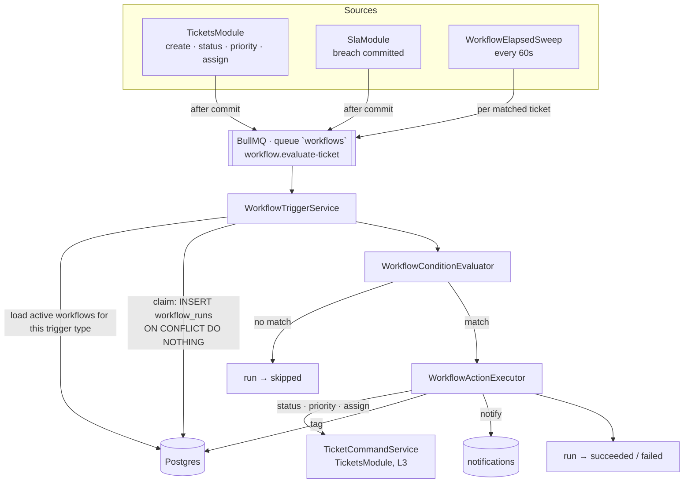

# Workflow automation: triggers, conditions and actions (TAR-392)

Status: proposed · Builds on [0002 — architecture and API contract](./0002-architecture-and-api-contract.md),
[0004 — RBAC permission matrix](./0004-rbac-permission-matrix.md),
[0006 — SLA timers and supervisor alerts](./0006-sla-timers-and-supervisor-alerts.md) and
[0007 — routing rules and the assignment-fallback seam](./0007-routing-rules-and-assignment-fallback.md) ·
Owns the design for TAR-27 · Consumed by TAR-394 (schema), TAR-395 (backend), TAR-396 (frontend),
TAR-393/TAR-398 (QA), TAR-399 (review), TAR-401 (documentation)

Reader: engineer. This is the contract those six issues build against.

## Context and Problem

TAR-27 asks for two things. A supervisor writes "if a ticket is unresolved for more than 4 hours,
escalate it to a supervisor and tag it `escalated`", and it happens without anybody watching. And a
workflow that names a team or a tag keeps naming the same team or tag after somebody renames it —
"no silent breakage" is the acceptance criterion's own phrase.

Four facts on `main` decide most of the shape.

1. **The tables exist and the grammar does not.** TAR-47 shipped `workflows` (`name`, `is_active`,
   `definition Json`, `version`) and `workflow_runs` (`status`, `trigger Json`, `context Json`,
   `error`), under a comment reading "TAR-27 owns the grammar". So this is a grammar to publish and
   a small delta to apply, not a model to invent.
2. **The mechanism for "a time became true" is already built, twice reviewed and twice corrected.**
   0006's SLA sweep is the closest working relative of TAR-27's headline example, and TAR-380 and
   TAR-381 are its two post-merge defects — a dropped trigger becoming a permanent false breach, and
   one tenant starving every other tenant's detection. Both are corrected in `SlaModule` today. A
   second sweep that repeats either of them would be a self-inflicted wound.
3. **The condition grammar has a precedent and an explicit hand-off.** 0007 shipped a flat AND-list
   over a closed set of four condition types, and rejected a nested boolean tree with the words
   "that is TAR-27's automation engine". It also dropped `assignment_rules.action` rather than leave
   a second action grammar lying around. Both are debts this document settles.
4. **`workflow:read` / `workflow:write` exist in `rbac.ts` and are granted to nobody but admin.**
   0004 made them admin-only with a stated reason: workflows "can send messages autonomously" and
   "a misconfigured workflow is a mass-messaging incident". TAR-27's user story opens "As a
   supervisor". Those two cannot both stand; see [security and access](#security-and-access).

The constraint that makes the rest non-trivial is that **a workflow is a standing instruction that
writes to tickets, and the thing that fires it is a clock.** Nothing calls us, at-least-once
delivery is the only delivery there is, and every mechanism below exists so that "escalate this
ticket" happens exactly once rather than every thirty seconds for ever.

## Goals / Non-Goals

**Goals**

- A trigger / condition / action grammar concrete enough that TAR-396 builds a form against it and
  TAR-394 writes a migration against it, covering exactly the actions TAR-27 commits to at launch.
- Exactly-once execution per workflow per triggering occurrence, across replicas, restarts and a
  Redis outage.
- Taxonomy references that survive a rename with no migration and fail **visibly** on a delete.
- A REST surface following 0002's conventions, adding one error code and no new permission name.
- A dry-run a supervisor can use before arming a rule that writes to real tickets.
- Shapes published now, so TAR-396 mocks and builds while TAR-394 and TAR-395 are still running.

**Non-Goals**

- Implementing any of it.
- The visual drag-and-drop canvas. TAR-27 puts it out of scope; the surface is a rule list, and
  every shape below is a flat list for that reason.
- Nested boolean condition trees (`{ all: [...], any: [{ not: ... }] }`). See decision 4.
- Any action that reaches a customer — sending a message or a template, starting a chatbot handover.
  Not in TAR-27's launch action set, and it is the action class 0004's admin-only gate was written
  about. The permission split in [security and access](#security-and-access) is what keeps adding
  one later a deliberate act rather than a widening nobody reviews.
- Scheduled workflows with no ticket ("every Monday, report X"). Every trigger here is about one
  ticket, which is what makes `workflow_runs` dedupable by ticket id.
- Cross-tenant or platform-level workflows.
- A workflow version history or a rollback UI. `workflows.version` is incremented on every write and
  stamped onto each run so a run can be read against the definition that produced it; nothing reads
  older definitions back, because nothing stores them.
- Tag CRUD as a feature. Two read/create endpoints are pre-empted from TAR-33 because the builder
  cannot work without them — see [risk 1](#open-questions-and-risks).

---

## Proposed Architecture

A new L4 `WorkflowsModule`, which 0002's ownership table already names ("Trigger/condition/action
automation", TAR-27). It is a new module rather than an extension of `SlaModule`, and it **imports
`TicketsModule`** — the two decisions the issue's first acceptance criterion asks for, argued in
decisions 1 and 5.

| Component                    | Responsibility                                                              |
| ---------------------------- | --------------------------------------------------------------------------- |
| `WorkflowService`            | CRUD, validation, reference indexing. The only writer of `workflows`        |
| `WorkflowCatalogService`     | Serves the trigger / operator / action vocabulary to the console            |
| `WorkflowTriggerService`     | Turns one triggering occurrence into candidate workflows and claims a run   |
| `WorkflowConditionEvaluator` | Pure evaluation of a condition set against a fact sheet. No database        |
| `WorkflowActionExecutor`     | Executes one action. The only component that writes outside this module     |
| `WorkflowElapsedSweep`       | Finds tickets that have met an elapsed trigger. The subject of decision 3   |
| `WorkflowQueueRunner`        | BullMQ registration — the only file in the module that knows a queue exists |
| `WorkflowsController`        | `/api/v1/workflows`, `/api/v1/workflow-catalog`                             |



### The execution model in one paragraph

A **triggering occurrence** — a ticket was created, a status moved, a sweep found a ticket four
hours old — becomes one `workflow.evaluate-ticket` job carrying `{ tenantId, ticketId, trigger,
occurrenceKey, depth }`. The handler loads the tenant's active workflows whose trigger type matches,
in `(position, id)` order. For each, it computes a **dedupe key** from the workflow and the
occurrence, claims a `workflow_runs` row with `INSERT … ON CONFLICT DO NOTHING RETURNING id`, and
proceeds only if the insert returned. It then reads one fact sheet for the ticket, evaluates that
workflow's conditions against it, and either records `skipped` or executes the action list in order,
recording the outcome of each. Nothing about this depends on the job being delivered once.

### Decision 1 — a new L4 module that imports `TicketsModule`, not an extension of `SlaModule`

**Trade-off axis: reusing a working sweep vs. two features sharing one failure domain.**

- **Chosen — a new `WorkflowsModule` (L4), importing `TicketsModule` (L3).** 0002's ownership table
  already reserves the name, and the two modules share a _shape_ (a periodic sweep, a per-ticket
  reconciler) rather than any data: `SlaModule` owns `sla_policies` and `sla_timers` and this owns
  `workflows` and `workflow_runs`, with no row read by both. Merging them would mean a tenant's
  malformed workflow can fail the job that also detects SLA breaches, and a supervisor reading
  "SLA sweep failed" would have to know it might mean something else entirely.

  What is genuinely reused is reused as **code, not as a module**: `isWithinBusinessHours`
  (0007, `packages/contracts/src/tenant.ts`) and `resolveAlertRecipients`
  (`apps/api/src/sla/sla-recipients.ts`) are both pure functions over rows the caller has already
  read. The second **moves** to `apps/api/src/people/supervisor-recipients.ts` under this story;
  see [the deltas outside this module](#the-deltas-outside-this-module).

- **Rejected — extend `SlaModule` with a workflow sweep.** One scheduler key, one failed set, one
  worker concurrency figure to tune, and the TAR-380/TAR-381 lessons are already applied there. It
  is the cheapest thing that could work. Rejected because SLA detection is the platform's
  contractual-obligation alarm and workflows are tenant-authored code: putting a tenant's
  `ticket_unresolved_for` sweep in the transaction budget that detects breaches means the loudest
  possible blast radius for the least trustworthy input.

- **Rejected — no sweep at all: express elapsed triggers as SLA policies and subscribe to
  `sla.breached`.** Genuinely elegant — `SlaModule` already knows how to notice that a ticket has
  been unanswered for N minutes, and reusing it would make TAR-27's headline example a workflow with
  an event trigger and no new timing machinery at all. Rejected on two counts. SLA policies are
  tenant-wide and priority-scoped with exactly two kinds (0006 decision 6), so "unresolved for 4h"
  and "unresolved for 24h" cannot both exist; and a supervisor editing the SLA window would silently
  re-time every workflow built on it, which is precisely the "silent breakage" TAR-27's second
  acceptance criterion is about. `ticket_sla_breached` survives as a trigger type, which is the part
  of the idea worth keeping.

**Why importing `TicketsModule` rather than 0007's `TenantPrisma`-only rule.** 0007 rule 5 forbids
`AssignmentModule` from importing any L3 module, and that was right there: it writes two assignment
columns under a compare-and-set it owns. This module writes ticket **status** and **priority**, and
those writes carry `TICKET_STATUS_TRANSITIONS`, `resolved_at`/`closed_at` stamping, the
`status_changed` ticket event, the `sla.evaluate-ticket` enqueue that pauses or stops a timer, and
the realtime announcement — five behaviours living in `TicketCommandService` today. A second
implementation of them inside `WorkflowsModule` would drift, and the first symptom would be a
workflow closing a ticket whose SLA timer never stopped. L4 importing L3 is what 0002's layering
rule explicitly permits and what 0006 already does.

**The one thing that requires of `TicketsModule`** is a system-actor entry point; see
[the deltas outside this module](#the-deltas-outside-this-module).

### Decision 2 — one durable job, and the run row is the idempotency mechanism

**Trade-off axis: where "has this already fired?" is answered.**

Every trigger — event or elapsed — enqueues the same job onto a new `workflows` queue:

```
WORKFLOWS_QUEUE = 'workflows'
WORKFLOW_EVALUATE_TICKET_JOB = 'workflow.evaluate-ticket'
```

BullMQ on 0002's rule ("anything that must survive a restart"), enqueued after the transaction that
caused it commits, exactly as 0003 and 0007 do. A workflow that does not run is an escalation that
did not happen, which is the same durability class as an unrouted ticket.

**Chosen — the claim is `INSERT INTO workflow_runs … ON CONFLICT DO NOTHING RETURNING id`, against
`UNIQUE (tenant_id, workflow_id, dedupe_key)`.** The row that records what happened is the same row
that reserves the right to make it happen. One statement, one round trip, correct across replicas by
construction.

```sql
INSERT INTO workflow_runs (id, tenant_id, workflow_id, workflow_version, ticket_id,
                           dedupe_key, status, trigger, created_at)
VALUES ($1, $2, $3, $4, $5, $6, 'running', $7::jsonb, now())
ON CONFLICT (tenant_id, workflow_id, dedupe_key) DO NOTHING
RETURNING id;
```

No row returned means another replica, another sweep tick, or an earlier delivery of this job
already owns this occurrence. The handler moves to the next workflow and logs nothing — a duplicate
delivery is the normal case, not an incident.

**The dedupe key is where the product decision lives**, and it is per trigger type:

| Trigger                 | `dedupeKey`                               | Meaning                                                    |
| ----------------------- | ----------------------------------------- | ---------------------------------------------------------- |
| `ticket_created`        | `ticket:{ticketId}`                       | Once per ticket, ever                                      |
| `ticket_status_changed` | `ticket:{ticketId}:event:{ticketEventId}` | Once per recorded status change                            |
| `ticket_assigned`       | `ticket:{ticketId}:event:{ticketEventId}` | Once per recorded assignment                               |
| `ticket_sla_breached`   | `ticket:{ticketId}:timer:{slaTimerId}`    | Once per breached timer                                    |
| `ticket_unresolved_for` | `ticket:{ticketId}`                       | **Once per ticket, ever** — the escalation does not repeat |

The last row is the one to read twice. A sweep that re-evaluates the same overdue ticket every
minute would notify a supervisor every minute; the constraint is what stops it, and it stops it
whether or not the sweep is correct. An event-driven key is scoped to the `ticket_events` row that
records the change, so the id already exists, is already unique per tenant, and is already the audit
record of the thing that fired — no new identifier, and a run can be joined back to what caused it.

**Three layers, one of which is load-bearing** — the same arrangement as 0006 decision 3:

| Layer                                             | Covers                                                  |
| ------------------------------------------------- | ------------------------------------------------------- |
| `UNIQUE (tenant_id, workflow_id, dedupe_key)`     | Two replicas, a retry, a redelivery. **The mechanism**  |
| The claim's own `status = 'running'` transition   | A second worker reading a row mid-flight                |
| BullMQ `jobId` (`workflow-evaluate-{t}-{ticket}`) | Collapses a duplicate enqueue while the first is queued |

Only the first is load-bearing, and this is stated because 0006 amendment 2 is the story of a guard
that was assumed sufficient and was not. Here the guard is a unique index over a row that is
inserted, never re-derived, so nothing else has to keep it true. Hyphens in the job id, never a
colon — TAR-249, and 0007 rule 6 records what that cost.

- **Rejected — a `last_fired_at` column on `workflows`.** One column, no join, and it reads like
  what a rate limiter would do. Rejected because it is per workflow rather than per ticket: two
  tickets breaching in the same minute would give one escalation, and which one is a race.

- **Rejected — read `workflow_runs`, decide in TypeScript, then insert.** The window between the
  read and the insert is exactly the window two sweep ticks race in, and the bug it produces — a
  duplicate escalation — is the one TAR-393 is chartered to catch.

**Failure is recorded, not retried, once the run is claimed.** A claimed run that throws is written
`failed` with a typed reason and the job **succeeds**. Retrying would re-enter a claim that now
conflicts, so the retry could only ever no-op; and a tenant's malformed workflow must not fill the
failed set that is monitored for infrastructure faults. The two exceptions that still throw and let
BullMQ retry are the ones that are not about the workflow at all: a database error before the claim,
and a malformed payload (`UnrecoverableError`, as everywhere else).

### Decision 3 — elapsed triggers are a bounded per-tenant sweep, fair by construction on day one

**Trade-off axis: detection precision vs. the durability of the deadline** — 0006 decision 1's axis,
with its two amendments already known.

**Chosen — one repeatable BullMQ job every `WORKFLOW_SWEEP_INTERVAL_MS` (default 60 000), installed
with `QueueService.schedule` under the key `workflow-sweep`.** Each run asks, per active tenant, per
active workflow carrying a `ticket_unresolved_for` trigger, which tickets have crossed the threshold
and have no run yet:

```sql
-- Phase 1. SystemPrisma, read-only, two columns. The same narrow exception 0006 documents,
-- and the LATERAL fairness cap TAR-381 had to add later.
SELECT d.tenant_id, d.id
FROM tenants n
CROSS JOIN LATERAL (
  SELECT t.tenant_id, t.id, t.created_at
  FROM tickets t
  WHERE t.tenant_id = n.id
    AND t.status IN ('open', 'pending')
    AND t.created_at <= now() - make_interval(mins => $1)
  ORDER BY t.created_at
  LIMIT 50                       -- WORKFLOW_SWEEP_TENANT_BATCH
) d
WHERE n.status = 'active'
ORDER BY d.created_at
LIMIT 200;                       -- WORKFLOW_SWEEP_BATCH
```

Phase 1 returns `(tenant_id, ticket_id)` pairs and nothing else — no subject, no contact, nothing
that is a tenant's data and nothing that reaches a caller. That is the same shape of justified
`SystemPrisma` hole 0006 decision 2 argues for, and `docs/reference/tenancy.md` gains a seventh row
when TAR-395 lands.

Phase 2 enqueues one `workflow.evaluate-ticket` job per pair, under that tenant, and does nothing
else. **The sweep writes nothing.** It is a discovery pass whose entire output is jobs, so the
per-tenant transaction that TAR-381 had to learn to chunk does not exist here: there is no
transaction to overrun and no partial progress to lose. The claim in decision 2 is what makes
enqueueing a ticket that already fired harmless.

Four properties carried over deliberately from 0006, so they are not rediscovered:

1. **The threshold lives in Postgres, and Redis is treated as losable.** `created_at <= now() - …`
   is re-asked from scratch every tick, so an outage of any length costs lateness and never a
   missed escalation. A delayed job per ticket per workflow would be a deadline stored in Redis.
2. **Fairness is structural from the first commit.** At 50 against a batch of 200, at least four
   tenants are served by every sweep whatever any one of them is doing. TAR-381 is what happens when
   this is added afterwards.
3. **Only active tenants are probed** (`n.status = 'active'`), so a deactivated tenant's backlog can
   never own the batch — the specific case 0006 decision 2 closed by hand.
4. **Every comparison is Postgres `now()`, never a node clock.**

`$1` is the smallest `minutes` across the tenant's elapsed-trigger workflows, so one probe per tenant
serves all of them and the per-workflow threshold is re-checked in the handler against the fact
sheet. A ticket that is old enough for the 4-hour workflow but not the 24-hour one is enqueued once
and skipped by the second workflow's own condition — which costs one job and keeps phase 1 to a
single query.

Cost, stated plainly: detection latency is bounded by the interval plus queue wait — 60 s against a
4-hour threshold is 0.4% of it. The query runs whether or not anything is due, at one bounded index
probe per active tenant on `tickets (tenant_id, status, created_at)`.

**Its breaking point, and the signal.** Sweep cost grows with the number of _active tenants_, not
with the number of tickets due. It stops being free when a full batch (200) comes back on
consecutive sweeps — raise `WORKFLOW_SWEEP_TENANT_BATCH` and `WORKFLOW_SWEEP_BATCH` together first,
because per 0006 amendment 1 raising only the batch makes a starving tenant wait longer rather than
less. TAR-395 logs batch size and elapsed time on every run that finds work, so the signal exists
without extra instrumentation. Do not pre-build the next step.

- **Rejected — a delayed BullMQ job per (ticket, workflow) fired at the threshold.** Precise to the
  second, no polling. Rejected on 0006 decision 1's first two reasons, and one more of its own: the
  threshold moves whenever a supervisor edits the workflow, so every edit would be a
  cancel-and-reschedule across every open ticket in the tenant, and a job that escapes cancellation
  escalates a ticket against a rule that no longer exists.

- **Rejected — reuse `sla_timers` by creating a timer per workflow per ticket.** The table is right
  there and the sweep is already written. Rejected because `sla_timers` is
  `UNIQUE (tenant_id, ticket_id, kind)` over two kinds, and widening it to carry workflow rows would
  put tenant-authored automation inside the query that detects contractual breaches — decision 1's
  blast-radius argument, arriving through the data model instead.

### Decision 4 — a workflow is one rule; the tenant's workflows are the ordered list

TAR-392's acceptance criteria ask for a DTO for "an ordered rule list: trigger + condition set +
action set". Two readings are available, and picking silently would cost TAR-394 and TAR-396 a
rewrite.

**Chosen — one workflow carries exactly one trigger, one condition set and one action list.
`workflows` gains a `position`, and the tenant's workflows _are_ the ordered rule list the console
renders.** This is the shape of `assignment_rules` and therefore the shape TAR-396's list already
knows how to build, it matches TAR-27's "rule-list builder, no canvas" scope, and it makes the name
and the enable switch belong to the thing a supervisor reasons about ("my escalation rule"), rather
than to a container of rules that share nothing.

- **Rejected — a workflow contains an ordered array of rules, each with its own trigger.** Strictly
  more expressive, and it is what the acceptance criterion's phrasing most literally describes.
  Rejected because a per-rule trigger inside a shared container gives two levels of ordering with no
  product meaning attached to the outer one, and because the enable switch, the name and the run
  history then have no natural owner — a "workflow" that fired would have to say which of its rules
  did, which is what `workflow_runs.workflow_id` already answers when a workflow is a rule.

**Every matching workflow runs. This is not first-match-wins**, and it is the one place this design
deliberately diverges from 0007. Routing picks one destination, so a first match is the answer;
automations compose — "tag it" and "notify a supervisor" are two workflows a supervisor wrote to
both happen. `position` therefore orders **execution**, not selection, and exists so that two
workflows setting priority on the same ticket resolve the same way every time. Ties break on `id`,
which is creation order, on 0007 decision 2's reasoning and served by the same index shape.

**Conditions inside a workflow combine with AND. There is no OR and no nesting.** 0007 rejected a
nested tree with "that is TAR-27's automation engine", and TAR-27 declines it: the acceptance
criteria are satisfied by AND, a supervisor wanting OR writes two workflows, and a tree the rule-list
UI cannot render is a grammar the API validates for ever without a caller. Recorded as
[risk 4](#open-questions-and-risks) rather than pretended away — this is the second document to
defer it, and the third should build it instead.

**An empty condition set is allowed, and 0007's opposite rule is not a contradiction.** A routing
rule with no conditions matches every ticket and, placed anywhere but last, silently swallows all
routing — so 0007 refuses it. A workflow with no conditions means "every time this trigger fires, do
this", which is a legitimate and common automation ("every ticket created gets tagged `new`") and
cannot swallow anything, because every other workflow still runs.

### Decision 5 — ticket-writing actions go through `TicketCommandService`; everything else is local

Actions execute **sequentially, in the declared order, each in its own transaction**, and the run row
records the outcome of each one.

| Action           | Executed by                                            | Writes                                          |
| ---------------- | ------------------------------------------------------ | ----------------------------------------------- |
| `set_status`     | `TicketCommandService.applyAutomation` (TicketsModule) | `tickets`, `ticket_events`, SLA enqueue, socket |
| `set_priority`   | `TicketCommandService.applyAutomation`                 | `tickets`, `ticket_events`, socket              |
| `reassign`       | `TicketCommandService.applyAutomation`                 | `tickets`, `ticket_events`, socket              |
| `add_ticket_tag` | `WorkflowActionExecutor`, `TenantPrisma`               | `ticket_tags`                                   |
| `notify`         | `WorkflowActionExecutor`, `TenantPrisma`               | `notifications`, socket                         |

**Trade-off axis: an all-or-nothing action list vs. a partial result a supervisor can read.**

- **Chosen — sequential, independent, and a failure stops the remaining actions.** The run is
  written `failed` with the index and reason of the action that failed, and the actions that already
  succeeded stay done. Two reasons. `TicketCommandService` owns its own transactions and emits after
  commit, so wrapping the list in one outer transaction would mean either rewriting it for
  workflows or emitting sockets for writes that later roll back. And a partial result is the honest
  one: if the ticket was tagged and the notification failed, "tagged, notification failed" is what
  happened, and a run row that claimed nothing happened would be a lie a supervisor debugs against.

  **Stopping rather than continuing** is the conservative half: actions in a list are usually
  ordered because the later ones assume the earlier ones ("reassign to the escalation team, then
  notify that team"), and running the notify after the reassign failed tells somebody about work
  they did not receive.

- **Rejected — one transaction for the whole action list, all or nothing.** Cleanest to reason
  about, and it makes a retry safe by construction. Rejected on the two reasons above, and because
  `notify` writes a row whose entire purpose is to survive independently of what caused it.

**The system actor.** `TicketCommandService` today is written for a principal: it enforces
`TICKET_STATUS_TRANSITIONS`, refuses a close without `ticket:close`, and reads the caller for
`ticket_events.actor_user_id`. `applyAutomation` is a second entry point onto the **same write
path** with the principal replaced by a workflow:

- `ticket_events.actor_user_id` is `null` — the column is already documented as null for the system,
  and `data` carries `{ workflowId, workflowRunId }`.
- **`TICKET_STATUS_TRANSITIONS` still applies.** A workflow may not reopen a `closed` ticket, for
  the reason the table's own docblock gives: `tickets_one_active_per_contact` is a partial unique
  index, and re-activating a resolved ticket for a contact who now holds another one raises a
  constraint violation. A workflow attempting it records `transition_refused` and does not throw.
- **No permission check.** A workflow has no principal; the permission that mattered was checked when
  a supervisor with `workflow:write` armed it.

`TicketCommandService.assign`'s existing "last writer wins" and its routing-column handling are
inherited unchanged — a workflow reassigning a ticket is the same write a supervisor makes.

### Decision 6 — taxonomy references: ids in the definition, names resolved at read, deletes refused by the database

TAR-27's second acceptance criterion, and TAR-392's longest bullet. Three separate mechanisms,
because a rename, a delete and a broken run are three different failures.

**1. The definition stores ids and only ids.** `{ type: 'add_ticket_tag', tagId: '019f…' }`, never
`{ tagName: 'escalated' }`. Ids are validated in tenant scope on write and re-read at evaluation
time. A rename therefore requires **nothing at all** — no migration, no backfill, no cache bust —
which is what "reflects the current values" means when it is designed rather than patched.

**2. Names reach the console resolved at read time, never stored.** `WorkflowResponse` carries the
raw `definition` (ids) plus a `references` array built by joining live rows:

```ts
{ kind: 'tag', id: '019f…', name: 'escalated', exists: true }
{ kind: 'team', id: '019f…', name: null,       exists: false }
```

`exists: false` is what makes breakage **visible** rather than silent: TAR-396 renders a broken
reference in the rule list without a second request, and the same array is what a supervisor sees
after somebody removed the user their workflow reassigned to. A response that embedded a stored name
would show the old one and look healthy.

**3. A referenced tag or team cannot be deleted, and the database is what refuses.** A new
`workflow_references` table carries one row per (workflow, referenced entity) with real composite
foreign keys, maintained inside the same transaction as every workflow write:

| Reference | On delete of the referenced row            | Why                                                                                      |
| --------- | ------------------------------------------ | ---------------------------------------------------------------------------------------- |
| `tag`     | **Refused** (`RESTRICT`)                   | Deleting a tag is a rare settings action; "3 workflows use this tag" is a fixable answer |
| `team`    | **Refused** (`RESTRICT`)                   | Same, and no team-delete path exists today — this specifies the one TAR-22 later adds    |
| `user`    | **Permitted**; the workflow is deactivated | Removal is a security action and must always succeed                                     |

**The FK is why this respects the layering rule.** "Block the delete" cannot be a call from
`ContactsModule` (L3) into `WorkflowsModule` (L4) — that is an upward import 0002 forbids. A foreign
key is enforced by Postgres and depends on no module knowing about any other. `ContactsModule`
translates the violation to `conflict` and names the workflows; the reverse index makes that lookup
one indexed read rather than a scan of every `definition` JSONB in the tenant.

**The user case mirrors what `users.service.ts` already does for `assignment_rules`**, and for the
same stated reason — "a supervisor should find the rule needing a new target, not find it silently
gone". Inside the removal transaction: deactivate every workflow referencing that user
(`is_active = false`, `broken_reason = 'reference_removed'`) and delete its reference rows. The
dangling id stays in the `definition`, so `references` reports `exists: false` and the console shows
exactly which field needs a new value. A workflow with a `broken_reason` cannot be re-enabled until
every reference resolves — `validation_failed`, naming the field, which is 0007's
"name the target, then enable" applied to a second surface.

**4. A reference that goes missing at evaluation time fails the run once, loudly.** Belt and braces
for the paths no foreign key covers — a user removed between the claim and the action, a tag deleted
by a raw statement. The action records `reference_missing`, the run is `failed`, the workflow is
**auto-deactivated** with `broken_reason = 'reference_missing'`, and a `workflow.broken` notification
goes to the tenant's admins. Deactivating rather than skipping is the whole point: a workflow that
fails silently on every ticket for a week is worse than one that stops and says so.

- **Rejected — soft-invalidate everything; never refuse a delete.** Fewer moving parts, no reverse
  index, and no other module ever sees a foreign-key error. Rejected because it turns every
  taxonomy edit into a silent trap: a supervisor deletes a tag, nothing complains, and the
  escalation workflow stops working at 02:00 on a Sunday. TAR-27's acceptance criterion asks for the
  opposite outcome by name.

- **Rejected — scan `definition` JSONB with a GIN index instead of a reference table.** No second
  table to keep in step. Rejected because it gives no foreign key, so refusing the delete would be
  back to a cross-module call, and because "which workflows reference this tag" against a JSONB
  containment operator is a query whose plan depends on a grammar this document expects to grow.

### Decision 7 — `sla_alerts` becomes `notifications`; the `notify` action is its second type

**Trade-off axis: not touching a shipped story vs. two notification inboxes.**

0006 decision 5 rejected building a generic notifications table and said, in as many words, what
should happen when this moment arrived: "when the second notification type arrives, generalising it
is a rename and a `type` column". This is that moment, and the alternative is a
`workflow_notifications` table with the same five meaningful columns, a second unread count, a
second acknowledge endpoint and a supervisor who has to look in two places.

**Chosen — rename `sla_alerts` to `notifications`, add `type` and `data`, make the SLA-specific
columns nullable behind a CHECK.** One reversible migration, no data migration (`type` defaults to
`'sla_breach'` for every existing row), and `GET /api/v1/sla-alerts` keeps its path, its response
shape and its behaviour as a documented `type = 'sla_breach'` view over the same table. The frontend
is untouched.

- **Rejected — a separate `workflow_notifications` table.** Zero risk to a `done` story, and it
  keeps this story's critical path shorter — which is a real cost, since it lands on TAR-394 and
  TAR-395. Rejected because two identical tables three weeks apart is exactly the duplication an
  architecture document exists to prevent, and because the generalisation was pre-authorised in
  writing by the document that shipped the first one. Sized honestly in
  [implementation phases](#implementation-phases): it is one migration and one mapper.

---

## Technology Choices

Everything in ADR 0001, 0002, 0006 and 0007 is inherited unchanged. Only what this document adds:

| Concern              | Choice                                                   | Alternatives considered                                          | Rationale                                                          |
| -------------------- | -------------------------------------------------------- | ---------------------------------------------------------------- | ------------------------------------------------------------------ |
| Module placement     | New L4 `WorkflowsModule`, imports `TicketsModule`        | Extend `SlaModule`; L4 with `TenantPrisma` only, per 0007        | Isolated failure domain; one implementation of the ticket write    |
| Elapsed detection    | Repeatable sweep, 60 s, per-tenant `LATERAL` cap         | Delayed job per ticket; rows in `sla_timers`; SLA policies       | Threshold in Postgres; fair on day one, not after an incident      |
| Exactly-once         | `UNIQUE (tenant_id, workflow_id, dedupe_key)` on the run | `last_fired_at` column; read-check-write                         | The record and the reservation are one row                         |
| Definition storage   | `definition JSONB` + `workflow_references` side table    | Normalised trigger/condition/action tables; JSONB alone with GIN | Grammar changes without a migration; deletes refused by an FK      |
| Rename safety        | Ids in the definition, names joined at read              | Denormalised names with a rename fan-out                         | Nothing to keep in step, so nothing can fall out of step           |
| Delete safety        | FK `RESTRICT` for tag/team; deactivate for user          | Cross-module permission call; soft-invalidate everything         | Postgres enforces it without an upward import                      |
| Ticket status writes | `TicketCommandService.applyAutomation`                   | Direct `TenantPrisma` writes, as 0007 does for assignment        | Transitions, timestamps, events, SLA and sockets stay in one place |
| Notification storage | Generalise `sla_alerts` → `notifications`                | A second `workflow_notifications` table                          | 0006 pre-authorised it; one inbox, one unread count                |
| Tag target           | New `ticket_tags`, reusing the `tags` taxonomy           | Write `contact_tags`; a `target` discriminator on the action     | The tag names the incident; segmentation stays the CRM's           |
| Loop protection      | `depth` on the trigger payload + a per-ticket run budget | Refusing every workflow-caused trigger; no protection            | Legitimate chains survive; runaway ones stop at a stated bound     |

---

## Data Model

`apps/api/prisma/schema.prisma` stays the source of truth; this is the delta TAR-394 applies.
Everything below is tenant-scoped and RLS-protected, per 0002's rule 2, with the standard
`tenant_isolation` policy and `ENABLE`/`FORCE ROW LEVEL SECURITY`.

### `workflows` — extended

| Change                                                                                           | Why                                                                                                                                                    |
| ------------------------------------------------------------------------------------------------ | ------------------------------------------------------------------------------------------------------------------------------------------------------ |
| `name` becomes `@db.Citext`                                                                      | `teams.name` and `assignment_rules.name` already are (0007 delta 1); the existing `UNIQUE (tenant_id, name)` should mean what a reader thinks it means |
| `+ position Int @default(0)`                                                                     | Decision 4's execution order                                                                                                                           |
| `+ triggerType workflow_trigger_type` (generated/maintained, not derived at query time)          | The evaluation query filters on it; digging it out of JSONB on every trigger is a scan                                                                 |
| `+ brokenReason workflow_broken_reason?`                                                         | Non-null exactly when the workflow was auto-deactivated. What the console renders as a warning                                                         |
| `+ CHECK (NOT is_active OR broken_reason IS NULL)`                                               | A broken workflow cannot be active. The API's "fix the reference, then enable" made structural                                                         |
| Replace `@@index([tenantId, isActive])` with `([tenantId, isActive, triggerType, position, id])` | The evaluation read: active workflows for one trigger type, in order                                                                                   |

`definition Json` and `version Int` are unchanged and keep their meaning. `version` increments on
every write that changes the definition and is copied onto each run, so a run can be read against the
definition that produced it.

**`triggerType` is a column duplicating a JSONB field, and that is deliberate.** Every triggering
occurrence reads "the active workflows in this tenant whose trigger is X", which is the hottest query
in the module. A JSONB extraction in the predicate cannot use a composite index with `position` on
it, and an expression index would be a second thing to keep in step with the grammar. TAR-395 writes
it in the same statement as `definition`; a mismatch is caught by the response schema in development
and test, which is where the repo puts this class of guard.

### `workflow_runs` — extended

| Change                                                | Why                                                                                  |
| ----------------------------------------------------- | ------------------------------------------------------------------------------------ |
| `+ ticketId` (uuid, FK `(tenant_id, id)` → `tickets`) | Every trigger is about a ticket. Cascade on ticket delete                            |
| `+ dedupeKey text NOT NULL`                           | Decision 2                                                                           |
| `+ workflowVersion Int NOT NULL`                      | Which definition ran                                                                 |
| `+ results Json`                                      | Per-action outcome: `[{ index, type, outcome, reason }]`                             |
| `+ failureReason workflow_failure_reason?`            | Typed, because a supervisor filters on it and a free-text `error` cannot be filtered |
| `+ @@unique([tenantId, workflowId, dedupeKey])`       | **The idempotency mechanism.** Everything else in decision 2 is optimisation         |
| `+ @@index([tenantId, ticketId, createdAt(Desc)])`    | "What automation touched this ticket" — the first question a supervisor asks         |

`error String?` stays for the human-readable detail behind `failureReason`. `status` gains `skipped`
to `WorkflowRunStatus` — a workflow whose conditions did not match ran and matched nothing, which is
not `failed` and is the answer to "why didn't my rule fire". **The enum value lands in its own
migration file**: Postgres refuses to use a label in the transaction that added it and Prisma runs
one migration per transaction — the lesson `sla_timer_state.paused` already carries.

### `workflow_references` — new

The reverse index of decision 6. One row per referenced entity per workflow, rewritten inside the
same transaction as every workflow write.

- **Tenant-scoped:** yes, RLS policy identical to every other table.
- **Model:** `WorkflowReference`
- **Unique:** `(tenant_id, workflow_id, tag_id, team_id, user_id)` — a workflow referencing the same
  tag from two actions stores one row
- **Index:** `(tenant_id, tag_id)`, `(tenant_id, team_id)`, `(tenant_id, user_id)` — the "which
  workflows use this?" lookup each delete path makes
- **CHECK:** `num_nonnulls(tag_id, team_id, user_id) = 1`

| Column        | FK                          | On delete                                      |
| ------------- | --------------------------- | ---------------------------------------------- |
| `tag_id`      | `tags (tenant_id, id)`      | `RESTRICT` — the delete is refused             |
| `team_id`     | `teams (tenant_id, id)`     | `RESTRICT` — the delete is refused             |
| `user_id`     | `users (tenant_id, id)`     | `NoAction`, cleared by the removal transaction |
| `workflow_id` | `workflows (tenant_id, id)` | `Cascade`                                      |

`NoAction` on `user_id` matches every other user reference in this schema, and the cleanup is what
makes it safe: `users.service.ts` deletes these rows in the same transaction it already uses to
clear `assignment_rules.target_user_id`.

### `ticket_tags` — new

`tags` today are contact tags: `contact_tags` links a tag to a contact, and TAR-33 owns the taxonomy.
TAR-27's example — "tag `escalated`" — is about the ticket.

- **Tenant-scoped:** yes.
- **Model:** `TicketTag`, mirroring `ContactTag` column for column
- **Unique:** `(tenant_id, ticket_id, tag_id)` — applying a tag twice is a no-op, not an error
- **Index:** `(tenant_id, tag_id)` — "every ticket with this tag", the filter that makes it useful
- **Relations:** `ticket` (cascade), `tag` (cascade), `tenant` (cascade)

**Why a new join table rather than tagging the contact.** Tagging the contact needs no migration at
all and reuses 0007's `tag` condition, which is a real argument. It loses because `escalated` is a
fact about one incident and a contact tag is a permanent property of a customer: a workflow writing
into the taxonomy TAR-33's segmentation reads would corrupt segments silently and irreversibly, and
"why is this customer tagged escalated eight months later" is a support conversation nobody can
answer. A `contact` variant of the action stays additive — a `target` discriminator on
`AddTagActionSchema`, no migration.

**`TicketResponse` gains `tags: Tag[]`.** Additive, and the console needs it to show what a workflow
did. Mapped from `ticket_tags`, and the existing ticket queries take one batched join.

### `notifications` — the `sla_alerts` generalisation

| Change                                                                                                              | Why                                                                                                                                |
| ------------------------------------------------------------------------------------------------------------------- | ---------------------------------------------------------------------------------------------------------------------------------- |
| `ALTER TABLE sla_alerts RENAME TO notifications` (+ index/constraint renames)                                       | 0006 decision 5's stated plan                                                                                                      |
| `+ type notification_type NOT NULL DEFAULT 'sla_breach'`                                                            | `['sla_breach', 'workflow_notify', 'workflow_broken']`                                                                             |
| `sla_timer_id`, `kind`, `due_at` become nullable                                                                    | They are `sla_breach` fields                                                                                                       |
| `+ CHECK ((type = 'sla_breach') = (sla_timer_id IS NOT NULL))`                                                      | The nullability above, made an invariant rather than a convention                                                                  |
| `+ data Json?`                                                                                                      | Type-specific payload: `{ workflowId, workflowRunId }` for the workflow types                                                      |
| `+ dedupe_key text?`, `UNIQUE (tenant_id, recipient_user_id, dedupe_key)` (partial, `WHERE dedupe_key IS NOT NULL`) | The workflow types' second idempotency layer, mirroring the SLA unique                                                             |
| Existing `UNIQUE (tenant_id, sla_timer_id, recipient_user_id)` becomes partial, `WHERE sla_timer_id IS NOT NULL`    | Postgres does not collide NULLs, so this is belt-and-braces rather than required — stated so a reader does not have to work it out |

`DEFAULT 'sla_breach'` is what makes this a metadata-only migration: every existing row is already
that type. The default stays afterwards rather than being dropped, because a writer that forgets the
column should land on the type that has a NOT NULL `sla_timer_id` and fail the CHECK loudly.

**Reversible.** The `down` renames back, drops `type`, `data` and `dedupe_key`, and restores the two
NOT NULLs — which succeeds precisely as long as no `workflow_*` row exists, i.e. as long as the
rollback is a rollback of this release. TAR-394 states that condition in the migration.

### Limits, and why each one exists

Published as a constant so the API, the console and this document cannot drift:

```ts
// packages/contracts/src/workflows.ts
export const WORKFLOW_LIMITS = {
  /** Active and inactive together. The evaluator loads the matching active set whole. */
  workflowsPerTenant: 50,
  /** Conditions in one workflow, all of which must hold. */
  conditionsPerWorkflow: 10,
  /** Actions in one workflow, executed in order. */
  actionsPerWorkflow: 5,
  /** Values in one multi-value condition. */
  valuesPerCondition: 25,
  /** Workflows in one tenant carrying an elapsed trigger. Each one is sweep work. */
  elapsedTriggerWorkflowsPerTenant: 10,
  /** Runs one ticket may produce in one hour, across every workflow. Loop protection. */
  runsPerTicketPerHour: 20,
  /** How deep a chain of workflow-caused triggers may go. */
  maxChainDepth: 3,
  /** Runs older than this are swept. `workflow_runs` is a log, not a ledger. */
  runsRetentionDays: 90,
} as const;
```

None of these is a limit a real tenant meets. They exist because evaluation cost per triggering
occurrence is `workflows × conditions` and because `workflow_runs` grows with ticket volume rather
than with anything a supervisor can see. `elapsedTriggerWorkflowsPerTenant` is separate and lower
because each one is a threshold the sweep has to consider on every tick, unlike an event trigger
which costs nothing until it fires.

Exceeding `workflowsPerTenant` on create is `conflict`, not `plan_limit_exceeded`, on 0007's
reasoning: the cap is a property of the engine, not of the tenant's plan, and a 402 would send a
supervisor to the billing page to fix something money cannot.

**`runsRetentionDays` needs an owner and does not have one.** See
[risk 5](#open-questions-and-risks); 0006 risk 5 left the same question open for `sla_alerts` and it
is the same question.

### Access patterns this adds

| Query                                                                | Index used                                                     | Frequency                           |
| -------------------------------------------------------------------- | -------------------------------------------------------------- | ----------------------------------- |
| Active workflows for one trigger type, ordered                       | `workflows (tenant_id, is_active, trigger_type, position, id)` | Once per triggering occurrence      |
| Claim a run                                                          | `workflow_runs (tenant_id, workflow_id, dedupe_key)` unique    | Once per (workflow, occurrence)     |
| Elapsed sweep phase 1                                                | `tickets (tenant_id, status, created_at)`                      | Once per active tenant per 60 s     |
| "What automation touched this ticket"                                | `workflow_runs (tenant_id, ticket_id, created_at DESC)`        | Console, on demand                  |
| "Which workflows reference this tag / team / user"                   | `workflow_references (tenant_id, tag_id)` and siblings         | Once per taxonomy delete or removal |
| Fact sheet: ticket, its tags, its contact's tags, the tenant's hours | Primary keys and `contact_tags (tenant_id, tag_id)`            | Once per claimed run                |

The fact sheet is **read once per claimed run and lazily**: a workflow whose conditions are all
`ticket_status` reads the ticket row and nothing else. A run that is not claimed reads nothing at all,
which is what keeps a redelivered job cheap.

---

## Interfaces

Everything below lands in a new `packages/contracts/src/workflows.ts`, exported from the package
index under a new "Automation" heading. `packages/contracts` is the only thing both sides of every
seam here import.

### The queue trigger

```ts
export const WORKFLOWS_QUEUE = 'workflows';
export const WORKFLOW_EVALUATE_TICKET_JOB = 'workflow.evaluate-ticket';
export const WORKFLOW_SWEEP_JOB = 'workflow.sweep';

export const WORKFLOW_TRIGGER_TYPES = [
  /** A ticket row was created — `TicketLinkerService`'s `created` path, or TAR-25's manual create. */
  'ticket_created',
  /** A `status_changed` ticket event was written, by an agent or by the system. */
  'ticket_status_changed',
  /** An `assigned` or `unassigned` ticket event was written. */
  'ticket_assigned',
  /** An SLA timer flipped to `breached` and its alerts committed (0006 decision 3). */
  'ticket_sla_breached',
  /** The ticket has been active for at least `minutes`. Detected by the sweep, decision 3. */
  'ticket_unresolved_for',
] as const;

export const WorkflowTriggerTypeSchema = z.enum(WORKFLOW_TRIGGER_TYPES);

export const WorkflowEvaluateTicketTriggerSchema = z.object({
  tenantId: IdSchema,
  ticketId: IdSchema,
  triggerType: WorkflowTriggerTypeSchema,
  /**
   * The `ticket_events` row, or the `sla_timers` row, that this occurrence is.
   * Null for `ticket_created` and `ticket_unresolved_for`, whose dedupe key is
   * the ticket itself.
   */
  occurrenceId: IdSchema.nullable(),
  /**
   * How many workflow runs deep this chain is. A trigger raised by a workflow
   * action carries its cause's depth plus one; anything else carries 0.
   * Above `WORKFLOW_LIMITS.maxChainDepth` the job is dropped with a warning.
   */
  depth: z
    .int()
    .min(0)
    .max(WORKFLOW_LIMITS.maxChainDepth + 1),
  /** The run whose action raised this, when one did. For the audit trail only. */
  causedByRunId: IdSchema.nullable(),
});

/** Hyphens, never a colon — BullMQ rejects a colon in a custom id (TAR-249). */
export function workflowEvaluateJobId(t: WorkflowEvaluateTicketTrigger): string;

/** The dedupe key of decision 2. Pure, so the sweep and the event paths cannot disagree. */
export function workflowDedupeKey(t: WorkflowEvaluateTicketTrigger): string;
```

**Six fields, and the payload is unauthenticated input.** The handler re-reads every id in tenant
scope, as 0003 rule 3 and 0007 rule 3 both require. `depth` and `causedByRunId` are the loop
protection of [failure modes](#failure-modes-and-operations); everything else is reachable from
`ticketId`.

### Triggers, conditions and actions

```ts
// --- Trigger ---------------------------------------------------------------

export const ElapsedTriggerSchema = z.object({
  type: z.literal('ticket_unresolved_for'),
  /** 5 minutes to 30 days. Below the sweep interval is a promise we cannot keep. */
  minutes: z.int().min(5).max(43_200),
});

const eventTrigger = <T extends string>(type: T) => z.object({ type: z.literal(type) });

export const WorkflowTriggerSchema = z.discriminatedUnion('type', [
  eventTrigger('ticket_created'),
  eventTrigger('ticket_status_changed'),
  eventTrigger('ticket_assigned'),
  eventTrigger('ticket_sla_breached'),
  ElapsedTriggerSchema,
]);

// --- Conditions ------------------------------------------------------------

export const WORKFLOW_SET_OPERATORS = ['in', 'not_in'] as const;
export const WORKFLOW_MATCH_OPERATORS = ['any', 'all', 'none'] as const;
export const WORKFLOW_NUMBER_OPERATORS = ['gte', 'lte'] as const;

export const TicketStatusConditionSchema = z.object({
  type: z.literal('ticket_status'),
  operator: z.enum(WORKFLOW_SET_OPERATORS),
  values: z.array(TicketStatusSchema).min(1).max(TICKET_STATUSES.length),
});

export const TicketPriorityConditionSchema = z.object({
  type: z.literal('ticket_priority'),
  operator: z.enum(WORKFLOW_SET_OPERATORS),
  values: z.array(TicketPrioritySchema).min(1).max(TICKET_PRIORITIES.length),
});

export const WORKFLOW_ASSIGNMENT_STATES = [
  'unassigned',
  'assigned_to_user',
  'assigned_to_team',
] as const;

export const TicketAssignmentConditionSchema = z
  .object({
    type: z.literal('ticket_assignment'),
    state: z.enum(WORKFLOW_ASSIGNMENT_STATES),
    /** Narrows the state to one team. Null means "any team". */
    teamId: IdSchema.nullable().default(null),
    /** Narrows the state to one user. Null means "any user". */
    userId: IdSchema.nullable().default(null),
  })
  .refine((c) => !(c.state === 'unassigned' && (c.teamId !== null || c.userId !== null)), {
    message: '`unassigned` takes no teamId or userId',
  })
  .refine((c) => !(c.state === 'assigned_to_user' && c.teamId !== null), {/* … */})
  .refine((c) => !(c.state === 'assigned_to_team' && c.userId !== null), {/* … */});

/** Tags on the ticket (`ticket_tags`). */
export const TicketTagConditionSchema = z.object({
  type: z.literal('ticket_tag'),
  match: z.enum(WORKFLOW_MATCH_OPERATORS),
  tagIds: z.array(IdSchema).min(1).max(WORKFLOW_LIMITS.valuesPerCondition),
});

/** Tags on the ticket's contact (`contact_tags`) — the same data 0007's `tag` condition reads. */
export const ContactTagConditionSchema = z.object({
  type: z.literal('contact_tag'),
  match: z.enum(WORKFLOW_MATCH_OPERATORS),
  tagIds: z.array(IdSchema).min(1).max(WORKFLOW_LIMITS.valuesPerCondition),
});

/** Minutes since `tickets.created_at`, against Postgres `now()`. */
export const TicketAgeConditionSchema = z.object({
  type: z.literal('ticket_age'),
  operator: z.enum(WORKFLOW_NUMBER_OPERATORS),
  minutes: z.int().min(1).max(43_200),
});

/** `isWithinBusinessHours` from 0007, unchanged. Same fail-false rule when unconfigured. */
export const BusinessHoursConditionSchema = z.object({
  type: z.literal('business_hours'),
  within: z.boolean(),
});

export const WorkflowConditionSchema = z.discriminatedUnion('type', [
  TicketStatusConditionSchema,
  TicketPriorityConditionSchema,
  TicketAssignmentConditionSchema,
  TicketTagConditionSchema,
  ContactTagConditionSchema,
  TicketAgeConditionSchema,
  BusinessHoursConditionSchema,
]);

// --- Actions ---------------------------------------------------------------

export const WORKFLOW_ACTION_TYPES = [
  'add_ticket_tag',
  'reassign',
  'notify',
  'set_status',
  'set_priority',
] as const;

export const AddTicketTagActionSchema = z.object({
  type: z.literal('add_ticket_tag'),
  /** Must name a `tags.id` in this tenant. A workflow never creates a tag. */
  tagId: IdSchema,
});

/** Exactly one target, on 0007's `RoutingTargetSchema` reasoning. */
export const WorkflowAssigneeSchema = z.discriminatedUnion('kind', [
  z.object({ kind: z.literal('team'), teamId: IdSchema }),
  z.object({ kind: z.literal('user'), userId: IdSchema }),
]);

export const ReassignActionSchema = z.object({
  type: z.literal('reassign'),
  target: WorkflowAssigneeSchema,
});

export const WORKFLOW_NOTIFY_AUDIENCES = [
  /** The ticket-holder's supervisors, resolved by `resolveAlertRecipients` (0006 decision 4). */
  'supervisors',
  'user',
  'team',
] as const;

export const NotifyActionSchema = z
  .object({
    type: z.literal('notify'),
    audience: z.enum(WORKFLOW_NOTIFY_AUDIENCES),
    /** Non-null exactly when `audience` is `user`. */
    userId: IdSchema.nullable().default(null),
    /** Non-null exactly when `audience` is `team`. Every active member is a recipient. */
    teamId: IdSchema.nullable().default(null),
    /** Shown verbatim to the recipient. No interpolation at v1 — see risk 6. */
    message: z.string().min(1).max(280).nullable().default(null),
  })
  .refine(/* audience ↔ userId/teamId exclusivity */);

export const SetStatusActionSchema = z.object({
  type: z.literal('set_status'),
  status: TicketStatusSchema,
});

export const SetPriorityActionSchema = z.object({
  type: z.literal('set_priority'),
  priority: TicketPrioritySchema,
});

export const WorkflowActionSchema = z.discriminatedUnion('type', [
  AddTicketTagActionSchema,
  ReassignActionSchema,
  NotifyActionSchema,
  SetStatusActionSchema,
  SetPriorityActionSchema,
]);
```

**Every condition that has no data to read is false. It never throws and never matches** — 0007's
rule, carried unchanged. A ticket with no contact makes `contact_tag` false; a tenant with no
business hours configured makes `business_hours` false whichever way `within` is set, so a workflow
does not fire on a tenant that never configured anything.

**`match: 'none'` exists here and does not in 0007.** A routing rule asking "does the contact NOT
have this tag" is expressible as a rule placed later in the list; a workflow list has no
first-match ordering to express it with, so the negation has to be in the grammar. It is the one
place this grammar is wider than 0007's, and it is that decision's cost.

### The workflow resource

```ts
export const WORKFLOW_BROKEN_REASONS = ['reference_removed', 'reference_missing'] as const;

export const WorkflowReferenceSchema = z.object({
  kind: z.enum(['tag', 'team', 'user']),
  id: IdSchema,
  /** Resolved live at read time. Null exactly when `exists` is false. */
  name: z.string().nullable(),
  /** False when the referenced row is gone. What TAR-396 renders as a broken rule. */
  exists: z.boolean(),
});

export const WorkflowResponseSchema = z.object({
  id: IdSchema,
  name: z.string().min(1).max(80),
  /** Ascending. Ties break on `id`, which is creation order. Execution order, not selection. */
  position: z.int().min(0),
  isActive: z.boolean(),
  /** Non-null exactly when the workflow was auto-deactivated. Blocks re-enabling. */
  brokenReason: z.enum(WORKFLOW_BROKEN_REASONS).nullable(),
  version: z.int().min(1),
  trigger: WorkflowTriggerSchema,
  conditions: z.array(WorkflowConditionSchema).max(WORKFLOW_LIMITS.conditionsPerWorkflow),
  actions: z.array(WorkflowActionSchema).min(1).max(WORKFLOW_LIMITS.actionsPerWorkflow),
  /** Every taxonomy id the definition names, resolved. Decision 6, mechanism 2. */
  references: z.array(WorkflowReferenceSchema),
  createdAt: TimestampSchema,
  updatedAt: TimestampSchema,
});

export const WorkflowCreateInputSchema = z.object({
  name: z.string().min(1).max(80),
  trigger: WorkflowTriggerSchema,
  /** Empty is legal and means "every time this trigger fires" — decision 4. */
  conditions: z
    .array(WorkflowConditionSchema)
    .max(WORKFLOW_LIMITS.conditionsPerWorkflow)
    .default([]),
  actions: z.array(WorkflowActionSchema).min(1).max(WORKFLOW_LIMITS.actionsPerWorkflow),
  /** Omitted, the workflow is appended last. */
  position: z.int().min(0).optional(),
  /** Default `false`, unlike an assignment rule: a rule that writes to tickets is armed on purpose. */
  isActive: z.boolean().default(false),
});

export const WorkflowUpdateInputSchema = WorkflowCreateInputSchema.partial();

export const WorkflowReorderInputSchema = z.object({
  /** The tenant's complete workflow set, in the order it should execute. */
  workflowIds: z.array(IdSchema).max(WORKFLOW_LIMITS.workflowsPerTenant),
});

/** Bounded by `workflowsPerTenant`, so `nextCursor` is fixed at null — 0007's deviation, same reason. */
export const WorkflowListResponseSchema = z.object({
  items: z.array(WorkflowResponseSchema),
  nextCursor: z.null(),
});
```

**`isActive` defaults to `false`, and `assignment_rules` defaults to `true`.** A routing rule that
does nothing until it matches costs a misrouted ticket; a workflow can close tickets and message
supervisors. Creating one and arming it are two acts, and the console's flow is create → dry-run →
enable.

### The run

```ts
export const WORKFLOW_RUN_STATUSES = [
  'pending',
  'running',
  'succeeded',
  'skipped',
  'failed',
] as const;

export const WORKFLOW_FAILURE_REASONS = [
  /** A tag, team or user the definition names no longer exists. Deactivates the workflow. */
  'reference_missing',
  /** `TICKET_STATUS_TRANSITIONS` refuses the move — e.g. reopening a closed ticket. */
  'transition_refused',
  /** The ticket was deleted, or is no longer visible, between the claim and the action. */
  'ticket_gone',
  /** The tenant hit `runsPerTicketPerHour`. Loop protection, not a fault. */
  'run_budget_exceeded',
  /** Everything else. `workflow_runs.error` carries the detail; the log line carries the stack. */
  'internal_error',
] as const;

export const WORKFLOW_ACTION_OUTCOMES = ['applied', 'no_op', 'failed', 'skipped'] as const;

export const WorkflowActionResultSchema = z.object({
  /** Index into the definition's `actions`, so a result maps back to what a supervisor wrote. */
  index: z.int().min(0),
  type: z.enum(WORKFLOW_ACTION_TYPES),
  outcome: z.enum(WORKFLOW_ACTION_OUTCOMES),
  /** A `WorkflowFailureReason` on `failed`; null otherwise. */
  reason: z.string().nullable(),
});

export const WorkflowRunResponseSchema = z.object({
  id: IdSchema,
  workflowId: IdSchema,
  workflowVersion: z.int().min(1),
  ticketId: IdSchema,
  ticketNumber: z.int().positive(),
  status: z.enum(WORKFLOW_RUN_STATUSES),
  triggerType: WorkflowTriggerTypeSchema,
  /** Empty on `skipped` — nothing was attempted. */
  results: z.array(WorkflowActionResultSchema),
  failureReason: z.enum(WORKFLOW_FAILURE_REASONS).nullable(),
  startedAt: TimestampSchema.nullable(),
  finishedAt: TimestampSchema.nullable(),
  createdAt: TimestampSchema,
});
```

`no_op` is not `applied`: setting a status the ticket already holds, or adding a tag it already
carries, changed nothing. `TicketCommandService.update` already treats that as a no-op rather than a
conflict, and the run should say so — "it ran and changed nothing" is the answer to half the
questions a supervisor brings.

### The catalog

```ts
export const WorkflowCatalogResponseSchema = z.object({
  triggers: z.array(
    z.object({
      type: WorkflowTriggerTypeSchema,
      /** Parameters this trigger takes, if any: `[{ name: 'minutes', kind: 'int', min: 5, max: 43200 }]` */
      parameters: z.array(WorkflowParameterSchema),
      /** Condition types that make sense against this trigger. All of them, at v1. */
      conditionTypes: z.array(WorkflowConditionTypeSchema),
    }),
  ),
  conditions: z.array(
    z.object({
      type: WorkflowConditionTypeSchema,
      operators: z.array(z.string()),
      /** `taxonomy: 'tag'` tells the console which picker to render. Null for a literal enum. */
      taxonomy: z.enum(['tag', 'team', 'user']).nullable(),
      /** For enum-valued conditions: the exact values. Saves the console a second contract import. */
      values: z.array(z.string()).nullable(),
    }),
  ),
  actions: z.array(
    z.object({
      type: z.enum(WORKFLOW_ACTION_TYPES),
      parameters: z.array(WorkflowParameterSchema),
    }),
  ),
  limits: z.object({/* WORKFLOW_LIMITS, verbatim */}),
});
```

**One endpoint rather than three.** TAR-392's acceptance criteria list three listings — trigger
types, condition operators, action types. A form that renders the builder needs all three before it
can render anything, so three endpoints would be three round trips that always happen together and
can disagree with each other across a deploy.

**And it is an endpoint at all even though the values are compile-time constants**, which the console
could import from `@whatsappcrm/contracts` directly. The endpoint is the one that is right when the
console is a version behind: it answers with the vocabulary the **server** will accept, so a builder
cannot offer an action the API refuses. The constants stay exported for types; the catalog is what
the form's options come from.

### REST surface

An amendment to 0002's endpoint surface, following its conventions unchanged.

```
# Workflows                                                               TAR-27
# Grammar, evaluation model and taxonomy-sync design:
# docs/architecture/0009-workflow-triggers-conditions-actions.md
GET    /api/v1/workflows                    → WorkflowListResponse          workflow:read
POST   /api/v1/workflows                    → WorkflowResponse          201 workflow:write
GET    /api/v1/workflows/{id}               → WorkflowResponse              workflow:read
PATCH  /api/v1/workflows/{id}               → WorkflowResponse              workflow:write
DELETE /api/v1/workflows/{id}               → 204                           workflow:write
POST   /api/v1/workflows/reorder            → WorkflowListResponse          workflow:write
POST   /api/v1/workflows/{id}/test          → WorkflowTestResponse          workflow:write
GET    /api/v1/workflows/{id}/runs          → CursorPage<WorkflowRunResponse> workflow:read
GET    /api/v1/workflow-catalog             → WorkflowCatalogResponse       workflow:read

# Notifications — always scoped to the calling principal                  TAR-27
GET    /api/v1/notifications                → CursorPage<NotificationResponse>  ticket:read
POST   /api/v1/notifications/{id}/acknowledge → NotificationResponse            ticket:read
# GET /api/v1/sla-alerts and its acknowledge stay exactly as 0006 published them,
# as a `type = 'sla_breach'` view over the same table.

# Tags — pre-empted from TAR-33, see risk 1                               TAR-33
GET    /api/v1/tags                         → CursorPage<TagResponse>       contact:read
POST   /api/v1/tags                         → TagResponse               201 contact:write
```

**`GET /api/v1/workflows` does not paginate**, on 0007's argument: `workflowsPerTenant` is enforced
on create, the evaluator loads the matching set whole anyway, and a cap the server enforces is a
promise it can keep. The response keeps `CursorPage`'s shape with `nextCursor` fixed at `null`.
`GET /workflows/{id}/runs` **does** paginate — runs grow with ticket volume, and that is exactly the
unbounded set the rule exists for. Keyset on `(created_at DESC, id DESC)`, served by the new index.

#### `POST /api/v1/workflows`

| Parameter    | In   | Type    | Required | Default | Notes                                                  |
| ------------ | ---- | ------- | -------- | ------- | ------------------------------------------------------ |
| `name`       | body | string  | yes      | —       | 1–80 characters, unique per tenant, case-insensitively |
| `trigger`    | body | object  | yes      | —       | One of `WORKFLOW_TRIGGER_TYPES`                        |
| `conditions` | body | array   | no       | `[]`    | 0–10, all of which must hold                           |
| `actions`    | body | array   | yes      | —       | 1–5, executed in order                                 |
| `position`   | body | integer | no       | last    | Execution order; ties break on creation order          |
| `isActive`   | body | boolean | no       | `false` | Create, dry-run, then enable                           |

**Authentication.** Session cookie, `workflow:write`. Absent, `unauthenticated`; present without the
permission, `forbidden`.

**Idempotency.** No `Idempotency-Key`. 0002 requires one for calls with external side effects; this
writes rows and has none.

```bash
curl -X POST https://acme.app.example.com/api/v1/workflows \
  -H 'Content-Type: application/json' \
  --cookie 'wac_session=…' \
  -d '{
        "name": "Escalate stale tickets",
        "trigger": { "type": "ticket_unresolved_for", "minutes": 240 },
        "conditions": [
          { "type": "ticket_status", "operator": "in", "values": ["open", "pending"] }
        ],
        "actions": [
          { "type": "notify", "audience": "supervisors",
            "message": "Unresolved for 4 hours" },
          { "type": "add_ticket_tag",
            "tagId": "019fed83-ebd1-774d-86e4-46137546a539" }
        ]
      }'
```

```json
{
  "id": "019fee01-3c7a-7b2e-9f14-2c8b5a0d61aa",
  "name": "Escalate stale tickets",
  "position": 0,
  "isActive": false,
  "brokenReason": null,
  "version": 1,
  "trigger": { "type": "ticket_unresolved_for", "minutes": 240 },
  "conditions": [{ "type": "ticket_status", "operator": "in", "values": ["open", "pending"] }],
  "actions": [
    {
      "type": "notify",
      "audience": "supervisors",
      "userId": null,
      "teamId": null,
      "message": "Unresolved for 4 hours"
    },
    { "type": "add_ticket_tag", "tagId": "019fed83-ebd1-774d-86e4-46137546a539" }
  ],
  "references": [
    {
      "kind": "tag",
      "id": "019fed83-ebd1-774d-86e4-46137546a539",
      "name": "escalated",
      "exists": true
    }
  ],
  "createdAt": "2026-08-15T09:14:02.118+03:00",
  "updatedAt": "2026-08-15T09:14:02.118+03:00"
}
```

| Status | Code                        | Cause                                                                                                                             |
| ------ | --------------------------- | --------------------------------------------------------------------------------------------------------------------------------- |
| `201`  | —                           |                                                                                                                                   |
| `400`  | `validation_failed`         | Grammar; an empty `actions`; a `tagId`/`teamId`/`userId` not in this tenant; an `audience` mismatch; a `minutes` outside 5–43 200 |
| `400`  | `workflow_reference_broken` | `isActive: true` on a workflow whose references do not all resolve. **The one new code**; see below                               |
| `401`  | `unauthenticated`           | No session                                                                                                                        |
| `403`  | `forbidden`                 | No `workflow:write`                                                                                                               |
| `409`  | `conflict`                  | Duplicate `name`; `workflowsPerTenant` reached; `elapsedTriggerWorkflowsPerTenant` reached                                        |

**A tag, team or user belonging to another tenant is `validation_failed`, not `not_found`.** RLS
means the id is simply not visible, so the server cannot distinguish "another tenant's team" from
"no such team" — and that indistinguishability is the point (0004). The refusal names the field.

#### `PATCH /api/v1/workflows/{id}`

Partial update, same field rules. `version` increments whenever `trigger`, `conditions` or `actions`
change; renaming or reordering does not bump it, because nothing about execution changed.

| Status | Code                        | Cause                                                                             |
| ------ | --------------------------- | --------------------------------------------------------------------------------- |
| `400`  | `workflow_reference_broken` | `isActive: true` while `brokenReason` is set or a reference does not resolve      |
| `404`  | `not_found`                 | Unknown id, or another tenant's. Never `forbidden`, which would confirm it exists |

`position` in a `PATCH` moves one workflow and shifts those between its old and new position by one,
in a single transaction. Moving many at once is `reorder`, which takes the tenant's **complete** set
and answers `conflict` if it is not exactly the current one — 0007's optimistic-concurrency shape,
unchanged.

#### `POST /api/v1/workflows/{id}/test`

The dry run TAR-392 asks for. Takes a real ticket id, evaluates the workflow's conditions against
that ticket's real fact sheet, and reports what **would** happen. **It writes nothing** — no
`workflow_runs` row, no ticket write, no notification, no socket.

```ts
export const WorkflowTestInputSchema = z.object({ ticketId: IdSchema });

export const WorkflowTestResponseSchema = z.object({
  matched: z.boolean(),
  /** One entry per condition, in order — which held and which did not. */
  conditions: z.array(
    z.object({
      index: z.int().min(0),
      type: WorkflowConditionTypeSchema,
      held: z.boolean(),
      /** Why a condition could not be evaluated: `no_contact`, `business_hours_unconfigured`. */
      reason: z.string().nullable(),
    }),
  ),
  /** What each action would do. Empty when `matched` is false. */
  actions: z.array(
    z.object({
      index: z.int().min(0),
      type: z.enum(WORKFLOW_ACTION_TYPES),
      /** `applied` here means "would apply". `no_op` means the ticket is already in that state. */
      outcome: z.enum(WORKFLOW_ACTION_OUTCOMES),
      /** Human-readable, resolved: `Reassign to team "Escalations"`. */
      describes: z.string(),
    }),
  ),
});
```

**`workflow:write`, not `workflow:read`.** The dry run reads one ticket the caller may not otherwise
be entitled to see — `ticket:read` without `_all` is the assigned-to-me scope — and reporting
"condition held: assigned to Sara" against a ticket the caller cannot open would be a read-scope
bypass. `workflow:write` is supervisor-and-above, who hold `ticket:read_all`; requiring it keeps the
dry run inside a scope its holder already has. **TAR-395 must still check `ticket:read_all` on the
named ticket** rather than assume it, because the permission table is data.

**Deliberately not "run it for real once".** A supervisor testing a rule that closes tickets should
not close one, and there is no way to un-close it. The rejected shape — a `commit: boolean` on the
same endpoint — is one typo away from a live write on a surface whose whole purpose is safety.

#### `DELETE /api/v1/workflows/{id}`

`204`, and idempotent: deleting an already-deleted workflow is `204`, not `404`. `workflow_runs` and
`workflow_references` cascade. Positions of the remaining workflows are left alone — gaps are
harmless, because the order is the sort and not the values.

### The one new error code

```ts
// packages/contracts/src/error-codes.ts
/**
 * A workflow names a tag, team or user that no longer exists, and the request
 * would arm it (TAR-27, 0009 decision 6). Distinct from `validation_failed`
 * because the body is well-formed and the caller changed nothing: what is wrong
 * is a reference that was valid when the workflow was written. The console's
 * next action differs too — "pick a replacement", not "fix your input" — and
 * `details` names each broken reference by its path in the definition.
 */
'workflow_reference_broken',
```

`API_ERROR_STATUS`: `400`. Everything else this surface refuses is already in the taxonomy —
`validation_failed`, `not_found`, `conflict`, `forbidden`, `unauthenticated`.

- **Rejected — reuse `validation_failed`.** No taxonomy change, and 0006 and 0007 both managed
  without one. Rejected because this is the one refusal the console must handle differently: a
  `validation_failed` sends the supervisor back to the field they just typed, and here they typed
  nothing — a colleague deleted a tag last week. Making it indistinguishable would leave TAR-396
  string-matching on `message`, which is the thing `code` exists to prevent.

### Realtime

Two members of `ServerEventSchema`:

```ts
z.object({
  event: z.literal('notification.created'),
  notification: NotificationResponseSchema,
}),
```

Emitted to `userRoom(recipientUserId)`, once per row actually inserted — 0006 decision 5's rule,
generalised with the table. `sla.breached` **stays exactly as it is**: it carries a
`SlaAlertResponse` and a `TicketResponse` and the console already renders it, so the SLA path emits
both events during the transition and TAR-401 records `sla.breached` as superseded. Removing it is a
breaking change for no benefit inside this story.

The ticket also changes when a workflow tags, reassigns or re-prioritises it, so `ticket.updated`
is emitted for every run with at least one `applied` ticket action, addressed by
`conversationAudienceRooms` read off the **committed ticket row** — `TicketCommandService` already
does this on every write, so `applyAutomation` inherits it rather than adding a second emitter.

### The deltas outside this module

Five, all additive, named here so each is reviewed under this story rather than discovered during
integration.

| #   | Delta                                                                                                    | Where                                         | Why                                                                     |
| --- | -------------------------------------------------------------------------------------------------------- | --------------------------------------------- | ----------------------------------------------------------------------- |
| 1   | `TicketCommandService.applyAutomation(ticketId, change, { workflowId, runId })`                          | `apps/api/src/tickets`                        | Decision 5 — one implementation of the ticket write                     |
| 2   | Enqueue `workflow.evaluate-ticket` after commit on create, status change, priority change and assignment | `TicketLinkerService`, `TicketCommandService` | The event triggers. Mirrors the existing `sla.evaluate-ticket` enqueues |
| 3   | Enqueue `workflow.evaluate-ticket` after the breach transaction commits                                  | `SlaSweepService`                             | `ticket_sla_breached`. One enqueue per breached timer                   |
| 4   | `resolveAlertRecipients` moves to `apps/api/src/people/supervisor-recipients.ts`                         | `SlaModule` → `RbacModule`                    | Two L4 modules need it; a pure function should not live in one of them  |
| 5   | `workflow_references` cleanup in the user-removal transaction                                            | `apps/api/src/people/users.service.ts`        | Decision 6. Beside the `assignment_rules` cleanup already there         |

Delta 2 is where these two stories touch `TicketsModule` most, and it is the same shape TAR-24 and
TAR-26 already added: an enqueue after commit, never a call. **`TicketCommandService` both enqueues
and is called by the executor**, which reads like a cycle and is not: `WorkflowsModule` imports
`TicketsModule`, never the reverse, and the return path is a queue payload defined in
`packages/contracts`. The loop that this does create is a real one, and decision 8 below is what
bounds it.

`TICKET_EVENT_TYPES` needs **no new entry**. A workflow's status change is a `status_changed` with a
null actor and `{ workflowId, workflowRunId }` in `data`; its assignment is an `assigned`. A
`workflow_ran` event type was considered and rejected: `workflow_runs` is the automation log and it
is queryable, whereas a second copy in an append-only ticket log would be two records of one fact
with no way to reconcile them.

---

## Failure Modes and Operations

| Component                                    | Down                                                                                                                                             | Slow                                                                                                        | Bad data                                                                                      |
| -------------------------------------------- | ------------------------------------------------------------------------------------------------------------------------------------------------ | ----------------------------------------------------------------------------------------------------------- | --------------------------------------------------------------------------------------------- |
| Redis / BullMQ                               | No workflow runs. **Nothing is lost for elapsed triggers** — the sweep re-asks `created_at <= now() - …`. **Event triggers ARE lost**; see below | Automations are late by the backlog, never duplicated — the claim is a unique index                         | Malformed payload → `UnrecoverableError`, straight to the failed set                          |
| Postgres                                     | Everything is down                                                                                                                               | A sweep overruns its interval and the next tick overlaps — harmless; the claim gives the second one nothing | —                                                                                             |
| `WorkflowActionExecutor`                     | —                                                                                                                                                | Holds a worker slot for the action list's duration                                                          | A missing reference deactivates the workflow and fails the run once, rather than every tick   |
| `TicketCommandService`                       | —                                                                                                                                                | —                                                                                                           | A refused transition is `transition_refused` on the run, never a throw                        |
| A tenant is deactivated                      | `assert_tenant_active` throws `TenantNotActiveError`; the job is dropped with a warning, as `SlaQueueRunner` does                                | —                                                                                                           | —                                                                                             |
| A tenant writes a rule loop                  | —                                                                                                                                                | —                                                                                                           | Bounded by `maxChainDepth` and `runsPerTicketPerHour`; both are logged, neither pages         |
| `tenant_settings.business_hours` unparseable | —                                                                                                                                                | —                                                                                                           | Every `business_hours` condition is false and the workflow does not fire. Logged once per run |

**The event-trigger gap is real and is stated rather than glossed.** `QueueService.enqueue` is
contractually allowed to report `failed` or `unavailable` and drop the job — that is exactly what
0006 amendment 2 (TAR-380) is about. For elapsed triggers this costs nothing: the sweep re-derives
from `tickets.created_at` on the next tick. For event triggers there is no reconciler, so a
`ticket_created` workflow can miss a ticket during a Redis outage and never learn. This is
**accepted at v1** and recorded as [risk 3](#open-questions-and-risks) with the fix named — a
backstop sweep over `tickets` with no matching `workflow_runs` row, which the unique key already
makes safe to run. It is not built now because the reconciler needed for each event trigger is a
different query per trigger type, and TAR-27's acceptance criteria are both elapsed-trigger cases.

### Loop protection, since a workflow's actions raise triggers

A workflow that sets priority raises `ticket_updated`, which can trigger a workflow that sets status,
which raises another. Three bounds, in order of when they bite:

1. **The dedupe key.** A workflow can never fire twice for the same occurrence, so a workflow cannot
   trigger itself directly. This is free and it is the common case.
2. **`depth`.** A trigger raised by a workflow action carries its cause's `depth + 1`. Above
   `WORKFLOW_LIMITS.maxChainDepth` (3) the job is dropped, logged once with the causing run id.
   Legitimate chains — "escalation tags it, a second rule notifies on that tag" — survive; a
   two-rule cycle stops after three hops.
3. **`runsPerTicketPerHour`.** A counting read over `workflow_runs (tenant_id, ticket_id)` before the
   claim. Above 20, the run is written `failed` with `run_budget_exceeded` and nothing executes. It
   is the backstop for a loop the first two miss — many workflows on one ticket, none repeating.

The budget is a **failed run rather than a silent drop** because it is the tenant's rule that is
wrong, and a supervisor with a runaway workflow needs to find it in the run list rather than in our
logs.

**What to monitor**

- `workflow.evaluate-ticket` jobs in the failed set. These are infrastructure faults by construction
  — every tenant-caused failure is a `failed` run row, not a failed job — so any volume here is real.
- The `workflow.sweep` job failing on consecutive runs. Elapsed detection has stopped and nothing
  else will notice.
- A full batch (200) returned on consecutive sweeps, per decision 3's breaking point.
- The rate of `run_budget_exceeded` and `chain_depth_exceeded`, per tenant. Either sustained is a
  tenant with a rule loop, and it is a support conversation before it is a capacity problem.
- `reference_missing` failures. Every one of them deactivated a workflow somebody was relying on.
- Sweep elapsed time against `WORKFLOW_SWEEP_INTERVAL_MS` — logged as `in Xms` from the first
  commit, because 0006 had to add it afterwards.

**What is deliberately not monitored:** the ratio of `skipped` to `succeeded` runs, and gaps in
`position`. Both are normal and vary entirely by what a tenant wrote.

**When a workflow looks wrong to a supervisor**, the answer is `GET /api/v1/workflows/{id}/runs`: it
says whether the workflow ran, which conditions held, and what each action did. That is the first
thing to read, before the definition. The dry run is the second.

---

## Security and Access

Nothing here widens the tenant boundary. Every read and write is under `TenantPrisma` or
`$tenantTransaction` **except phase 1 of the elapsed sweep**, which returns two uuid columns, is
read-only, and reaches no caller — decision 3 is the justification `docs/reference/tenancy.md`
requires for a seventh `SystemPrisma` call site, and the list there gains a row when TAR-395 lands.

- **`workflows`, `workflow_runs`, `workflow_references` and `ticket_tags` are all tenant-scoped**
  with the standard `tenant_isolation` policy and `ENABLE`/`FORCE ROW LEVEL SECURITY`. The isolation
  test that ships with every migration covers all four.
- **A workflow cannot reference another tenant's tag, team or user.** The ids are validated in tenant
  scope on write, and `workflow_references`' foreign keys are composite `(tenant_id, id)` — so a
  cross-tenant reference fails at the constraint even if validation were skipped.
- **The worker sets tenant context from `job.data.tenantId` before its first statement** and re-reads
  every id in the payload rather than trusting it. The sweep opens a scope per tenant from the ids
  phase 1 found.
- **`not_found`, never `forbidden`, for a workflow the caller cannot see** (0004). Within the tenant,
  workflows are tenant configuration rather than assignable records: everyone holding
  `workflow:read` sees all of them.
- **`GET /api/v1/notifications` narrows to `recipient_user_id = principal.userId` on top of RLS**,
  exactly as `GET /api/v1/sla-alerts` does. Two layers, and the outer one is what stops one
  supervisor reading another's queue.
- **Workflow writes are audited.** `audit_logs` rows for `workflow.created`, `.updated`, `.deleted`,
  `.reordered` and `.deactivated` (the automatic one, actor null), carrying the workflow's name, its
  trigger type and its action types in metadata — **never its conditions**, on the rule
  `assignment_rule.*` already follows: a condition can carry tenant data, and this table is exported
  for compliance review rather than being a place to discover it.
- **No PII in a job payload or a log line.** The trigger carries ids and a depth. A run's log line
  names the workflow, the ticket and the outcome, never a `notify` message body or a tag name.

### The permission question 0004 leaves open

0004's matrix grants `workflow:read` / `workflow:write` to **admin only**, with the reason stated in
its own text: workflows "can send messages autonomously" and "a misconfigured workflow is a
mass-messaging incident, and that is not a supervisor-shift-level decision". TAR-27's user story
opens "As a supervisor, I want to build trigger → condition → action automations". Both cannot
stand.

**Chosen — grant `workflow:read` and `workflow:write` to supervisor, and put the outbound action
class behind a permission that stays admin-only.**

0004's reason is exactly right about the risk it names and does not apply to the launch action set.
`tag`, `reassign`, `notify` and `change status/priority` are all **internal**: every one of them is
something a supervisor can already do by hand with the permissions they already hold
(`ticket:update`, `ticket:assign`, `ticket:read_all`), on tickets they can already see. A workflow
that automates them changes the speed, not the blast radius. The mass-messaging incident 0004
describes needs an action that reaches a customer, and there is no such action here.

So the gate moves to where the risk is:

```ts
// packages/contracts/src/rbac.ts — added to SUPERVISOR_PERMISSIONS
'workflow:read',
'workflow:write',
```

and a new rule this document fixes for whoever adds the first outbound action:

> **Any workflow action that sends a message to a customer requires a separate permission
> (`workflow:send_message`), granted to admin only, checked at workflow-write time on the action
> type — not at execution time.** A supervisor holding `workflow:write` alone may create every
> action in `WORKFLOW_ACTION_TYPES` as published here, and none that is added later carrying that
> flag.

Checking at write time rather than execution time matters: a workflow runs with no principal, so
there is nobody to check against when it fires. The permission is a property of the person who armed
it, and the moment to enforce it is the moment they arm it.

- **Rejected — keep it admin-only and read TAR-27's "supervisor" loosely.** No RBAC change, no
  argument with a shipped matrix. Rejected because it makes the feature's primary user unable to use
  it, and the workaround — tenants making their supervisors admins — is a real privilege escalation
  bought to avoid editing one array.

- **Rejected — a third permission, `workflow:execute`, separating "may edit" from "may arm".** More
  precise, and it is what a large tenant will eventually want. Rejected as scope for v1: the console
  has one settings surface, `isActive` defaulting to `false` already makes arming a deliberate second
  act, and a permission with no UI to distinguish it is a permission nobody assigns correctly.

**TAR-399's review checklist** should treat two things as blocking: that no path returns or mutates
another tenant's workflow, run or reference, and that the dry run checks `ticket:read_all` on the
named ticket rather than assuming `workflow:write` implies it.

---

## Implementation Phases

TAR-27 already carries its sub-issues. **This document creates none**; it says what each existing one
builds and in what order.

| Order | Story       | Delivers from this document                                                                                                                                                                                                                                           | Unblocks        |
| ----- | ----------- | --------------------------------------------------------------------------------------------------------------------------------------------------------------------------------------------------------------------------------------------------------------------- | --------------- |
| 1     | **TAR-392** | This document. No code                                                                                                                                                                                                                                                | 394, 396        |
| 2     | **TAR-394** | The `workflows`/`workflow_runs` deltas; `workflow_references`; `ticket_tags`; the `sla_alerts` → `notifications` migration; the `WorkflowRunStatus.skipped` enum value **in its own migration file**; the RLS policies and the isolation test extended to four tables | 395             |
| 2     | **TAR-396** | The rule list, the trigger/condition/action form against `GET /workflow-catalog`, the taxonomy pickers, the broken-reference state, the dry-run panel and the run list. **Can start as soon as this document lands** — every shape it needs is above                  | 398             |
| 3     | **TAR-395** | `packages/contracts/src/workflows.ts`; `WorkflowsModule`; the five deltas outside it; the sweep; the executor; the endpoints; the `notifications` mapper; the `rbac.ts` grant; `workflow_reference_broken` in `error-codes.ts`                                        | 396 wiring, 398 |
| 4     | TAR-398     | The plan from TAR-393, executed against the integrated result                                                                                                                                                                                                         | 399             |
| 5     | TAR-399     | Review, with decisions 2 and 6 as the checklist for the exactly-once and taxonomy-sync criteria                                                                                                                                                                       | 401             |
| 6     | TAR-401     | `docs/reference/workflows.md`, the user guide, the changelog line, and the `sla.breached` supersession note                                                                                                                                                           | —               |

**TAR-396 does not wait for TAR-395.** Every shape it needs is published above, and the catalog
endpoint is the only thing it cannot mock trivially — its response is derived from constants in this
document, so the mock and the implementation are generated from the same source. Any contract change
comes back here, not agreed privately between TAR-395 and TAR-396.

**The `notifications` migration is the one piece of TAR-394 that touches a `done` story.** Sized
plainly: one `ALTER TABLE … RENAME`, three `DROP NOT NULL`s, three added columns, two CHECKs, two
index renames, and a mapper in `SlaModule` reading a renamed model. No data migration and no
frontend change. If it is going to slip TAR-394, split it out as its own migration and land it
first — it is independent of everything else in that story.

**Tests that must exist, because the failure they catch is silent**

1. Two concurrent evaluations of the same (workflow, ticket, occurrence) produce exactly **one**
   `workflow_runs` row and one set of actions.
2. A `ticket_unresolved_for` workflow whose ticket stays open for six hours escalates **once**, not
   once per sweep — the failure mode a supervisor experiences as a pager.
3. Renaming a tag that a workflow references changes nothing about the workflow and its next run
   applies the renamed tag (TAR-27 AC 2).
4. Deleting a tag a workflow references is refused with `conflict` naming the workflow; removing a
   **user** a workflow references succeeds and leaves the workflow deactivated with
   `brokenReason: 'reference_removed'`.
5. Tenant B's sweep and worker never write into tenant A — the isolation test 0002 requires with
   every migration, extended to all four new tables.
6. A workflow whose action triggers a second workflow whose action triggers the first stops at
   `maxChainDepth`, and the runs say so.
7. A `set_status` action attempting to reopen a `closed` ticket records `transition_refused` and
   throws nothing.
8. Redis stopped for the length of an elapsed threshold, then started: the first sweep raises the
   escalation, **once**.

---

## Open Questions and Risks

| #   | Item                                                                                                                                                                                                                                                                                  | Severity | Resolution                                                                                                                                                                                                                                                                                                                                                             |
| --- | ------------------------------------------------------------------------------------------------------------------------------------------------------------------------------------------------------------------------------------------------------------------------------------- | -------- | ---------------------------------------------------------------------------------------------------------------------------------------------------------------------------------------------------------------------------------------------------------------------------------------------------------------------------------------------------------------------- |
| 1   | **There is no tag API.** `tags` exists as a table with no module, no controller and no entry in 0002's endpoint surface — TAR-33 owns it and has not landed. Without one, the builder has no picker and a tenant cannot create `escalated`, so TAR-27's own example is undemonstrable | **High** | This document pre-empts the two smallest endpoints — `GET /api/v1/tags` and `POST /api/v1/tags`, under the existing `contact:read`/`contact:write` — as a `TagsController` in `WorkflowsModule`'s absence of a better home. TAR-33 absorbs them unchanged when it lands. **Confirm with the Product Owner** that pre-empting is preferred to blocking TAR-27 on TAR-33 |
| 2   | **The `sla_alerts` → `notifications` rename touches a `done` story** (TAR-26) and lands on TAR-394 and TAR-395, who did not sign up for it                                                                                                                                            | Medium   | Sized in [implementation phases](#implementation-phases) and independently landable. The fallback if it threatens the date is a `workflow_notifications` table, at the cost 0006 decision 5 already describes — record the swap here rather than making it quietly                                                                                                     |
| 3   | **Event triggers have no reconciler.** A dropped `enqueue` during a Redis outage loses a `ticket_created` workflow for that ticket permanently — the exact class of bug TAR-380 found in the SLA path                                                                                 | Medium   | Accepted at v1: TAR-27's two acceptance criteria are both elapsed-trigger cases, which self-heal. The fix is a backstop sweep for tickets with no `workflow_runs` row for an active `ticket_created` workflow, which the unique key already makes safe. TAR-398 should confirm the gap is understood before it is shipped                                              |
| 4   | **No OR and no nesting in the condition grammar.** This is the second document to defer a boolean tree (0007 was the first) and a supervisor wanting "urgent OR unassigned" writes two workflows that must be kept in step                                                            | Medium   | Deliberate — the rule-list UI cannot render a tree, and TAR-27 scopes out the canvas. The third story to need it should build it rather than defer it again: the grammar is a discriminated union, so a `{ any: [...] }` node is additive with no migration                                                                                                            |
| 5   | **`workflow_runs` retention is unset** and the table grows with ticket volume × active workflows, faster than anything else this story adds                                                                                                                                           | Medium   | `runsRetentionDays: 90` is published as a constant with nothing enforcing it. Proposal: fold it into the same sweeper that 0006 risk 5 leaves open for acknowledged alerts, as one retention job with two predicates. Must be settled before the first large tenant                                                                                                    |
| 6   | **`notify.message` is a fixed string with no interpolation.** A supervisor cannot write "Ticket #{number} is overdue"                                                                                                                                                                 | Low      | Accepted at v1: the notification carries `ticketId` and `ticketNumber` as fields, so the console renders the context and the message is the supervisor's own note. A template syntax is a parser plus an escaping story pointed at tenant-authored input                                                                                                               |
| 7   | **`WORKFLOW_SWEEP_INTERVAL_MS = 60_000` is an assumption, not a measurement**, and so is the cost of one bounded probe per active tenant per tick                                                                                                                                     | Low      | TAR-395 logs sweep duration and batch size from the first commit. TAR-398 confirms observed latency against the 60 s claim. No benchmark is claimed here                                                                                                                                                                                                               |
| 8   | **`ticket_tags` is a new surface with no UI outside this story.** `TicketResponse.tags` is published and only workflows write it, so a supervisor cannot add or remove a ticket tag by hand                                                                                           | Low      | Deliberate scope boundary — TAR-27 asks for automated tagging. Manual ticket tagging is a `POST/DELETE /tickets/{id}/tags` pair, additive, and it belongs to whoever asks for it. TAR-401 should say plainly that ticket tags are automation-written at v1                                                                                                             |
| 9   | **`elapsedTriggerWorkflowsPerTenant: 10` is picked, not derived.** It bounds sweep work per tenant and no measurement supports the number                                                                                                                                             | Low      | Bounded and observable: the sweep's per-tenant probe uses the smallest threshold across a tenant's elapsed workflows, so the cost is one probe regardless of the count and this cap is about evaluation, not detection. Raise it on the first tenant that asks                                                                                                         |
