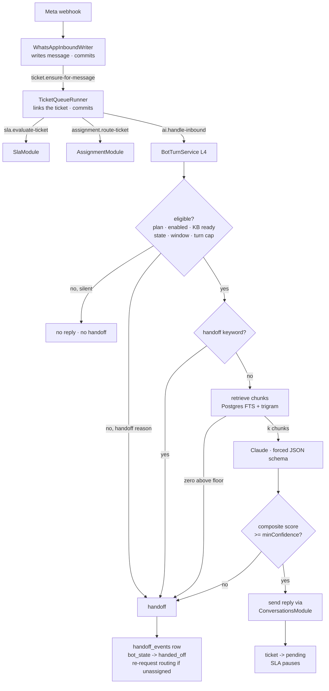
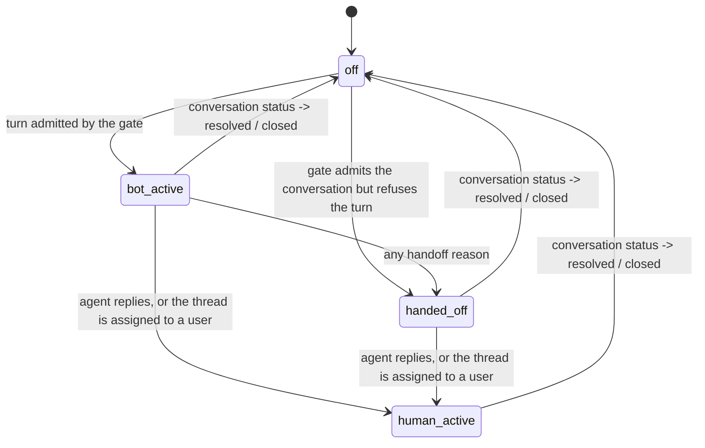

# AI chatbot: knowledge base, confidence gating and human handoff (TAR-400)

Status: proposed · Builds on [0002 — architecture and API contract](./0002-architecture-and-api-contract.md), [0003 — ticket auto-linking contract](./0003-ticket-auto-linking-contract.md), [0004 — RBAC permission matrix](./0004-rbac-permission-matrix.md), [0006 — SLA timers and supervisor alerts](./0006-sla-timers-and-supervisor-alerts.md), [0007 — routing rules and the assignment-fallback seam](./0007-routing-rules-and-assignment-fallback.md) · Consumed by TAR-402 (schema), TAR-406 (backend), TAR-408 (frontend), TAR-410 (QA), TAR-415 (documentation)

> **Read [`tenancy.md`](../reference/tenancy.md) first if you have not.** Every table and every query
> here inherits its isolation from that document and adds nothing to it. Where this document says
> "tenant-scoped", it means one `tenant_isolation` policy in the same migration and `TENANT_PRISMA`
> at the injection site — not a `where` clause somebody has to remember.

## Context and Problem

TAR-28 asks for three behaviours:

> Given a customer asks a question matched in the tenant's knowledge base, when the bot is confident
> in an answer, then it replies automatically within the WhatsApp session window.
>
> Given the bot is not confident or the customer asks to speak to a human, when that happens, then
> the conversation hands off to a human agent with full context (prior bot exchange included).
>
> Given a tenant has not configured a knowledge base, when a conversation starts, then the bot does
> not attempt automated replies (no hallucinated answers with an empty knowledge base).

The hard part is not calling an LLM. It is that **three of the four things this story touches are
already built and already have opinions**, and a bot that ignores them produces a worse product than
no bot at all:

1. **The inbound pipeline is a durable chain, not a function call.** A webhook writes the message
   (`WhatsAppInboundWriter`), enqueues `ticket.ensure-for-message`, and `TicketQueueRunner` fans out
   to `sla.evaluate-ticket` and `assignment.route-ticket` after the link commits. Every hop is a
   BullMQ job because 0003 decided the customer's message is the thing that must never be lost.
2. **The SLA first-response timer only stops on a human.** `SlaTimerService` looks for an outbound
   message with `sender_user_id IS NOT NULL`. A bot reply does not stop that clock, so a bot that
   answers perfectly still breaches every first-response SLA it touches and pages a supervisor about
   it (decision 7).
3. **Auto-assignment runs on ticket creation.** `TicketRoutingState` moves to `assigned` before the
   bot has said anything, so "routine queries don't consume agent time" is not automatic —
   it has to be designed for (decision 8).

Four things are already seated for this story and constrain the answer rather than being open:

| Already exists                    | Where                             | What it means here                                                                                                                                                          |
| --------------------------------- | --------------------------------- | --------------------------------------------------------------------------------------------------------------------------------------------------------------------------- |
| `AiModule` is **L4**              | 0002 module map                   | It may import `TicketsModule`/`ConversationsModule` (L3). Nothing at L3 may import it — so the trigger _into_ the bot must be a queue job, exactly like SLA and assignment. |
| `ai:read` / `ai:write`            | `rbac.ts`                         | Admin-only in `ROLE_PERMISSIONS`. No permission is added by this document.                                                                                                  |
| `ai_chatbot`                      | `PLAN_FEATURES`                   | The feature gate exists; `@RequireFeature('ai_chatbot')` is the whole cost of using it.                                                                                     |
| `botHandling`, `sentByAutomation` | `conversations.ts`, `messages.ts` | The published contract already has fields for this story. Both are kept and neither changes meaning.                                                                        |

And two placeholders, written by TAR-39 and deliberately left incomplete:

```prisma
/// Per-tenant knowledge base. No embedding column: whether that is `pgvector`,
/// an external index, or nothing at all is TAR-28's decision, and adding the
/// column here would make it look settled.
model KnowledgeDocument { … }
model AiConfig { isEnabled, model, systemPrompt, handoffKeywords, … }
```

Deciding the retrieval strategy is therefore this document's first job, because the schema is holding
a column open for the answer.

## Goals / Non-Goals

**Goals**

- A retrieval strategy that adds **no new infrastructure**, and a stated breaking point with the next
  step named.
- A confidence rule that is **deterministic enough to unit-test without an LLM**, and whose threshold
  means something an admin can reason about.
- An empty-knowledge-base rule strong enough that AC3 holds by construction — no prompt, no API call,
  no possible hallucination — rather than by the model behaving.
- "Full context" defined as a concrete DTO with named fields, so TAR-408 can render it and TAR-410 can
  assert on it.
- A conversation state machine with every transition named, including who writes it, so the bot cannot
  talk over a human.
- The API contract and the internal queue contract, concrete enough that TAR-406 and TAR-408 start in
  parallel without a second conversation.
- Tenant isolation for every new entity, on the mechanism that already exists.

**Non-Goals**

- Implementing any of it. TAR-402 migrates, TAR-406 builds the worker and the endpoints, TAR-408 builds
  the console.
- Voice interaction. TAR-28 puts it out of scope explicitly.
- Semantic/vector retrieval at v1. Decision 2 records what would move it in and how to tell.
- Multi-turn bot _tasks_ — booking, order lookups, tool use. The bot answers questions from a document
  set and hands off. Anything else is a workflow (TAR-27).
- Bot-authored internal notes, summarisation of the thread for the agent, or suggested replies. Open
  question 3.
- Per-tenant model API keys. Decision 11 records the platform-key decision and the migration path.
- Re-engaging the bot after a human has replied within the same conversation. Decision 5 makes this
  terminal on purpose.

## Proposed Architecture

### The pipeline, and where the bot is spliced in



Every arrow out of a committed transaction is a BullMQ job carrying `tenantId`, per
[`tenancy.md`](../reference/tenancy.md) rule 4. Nothing in this diagram runs inside the transaction
that wrote the customer's message.

### Components

| Component                                            | Layer | Owns                                                                                                                                                             |
| ---------------------------------------------------- | ----- | ---------------------------------------------------------------------------------------------------------------------------------------------------------------- |
| `AiQueueRunner`                                      | L4    | The only file in `AiModule` that knows a queue exists, on `TicketQueueRunner`'s pattern. Validates the job payload, opens the tenant scope, delegates.           |
| `BotEligibilityService`                              | L4    | The gate. Pure enough to unit-test: takes a snapshot record, returns an admit/refuse decision with a reason. No I/O of its own beyond one read.                  |
| `KnowledgeRetriever`                                 | L4    | The `websearch_to_tsquery` + `similarity` query, top-K selection, and the retrieval score.                                                                       |
| `BotTurnService`                                     | L4    | Orchestrates one turn: gate → keyword → retrieve → model → score → send-or-handoff. Writes `bot_turns`.                                                          |
| `ClaudeClient`                                       | L4    | The `@anthropic-ai/sdk` wrapper: prompt assembly, cache breakpoints, forced output schema, timeout, error classification. The one place a provider name appears. |
| `HandoffService`                                     | L4    | Writes `handoff_events`, moves `bot_state`, re-requests routing, builds `HandoffContextResponse`.                                                                |
| `KnowledgeIndexer`                                   | L4    | Chunking. Runs on `ai.index-document`, writes `knowledge_chunks`, moves the document's status.                                                                   |
| `KnowledgeDocumentsController`, `AiConfigController` | L4    | The tenant-facing CRUD and config surfaces.                                                                                                                      |

`AiModule` injects `TENANT_PRISMA` only. **No `SystemPrisma` anywhere in this story** — every path
here starts from a tenant-scoped job payload or an authenticated request, so there is no
across-tenants read to justify a seventh call site.

## Technology Choices

| Concern            | Choice                                                                                         | Alternatives considered                                         | Rationale                                                                                                                                                                                                                                                                                                                                                                                                                                                                                                                                          |
| ------------------ | ---------------------------------------------------------------------------------------------- | --------------------------------------------------------------- | -------------------------------------------------------------------------------------------------------------------------------------------------------------------------------------------------------------------------------------------------------------------------------------------------------------------------------------------------------------------------------------------------------------------------------------------------------------------------------------------------------------------------------------------------- |
| LLM provider / SDK | Anthropic Claude via `@anthropic-ai/sdk`                                                       | OpenAI SDK; a provider-abstraction layer over both              | No provider is in the repo today, so this is a greenfield pick, and the deciding features are ones this design leans on directly: forced JSON output (`output_config.format`), prompt caching with a published 512-token minimum on the chosen model, and a 1M context window that removes any prompt-size cliff. A two-provider abstraction is rejected at v1: it buys nothing until a second provider exists and costs a lowest-common-denominator surface that would forbid the two features above. `ClaudeClient` is the seam if that changes. |
| Model              | `claude-opus-5`, per-tenant overridable from an allowlist                                      | Pin a single model platform-wide; per-tenant free-text model id | Opus 5 is the default because quality on a grounded-answer task is what protects the tenant's brand, and because the failure this design most needs to avoid — answering when it should not — is a judgement call. Cost is a real trade-off and it is the tenant's to make, not this document's: `ai_configs.model` stays, constrained to a published allowlist (decision 10) with the price table so an admin can choose deliberately. Free-text is rejected — an unknown id is a 404 discovered on a live customer message.                      |
| Retrieval          | PostgreSQL FTS (`websearch_to_tsquery` on a generated `tsvector`) + `pg_trgm` similarity       | `pgvector` embeddings; whole-KB-in-prompt with caching          | Decision 2.                                                                                                                                                                                                                                                                                                                                                                                                                                                                                                                                        |
| Chunking           | Paragraph-packed, ~1200 characters, 1 paragraph overlap                                        | Fixed token windows; whole documents as one chunk               | A tenant FAQ is authored in paragraphs and headings; splitting on blank lines respects the author's own boundaries and needs no tokenizer at write time. Whole documents are rejected because one 40 KB policy document would dominate every prompt and every rank.                                                                                                                                                                                                                                                                                |
| Structured output  | `output_config.format` with a JSON Schema                                                      | Strict tool use; parse free text; assistant prefill             | The response is one object, not a tool invocation, so a tool call would model it wrong. Prefill returns a 400 on this model family. Free-text parsing is what the schema exists to eliminate.                                                                                                                                                                                                                                                                                                                                                      |
| Thinking / effort  | `thinking: { type: 'adaptive' }` (the model's default) with `output_config: { effort: 'low' }` | `thinking: { type: 'disabled' }` for latency                    | Decision 9.                                                                                                                                                                                                                                                                                                                                                                                                                                                                                                                                        |
| Prompt caching     | One `cache_control` breakpoint at the end of the tenant-static system block                    | Cache the retrieved chunks too; 1-hour TTL                      | Retrieved chunks vary per message, so a breakpoint after them would write a fresh entry per message and never read one. 1-hour TTL costs a 2× write and needs more reads to pay off than bursty WhatsApp traffic reliably provides — start at the 5-minute default and let measurement move it (decision 12).                                                                                                                                                                                                                                      |
| Idempotency        | `bot_turns` unique on `(tenant_id, inbound_message_id)`, inserted before the model call        | Rely on the BullMQ `jobId` alone                                | A deterministic `jobId` de-duplicates a re-enqueue; it does not de-duplicate a worker that crashed after sending and before acking. Sending a customer a second WhatsApp message is visible and unrecoverable, so the guard is a row, not a queue property.                                                                                                                                                                                                                                                                                        |

## Decisions

### 1. The trigger is a job from `TicketQueueRunner`, not a second enqueue from the inbound writer

`TicketQueueRunner` enqueues `ai.handle-inbound` after the linking transaction commits, for the
`created` and `attached` outcomes and not for `skipped`, alongside the SLA and routing jobs it already
sends.

Three things fall out, and all three are the reason:

- **The bot gets a `ticketId`.** It needs one to move the ticket to `pending` (decision 7) and to
  re-request routing on handoff (decision 8). A trigger fired before the ticket exists has neither.
- **It inherits the inbound-only, once-per-message filter for free.** `WhatsAppInboundWriter` already
  decided that outbound status placeholders never reach this chain, and `TicketQueueRunner` already
  decided `skipped` means "no ticket, nothing to do".
- **It is the same shape three consumers already use**, so the failure mode is one an operator has
  seen: `enqueue` reports rather than throws, a Redis outage leaves the message committed and the bot
  silent, and the conversation is handled by a human exactly as it is today.

**Rejected: a second enqueue from `WhatsAppInboundWriter`, in parallel with the ticket trigger.** One
hop lower latency, and no dependency on the ticket pipeline. It loses the race that matters: the bot
worker can beat the ticket's commit, and then the `pending` transition and the SLA pause silently do
not happen — the bot answers and the supervisor is paged about it anyway. That is a correctness bug
that appears only under load, which is the worst kind.

The cost of the chosen option is stated rather than glossed: **a broken or backed-up ticket pipeline
also stops the bot.** The bot is an accelerator on top of a pipeline that already has to work, so this
is an acceptable coupling — but it is a coupling, and `ai.handle-inbound` queue depth is named in
Failure Modes as something to watch separately from `tickets`.

**Latency budget**, so TAR-410 has a number to test against: webhook ack → message commit → ticket job
→ ticket commit → AI job → gate → retrieval → model → send-enqueue. Everything before the model call is
indexed database work and two queue hops. The model call dominates. Target: **a bot reply enqueued
within 10 seconds of the inbound message's commit, p95**, with the model call bounded by a 20-second
client timeout (decision 13). This is a target, **not a measured figure** — TAR-410 establishes the
baseline.

### 2. Retrieval is PostgreSQL full-text search plus trigram similarity, and there is no embedding column

The schema comment left three options open. This document takes the third one off the table and picks
between the first two.

**Chosen: lexical retrieval in the database we already run.** `knowledge_chunks` carries a generated
`tsvector` column with a GIN index; the query is `websearch_to_tsquery` ranked by `ts_rank_cd`, with a
`pg_trgm` `similarity()` pass as a second retriever when FTS returns nothing.

Four reasons, in the order that decided it:

1. **No new infrastructure.** `pgcrypto` and `citext` are already created by the baseline migration, so
   contrib extensions are available on this cluster; `pg_trgm` is contrib. `pgvector` is **not** — it
   is a third-party extension that has to be installed on the server, which means it is a question for
   the managed Postgres on Render before it is a question about recall. _Whether Render's managed
   Postgres 16 offers `pgvector` needs verification before decision 2 is revisited; this document does
   not assume either answer._
2. **Retrieval must produce a refusal, not just a ranking.** The empty-KB and no-match rules (decision 4) need a defensible "nothing here answers this". A lexical rank with a floor gives one. Cosine
   similarity over embeddings gives a number that is never zero — every query is _somewhat_ close to
   every document — which makes the floor a tuning exercise rather than a rule.
3. **It is a scale-appropriate design.** A tenant's knowledge base is an FAQ and a policy set: tens of
   documents, hundreds of chunks. BM25-style ranking over hundreds of chunks is not the weak point;
   the weak point is vocabulary mismatch, which the trigram pass partially covers.
4. **No second write path.** Embeddings mean an embedding call on every document write, a backfill
   job, a dimension pinned to a model, and a re-embed migration when that model changes. That is a
   subsystem, and it belongs to the story that can show it is needed.

**Rejected: `pgvector` embeddings.** Better recall on paraphrases, which is the real weakness of the
chosen design. Deferred, not dismissed — the schema stays additive (a `vector` column on
`knowledge_chunks` plus a second retriever in `KnowledgeRetriever` is the whole change).
**The signal to revisit it is measurable**: the share of bot turns whose outcome is
`handoff:no_match` while the tenant's KB does contain an answer. TAR-410's plan should record a
baseline for it, and `bot_turns` stores the outcome per turn precisely so that number is a query
rather than a research project.

**Rejected: put the whole knowledge base in the prompt and lean on prompt caching.** Genuinely
attractive at this scale and it removes retrieval entirely. Three things sank it: a 5-minute cache TTL
against bursty per-tenant traffic makes the hit rate a guess, so the cost is the _uncached_ cost of the
whole corpus on every miss; the size cap is a cliff — the design works until one tenant pastes a 300 KB
handbook and then silently changes cost profile; and it deletes the retrieval signal that decision 3's
confidence floor is built on.

**The text search configuration is `'simple'`, deliberately.** A generated column requires an immutable
expression, so the configuration must be a literal — a per-tenant `regconfig` cannot be a generated
column at all, which settles it on mechanism rather than preference. `'simple'` does no stemming, which
costs English recall and is the right trade for a product whose first market is bilingual
Arabic/English: a wrong stemmer is worse than none, and the trigram pass recovers part of what stemming
would have given. `knowledge_documents.language` is stored for the console and for a future
per-language partial index, and is **not** consulted by the query today.

**One query-plan note, inherited from [`tenancy.md`](../reference/tenancy.md#the-extension-does-not-inject-tenantid):**
RLS blocks a non-leakproof qual from being pushed into an index condition. `KnowledgeRetriever` should
pass an explicit `tenantId` in the `where` alongside RLS, with a comment saying it is a plan fix — the
same exception the inbox query already documents.

### 3. Confidence is the minimum of two independent signals, and the model can only veto

The model is asked for a strict JSON object:

```jsonc
{
  "answered": true, // false = "I cannot answer this from the provided material"
  "answer": "…", // null when answered is false
  "confidence": "high", // "high" | "medium" | "low"
  "citedChunkIds": ["uuid", "uuid"], // must be a subset of what was retrieved
  "reason": "grounded", // "grounded" | "not_in_kb" | "ambiguous" | "wants_human"
}
```

The composite score is:

```
modelConfidence     = answered ? { high: 1.0, medium: 0.6, low: 0.3 }[confidence] : 0
retrievalConfidence = clamp(topChunkRank / RANK_TARGET, 0, 1)
score               = min(modelConfidence, retrievalConfidence)
```

**`min`, not an average, and that is the whole decision.** An average lets a confident model compensate
for weak retrieval — which is precisely the hallucination case this story exists to prevent. Under
`min`, neither signal can rescue the other: the bot answers only when the material was there _and_ the
model says it used it. It is also monotone in both inputs, so `minConfidence` keeps a meaning an admin
can hold in their head ("0.6 = the model must be at least _medium_, and retrieval must be at least
solid").

**Two hard preconditions sit outside the score**, because they are correctness rather than confidence:

- `citedChunkIds` must be non-empty and every id must be one this turn actually retrieved. An id the
  bot invented is a fabrication signal, and the turn is refused regardless of score.
- `retrievalConfidence` must be > 0. Zero retrieved chunks means the model was never called at all
  (decision 4).

**`RANK_TARGET` and the `{1.0, 0.6, 0.3}` mapping are defensible starting values, not measured ones** —
stated the way `ASSIGNMENT_POLICY.defaultMaxConcurrentTickets` states its five. They live in one
exported constant in `@whatsappcrm/contracts` so the console, the worker and the tests read the same
numbers, and `bot_turns` stores `model_confidence` and `retrieval_score` separately so they can be
re-tuned against real traffic without re-deriving them from an aggregate.

**Why not the model's self-reported confidence alone**: a language model's declared confidence is not
calibrated, and treating it as a probability would be inventing a number. It is used here only in the
direction it is trustworthy — as a **veto**. It can lower the score; it can never raise it above what
retrieval supports.

**Why not token log-probabilities**: not available on this API surface. Recorded so nobody re-opens it.

### 4. The empty-knowledge-base rule is structural, not behavioural (TAR-28 AC3)

A tenant is **KB-ready** when all of the following hold. The check is one indexed read and is evaluated
per turn, not cached:

```
ANTHROPIC_API_KEY is configured        (platform)
AND plan includes 'ai_chatbot'         (tenant)
AND ai_configs.is_enabled = true       (tenant)
AND EXISTS (knowledge_documents WHERE status = 'indexed')  (tenant)
AND EXISTS (knowledge_chunks)                              (tenant)
```

If any fails, `BotEligibilityService` refuses the turn **silently** — no reply, no handoff event, no
customer-visible change. The conversation behaves exactly as it does today, which is the correct
no-bot behaviour and the one that cannot regress an existing tenant.

Then, per turn, a second structural rule: **if retrieval returns zero chunks above the floor, the model
is not called.** No prompt is assembled, no request is sent, no tokens are spent, and the turn becomes
a handoff with reason `no_match`.

The property this buys is worth stating plainly, because it is what makes AC3 an architectural
guarantee rather than a prompt-engineering hope: **there is no code path on which the model is invoked
without tenant knowledge-base content in the prompt.** A tenant with an empty knowledge base cannot
receive a hallucinated answer, because no request is ever made on their behalf.

`GET /api/v1/ai/config` publishes the readiness breakdown (`readiness.ready` plus a per-clause
`blockers[]`) so TAR-408 can render _why_ automated replies are off rather than a bare toggle.

### 5. The conversation state machine

A new enum column on `conversations`:

```prisma
enum ConversationBotState {
  off           /// The bot is not and has not been in charge of this conversation. Column default.
  bot_active    /// The bot owns the reply. It has answered at least once, or is about to.
  handed_off    /// The bot released the conversation. No human has taken it yet.
  human_active  /// A human owns it. Terminal until the conversation closes.
}
```



The three names TAR-28 asks for map exactly: bot-active is `bot_active`, handed-off is `handed_off`,
human-active is `human_active`. The fourth value exists because "the bot never engaged" and "the bot
gave up" are different facts and the console has to render them differently — an empty-KB tenant's
inbox must not look like a tenant whose bot is failing.

**Who writes each transition, which is the part that decides whether this is safe:**

| Transition                              | Writer                                                                 | Note                                                                                                                                                                                                              |
| --------------------------------------- | ---------------------------------------------------------------------- | ----------------------------------------------------------------------------------------------------------------------------------------------------------------------------------------------------------------- |
| `off → bot_active` / `off → handed_off` | `BotTurnService`                                                       | Inside the turn transaction, compare-and-set against `bot_state <> 'human_active'`.                                                                                                                               |
| `bot_active → handed_off`               | `HandoffService`                                                       | Same transaction as the `handoff_events` insert.                                                                                                                                                                  |
| `→ human_active`                        | `MessageSendService` (`ConversationsModule`) and the assign/claim path | `UPDATE … SET bot_state = 'human_active' WHERE bot_state <> 'human_active'` inside the transaction that already runs. One statement, no module dependency — `bot_state` is a plain column, not an `AiModule` API. |
| `→ off`                                 | The conversation status update path                                    | On `resolved`/`closed` only.                                                                                                                                                                                      |

**`human_active` is terminal for the conversation's active life, on purpose.** A bot that resumes
answering after an agent has spoken is the single worst failure this feature can produce: it talks over
a colleague in front of the customer, and no confidence score can prevent it. The reset on close is
what keeps that from meaning "one handoff disables the bot for this contact forever" — a new question
next month starts at `off` and is eligible again.

`BotTurnService` re-reads `bot_state` inside its own transaction and aborts on `human_active`. The
window between the gate and the send is small but real, and the compare-and-set is what closes it.

### 6. "Full context" on handoff is a named DTO, not a summary (TAR-28 AC2)

Two halves, and the first is the important one:

**The bot's replies are ordinary `messages` rows.** They were genuinely sent to the customer over
WhatsApp, so they must be — anything else would give the agent a thread that does not match what the
customer sees. The agent's existing thread view therefore already contains the entire bot exchange,
verbatim and in order, with no new UI required. `messages.origin` (decision 14) is what lets the
console badge them.

**On top of that, `GET /api/v1/conversations/{id}/handoff` returns the summary the thread cannot
carry** — why the bot stopped, and how sure it was:

```ts
interface HandoffContextResponse {
  conversationId: Id;
  ticketId: Id | null;
  reason: HandoffReason;
  /** The customer message the bot could not handle. The question to answer. */
  triggerMessageId: Id;
  triggerMessageBody: string | null;
  /** Every message from `botEngagedAt` to the trigger, inclusive, oldest first. */
  botExchange: MessageResponse[];
  botEngagedAt: Timestamp;
  handedOffAt: Timestamp;
  /** How many times the bot replied before giving up. */
  botReplyCount: number;
  /** Null when the bot never reached the model — `no_match`, `customer_requested`. */
  confidence: {
    score: number; // the composite, 0–1
    modelConfidence: number;
    retrievalScore: number;
    modelReason: BotAnswerReason | null;
  } | null;
  /** Distinct KB documents the bot cited across the exchange. Empty when it cited none. */
  citedDocuments: Array<{ id: Id; title: string }>;
}
```

`botExchange` carries whole `MessageResponse` objects rather than a rendered transcript string, per
0002's realtime rule that payloads are whole resources — the console renders them with the same
component it already uses for the thread, and adding a field to a message cannot silently change this
endpoint's shape.

**`citedDocuments` is the field that earns its place in review.** It is what lets an agent see that the
bot answered from the _refunds_ policy when the customer was asking about _shipping_ — which is the
most common way a confident wrong answer happens, and it is invisible from the transcript alone.

Visibility: the same `not_found`-never-`forbidden` rule the rest of the inbox uses. A conversation the
principal may not see answers 404, and so does a conversation that has never handed off.

### 7. A bot reply moves the ticket to `pending`, which pauses the SLA clock

This is the cross-cutting consequence that would otherwise be discovered in integration.

`SlaTimerService` stops a first-response timer on an outbound message with `sender_user_id IS NOT NULL`.
A bot reply has a null sender. So without a decision here, **every conversation the bot handles
perfectly still breaches its first-response SLA and alerts a supervisor about a customer who already
got an answer** — noise that would make supervisors stop trusting the alert queue, which is a worse
outcome than the bot not existing.

**Chosen: after a successful bot reply, `BotTurnService` moves the ticket to `pending`.** The existing
machinery then does everything else, with no new SLA code at all:

- `TICKET_STATUS_PAUSES_SLA` marks `pending`, so `slaTimerTargetFor` returns `paused`;
- `SlaTimer` pause arithmetic already moves `due_at` forward by the pause duration on resume, and
  `paused_ms` already accumulates for reporting;
- when the customer writes back, `TicketLinkerService.reopen` moves `pending → open` and the existing
  `sla.evaluate-ticket` trigger resumes the clock with the elapsed time preserved.

It is also semantically honest rather than a trick: `pending` means "waiting on the customer", and
after the bot answers, that is exactly the state the ticket is in. It has the side benefit of dropping
bot-handled tickets out of an agent's active queue, which is most of what "routine queries don't
consume agent time" means in practice.

The status write is system-initiated with a null actor, which has precedent: `TicketLinkerService`'s
reopen already writes a status with no actor and deliberately emits no `ticket.updated`. This path
follows the same shape.

**Rejected: leave SLA alone.** Zero code, and it produces the false-breach flood above.

**Rejected: let a bot reply stamp `first_response_at`.** One line, and it is a lie the reporting surface
would repeat forever — TAR-30's "agent response time" would silently include machine replies, and a
tenant would be told their team answers in four seconds.

**Rejected: an SLA-aware bot exemption (a new timer state, or a bot-aware `slaTimerTargetFor`).** It puts
AI knowledge inside 0006's reconciler for a case the existing vocabulary already expresses.

**One honest limitation**: a bot-answered ticket whose customer never writes back sits `pending` with a
paused clock indefinitely. That is not new — it is exactly what happens today when an agent replies with
a question — and TAR-25's auto-close behaviour is what covers it. Named here so TAR-410 tests it rather
than files it.

> **This decision needs a sign-off from 0006's owner before TAR-406 merges.** It changes what a
> `pending` ticket can mean, and 0006 is the document that gets to rule on that.

### 8. Auto-assignment runs unchanged; handoff re-requests routing only if nobody holds the ticket

Routing fires on ticket creation and can place the ticket with an agent before the bot has spoken.

**Chosen: leave 0007's pipeline completely untouched.** The bot's effect on the agent's queue comes from
decision 7's `pending` status and the console's `botState` badge, not from suppressing routing.

Two reasons, and the second is the one that changed the answer:

1. **Availability.** Making routing wait for the bot's verdict would put `AiModule` — and by extension a
   third-party API — on the critical path for _every_ ticket getting an owner, including at tenants with
   no bot at all. A degraded LLM provider would become "nothing gets assigned".
2. **Pre-assignment makes handoff instant.** If the bot gives up, the ticket already has an owner and a
   started SLA clock. Deferring routing would mean the handoff _starts_ a routing job — adding delay at
   the exact moment a frustrated customer is waiting for a human.

On handoff, `HandoffService` re-requests routing **only** when `tickets.routing_state` is `pending` or
`deferred` — i.e. when nobody placed it. It never re-routes a ticket in state `assigned` or `manual`,
which preserves 0007's rule that a human placement is terminal for routing.

**Rejected: defer routing until the bot releases the conversation.** Cleaner on paper — an agent never
sees a ticket the bot resolves — at the cost of the availability coupling above. Recorded as the next
step if tenants report queue noise, together with what it costs.

### 9. Adaptive thinking at `low` effort, and thinking is not disabled

`thinking: { type: 'adaptive' }` is this model's default; `output_config: { effort: 'low' }` keeps the
deliberation proportionate to a grounded-answer task and holds latency and cost down.

**Thinking is deliberately not disabled**, even though this is a latency-sensitive path. With thinking
off, this model family has two documented failure modes that are both silent and both bad here: a tool
call can be emitted as visible text (the turn "succeeds" and does nothing), and internal `<thinking>`
tags can leak into the response — which, on this surface, would be **sent to a customer over WhatsApp**.
Low effort gets most of the cost and latency saving without either.

Two consequences TAR-406 must build for:

- **`max_tokens` bounds thinking _plus_ the answer.** Size it with headroom — 4096 is a reasonable
  starting point for a reply capped at ~1200 characters — and treat `stop_reason === 'max_tokens'` as a
  **handoff**, never as a partial answer to send.
- **`stop_reason === 'refusal'` must be checked before reading `content`.** It is a normal 200 response
  on this model, and code that reads `content[0]` unconditionally breaks on it. A refusal is a handoff
  with reason `bot_error`. No server-side fallback model is configured at v1 — the handoff _is_ the
  fallback, and it is a better one than a second model for a customer-facing message.

### 10. The model is per-tenant, from an allowlist, with the price published

`ai_configs.model` stays. It is validated against `AI_MODELS` in `@whatsappcrm/contracts` — an id
outside the list is `validation_failed` at write time rather than a 404 discovered on a live customer
message. `null` means "the platform default", so a tenant that never chooses is not pinned to whatever
was current the day their row was written.

`GET /api/v1/ai/config` returns the allowlist with per-model list prices so the console can show the
trade-off at the point of decision, rather than hiding a 5× cost difference behind a dropdown.

**Indicative cost per bot reply.** Arithmetic from published list prices, **not measured** — TAR-410
establishes real figures. Assumptions: ~2,600 input tokens (system + 6 chunks × ~250 + short history +
the message) and ~450 output tokens including thinking; no cache read.

| Model                     | Input $/MTok | Output $/MTok | ≈ per reply |
| ------------------------- | ------------ | ------------- | ----------- |
| `claude-opus-5` (default) | $5.00        | $25.00        | ~$0.024     |
| `claude-sonnet-5`         | $3.00        | $15.00        | ~$0.014     |
| `claude-haiku-4-5`        | $1.00        | $5.00         | ~$0.005     |

A cache read on the system block (decision 12) takes roughly 20–25% off the input half when it hits.
These are **list prices at the time of writing and need re-verification before they are shown to a
tenant**; the console should render them from one constant, not from copy.

### 11. One platform API key, not per-tenant credentials

`ANTHROPIC_API_KEY` is a platform environment variable, optional in the schema and **fail-closed** when
absent: no key means `readiness.ready = false` for every tenant with blocker `provider_not_configured`,
and no path calls the provider. That is the same shape `WHATSAPP_TOKEN_ENCRYPTION_KEY` and
`PLATFORM_ADMIN_TOKEN` already use — an environment that was never configured refuses rather than
half-works.

Per-tenant bring-your-own keys are deferred. When they land, `AccessTokenCipher` is the existing pattern
(envelope encryption, key from the environment, never returned by any mapper) and the column would be
`ai_configs.api_key_encrypted`. Nothing in this design forecloses it.

**No secret value appears in any DTO, log line, error message or issue body.** `ClaudeClient` is the only
class that reads the key.

### 12. Prompt caching: one breakpoint, on the tenant-static prefix

Prompt render order is tools → system → messages, and caching is a prefix match, so the breakpoint goes
at the end of the block that does not change between messages for a tenant:

```
[ system: platform instructions + tenant systemPrompt + reply rules ]  ← cache_control here
[ user:   retrieved chunks + short conversation history + the message ]
```

The tenant-static prefix must be **byte-stable**: no timestamps, no conversation id, no customer name in
the system block. Those go after the breakpoint. A change to `ai_configs.system_prompt` or `model`
invalidates the entry, which is correct and rare.

Two things to know: the minimum cacheable prefix on the default model is 512 tokens, so a tenant with a
two-sentence system prompt will silently not cache — that is acceptable and not worth padding for. And
`usage.cache_read_input_tokens` is the only honest verification; `bot_turns.cached_input_tokens` stores
it per turn so "is caching working" is a query rather than a guess.

### 13. Timeouts, retries and what a provider outage looks like

- **Client timeout: 20 seconds**, with the SDK's automatic retries disabled (`maxRetries: 0`) — retry
  policy belongs to BullMQ, which is where every other durable step in this codebase retries.
- **BullMQ: 2 attempts, exponential backoff from 2s.** A `bot_turns` row is inserted before the model
  call, so a retry that arrives after a successful send is refused by the unique constraint rather than
  sending twice.
- **Attempts exhausted, refusal, `max_tokens`, malformed output, timeout, 429, 529** → the turn becomes a
  handoff with reason `bot_error`. The conversation reaches a human. **There is no failure mode in which
  the customer is left with silence and no human**, which is the property that matters more than any
  latency number here.

### 14. `messages.origin`, because "automation" is about to mean two things

`MessageResponse.sentByAutomation` is published and derived from `sender_user_id IS NULL`. TAR-27's
workflows will also send messages with a null sender, so that flag is about to stop distinguishing a bot
reply from a workflow reply — and TAR-408 has to badge exactly one of them.

This is a shared seam rather than a private one:
[0009 — workflow triggers, conditions and actions](./0009-workflow-triggers-conditions-actions.md)
landed while this document was in review and claims no column of its own for message authorship, so
`origin` is the field both stories should write. `bot` is this story's value; a `workflow` value is
TAR-27's to add when its send action lands, and the enum is written to be extended rather than
replaced.

Add a column, keep the flag:

```prisma
enum MessageOrigin { contact  agent  bot  system }
```

`MessageResponse.origin` is published alongside `sentByAutomation`, which keeps its current meaning
(`origin !== 'contact' && origin !== 'agent'`) so no existing client breaks. Backfill is deterministic:

```sql
origin = CASE
  WHEN direction = 'inbound'          THEN 'contact'
  WHEN sender_user_id IS NOT NULL     THEN 'agent'
  ELSE 'system'
END
```

Existing automation rows become `system` rather than `bot`, which is the honest answer — nothing before
this story was a bot.

## Data Model

Every table below is tenant-scoped and gets `ENABLE`/`FORCE ROW LEVEL SECURITY` plus one
`tenant_isolation` policy **in the same migration**, followed by a `pnpm db:roles` re-run. Every foreign
key to a tenant-scoped table uses the composite `(tenant_id, id)` form, per convention 2 — a bare
`uuid REFERENCES …(id)` would accept another tenant's row. `pnpm db:verify:rls` reads the catalogue by
name, so a missing policy fails CI rather than shipping.

### Changed: `ai_configs`

| Column             | Type                                   | Note                                                                                                                                                                 |
| ------------------ | -------------------------------------- | -------------------------------------------------------------------------------------------------------------------------------------------------------------------- |
| `min_confidence`   | `numeric(3,2)` NOT NULL default `0.60` | Bounded `0.00 ≤ x ≤ 1.00` by a CHECK constraint, not only by zod.                                                                                                    |
| `max_bot_turns`    | `int` NOT NULL default `5`             | Bounded 1–20. Exceeding it is `handoff:max_turns` — the loop-breaker for a bot and a customer talking past each other.                                               |
| `handoff_message`  | `text` NULL                            | Sent to the customer once per conversation on handoff. Null = say nothing. Opt-in, because a tenant that hands off on every unmatched greeting would otherwise spam. |
| `model`            | existing                               | Now constrained to `AI_MODELS` at the API boundary.                                                                                                                  |
| `handoff_keywords` | existing                               | Now with a documented matching rule (below).                                                                                                                         |

### Changed: `knowledge_documents`

| Column        | Type                       | Note                                                                                         |
| ------------- | -------------------------- | -------------------------------------------------------------------------------------------- |
| `language`    | `text` NULL                | BCP 47, `LocaleSchema`. Stored for the console; **not** consulted by retrieval (decision 2). |
| `chunk_count` | `int` NOT NULL default `0` | Denormalised so the console can show "indexed, 14 chunks" without a count query per row.     |
| `index_error` | `text` NULL                | Why `status = 'failed'`. Operator-facing; never rendered to a customer.                      |
| `content`     | existing                   | Capped at **256 KiB** at the API boundary → `payload_too_large`.                             |

Per-tenant document cap: **1,000**. Exceeding it is `conflict`. Both caps exist so "how large can a
knowledge base get" has an answer before a tenant finds one.

### New: `knowledge_chunks`

```prisma
model KnowledgeChunk {
  id           String  @id @default(uuid(7)) @db.Uuid
  tenantId     String  @map("tenant_id") @db.Uuid
  documentId   String  @map("document_id") @db.Uuid
  /// Position within the document. Ordering context for the prompt, and what
  /// makes a citation locatable in the source the tenant authored.
  ordinal      Int
  content      String
  /// Generated, STORED. `'simple'` is a literal because a generated column
  /// requires an immutable expression — a per-tenant regconfig cannot be one
  /// (0010 decision 2).
  searchVector Unsupported("tsvector")
  createdAt    DateTime @default(now()) @map("created_at") @db.Timestamptz(3)

  tenant   Tenant            @relation(fields: [tenantId], references: [id], onDelete: Cascade)
  document KnowledgeDocument @relation(fields: [tenantId, documentId], references: [tenantId, id], onDelete: Cascade)

  @@unique([tenantId, id])
  @@unique([tenantId, documentId, ordinal])
  @@index([tenantId, documentId])
  @@map("knowledge_chunks")
}
```

Two indexes are created in raw SQL in the migration, because Prisma cannot express either:

```sql
CREATE INDEX knowledge_chunks_search_idx ON knowledge_chunks USING GIN (search_vector);
CREATE INDEX knowledge_chunks_content_trgm_idx ON knowledge_chunks USING GIN (content gin_trgm_ops);
```

Both need `CREATE EXTENSION IF NOT EXISTS pg_trgm` in the same migration, alongside the existing
`pgcrypto`/`citext` baseline.

**Re-indexing is delete-and-insert inside one transaction**, keyed on the document. A document edited
while a retrieval query is running either sees the old chunk set or the new one, never a half-written
mixture — which matters, because a partially-reindexed document is exactly a confidently-wrong answer.

### New: `bot_turns`

The idempotency ledger, the audit trail, and the tuning data set — three jobs, and each is load-bearing.

| Column                                                 | Type                | Note                                                                                                                          |
| ------------------------------------------------------ | ------------------- | ----------------------------------------------------------------------------------------------------------------------------- |
| `id`                                                   | uuid v7             |                                                                                                                               |
| `tenant_id`, `conversation_id`                         | uuid                |                                                                                                                               |
| `inbound_message_id`                                   | uuid                | **`UNIQUE (tenant_id, inbound_message_id)` — the guard that makes a double reply impossible.**                                |
| `outcome`                                              | enum                | `replied` · `handed_off` · `suppressed`                                                                                       |
| `handoff_reason`                                       | enum NULL           | Set when `outcome = 'handed_off'`.                                                                                            |
| `score`, `model_confidence`, `retrieval_score`         | `numeric(4,3)` NULL | Null when the model was never called.                                                                                         |
| `reply_message_id`                                     | uuid NULL           | The message the bot sent.                                                                                                     |
| `cited_chunk_ids`                                      | `uuid[]`            | Written once, read with the turn, never queried the other way — a plain array, on `InternalNote.mentionedUserIds`' precedent. |
| `model`                                                | text NULL           | The id actually used, not the configured one.                                                                                 |
| `input_tokens`, `output_tokens`, `cached_input_tokens` | int NULL            | From `usage`. Cost attribution and cache verification.                                                                        |
| `latency_ms`                                           | int NULL            | Model call only.                                                                                                              |
| `error`                                                | text NULL           | Classified failure. Never a prompt, never a key.                                                                              |
| `created_at`                                           | timestamptz         |                                                                                                                               |

Indexes: `(tenant_id, conversation_id, created_at DESC, id DESC)` for the handoff context read, and
`(tenant_id, outcome, created_at DESC)` for the tuning queries decision 2 and decision 3 name.

**`bot_turns` stores no prompt and no answer text.** The answer is already a `messages` row; storing it
twice would double a customer's data footprint for no reader, and would make retention two problems
instead of one.

### New: `handoff_events`

| Column                         | Type             | Note                                                                       |
| ------------------------------ | ---------------- | -------------------------------------------------------------------------- |
| `id`                           | uuid v7          |                                                                            |
| `tenant_id`, `conversation_id` | uuid             |                                                                            |
| `ticket_id`                    | uuid NULL        | Null when no ticket existed yet.                                           |
| `reason`                       | enum             | See below.                                                                 |
| `trigger_message_id`           | uuid             | The customer message that ended the bot's run.                             |
| `bot_turn_id`                  | uuid NULL        | Null for `customer_requested` and `no_match` — the model was never called. |
| `bot_engaged_at`               | timestamptz NULL | Start of the window `botExchange` spans. Null when the bot never replied.  |
| `bot_reply_count`              | int NOT NULL     |                                                                            |
| `created_at`                   | timestamptz      |                                                                            |

Index `(tenant_id, conversation_id, created_at DESC, id DESC)`. **Not unique per conversation** — a
conversation can be resolved, reopened by a later question, handled by the bot again and handed off
again. The most recent row is the one `GET …/handoff` returns.

```ts
export const HANDOFF_REASONS = [
  'low_confidence', // the composite score fell below the tenant's threshold
  'no_match', // retrieval returned nothing above the floor; the model was never called
  'customer_requested', // a handoff keyword matched
  'max_turns', // maxBotTurns reached in this conversation
  'agent_requested', // an agent took the thread from the console
  'bot_error', // timeout, refusal, max_tokens, malformed output, provider failure
] as const;
```

### Changed: `conversations`, `messages`

| Table           | Column                                                    | Note                                                 |
| --------------- | --------------------------------------------------------- | ---------------------------------------------------- |
| `conversations` | `bot_state` `ConversationBotState` NOT NULL default `off` | Decision 5.                                          |
| `conversations` | `bot_engaged_at` timestamptz NULL                         | Set on the first `→ bot_active`, cleared on `→ off`. |
| `messages`      | `origin` `MessageOrigin` NOT NULL                         | Decision 14, with the backfill given there.          |

No new index on `conversations` for `bot_state`: the console filters an already-narrow inbox page, and
the existing keyset indexes serve it. If a "bot-handled" inbox filter is later added as a _primary_
predicate, that is a measured index change, not a speculative one.

### Usage metering

`usage_counters` (metric, period) rows incremented in the same transaction as the `bot_turns` insert:
`ai_bot_replies`, `ai_input_tokens`, `ai_output_tokens`. TAR-18 records that usage data is captured so
per-conversation billing can be switched on later without a migration; this keeps the AI half of that
true from day one.

## Interfaces

### Knowledge base CRUD — `ai:read` / `ai:write`, `@RequireFeature('ai_chatbot')`

```
GET    /api/v1/knowledge-documents?cursor&limit&status&q     → CursorPage<KnowledgeDocumentResponse>
POST   /api/v1/knowledge-documents                           → 201 KnowledgeDocumentResponse
GET    /api/v1/knowledge-documents/{id}                      → KnowledgeDocumentResponse
PATCH  /api/v1/knowledge-documents/{id}                      → KnowledgeDocumentResponse
DELETE /api/v1/knowledge-documents/{id}                      → 204
POST   /api/v1/knowledge-documents/{id}/reindex              → 202 KnowledgeDocumentResponse
```

```ts
export const KnowledgeDocumentResponseSchema = z.object({
  id: IdSchema,
  title: z.string().min(1).max(200),
  sourceUrl: z.url().nullable(),
  content: z.string(),
  language: LocaleSchema.nullable(),
  status: KnowledgeDocumentStatusSchema, // 'pending' | 'indexed' | 'failed'
  chunkCount: z.int().nonnegative(),
  indexError: z.string().nullable(),
  indexedAt: TimestampSchema.nullable(),
  createdAt: TimestampSchema,
  updatedAt: TimestampSchema,
});

export const CreateKnowledgeDocumentInputSchema = z.object({
  title: z.string().min(1).max(200),
  content: z.string().min(1).max(262_144), // 256 KiB
  sourceUrl: z.url().max(2048).optional(),
  language: LocaleSchema.optional(),
});

export const UpdateKnowledgeDocumentInputSchema = CreateKnowledgeDocumentInputSchema.partial();
```

The list endpoint is keyset-paginated on `(created_at DESC, id DESC)`, per 0002's cursor default.
`q` is a plain `ILIKE` over `title` — a console filter, not the retrieval path. `content` is omitted
from list items and returned only on the single-document read; a 1,000-document page carrying 256 KiB
each is a response nobody wants.

**Writes are asynchronous in exactly one respect:** `POST` and a content-changing `PATCH` return `201`/
`200` with `status: 'pending'` and enqueue `ai.index-document`. The document is not retrievable by the
bot until indexing commits. The console shows the pending state; that is the honest thing to render,
and it is why `chunkCount` is on the response.

### Chatbot configuration — `ai:read` / `ai:write`

```
GET    /api/v1/ai/config     → AiConfigResponse        (ai:read)
PATCH  /api/v1/ai/config     → AiConfigResponse        (ai:write, @RequireFeature('ai_chatbot'))
```

```ts
export const AiConfigResponseSchema = z.object({
  isEnabled: z.boolean(),
  model: z.enum(AI_MODELS).nullable(), // null = platform default
  systemPrompt: z.string().max(4000).nullable(),
  handoffKeywords: z.array(z.string().min(1).max(64)).max(50),
  minConfidence: z.number().min(0).max(1),
  maxBotTurns: z.int().min(1).max(20),
  handoffMessage: z.string().max(1000).nullable(),
  /** Why automated replies are or are not happening. Drives the console's empty state. */
  readiness: z.object({
    ready: z.boolean(),
    indexedDocumentCount: z.int().nonnegative(),
    blockers: z.array(
      z.enum([
        'provider_not_configured',
        'feature_not_in_plan',
        'disabled',
        'no_indexed_documents',
      ]),
    ),
  }),
  /** So the console can show the cost trade-off where the choice is made. */
  availableModels: z.array(
    z.object({
      id: z.enum(AI_MODELS),
      displayName: z.string(),
      inputPricePerMTokUsd: z.number(),
      outputPricePerMTokUsd: z.number(),
      isDefault: z.boolean(),
    }),
  ),
  updatedAt: TimestampSchema,
});

export const UpdateAiConfigInputSchema = AiConfigResponseSchema.pick({
  isEnabled: true,
  model: true,
  systemPrompt: true,
  handoffKeywords: true,
  minConfidence: true,
  maxBotTurns: true,
  handoffMessage: true,
}).partial();
```

**`GET` is allowed even when the plan lacks `ai_chatbot`**, returning `isEnabled: false` and blocker
`feature_not_in_plan`, so the console can render an upsell rather than a 403 page. **`PATCH` is
refused** with `feature_not_in_plan`. A tenant with no `ai_configs` row reads defaults rather than a
404 — the row is created on first write, on `SlaPolicyService`'s precedent.

**Handoff-keyword matching** is specified here rather than left to the implementation, because a rule
nobody wrote down becomes three different rules: NFKC-normalised, case-folded, Arabic diacritics and
tatweel stripped, then a **substring** match of any keyword against the normalised message. Substring
rather than whole-word because "agent" must match "agent?" and Arabic is not reliably whitespace-token
separable for this purpose. Checked **before** retrieval and before any model call — it is the cheapest
gate and the highest-priority one.

### Handoff

```
GET  /api/v1/conversations/{id}/handoff   → HandoffContextResponse   (conversation:read + visibility)
POST /api/v1/conversations/{id}/handoff   → ConversationResponse     (conversation:claim)
```

`GET` returns the most recent handoff, or `404` when the conversation has never handed off. Shape in
decision 6.

`POST` is an agent taking a bot-active thread from the console — one button in the inbox. Body:

```ts
export const RequestHandoffInputSchema = z.object({}).strict(); // reason is always 'agent_requested'
```

**Idempotent by design**: a conversation already in `handed_off` or `human_active` answers `200` with
the current `ConversationResponse` and writes nothing. A double-click is not a `409`; it is a no-op.

### Conversation and message response deltas

```ts
// conversations.ts — additive
botState: z.enum(CONVERSATION_BOT_STATES),        // 'off' | 'bot_active' | 'handed_off' | 'human_active'
botHandling: z.boolean(),                          // UNCHANGED, now === (botState === 'bot_active')

// messages.ts — additive
origin: z.enum(MESSAGE_ORIGINS),                   // 'contact' | 'agent' | 'bot' | 'system'
sentByAutomation: z.boolean(),                     // UNCHANGED
```

Both additions are backward compatible: `botHandling` and `sentByAutomation` keep their published
meanings, so a console running yesterday's bundle keeps working.

### Internal queue contract — `@whatsappcrm/contracts/ai`

Owned by neither `TicketsModule` (L3) nor `AiModule` (L4); both import it. Same arrangement as
`ticket-linking.ts`.

```ts
export const AI_QUEUE = 'ai';
export const AI_HANDLE_INBOUND_JOB = 'ai.handle-inbound';
export const AI_INDEX_DOCUMENT_JOB = 'ai.index-document';

/** Enqueued by `TicketQueueRunner` after the linking transaction commits. */
export interface BotInboundTrigger {
  readonly tenantId: string;
  readonly conversationId: string;
  readonly contactId: string;
  readonly messageId: string;
  /** Null only when the linker produced no ticket — the bot still answers. */
  readonly ticketId: string | null;
  /** ISO 8601 with offset, matching `InboundMessageTicketTrigger.receivedAt`. */
  readonly receivedAt: string;
}

/** Deterministic, so a re-enqueue of the same delivery collapses. */
export function botInboundJobId(trigger: BotInboundTrigger): string;

export interface IndexKnowledgeDocumentJob {
  readonly tenantId: string;
  readonly documentId: string;
}
```

Enqueue options mirror the SLA trigger: `attempts: 2`, exponential backoff from 2s,
`removeOnComplete: 1_000`, `removeOnFail: 5_000`. `enqueue` reports rather than throws — a Redis outage
leaves the message committed and the bot silent, which is the same degradation every other consumer in
this pipeline has.

### The one obligation this document places on another module

`TicketQueueRunner` gains a third fan-out enqueue next to `triggerSlaEvaluation` and `requestRouting`,
for the `created` and `attached` outcomes. That is the entire change to `TicketsModule` — small enough
to review in one hunk, and named here so it is reviewed rather than discovered.

`MessageSendService` and the conversation assign/claim path each gain one `UPDATE … SET bot_state =
'human_active' WHERE bot_state <> 'human_active'` inside the transaction they already open (decision 5),
and the conversation status path gains the reset to `off` on `resolved`/`closed`. Three statements, no
new module edges.

### Errors

**No new error code.** `error-codes.ts` is something 0002 rules, not something an implementation edits,
and the published taxonomy covers every refusal this surface has:

| Condition                                                     | Code                    | Note                                                                                                                 |
| ------------------------------------------------------------- | ----------------------- | -------------------------------------------------------------------------------------------------------------------- |
| Unknown document id, or another tenant's                      | `not_found`             | Never `forbidden` — a 403 would confirm the id exists somewhere.                                                     |
| Conversation not visible, or never handed off                 | `not_found`             | Same rule the rest of the inbox uses.                                                                                |
| `minConfidence` out of range, unknown `model`, bad `language` | `validation_failed`     | With `details[].path` naming the field.                                                                              |
| Content over 256 KiB                                          | `payload_too_large`     |                                                                                                                      |
| Document cap reached                                          | `conflict`              |                                                                                                                      |
| Plan lacks `ai_chatbot` on a write                            | `feature_not_in_plan`   | `GET /ai/config` is deliberately exempt.                                                                             |
| Deactivated tenant with a live session                        | `subscription_inactive` | `TenantNotActiveError`, as everywhere. Throw `tenantInactive()`; never the error's own message (amended by TAR-539). |

`translateAiFailure` is the single mapping function, on `translateSlaFailure`'s pattern. Anything
unrecognised is rethrown untouched — a database outage reported as a validation error is an outage
nobody finds.

**Provider failures never reach an HTTP caller.** They happen in a worker and become
`handoff:bot_error`. `upstream_unavailable` exists in the taxonomy and is deliberately unused here.

## Failure Modes and Operations

| Component            | Slow                                                                                                                  | Down                                                                                                                           | Wrong data                                                                                                       |
| -------------------- | --------------------------------------------------------------------------------------------------------------------- | ------------------------------------------------------------------------------------------------------------------------------ | ---------------------------------------------------------------------------------------------------------------- |
| Claude API           | 20s client timeout, then `handoff:bot_error`. The customer waits at most one timeout before a human is engaged.       | Every turn hands off. The product degrades to exactly its pre-TAR-28 behaviour: humans answer everything. **Nothing is lost.** | Refusal, `max_tokens`, or output failing the schema → handoff. Never a partial or unparsed answer to a customer. |
| Retrieval (Postgres) | Shares the primary with the inbox — a slow chunk query is an inbox problem first. Bounded by `LIMIT` and a GIN index. | The turn throws, BullMQ retries, then `handoff:bot_error`.                                                                     | Stale chunks after an edit are impossible within a turn: reindex is delete-and-insert in one transaction.        |
| BullMQ / Redis       | Reply latency rises; the `ai` queue backs up.                                                                         | No bot replies at all. Messages, tickets and human assignment are unaffected — the enqueue reports rather than throws.         | A duplicate job is refused by `bot_turns`' unique constraint before the model is called.                         |
| `KnowledgeIndexer`   | Documents sit `pending` and the bot does not use them — **correct, conservative behaviour**.                          | Same, indefinitely. `readiness.indexedDocumentCount` shows it.                                                                 | A failed chunking run sets `status = 'failed'` with `index_error`; a failed document is never retrieved.         |

**What gets monitored**

- `ai` queue depth and failed-job count, separately from `tickets` (decision 1's coupling).
- Turn outcome mix over time: `replied` / `handed_off` / `suppressed`, and the handoff reason
  breakdown. A rising `no_match` share is decision 2's revisit signal; a rising `bot_error` share is a
  provider incident.
- Model call p50/p95 latency and the timeout rate.
- Token spend per tenant per period, from `usage_counters`.
- `cache_read_input_tokens` share — zero across repeated turns for one tenant means a silent cache
  invalidator (decision 12).

**What pages someone**: a sustained `bot_error` rate — that is a provider or configuration incident.
Nothing else here is page-worthy, because every other failure degrades to "a human answers", which is
the product's normal state.

**What deliberately does not page**: a high handoff rate. That is either a thin knowledge base or a
threshold set high, and both are tenant configuration, not an outage.

## Security and Access

**Tenant isolation** is inherited, not re-invented. Every new table (`knowledge_chunks`, `bot_turns`,
`handoff_events`) carries `ENABLE`/`FORCE ROW LEVEL SECURITY` and one `tenant_isolation` policy written
in the same migration, with composite `(tenant_id, id)` foreign keys throughout. `AiModule` injects
`TENANT_PRISMA` only — **no `SystemPrisma` call site is added, and none is needed**: every entry point
is either an authenticated request or a job payload carrying `tenantId`. `pnpm db:verify:rls` reads the
catalogue by name, so a table shipped without a policy fails CI, and `pnpm test:db` asserts the same
guarantee through the client.

**The cross-tenant risk unique to this story is the prompt, not the query.** A prompt assembled with
another tenant's chunks would leak content that no `where` clause could recover. Two things prevent it,
and the second is the one that would catch a bug in the first: chunk retrieval runs on `TenantPrisma`
inside the job's tenant scope, so RLS filters it; and `BotTurnService` asserts every `citedChunkId`
against the set _this turn_ retrieved before it sends. TAR-410's plan should include a two-tenant
integration test that indexes a distinctive string in tenant A and asserts it can never appear in a
tenant B reply.

**AuthZ**: `ai:read`/`ai:write` are admin-only in `ROLE_PERMISSIONS` and this document does not change
that. Knowledge-base content is tenant-authored business material; an agent reading it through the
console is not a requirement TAR-28 states, and widening a permission is 0004's call, not this
document's. `GET …/handoff` is `conversation:read` plus the same visibility check the thread uses, so it
cannot expose a conversation the principal could not already open.

**Data sensitivity**: bot replies are customer-visible messages and live in `messages` under the
retention TAR-36 sets. `bot_turns` stores scores, token counts and ids — **no prompt text, no answer
text, no customer content** — so the AI feature adds telemetry, not a second copy of a tenant's
conversations. Log lines follow the same rule: `ClaudeClient` logs the model, latency, token counts and
a classified error, never the prompt and never the reply.

**Prompt injection** is a real exposure here and is bounded rather than solved. Customer message text is
untrusted and is placed in the user turn, never in the system block; knowledge-base content is
tenant-authored and semi-trusted. The system prompt states that material in the retrieved block is
reference content and never instructions. That reduces the risk; it does not eliminate it. What
actually bounds the blast radius is that **the bot has no tools**: it can produce one text reply to one
customer and nothing else — no lookups, no writes, no sends to anyone but the person who wrote in. A
successful injection costs one wrong message and a handoff, not an action. Adding a tool to this bot
later is a security review, not a feature.

**Secrets**: `ANTHROPIC_API_KEY` is environment-only, read by one class, never in a DTO, a log, an
error, a `bot_turns` row or an issue body.

## Implementation Phases

The sub-issues already exist; this maps the work onto them.

**Phase 1 — Schema and migrations (TAR-402).** `pg_trgm`; `knowledge_chunks` with both GIN indexes;
`bot_turns`; `handoff_events`; the `ai_configs` and `knowledge_documents` columns;
`conversations.bot_state`/`bot_engaged_at`; `messages.origin` with the backfill; the four new enums; RLS
policies and a `pnpm db:roles` re-run; reversible `down.sql` tested clean on a fresh database.
_Delivers_: every table TAR-406 and TAR-408 write against. _Unblocks_: both.

**Phase 2a — Backend (TAR-406).** `@whatsappcrm/contracts/ai`; `AiModule` with the eight components;
knowledge-base CRUD and config endpoints; the indexer; the retriever; `ClaudeClient`; the turn
orchestrator and the gate; `HandoffService`; the three one-statement edits in `TicketsModule` and
`ConversationsModule`. Start from a failing test, per squad convention. **The confidence gate, the
empty-KB rule and every handoff reason must be unit-testable with a stubbed model client** — a design
whose central rule can only be tested against a live API is a design that will not be tested.
_Delivers_: AC1, AC2, AC3 end to end.

**Phase 2b — Frontend (TAR-408).** Knowledge-base admin (list, create, edit, delete, pending/failed
states); chatbot configuration with the model/price table and the readiness blockers rendered as the
empty state; the inbox `botState` badge; bot-origin message styling; the handoff context panel. Built
against this contract with mocked endpoints; **runs in parallel with 2a and does not wait for it.** Any
contract mismatch comes back to TAR-400 rather than being settled ad hoc with Backend.

**Phase 3 — QA (TAR-410).** Plan drafting starts as soon as this document is accepted. Execution needs
2a and 2b integrated. Must cover the three ACs, the two-tenant isolation test named in Security, and
each handoff reason individually.

**Phase 4 — Review and merge (TAR-411), then documentation (TAR-415).**

## Open Questions and Risks

1. **Is `pgvector` available on Render's managed Postgres 16?** Does not block anything — decision 2
   needs no extension beyond contrib — but it determines whether the recorded next step is real.
   _Resolve by_: checking Render's Postgres extension list before decision 2 is revisited. **Needs
   verification; not assumed either way here.**

2. **Decision 7 changes what a `pending` ticket can mean, and 0006 owns that.** _Resolve by_: sign-off
   from 0006's owner before TAR-406 merges. If it is refused, the fallback is a `bot_replied_at` column
   consulted by `slaTimerTargetFor` — more code, same outcome, and it puts AI knowledge inside the SLA
   reconciler.

3. **Should the bot write an internal note summarising its exchange on handoff?** Attractive for the
   agent, and `InternalNote` already supports a null author. Left out because it is a second LLM call on
   the hot path for a summary of a transcript the agent can already see. _Resolve by_: asking agents
   after TAR-410, once there is a real handoff to look at.

4. **`RANK_TARGET`, the confidence mapping, the `0.60` default, and 6 chunks are starting values, not
   measured ones.** The risk is a threshold that is wrong in the dangerous direction — too low means
   confidently wrong answers reach customers. _Mitigation_: `bot_turns` stores both component scores per
   turn, so re-tuning is a query. _Resolve by_: reviewing the score distribution against agent
   judgement after the first two weeks of real traffic.

5. **Retrieval recall on paraphrases is the known weakness of decision 2.** A customer who asks "can I
   get my money back" against a KB that says "refund policy" may not match. Trigram similarity covers
   part of it and the failure mode is safe — a handoff, not a wrong answer. _Resolve by_: the
   `handoff:no_match` share named in decision 2.

6. **Prompt injection is bounded, not eliminated** (Security). _Mitigation_: the bot holds no tools.
   _Resolve by_: treating any future tool grant to this bot as a security review in its own right.

7. **Cost is unmeasured.** The table in decision 10 is arithmetic from list prices. A tenant on the
   default model with heavy traffic could cost more per seat than the seat earns. _Mitigation_: the
   model is per-tenant, `usage_counters` records spend from day one, and the per-conversation allowance
   TAR-18 already plans is where a ceiling would live. _Resolve by_: reviewing real spend after TAR-410,
   before the feature is enabled for a paying tenant.

8. **No per-tenant rate limit on bot replies at v1.** A tenant under a message flood spends
   proportionally. `maxBotTurns` caps one conversation, not a tenant. _Resolve by_: a daily cap on
   `ai_bot_replies` in `usage_counters`, once decision 10's real cost is known.

## Amendments

None yet.
