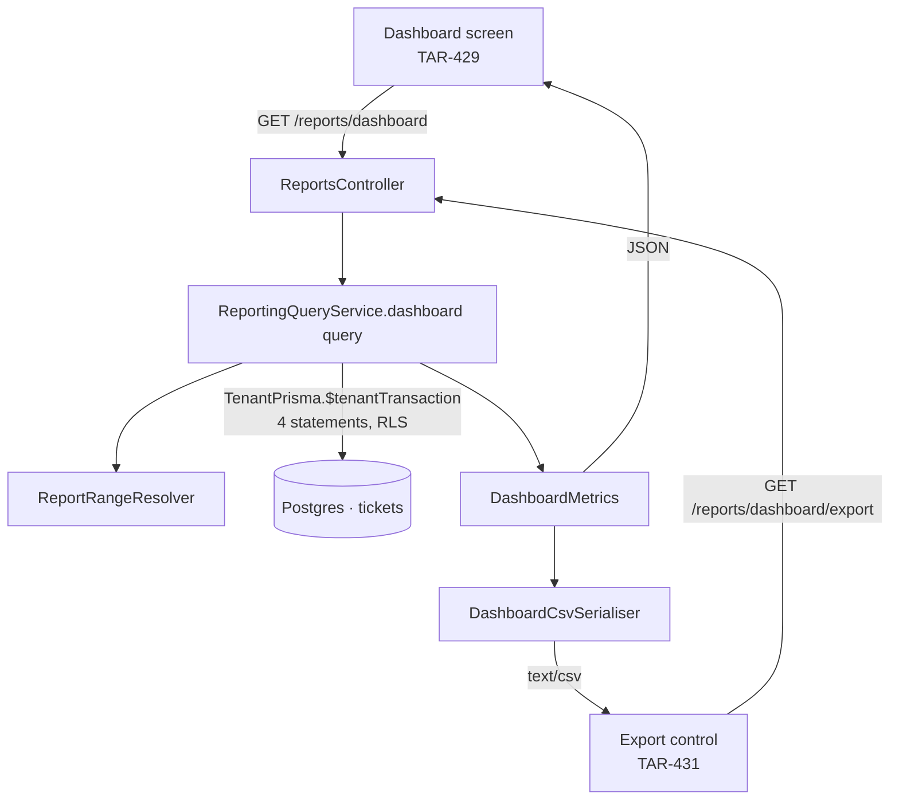

# Reporting dashboard and export (TAR-426)

Status: proposed · Builds on [0002 — architecture and API contract](./0002-architecture-and-api-contract.md),
[0004 — RBAC permission matrix](./0004-rbac-permission-matrix.md),
[0006 — SLA timers and supervisor alerts](./0006-sla-timers-and-supervisor-alerts.md) ·
Owns the design for TAR-30

Reader: engineer. This is the contract TAR-427 (schema), TAR-428 (metrics API), TAR-429
(dashboard UI), TAR-430 (export) and TAR-431 (export UI) build against.

## Context and Problem

TAR-30 asks for two things. A supervisor picks a date range and sees response time,
resolution time, ticket volume and a per-agent breakdown for their tenant. A supervisor
exports a report and **the exported data matches what is shown on screen**.

This is not a green field. `tickets` already carries `created_at`, `first_response_at`,
`resolved_at` and `closed_at`; TAR-280 writes the first of those from the SLA reconciler and
TAR-25's command service writes the other two on the transition into the state. `sla_timers`
carries `paused_ms` with a docblock that names TAR-30 as its reader. What does not exist is
a `ReportingModule`, any query that reads a range rather than a page, and any record of
**who** answered or resolved a ticket.

Two constraints make it non-trivial.

**The parity criterion is an architectural constraint, not a QA step.** "Exported data
matches what's shown on screen" cannot be satisfied by two code paths that are carefully
kept in step, because nothing keeps them in step except attention. It has to be satisfied by
there being one path.

**A report is the first read in this system whose cost grows with a tenant's history rather
than with a page.** Every list in 0002 is keyset-paginated precisely so that no query scans
more than a page. A date-range aggregate scans the range, and the range is chosen by the
caller.

## Goals / Non-Goals

**Goals**

- Four metrics — response time, resolution time, ticket volume, per-agent breakdown — over
  a supervisor-chosen date range, tenant-scoped by the mechanism 0002 already fixed.
- **Reproducibility**: the same range re-run next month returns the same numbers.
- One query layer. The export is a second _serialisation_ of one result, never a second
  computation.
- Shapes published now, so TAR-429 and TAR-431 build before TAR-428 and TAR-430 land.
- The data support named precisely enough for TAR-427 to write one migration: what already
  exists, what is new, and what index serves which predicate.

**Non-Goals**

- Cross-tenant or platform-level analytics. TAR-30 puts it out of scope explicitly.
- **Business-hours ("working time") durations.** Every duration here is wall-clock, the same
  choice — and the same open risk — 0006 recorded for `sla_policies.business_hours_only`.
  See risk 2.
- Scheduled, emailed or asynchronously generated reports. Decision 1 names the trigger to
  revisit.
- PDF and XLSX. CSV only; decision 7.
- Row-level exports. The export is the aggregate on screen, not a dump of the tickets behind
  it. A per-ticket export is a different feature with a different permission question.
- Pre-aggregation — rollup tables, materialised views. Decision 3 says when to revisit.
- CSAT, conversation-level and message-level metrics, forecasting.

---

## Proposed Architecture

A new L4 `ReportingModule`, per 0002's module table. It may import L3 (`TicketsModule`) and
L1; nothing imports it. It owns no queue, no worker, no scheduled job and no realtime event:
reporting is a synchronous read, and that is the whole of its operational surface.

| Component                | Responsibility                                                                    |
| ------------------------ | --------------------------------------------------------------------------------- |
| `ReportRangeResolver`    | Date-only `from`/`to` + the tenant's timezone → a half-open instant interval      |
| `ReportingQueryService`  | **The only place aggregation SQL lives.** Returns one `DashboardMetrics`          |
| `DashboardCsvSerialiser` | `DashboardMetrics` → CSV bytes. Touches no database and takes no query parameters |
| `ReportsController`      | `GET /api/v1/reports/dashboard` and `GET /api/v1/reports/dashboard/export`        |



The single sentence the whole design turns on: **the export endpoint calls
`ReportingQueryService.dashboard()` with the same parsed query object the dashboard endpoint
passes, and hands the result to a serialiser. There is no SQL on the export path.**

---

## Decisions

### Decision 1 — The export reuses the query layer; the format gets its own route, not a `format` parameter

This is the question TAR-426 was raised to answer, so it is answered first and in two parts,
because the two halves are independent and conflating them is how the answer goes wrong.

**Part one — one query layer, and it is not negotiable.** `ReportingQueryService.dashboard()`
is the only method in the system that aggregates ticket metrics. Both endpoints call it.
There is no `ReportGenerationService` that knows how to compute a median, and no CSV builder
that touches Prisma. Four things fall out of that, and each is a way the numbers could
otherwise drift:

1. **One filter parse.** Both routes validate against schemas built from the same object
   shape (see Interfaces), so "the range the export used" and "the range the screen shows"
   are the same parsed value, not two readings of the same query string.
2. **One rounding.** Durations are rounded to integer seconds **in SQL**, once. The CSV
   prints the integer the JSON carries. There is no second rounding at format time.
3. **One aggregation set.** The tenant total and the per-agent rows come out of a single
   statement using `GROUPING SETS` (see Interfaces), so the total cannot disagree with the
   breakdown even inside one response.
4. **One visibility predicate.** 0004 invariant 4 requires reporting to aggregate over
   exactly `visible(...)`; there is one place that clause is built.

TAR-430's acceptance criterion — a test asserting the CSV parses back to the JSON values —
is then a regression test for a property the structure already has, rather than the only
thing holding it up.

**Part two — the CSV gets its own route.** `GET /api/v1/reports/dashboard/export`, not
`GET /api/v1/reports/dashboard?format=csv`. Three reasons, none of which is about where the
numbers come from:

- 0002's `SerializerInterceptor` parses every outbound payload against a response schema and
  throws on mismatch in development. A route that returns a typed object on Monday and a
  byte stream on Tuesday has no response schema to be described by.
- The bytes need headers set before the first byte — `Content-Type`, `Content-Disposition`,
  `nosniff`, `Cache-Control: private, no-store`. `MediaController.content` already
  established that shape at `/media/{id}/content`, and this is the same shape: a resource and
  a representation sub-resource. It does not breach 0002's one-level nesting rule for the
  same reason that route does not — `export` is a representation, not a nested collection.
- Export is the most expensive `GET` in the product. Keeping it a distinct route means it can
  get its own rate limit, its own log line and its own timeout later without splitting a
  route that the console depends on.

**Rejected — a distinct report-generation service.** The PO/BA's alternative: a separate
service that owns report production end to end, potentially asynchronous — enqueue a job,
write a file to object storage, hand back a download link. It is the right answer at a size
this feature is nowhere near, and it fails the parity criterion in a way that is easy to
miss: the job runs _later_, so even with a shared query layer the file is generated against a
database that has moved on from the screen the supervisor was looking at. The export would be
correct and would still not match. Add to that a queue, a storage object, a retention policy
and a polling surface, for a response that is a few dozen aggregate rows and generates in
well under a second.

**Reconsider when** either becomes true: the export becomes row-level (a per-ticket dump,
where the payload is unbounded rather than bounded by agent count), or reports become
scheduled and delivered without a browser waiting. Both are new features with their own
stories, and both would call this same query layer.

**Rejected — `?format=csv` on the metrics route.** Genuinely the smallest diff, and it makes
the shared-parameters property structural rather than conventional. Rejected on the
serialiser and header arguments above. Note what is _not_ an argument against it: it would
not have hurt the numbers. The parity guarantee lives in part one, and part two would not
have changed it either way.

### Decision 2 — Every metric anchors on the event that makes it true

**Trade-off axis: "what arrived in this window" vs "what we achieved in this window".**

A date range has to be applied to a column, and the four metrics do not share one.

- **Cohort anchoring** puts every metric on `created_at`: "of the tickets that arrived last
  week, how were they handled". Intuitive, and **not reproducible** — a ticket created on the
  last day of the range and resolved a week later changes last week's resolution time after
  the fact. A supervisor who exported the report on Monday and re-exports it on Friday gets
  different numbers for the same range, with no error and no explanation.
- **Event anchoring** puts each metric on the timestamp that makes it true. "This week's
  resolution time" is over tickets _resolved_ this week, whenever they arrived.

**Chosen — event anchoring**, and the anchor is part of the published contract:

| Metric                          | Anchored on                        | Value                            | Attributed to             |
| ------------------------------- | ---------------------------------- | -------------------------------- | ------------------------- |
| Ticket volume — created         | `created_at`                       | count                            | — (a customer created it) |
| Ticket volume — resolved        | `resolved_at`                      | count                            | `resolved_by_user_id`     |
| Ticket volume — closed unworked | `closed_at`, `resolved_at IS NULL` | count                            | —                         |
| Response time                   | `first_response_at`                | `first_response_at - created_at` | `first_response_user_id`  |
| Resolution time                 | `resolved_at`                      | `resolved_at - created_at`       | `resolved_by_user_id`     |

Two consequences worth stating rather than discovering:

**A single range can count a ticket in more than one bucket, or in none.** A ticket created
in January and resolved in March appears in January's `created` and March's `resolved`. That
is the point: `created` measures arriving work, `resolved` measures completed work, and a
dashboard that shows both tells a supervisor something a single number cannot — whether the
team is keeping up.

**Reproducibility holds because the anchor columns are written once.**
`ticket-command.service.ts` is explicit that `resolved_at` is written on the transition into
`resolved`, never cleared, and that `resolved → open` is refused at v1, so there is no path
that rewrites it. `first_response_at` is written under a `WHERE first_response_at IS NULL`
guard. When a reopen window lands (0003 open question 1), this table is what it has to be
checked against: a second resolution of the same ticket would need to decide whether it is a
second row in the resolved count, and that decision belongs to that story.

**`closed_at IS NOT NULL AND resolved_at IS NULL` is carried as its own count**, named
`closedWithoutResolution`. The schema comment already calls it "the honest signal for closed
unworked", and folding it into the resolved count would inflate a client-facing number with
spam and wrong numbers.

### Decision 3 — Aggregate live over `tickets`; no rollup table, no materialised view

**Trade-off axis: query cost vs. staleness and a second copy of the numbers.**

**Chosen — every metric is computed from `tickets` at request time**, with new composite
indexes and nothing else. At 0002's stated scale — low hundreds of concurrent agents, one
Postgres primary — a tenant's tickets inside a typical range are thousands of rows behind an
index range scan, and the aggregate is a hash aggregate over them.

Three properties beyond speed, and they are why this is the answer even before performance:

1. **Zero staleness.** "Matches what's shown on screen" is trivially true when both reads hit
   the same table in the same second. Against a rollup it is true only up to the last
   refresh, and the failure is invisible: today's numbers quietly lag.
2. **Percentiles need the rows.** `percentile_cont` requires the underlying distribution.
   Medians do not compose — you cannot average two days' medians into a week's — so a rollup
   would have to store either a t-digest per bucket or, more realistically, degrade the
   product to means. Means are what a single outlier moves most.
3. **No second writer.** A rollup is a second place the numbers are produced, which is the
   exact failure mode decision 1 exists to prevent, arriving through a side door.

**Its breaking point, because it has one.** Cost grows with the number of tickets in the
range, not with the number of agents. It stops being free when a single tenant's range scan
approaches the request timeout — observable well before that, because TAR-428 logs the
statement duration and row count on every report request. The escalation order, in order, and
none of it is to be pre-built:

1. Confirm with `EXPLAIN (ANALYZE, BUFFERS)` that the three range indexes are being used and
   the plan is an index scan, not a sequential scan with a filter.
2. Move reporting reads to a read replica. 0002's scale ceiling already names read replicas
   for reporting as the first step past the single primary, and because every reporting read
   goes through one service, that is a client swap. RLS and the GUC work unchanged on a
   replica.
3. A nightly rollup of counts and sums per `(tenant_id, day, user_id)`, plus a fixed-bucket
   histogram for percentiles, with the live query kept for the current day. This is where the
   staleness and the second writer get paid for, deliberately.
4. Partition `tickets`.

**Rejected — a materialised view.** The obvious pre-aggregation, and it has a specific
disqualifier here beyond staleness: **a materialised view cannot carry a row-level security
policy.** `CREATE POLICY` applies to tables; a matview is not one, so tenant-scoped data
copied into it is protected by nothing this codebase relies on. It would have to be wrapped
in a security-barrier view with the tenant predicate written by hand — reintroducing exactly
the "every query remembers to filter" model 0002 decision 1 rejected, in the one subsystem
0002 named as the reason RLS is the layer that matters. Verify this against the Postgres
version in the Compose stack before anyone revisits it; do not revisit it on the strength of
performance alone.

**Rejected — a nightly rollup table now.** Fast reads, small tables, and a shape the team
will eventually need. Rejected as premature at zero tenants: it costs a job, a backfill, a
reconciliation story for corrections, and the percentile degradation above, to solve a
latency problem that has not been measured and may never appear. It is step 3 of the
escalation, written down so that reaching for it later is a decision rather than a rewrite.

### Decision 4 — Attribution is recorded when it happens: two new columns on `tickets`

**Trade-off axis: two denormalised columns vs. deriving the same fact at query time.**

The per-agent breakdown needs to know who answered and who resolved. Neither is recorded
today. `sla-timer.service.ts` writes the `first_response` ticket event with **no actor**, and
its comment says so deliberately: "the timer observed the reply, it did not make it. The
message row is where 'who answered' lives."

**Chosen — record it on the ticket, in the transaction that already establishes the fact.**

| Column                           | Written by                                                | Meaning                                        |
| -------------------------------- | --------------------------------------------------------- | ---------------------------------------------- |
| `tickets.first_response_user_id` | `SlaTimerService.stampFirstResponse`                      | The sender of the reply that stopped the clock |
| `tickets.resolved_by_user_id`    | `TicketCommandService`, on the transition into `resolved` | The actor who resolved it                      |

Both are one-line changes to existing single writers. `stampFirstResponse` already selects
the deciding message and writes `first_response_at` from it under a `WHERE … IS NULL` guard;
it selects `senderUserId` alongside `sentAt` and writes both in the same `updateMany`. The
command service already knows `actorUserId` — it puts it on the `status_changed` event — and
writes it into the same update that sets `resolved_at`.

**Rejected — derive from `messages` at query time.** No migration, no backfill. Rejected
because it is a second implementation of "who answered": `stampFirstResponse`'s definition is
specific — outbound, non-null `sender_user_id` (which is 0006's answer to "does a chatbot
count"), `sent_at >= tickets.created_at`, on the ticket's own conversation, earliest by
`(sent_at, id)`. A lateral join in a reporting query that reproduces four of those five
clauses is correct until someone changes one of them, and then the dashboard and the SLA
timer disagree about who responded first. It is also a per-ticket index probe on the largest
table in the schema, inside the one query whose row count is caller-controlled.

**Rejected — attribute to `assigned_user_id`.** Free, already indexed. Rejected because it
rewrites history: a ticket reassigned in March moves its January response time onto a
different agent's row, so a closed period's numbers change after it was reported to a client.
That is the same reproducibility property decision 2 is built on, lost to a column that means
"who holds this now".

**Rejected — put the responder in the `first_response` event's `data` JSON.** No schema
change to `tickets`. Rejected: grouping a range aggregate by a JSON extraction on an
append-only log with no supporting index is the worst-performing option, and the event log is
not unique per ticket by construction.

**Backfill, and its honest limit.** The migration backfills both columns — `first_response_user_id`
from the earliest qualifying message using exactly the predicate `stampFirstResponse` uses,
`resolved_by_user_id` from the latest `ticket_events` row with `type = 'status_changed'` and
`data->>'to' = 'resolved'`, taking its `actor_user_id`. Both are best-effort: a ticket whose
evidence is missing keeps `NULL`, lands in the report's **unattributed** row, and is visible
as such rather than silently redistributed. 0006 risk 3 is inherited unchanged — a reply sent
on a second conversation for a multi-number tenant is not seen by either the stamp or the
backfill.

### Decision 5 — The range is dates in the tenant's timezone, resolved server-side

**Chosen — `from` and `to` are `YYYY-MM-DD`, inclusive at both ends, interpreted in
`tenant_settings.timezone`, and converted server-side to a half-open instant interval
`[from 00:00, to+1 day 00:00)`.** The response echoes the resolved instants and the zone.

The tenant timezone is already the right authority: the schema comment on
`tenant_settings.timezone` names report bucketing as one of the three things it drives. A
supervisor in Riyadh picking "1–7 August" means their week, not UTC's.

The conversion is done in SQL — `($1::date)::timestamp AT TIME ZONE $tz` — so day bucketing
and range endpoints are computed by the same engine, with the same DST rules, in the same
transaction. The known edge: in a zone that shifts at midnight, a local midnight can fail to
exist and Postgres resolves it forward. That moves a boundary by an hour once a year and is
recorded rather than handled.

**Rejected — the client sends ISO instants.** It puts the timezone decision in the browser.
Rejected because it makes every future caller — the export, a scheduled report, a support
engineer with `curl` — responsible for knowing the tenant's zone and agreeing on it, and the
server cannot validate that they did. It also breaks the day buckets in the series, which
have to be tenant-local days or they are not the days anyone is looking at.

**The range is capped at 366 days** (`REPORT_RANGE_MAX_DAYS`), refused with
`validation_failed` before any SQL runs. A cap that a supervisor can reach in normal use
would be wrong; this one bounds the unbounded scan and lets "a year" through.

### Decision 6 — Without `report:read_all`, the per-agent breakdown contains one row

`report:read` is held by every role, `report:read_all` by supervisor and admin. 0004
invariant 4 fixes the aggregate set: `report:read` aggregates over exactly `visible(...)`,
`report:read_all` is tenant-wide.

That fixes _which tickets_ are counted. It does not say whether the result may be **broken
out by colleague**, and the difference matters: an agent's visible set includes their team's
tickets, so a per-agent table over it is a ranking of their teammates.

**Chosen — a caller without `report:read_all` gets `agents` containing exactly their own row
(plus the unattributed row where it applies).** The summary and series are unchanged and
still cover the visible set, per the invariant. Rationale: the aggregate is what the matrix
governs; a colleague-by-colleague performance comparison is a distinct disclosure that TAR-30
asks for on behalf of a supervisor, and no acceptance criterion asks for it on behalf of an
agent. This narrows, it does not widen, so it cannot become a read channel around the matrix.

Consistent with 0004 invariant 2, this **narrows without rejecting**: an agent opening a
supervisor's dashboard URL sees a valid dashboard with less in it, and the console shows the
same kind of notice the inbox already shows for a narrowed scope.

Flagged as open question 1 — it is a product call, and it is cheap to reverse in either
direction because it is one branch in one service.

### Decision 7 — What the CSV actually contains

- **One section per file**, chosen by `?section=summary|agents|series`, default `agents`.
  Rejected: several tables stacked in one file separated by blank lines, which no spreadsheet
  imports cleanly; and a ZIP, which buys one click for an archive format on the download path.
- **The `agents` file ends with a `TOTAL` row that is the summary**, in the same columns. That
  is what makes "the export matches the screen" true of the headline numbers in the file a
  supervisor actually downloads.
- **Integer seconds, never a formatted duration.** The screen shows "2h 14m"; the CSV column
  is `first_response_median_seconds` with `8040` in it. A spreadsheet can compute on a
  number and cannot compute on "2h 14m", and — the reason that matters here — a formatted
  string in the API would be a second implementation of the console's duration formatter,
  which is the drift this document exists to prevent, arriving in the presentation layer
  instead of the query layer. Formatting stays in exactly one place: the console.
- **UTF-8 with a byte-order mark**, RFC 4180 quoting, `\r\n` line endings. The BOM is not
  decoration: Excel on Windows reads a BOM-less UTF-8 CSV as the local code page, and agent
  names in this product are routinely Arabic.
- **Formula injection is neutralised.** A field whose first character is `=`, `+`, `-`, `@`,
  a tab or a carriage return is prefixed with a single quote before quoting. Agent names are
  tenant-supplied text and a CSV is opened in a spreadsheet by definition.
- **Filename**: `report-<section>-<from>-<to>.csv`, via `Content-Disposition: attachment`.

---

## Technology Choices

Everything in ADR 0001, 0002 and 0004 is inherited unchanged. Only what this document adds:

| Concern            | Choice                                                        | Alternatives considered                                  | Rationale                                                        |
| ------------------ | ------------------------------------------------------------- | -------------------------------------------------------- | ---------------------------------------------------------------- |
| Aggregation        | Live `$queryRaw` over `tickets` inside `$tenantTransaction`   | Nightly rollup; materialised view                        | No staleness, no second writer, percentiles need the rows        |
| Percentiles        | `percentile_cont(0.5)` and `(0.9)`, plus mean and count       | Mean only; t-digest                                      | A median survives one outlier; a mean does not                   |
| Total vs breakdown | One statement, `GROUPING SETS ((user_id), ())`                | Two statements summed in TypeScript                      | The total and the rows cannot disagree                           |
| Export production  | Same service method, second serialiser                        | `?format=csv`; async report-generation service           | Decision 1                                                       |
| Export format      | CSV, UTF-8 + BOM, one section per file                        | XLSX; PDF; ZIP of sections                               | Boring, streamable, opens everywhere, no new dependency          |
| Attribution        | Denormalised `first_response_user_id` / `resolved_by_user_id` | Derive from `messages`/`ticket_events`; current assignee | Recorded once, by the writer that already knows                  |
| Range input        | Tenant-local dates, resolved in SQL                           | Client-sent instants                                     | One authority for the zone; tenant-local day buckets             |
| Tenant scoping     | `TenantPrisma` + RLS, unchanged                               | —                                                        | 0002 decision 1 explicitly anticipated raw SQL for reporting     |
| Caching            | None                                                          | Redis-cached responses per (tenant, range)               | The range is caller-chosen and cheap; a cache is a staleness bug |

---

## Data Model

`apps/api/prisma/schema.prisma` stays the source of truth. This is the delta TAR-427 applies.
Everything below is tenant-scoped and RLS-protected, per 0002's rule 2.

### What already exists and is sufficient

`tickets.created_at`, `first_response_at`, `resolved_at`, `closed_at`, `assigned_user_id`,
`assigned_team_id`. No new table. `sla_timers` is **not** read by this design — a breach is a
policy outcome, not a duration, and TAR-30's four metrics are all cycle times. `paused_ms`
stays reserved for the working-time variant in risk 2.

### `tickets` — two new columns

| Column                   | Type       | Notes                                                                                          |
| ------------------------ | ---------- | ---------------------------------------------------------------------------------------------- |
| `first_response_user_id` | uuid, null | The agent whose reply stopped the first-response clock. Null = unattributed (decision 4)       |
| `resolved_by_user_id`    | uuid, null | The actor who moved the ticket to `resolved`. Null for a backfill with no event, or automation |

Both relate to `users` on the composite `(tenant_id, id)` with `onDelete: NoAction`, matching
every other user reference in the file. **Both need named Prisma relations**: `User` already
has an unnamed relation to `Ticket` through `assigned_user_id`, and a third and fourth
relation between the same two models is a schema error without `@relation("…")` names on all
of them. Naming the existing one is part of this migration and renames a generated field.

Neither column is written by any read path, and neither is nullable-by-accident: null means
"not recorded", which the report renders rather than hides.

### `tickets` — new indexes

| Index                            | Serves                                                   |
| -------------------------------- | -------------------------------------------------------- |
| `(tenant_id, created_at)`        | Volume created, and the daily series' created bucket     |
| `(tenant_id, first_response_at)` | Response-time aggregate and its per-agent grouping       |
| `(tenant_id, resolved_at)`       | Resolution-time aggregate, resolved volume               |
| `(tenant_id, closed_at)`         | `closedWithoutResolution` only — see the cost note below |

The existing `(tenant_id, status, priority, created_at DESC)` cannot serve any of these: it
leads with `status`, so a range on a timestamp alone has no start condition in it.

**Two costs, stated rather than discovered.** Four new btree indexes on the most-written
table in the schema is four extra index maintenance operations per ticket insert and per
update that touches an indexed column. If TAR-427 wants to cut that, **`(tenant_id, closed_at)`
is the lever** — it serves one supplementary count, and dropping the index and the
`closedWithoutResolution` field together is a coherent reduction. The other three are
load-bearing for TAR-30's stated metrics.

And these indexes are not partial, though `first_response_at IS NOT NULL` would halve two of
them. Prisma cannot express an index predicate, and an index created outside the schema is
drift the next `migrate dev` proposes to drop — the same trade `sla_timers` documents in its
own docblock, with the same escalation: make them partial outside Prisma, with a spec
asserting their definition, once size makes it worth the drift caveat.

### Backfill

One migration, both columns, per decision 4. It is a single `UPDATE … FROM` per column over
existing rows — small in every environment today, and it must run in its own migration file
after the columns are added.

### Seed and demo data

TAR-46's demo dataset needs tickets that were **responded to and resolved across a spread of
days**, and at least one `closed` with no `resolved_at`, or TAR-429 renders an empty
dashboard and cannot tell an empty range from a broken query.

---

## Interfaces

### New contracts file — `packages/contracts/src/reporting.ts`

```ts
import { z } from 'zod';
import { IanaTimezoneSchema, IdSchema, TimestampSchema } from './common';

/** A year and a day. Bounds the one query whose row count the caller chooses. */
export const REPORT_RANGE_MAX_DAYS = 366;

/** Tenant-local calendar day, `YYYY-MM-DD`. Never an instant — see 0010 decision 5. */
export const ReportDateSchema = z.iso.date();

/**
 * Every duration statistic in this file. `count` is the number of tickets the
 * statistic was computed over; the three durations are **null when `count` is
 * zero**, never `0`, because "no ticket was answered" and "every ticket was
 * answered instantly" are different facts.
 */
export const DurationStatsSchema = z
  .object({
    count: z.int().nonnegative(),
    averageSeconds: z.int().nonnegative().nullable(),
    medianSeconds: z.int().nonnegative().nullable(),
    p90Seconds: z.int().nonnegative().nullable(),
  })
  .refine((v) => (v.count === 0) === (v.medianSeconds === null), {
    message: 'Durations are null exactly when count is zero',
  });

export const TicketVolumeSchema = z.object({
  /** Tickets whose `created_at` falls in the range. */
  created: z.int().nonnegative(),
  /** Tickets whose `resolved_at` falls in the range, whenever they were created. */
  resolved: z.int().nonnegative(),
  /** Closed in the range having never been resolved — the "closed unworked" signal. */
  closedWithoutResolution: z.int().nonnegative(),
});

export const ReportMetricsSchema = z.object({
  volume: TicketVolumeSchema,
  firstResponse: DurationStatsSchema,
  resolution: DurationStatsSchema,
});

/**
 * One agent's row. `userId` is **null for the unattributed row** — work whose
 * responder or resolver was never recorded (a pre-backfill ticket, a resolution
 * with no actor). It is rendered, not hidden, so the table adds up to the summary.
 */
export const AgentReportRowSchema = z.object({
  userId: IdSchema.nullable(),
  name: z.string().nullable(),
  /** False for a suspended or removed agent who still has work in the range. */
  isActive: z.boolean(),
  ticketsResolved: z.int().nonnegative(),
  firstResponse: DurationStatsSchema,
  resolution: DurationStatsSchema,
});

/** One tenant-local day. Every day in the range is present, zero-filled. */
export const DailyPointSchema = z.object({
  date: ReportDateSchema,
  created: z.int().nonnegative(),
  resolved: z.int().nonnegative(),
  firstResponseMedianSeconds: z.int().nonnegative().nullable(),
});

export const ReportRangeSchema = z.object({
  from: ReportDateSchema,
  to: ReportDateSchema,
  timezone: IanaTimezoneSchema,
  /** The resolved half-open interval, inclusive. */
  startsAt: TimestampSchema,
  /** Exclusive: `to` + 1 day at local midnight. */
  endsAt: TimestampSchema,
});

/**
 * The query shape, declared once as a plain object so that the JSON and CSV
 * routes are the same parameters by construction and not by convention
 * (0010 decision 1). `.refine` returns an effects schema with no `.extend`,
 * which is why the shape and the rules are separate.
 */
const dashboardQueryShape = {
  from: ReportDateSchema,
  to: ReportDateSchema,
  /** Narrowed, never rejected, per 0004 invariant 2. */
  scope: z.enum(['assigned', 'all']).default('all'),
  assignedTeamId: IdSchema.optional(),
};

function withRangeRules<T extends z.ZodObject<{ from: z.ZodType; to: z.ZodType }>>(schema: T) {
  return schema
    .refine((v) => v.from <= v.to, { message: '`from` must not be after `to`' })
    .refine((v) => reportRangeDays(v.from, v.to) <= REPORT_RANGE_MAX_DAYS, {
      message: `Range must not exceed ${REPORT_RANGE_MAX_DAYS} days`,
    });
}

/** Inclusive day count. Exported so the console can disable the picker at the same bound. */
export function reportRangeDays(from: string, to: string): number {
  return (
    Math.round((Date.parse(`${to}T00:00:00Z`) - Date.parse(`${from}T00:00:00Z`)) / 86_400_000) + 1
  );
}

export const DashboardMetricsQuerySchema = withRangeRules(z.object(dashboardQueryShape));

export const REPORT_EXPORT_SECTIONS = ['summary', 'agents', 'series'] as const;
export const ReportExportSectionSchema = z.enum(REPORT_EXPORT_SECTIONS);

export const DashboardExportQuerySchema = withRangeRules(
  z.object({ ...dashboardQueryShape, section: ReportExportSectionSchema.default('agents') }),
);

export const DashboardMetricsResponseSchema = z.object({
  range: ReportRangeSchema,
  /** What the caller actually got, after narrowing. */
  scope: z.enum(['assigned', 'all']),
  summary: ReportMetricsSchema,
  /** One row per agent with work in the range, plus every active agent, zero-filled. */
  agents: z.array(AgentReportRowSchema),
  series: z.array(DailyPointSchema),
});

export type DurationStats = z.infer<typeof DurationStatsSchema>;
export type ReportMetrics = z.infer<typeof ReportMetricsSchema>;
export type AgentReportRow = z.infer<typeof AgentReportRowSchema>;
export type DailyPoint = z.infer<typeof DailyPointSchema>;
export type DashboardMetricsQuery = z.infer<typeof DashboardMetricsQuerySchema>;
export type DashboardExportQuery = z.infer<typeof DashboardExportQuerySchema>;
export type DashboardMetricsResponse = z.infer<typeof DashboardMetricsResponseSchema>;
```

`agents` includes every active agent, supervisor and admin in the tenant even with nothing in
the range — a supervisor comparing a team needs the zero rows, and their absence reads as a
loading bug — plus any inactive user who does have work in the range, so a departed
contractor's numbers do not vanish from a closed period.

### Endpoint surface

Following 0002's conventions exactly.

```
# Reporting                                                               TAR-30
GET    /api/v1/reports/dashboard          → DashboardMetricsResponse   report:read
GET    /api/v1/reports/dashboard/export   → text/csv (bytes)           report:read
```

Both are safe and idempotent. Neither takes an `Idempotency-Key` — nothing is written.

**Export response headers**, mirroring `MediaController.content`:

```
content-type: text/csv; charset=utf-8
content-disposition: attachment; filename="report-agents-2026-08-01-2026-08-07.csv"
x-content-type-options: nosniff
cache-control: private, no-store
```

### Error codes

**No new entry in `error-codes.ts`.** The existing taxonomy covers everything this surface
can fail with:

| Condition                                                                        | Code                | Status |
| -------------------------------------------------------------------------------- | ------------------- | ------ |
| `from` after `to`, a range over 366 days, a malformed date, an unknown `section` | `validation_failed` | 400    |
| Caller lacks `report:read`                                                       | `forbidden`         | 403    |
| `assignedTeamId` naming an unknown team, or another tenant's                     | `not_found`         | 404    |
| The report query exceeds its statement timeout                                   | `internal_error`    | 500    |

The last row is deliberate. A timed-out report is a capacity fault on our side, not something
the caller can fix by asking differently — the range is already capped — so it takes the
generic server code and leaves the detail in the log line with its `requestId`. If ranges
start timing out routinely, that is decision 3's escalation, not a new error code.

### Query shapes

TAR-428 implements these; they are specified here so the aggregation is not reinvented per
statement. All four run inside **one** `TenantPrisma.$tenantTransaction` — the GUC is set once
and every statement is under RLS — preceded by `SET LOCAL statement_timeout`. Every value is
a bound parameter, including the timezone.

**0. Resolve the range** (one round trip, and the tenant's zone comes from its own row):

```sql
SELECT ($1::date)::timestamp AT TIME ZONE s.timezone       AS starts_at,
       (($2::date + 1))::timestamp AT TIME ZONE s.timezone AS ends_at,
       s.timezone
FROM tenant_settings s;
```

RLS makes that a one-row read; a tenant with no settings row falls back to `UTC` and logs.

**1. Volume** — three independent index range scans rather than one `OR` across three
timestamp columns, which no single index can serve as a start condition:

```sql
SELECT
  (SELECT count(*) FROM tickets
    WHERE created_at >= $1 AND created_at < $2 /*+ scope*/)                       AS created,
  (SELECT count(*) FROM tickets
    WHERE resolved_at >= $1 AND resolved_at < $2 /*+ scope*/)                     AS resolved,
  (SELECT count(*) FROM tickets
    WHERE closed_at >= $1 AND closed_at < $2 AND resolved_at IS NULL /*+ scope*/) AS closed_unworked;
```

**2. Durations, total and per agent in one statement.** Run twice — once for first response,
once for resolution — differing only in the anchor column, the interval and the attribution
column:

```sql
SELECT
  first_response_user_id                                                       AS user_id,
  grouping(first_response_user_id)                                             AS is_total,
  count(*)                                                                     AS n,
  round(extract(epoch FROM avg(first_response_at - created_at)))::int           AS avg_seconds,
  round(extract(epoch FROM percentile_cont(0.5) WITHIN GROUP (
    ORDER BY first_response_at - created_at)))::int                            AS p50_seconds,
  round(extract(epoch FROM percentile_cont(0.9) WITHIN GROUP (
    ORDER BY first_response_at - created_at)))::int                            AS p90_seconds
FROM tickets
WHERE first_response_at >= $1 AND first_response_at < $2 /*+ scope*/
GROUP BY GROUPING SETS ((first_response_user_id), ());
```

The `GROUPING SETS` is the point: the row with `is_total = 1` is computed over exactly the
rows the per-agent rows partition, so the summary cannot disagree with the breakdown. Note
that the total's median is **not** the median of the per-agent medians, and must not be
presented as though the column sums.

**3. The daily series**, bucketed in tenant-local days with every day present:

```sql
WITH days AS (
  SELECT generate_series($1::date, $2::date, interval '1 day')::date AS day
)
SELECT d.day, ...
FROM days d
LEFT JOIN tickets t ON (t.created_at AT TIME ZONE $3)::date = d.day /*+ scope*/
GROUP BY d.day
ORDER BY d.day;
```

`AT TIME ZONE` then `::date` is DST-correct in a way that adding `interval '1 day'` to a
`timestamptz` is not.

**The scope clause**, spliced into each statement above for a caller whose scope narrowed to
`assigned`:

```sql
AND (assigned_user_id = $4 OR assigned_team_id = ANY($5::uuid[]))
```

It must be built from one helper with a spec asserting it matches `assignedFilter` in
`apps/api/src/rbac/visibility.ts` — 0004 calls this the most re-implementable rule in the
codebase, and this is its first raw-SQL caller. Note the deliberate asymmetry it creates:
**visibility reads current assignment, attribution reads recorded history**, so an agent's
own first response on a ticket since reassigned away is excluded from their scoped report.
That is correct — they cannot see the ticket now — and it is worth a line in TAR-434's docs.

### Frontend contract notes

- Route `/(app)/reports`, nav entry gated on `report:read` from `principal.permissions`, the
  same way every other rail entry is gated.
- `apps/web/lib/api/reports.ts` for the client, with mock handlers in
  `apps/web/lib/api/mock/handlers.ts` so TAR-429 and TAR-431 build before the backend lands.
- **The applied range lives in the URL search params**, read through `lib/search-params.ts`.
  Both the metrics request and the export URL are derived from that one value, which is the
  mechanism behind TAR-431's "can never export a range different from what's on screen" —
  the export cannot hold its own copy of the filters because it has nowhere to hold it.
- **Export via `fetch` + `Blob`, not a bare `<a download>`.** A plain link cannot render the
  error state TAR-431's criteria require: a failed export would navigate the browser to a
  JSON error body. Fetch with credentials, check the status, `URL.createObjectURL`, click a
  synthetic anchor, revoke.
- No realtime. The dashboard is a request-time read; there is no `ServerEvent` for it and no
  socket subscription to add.

---

## Failure Modes and Operations

| Component                 | Down                                         | Slow                                                                       | Bad data                                                                                   |
| ------------------------- | -------------------------------------------- | -------------------------------------------------------------------------- | ------------------------------------------------------------------------------------------ |
| Postgres                  | The whole product is down                    | The dashboard is slow; nothing is queued, nothing is lost, a retry is free | —                                                                                          |
| Report query              | —                                            | `statement_timeout` → `internal_error` with the `requestId`                | A range over the cap never reaches SQL                                                     |
| Redis / BullMQ            | **Unaffected.** Reporting uses neither       | —                                                                          | —                                                                                          |
| Attribution backfill      | —                                            | —                                                                          | Unrecorded work lands in the unattributed row and is rendered as such, never redistributed |
| A deactivated tenant      | `assert_tenant_active` raises, as everywhere | —                                                                          | —                                                                                          |
| Missing `tenant_settings` | Falls back to `UTC`, logs once               | —                                                                          | Day boundaries are UTC's for that tenant until the row exists                              |
| Tenant timezone changed   | —                                            | —                                                                          | Historical reports re-bucket; the range is resolved at read time. Risk 6                   |
| Export serialiser         | —                                            | —                                                                          | Formula-injection prefixes are applied to every text field, not only names                 |

**What should page someone: nothing.** This subsystem has no background work, no delivery
guarantee and no state to diverge. That is a property of the design, not an omission.

**What should be logged, because decision 3's breaking point is otherwise invisible**: per
report request, the resolved range in days, the row counts the statements returned, and the
elapsed time. A p95 that starts climbing with a tenant's history is the signal to start the
escalation, and it will not announce itself any other way.

**Scale ceiling.** The design targets 0002's stated scale. The first thing to break is the
range scan for a tenant with a large ticket history, and the escalation order is decision 3's.
Do not pre-build any of it.

---

## Security and Access

- **`ReportingModule` uses `TenantPrisma` only.** It adds no `SystemPrisma` call site, so the
  written list in `docs/reference/tenancy.md` is unchanged and there is no second tenant
  binding point to review. This is what satisfies TAR-426's "confirms the tenant-scoping
  mechanism established in TAR-39/TAR-19".
- **Raw SQL is safe here because isolation is not enforced by the query.** 0002 decision 1
  anticipated this exact caller — "hand-written `$queryRaw` for reporting" is named as the
  reason RLS is the layer that matters — and the tenant-scope extension's `$allOperations`
  hook covers `$queryRaw` too. Every statement runs inside `$tenantTransaction`, so the GUC is
  set and a missing tenant yields zero rows rather than every row.
- **Every value is a bound parameter**, including the timezone, the range, the principal's id
  and the team-id array. Nothing is string-interpolated into SQL, and the two things that
  look like identifiers — `section` and `scope` — are enums that select a code path, never
  text that reaches a statement.
- **The visibility predicate is 0004's, built once**, with a spec asserting it agrees with
  `assignedFilter`. Decision 6 narrows the per-agent breakdown further, never wider.
- **`assignedTeamId` for an unknown or another tenant's team answers `not_found`**, per
  0002's rule that a 403 confirms an id exists.
- **The CSV is served as an attachment with `nosniff` and `no-store`**, and text fields are
  neutralised against spreadsheet formula injection (decision 7). Tenant data must not sit in
  a shared cache and must not be interpretable as a script on this origin.
- **No message content, no contact identity, no PII beyond agent display names** appears in
  either response. The dashboard is counts, durations and names.
- Log lines carry the range, counts and duration — never a tenant's numbers and never a name.

---

## Implementation Phases

TAR-30 already carries its sub-issues. **This document creates none**; it says what each
existing one builds.

| Order | Story       | Delivers from this document                                                                                                                                                                                               | Unblocks   |
| ----- | ----------- | ------------------------------------------------------------------------------------------------------------------------------------------------------------------------------------------------------------------------- | ---------- |
| 1     | **TAR-427** | The two `tickets` columns with named relations, the four indexes, the backfill migration and its `down.sql`, the TAR-46 demo data                                                                                         | 428, 429   |
| 2     | **TAR-428** | `packages/contracts/src/reporting.ts`; `ReportingModule`; the four statements; `first_response_user_id` and `resolved_by_user_id` written by their existing writers; `GET /reports/dashboard`; the `EXPLAIN` verification | 429, 430   |
| 2     | **TAR-429** | The dashboard screen against the published contract, mocked. **Can start as soon as this document lands** — every shape it needs is above                                                                                 | 431        |
| 3     | **TAR-430** | `GET /reports/dashboard/export`, `DashboardCsvSerialiser`, the parity spec                                                                                                                                                | 431 wiring |
| 3     | **TAR-431** | The export control on TAR-429's screen, deriving its URL from the same search params                                                                                                                                      | 432        |
| 4     | TAR-432     | QA against the cases below                                                                                                                                                                                                | 433        |
| 5     | TAR-433     | Review, with decisions 1, 2 and 6 as the checklist                                                                                                                                                                        | 434        |
| 6     | TAR-434     | Operator and tenant-user documentation, including what each metric is anchored on                                                                                                                                         | —          |

**Tests that must exist, because the failure they catch is silent**

1. **Parity.** The CSV for a range, parsed back, equals the JSON body for the same range —
   asserted on values, not eyeballed (TAR-430's own criterion).
2. **Reproducibility.** A range whose tickets are all resolved returns identical numbers when
   re-run after new tickets arrive outside it.
3. **Isolation.** Tenant B's dashboard never counts tenant A's tickets — the isolation test
   0002 requires with every migration, extended to the reporting statements, which is the one
   place raw SQL is trusted to RLS alone.
4. **Attribution is historical.** A ticket reassigned after resolution keeps its resolution on
   the original resolver's row.
5. **Scope.** An agent's dashboard aggregates over exactly the tickets `GET /tickets` returns
   for them, and their `agents` array has one row (decision 6).
6. **Timezone.** A ticket created at 23:30 local on the last day of the range is inside it,
   and one at 00:30 local the next day is not.
7. **Empty range.** Zero tickets returns zero counts and **null** durations, not zeros, and
   the series still carries every day.
8. **Formula injection.** An agent named `=cmd|' /c calc'!A1` is exported as inert text.

---

## Open Questions and Risks

| #   | Item                                                                                                                                                            | Severity | Resolution                                                                                                                                                          |
| --- | --------------------------------------------------------------------------------------------------------------------------------------------------------------- | -------- | ------------------------------------------------------------------------------------------------------------------------------------------------------------------- |
| 1   | **Should an agent see a per-agent breakdown of their team?** Decision 6 says no — one row, their own                                                            | Medium   | Product call for Tarek/the PO. One branch in one service either way; the aggregate set is unaffected and stays inside 0004 invariant 4                              |
| 2   | **Durations are wall-clock.** A ticket arriving at 17:30 shows a 15-hour response time that says nothing about the team, and a client-facing report inherits it | High     | Same risk 0006 raised for SLA windows, and it should be answered once for both. If any tenant's reporting is contractual against business hours it is its own story |
| 3   | **No performance measurement is claimed here.** The index choices are reasoned, not benchmarked                                                                 | Medium   | TAR-427/428 verify with `EXPLAIN (ANALYZE, BUFFERS)` against TAR-46 volume: index scans, no sequential scan, no sort node on the range predicate                    |
| 4   | **Four new indexes on the hottest table.** Write amplification on `tickets` insert and update is not measured                                                   | Medium   | TAR-427 measures; `(tenant_id, closed_at)` plus `closedWithoutResolution` is the named lever to cut if it matters                                                   |
| 5   | **The backfill is best-effort**, and inherits 0006 risk 3 — a reply on a second conversation for a multi-number tenant is invisible to it                       | Low      | Unattributed rows are rendered, not hidden. Revisit with 0006 risk 3, not separately                                                                                |
| 6   | **Changing a tenant's timezone re-buckets history.** A report run before and after a zone change can differ at day boundaries                                   | Low      | Accepted: the alternative is a stored report entity, which v1 has none of. Note it in TAR-434's documentation                                                       |
| 7   | **p50/p90 are an assumption**, not a stated client requirement                                                                                                  | Low      | Adding p95 is an additive contract field and a one-line SQL change. Confirm with the PO before TAR-434 documents them as the definition                             |
| 8   | **Materialised views cannot carry RLS** is stated as fact in decision 3 and gates a whole rejected option                                                       | Low      | Verify against the Compose stack's Postgres before anyone revisits pre-aggregation. Cheap; the answer changes which shape step 3 of the escalation takes            |
