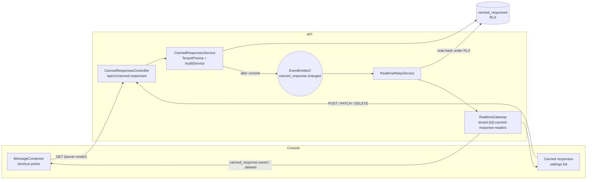

# Canned responses: where a shortcut is resolved, and what carries an edit (TAR-474)

Status: **accepted** · Inherits:
[0002 — architecture and API contract](./0002-architecture-and-api-contract.md),
[0004 — RBAC permission matrix](./0004-rbac-permission-matrix.md) · Consumed by: TAR-475
(schema), TAR-477 (contracts and CRUD), TAR-484 (composer), TAR-485 (relay), TAR-486 (live
update), TAR-487 (QA), TAR-488 (review), TAR-489 and TAR-610 (documentation).

Reader: engineer.

> **This landed a story late, and the body below is unedited.** TAR-474 settled the contract
> on 15 August 2026 and it was never committed. Four files went on citing a path that did not
> resolve — `packages/contracts/src/canned-responses.ts`,
> `apps/api/src/canned-responses/canned-responses.service.ts`,
> `apps/api/src/prisma/canned-response-schema.int-spec.ts` and TAR-475's migration — and
> [the canned responses API reference](../reference/canned-responses-api.md) transcribed every
> "0011, decision N" from those comments rather than reading it here. TAR-610 committed the
> document from TAR-474's own attachment; everything from _Context and Problem_ down is as it
> was ruled, including the phases and open questions, which are the record of what was decided
> rather than a report on what shipped.
>
> **`0011` is shared with**
> [0011 — ticket reassignment and escalation](./0011-ticket-reassignment-and-escalation.md).
> The collision stands: the four citations above name this filename in source, and renaming it
> would mean editing application code to correct a documentation gap. Cite this one by its full
> name, never by its number alone.

## Context and Problem

TAR-31 asks for two things: an agent types `/hours` in the composer and gets the full text
inserted for review, and an admin's edit reaches every agent on the tenant immediately.

Most of the answer already exists in this repository and the job is to say which parts are
being used, not to design from zero.

- **`canned_responses` already ships.** It was created by
  `20260810130000_initial_data_model` and RLS-protected by
  `20260810140000_tenant_isolation_rls`, with `UNIQUE (tenant_id, shortcut)` — exactly as
  0002's data-model table publishes it. TAR-475 is a set of deltas, not a new table.
- **`canned_response:read` / `canned_response:write` already ship** in `rbac.ts`, granted by
  0004 to agent+ and supervisor+ respectively.
- **`CannedResponsesModule` is already named** in 0002's L4 module diagram.

What does not exist: the REST surface, the contract DTOs, the wire events, and the composer
UI. What is genuinely undecided, and what this document rules on: **where a typed shortcut
is resolved**, and **which transport carries an admin's edit to every agent**.

The constraint that makes the second non-trivial is 0002 amendment 5: _a realtime fan-out
wider than the read rule is an authorization bypass_. `tenantRoom(tenantId)` — which every
socket joins at handshake — is the obvious audience and is one custom role away from being
wider than `canned_response:read`.

## Goals / Non-Goals

**Goals**

- A CRUD contract for tenant-shared canned responses that TAR-475/477 can build against
  without further design.
- A shortcut-matching mechanism specified down to the trigger grammar, the insertion rule
  and the no-match behaviour.
- A propagation transport with a named, tenant-scoped audience and a stated reason why that
  audience is not wider than the read rule.
- An isolation review that enumerates every path — REST, socket, cache — rather than
  asserting isolation.

**Non-Goals**

- **Personal (per-agent) canned responses.** TAR-31 puts them out of scope. The shipped
  `is_shared` column is the seam; see Data Model.
- **Variable interpolation** (`{{contact.name}}`). The body is literal text at v1. Adding
  interpolation later is additive — see Open Questions 1.
- **Full-text search over bodies.** The picker matches shortcut and title; see Open
  Questions 5.
- **Usage analytics** ("which canned response gets used most"). Nothing here records a use.
- **A generic tenant-wide realtime cache layer.** Two events on the existing gateway, not a
  framework.

## Proposed Architecture

`CannedResponsesModule` is an L4 feature module, exactly where 0002 puts it. It owns one
controller, one service, one mapper and one domain event. It imports nothing from
`RealtimeModule` (L1) and `RealtimeModule` imports nothing from it — they share a type on
the in-process bus, on `domain-events.ts`' stated rule.



Flow, in one sentence each:

1. The inbox route server-renders the tenant's whole canned-response set and passes it to
   the composer as a prop.
2. The agent types `/`; the composer filters that set locally and inserts the chosen body
   into the draft. No request, no latency.
3. A supervisor saves an edit; the service commits, writes an audit row, and emits
   `canned_response.changed` after commit.
4. The relay re-reads the committed row in its own tenant scope and publishes the whole
   resource to the tenant's canned-response readers room.
5. Every console in that room refetches; the composer's prop is new on the next render.

## Technology Choices

| Concern              | Choice                                                        | Alternatives considered                                  | Rationale                                                                                               |
| -------------------- | ------------------------------------------------------------- | -------------------------------------------------------- | ------------------------------------------------------------------------------------------------------- |
| Shortcut resolution  | Client-side, over the whole bounded set                       | Per-token lookup endpoint; debounced search endpoint     | Zero latency per keystroke; the picker needs the set anyway, so a lookup route would be a second reader |
| Propagation          | Existing Socket.IO gateway, new permission-gated tenant room  | Reuse `tenantRoom` as-is; a second SSE endpoint; polling | Reuse; and a permission-derived room matches the read rule by construction (Decision 2)                 |
| Cross-replica fanout | Socket.IO's existing Redis adapter                            | Our own Redis pub/sub channel                            | Already deployed and already used by `fetchSockets()`; a second channel is a second thing to operate    |
| Client update        | Whole-resource payload; console treats it as a refetch signal | Console patches a client-side cache from the payload     | Matches the console's shipped `refetch, never patch` discipline; the payload keeps patching available   |
| Shortcut uniqueness  | `citext` on the existing `UNIQUE (tenant_id, shortcut)`       | Lowercase-on-write in the service                        | Database-enforced, on `tenants.slug` / `tags.name` precedent; a service rule is one bypass from broken  |
| List shape           | Unpaginated, capped at 200, `{ items, nextCursor: null }`     | Cursor page                                              | Client-side matching needs the whole set; exactly the `assignment-rules` precedent                      |
| Idempotency          | **No** `Idempotency-Key` on these writes                      | Require it on `POST`                                     | 0002 requires it for _external_ side effects — sends and billing. A duplicate shortcut is a `conflict`  |

### Decision 1 — The shortcut is resolved in the console, against the whole set

**Trade-off axis: request cost per keystroke vs. freshness of the matched text.**

- **Chosen — the console holds the tenant's whole set and matches locally.** The set is
  capped at 200 rows server-side, which is what makes "the whole set" a promise the API can
  keep. `GET /api/v1/canned-responses` is unpaginated and returns it in one response,
  server-rendered into the inbox route. Matching a `/` token is then a string comparison in
  the browser: no request, no spinner, no debounce, and the picker can rank and preview
  without a second round trip.

  The cost is stated plainly: the set can be up to a few minutes stale if the socket is
  down. Decision 2 is what keeps it fresh when the socket is up, and the composer degrades
  to "slightly old copy inserted", never to an error.

- **Rejected — a per-token lookup endpoint** (`GET /canned-responses?shortcut=/hours`).
  This is the literal reading of TAR-477's second acceptance criterion, and it is rejected
  on purpose. A lookup that answers only after the agent has finished typing cannot drive a
  _picker_, so the console would need the list endpoint too — and then there are two readers
  of the same data, one of which is a request on the keystroke path. **TAR-477's criterion
  is satisfied by the list endpoint plus client-side resolution**, and this paragraph is
  here so that reading is a recorded decision rather than something skipped.

  Re-open if `perTenant` is ever raised above roughly 500: at that size the payload and the
  local scan stop being free and a server-side prefix query earns its keep.

- **Rejected — a debounced search endpoint.** All of the latency of the above plus a
  ranking implementation, for a set that fits in a single JSON response.

### Decision 2 — Transport: the existing Socket.IO gateway, with a permission-gated room

**Trade-off axis: reuse vs. an audience that matches the read rule by construction.**

- **Chosen — reuse the gateway; add `tenantCannedResponseRoom(tenantId)` =
  `tenant:{tenantId}:canned-response-readers`,** joined at handshake if and only if the
  resolved principal holds `canned_response:read`.

  Reuse is not in question: the console already holds exactly one authenticated socket per
  session, `RealtimeRelayService` already exists as the bridge from the in-process bus to
  the rooms, and the Redis adapter already fans out across replicas. A second transport
  would be a second connection, a second auth handshake and a second thing to operate for
  two events.

  What _is_ a decision is the room. The nested naming and the permission-derived join copy
  `tenantReadersRoom` exactly — same file, same prefix rule, same reasoning — so this is the
  house pattern for "a permission-gated tenant-wide audience", not a new idea.

  Membership cannot outlive the permission. A role change revokes that user's sessions;
  `SESSIONS_REVOKED_EVENT` reaches `RealtimeRelayService.onSessionsRevoked`, which re-reads
  each session and `socket.disconnect(true)`s the ones that are gone. The demoted agent's
  socket is closed, and the next handshake re-derives the rooms from the new principal.

- **Rejected — publish to `tenantRoom(tenantId)`.** Every socket already joins it, so this
  is free, and _today_ it is exactly right: `ROLE_PERMISSIONS` grants
  `canned_response:read` to agent, supervisor and admin alike, so "every socket in the
  tenant" and "every principal who may read a canned response" are the same set.

  Rejected because that equality is a fact about a constant, not a property of the design.
  `rbac.ts` says out loud that TAR-22 may replace `ROLE_PERMISSIONS` with tenant-configurable
  rows; the first custom role without `canned_response:read` would silently make this
  fan-out wider than the read rule, which is precisely the class of defect 0002 amendment 5
  exists to forbid — and it would be found the way amendment 5's was, after shipping. One
  extra `socket.join` per connection is the whole cost of not relying on that.

- **Rejected — a Server-Sent Events endpoint.** A second long-lived connection per tab,
  its own auth story (the realtime ticket is single-use and minted for the socket), and its
  own cross-replica fan-out. Nothing is bought.

- **Rejected — polling `GET /canned-responses` on an interval.** "Immediately" in TAR-31's
  second acceptance criterion becomes "within one interval", and the request volume is
  agents × tenants × interval for data that changes a few times a month.

### Decision 3 — Whole-resource payloads; the console refetches

**Trade-off axis: TAR-485's literal payload requirement vs. the console's shipped discipline.**

- **Chosen — the wire payload is the whole `CannedResponseResponse`; the console treats
  the event as a signal and refetches.**

  The payload half is not optional: `realtime.ts` fixes "every payload is a full resource
  rather than a delta" for the whole union, so `canned_response.saved` carries the committed
  row regardless. That satisfies TAR-485's second acceptance criterion — _the payload does
  carry enough data to update local state without a refetch_ — and leaves the patch path
  open without a contract change.

  The consumer half is the console's call, and `inbox-events.ts` already made it: an event
  is a signal to refetch, never state to apply. Integration is then three lines —
  two names added to `INBOX_SERVER_EVENTS`, two cases returning `refetch` in
  `inboxEffectOf` — and it inherits the 400 ms coalescing and the refetch-on-every-reconnect
  guarantee for free. `router.refresh()` re-renders the server tree and preserves client
  state, so an agent mid-draft does not lose what they typed.

  **Flagged, once:** a reviewer reading TAR-485 AC2 as "the console must not refetch" will
  see a deviation. It is deliberate — the criterion constrains the _payload_, and the
  payload complies.

- **Rejected — the console patches a client-side cache.** Defensible here in a way it is
  not for the inbox, because a canned response has no assignment and no claim state, so
  there is no per-record visibility branch to re-derive. Rejected on cost: it needs upsert,
  delete and an `updatedAt` guard against two rapid saves relaying out of order, all to
  avoid a server render of a route the agent is already on. Adopt it only if profiling shows
  `router.refresh()` is too coarse on the inbox route; the payload already supports it.

### Decision 4 — Shortcut grammar and case-insensitive uniqueness

- **Chosen — the stored value includes the leading `/`,** matching what the shipped schema
  comment already says (`/// What an agent types to expand it, e.g. /refund`), and matching
  what the agent types. Storing the bare word would mean the API, the console and the
  database each carrying half a rule about who adds the slash.

  Grammar: `^/[a-z0-9][a-z0-9_-]{0,39}$`. Lowercase, no whitespace, no second slash — so a
  shortcut can never contain the trigger character and a URL path segment can never be
  mistaken for one. Enforced in the Zod schema _and_ as a CHECK constraint, because the
  console's prefix match assumes it.

- **Chosen — `shortcut` becomes `citext`,** so the existing `UNIQUE (tenant_id, shortcut)`
  refuses `/Hours` alongside `/hours`. This is the `tenants.slug` and `tags.name` precedent,
  and it is what makes the console's case-insensitive picker match agree with the database.

- **Rejected — lowercase-on-write in the service.** Same effect while every writer
  remembers. `AssignmentRuleNameTakenError`'s comment already documents the `citext` answer
  for the identical problem one table over.

## Data Model

The table exists. TAR-475 ships deltas, with a reversible `down.sql` beside them.

`canned_responses` — RLS-protected, `tenant_id` non-null, composite index leading with
`tenant_id`, all three already true.

| Column               | Today                  | Delta                                               | Why                                                                                                                   |
| -------------------- | ---------------------- | --------------------------------------------------- | --------------------------------------------------------------------------------------------------------------------- |
| `id`                 | `uuid` PK, uuidv7      | —                                                   |                                                                                                                       |
| `tenant_id`          | `uuid` NOT NULL        | —                                                   | RLS predicate column                                                                                                  |
| `shortcut`           | `text`                 | → `citext`; CHECK `~ '^/[a-z0-9][a-z0-9_-]{0,39}$'` | Decision 4                                                                                                            |
| `title`              | `text`                 | CHECK `length between 1 and 80`                     | The picker's label; an empty one is an unpickable row                                                                 |
| `body`               | `text`                 | CHECK `length between 1 and 4096`                   | 4096 is `SendTextInputSchema.body`'s ceiling — a canned response is always sendable as-is                             |
| `is_shared`          | `boolean` default true | CHECK `is_shared = true`                            | The v1 invariant, enforced rather than remembered. Dropping this CHECK is what a future personal-responses story does |
| `created_by_user_id` | `uuid` NULL            | —                                                   | Set from the writing principal; NULL survives the creator's removal (`onDelete: NoAction`)                            |
| `created_at`         | `timestamptz(3)`       | —                                                   |                                                                                                                       |
| `updated_at`         | `timestamptz(3)`       | —                                                   | Published in the DTO; the guard a patch-path client would need                                                        |

**Constraints and indexes**

- `UNIQUE (tenant_id, shortcut)` — exists. After the `citext` change it also serves the
  list's `ORDER BY shortcut`, so no new index is needed.
- `@@index([tenantId, createdByUserId])` — exists, and **nothing in this contract queries by
  creator**. Recommend dropping it in the same migration: it is write amplification on every
  insert for a query nobody makes. Reversible, and re-addable the day a "responses I added"
  filter is asked for. Flagged rather than done silently because it is a delete.

**Access patterns**

| Query                              | Index used                     | Frequency              |
| ---------------------------------- | ------------------------------ | ---------------------- |
| List the tenant's set, by shortcut | `UNIQUE (tenant_id, shortcut)` | Once per inbox render  |
| Read one by id                     | PK, filtered by RLS            | Rare (settings detail) |
| Insert / update, unique check      | `UNIQUE (tenant_id, shortcut)` | A few times a month    |

## Interfaces

### `packages/contracts/src/canned-responses.ts` (new)

```ts
import { z } from 'zod';
import { IdSchema, TimestampSchema } from './common';

/**
 * Caps the API enforces, published so the console's `maxLength` and the schema
 * that refuses the value cannot disagree. `perTenant` is what makes the
 * unpaginated list a promise the server can keep (0011, decision 1).
 */
export const CANNED_RESPONSE_LIMITS = {
  /** The whole set, shared library only at v1. */
  perTenant: 200,
  /** Including the leading `/`. */
  shortcutLength: 40,
  titleLength: 80,
  /** `SendTextInputSchema.body`'s ceiling, so an inserted body is always sendable. */
  bodyLength: 4096,
} as const;

/** The character that opens the composer's picker. One place, three readers. */
export const CANNED_RESPONSE_TRIGGER = '/';

/**
 * Lowercase, no whitespace, and no second `/` — so a shortcut can never contain
 * the trigger and a URL path segment can never be read as one. `citext` in the
 * database, so `/Hours` and `/hours` collide (0011, decision 4).
 */
export const CannedResponseShortcutSchema = z
  .string()
  .max(CANNED_RESPONSE_LIMITS.shortcutLength)
  .regex(/^\/[a-z0-9][a-z0-9_-]*$/, 'Must start with `/`, e.g. `/hours`');

export const CannedResponseResponseSchema = z.object({
  id: IdSchema,
  /** Unique per tenant, case-insensitively. What the agent types. */
  shortcut: CannedResponseShortcutSchema,
  /** The picker's label. Never the body — a 4 kB preview is not a menu item. */
  title: z.string().min(1).max(CANNED_RESPONSE_LIMITS.titleLength),
  /** Literal text. No interpolation at v1 (0011, non-goals). */
  body: z.string().min(1).max(CANNED_RESPONSE_LIMITS.bodyLength),
  /** Null once the creator is removed from the tenant. */
  createdByUserId: IdSchema.nullable(),
  createdAt: TimestampSchema,
  updatedAt: TimestampSchema,
});

export const CannedResponseCreateInputSchema = z.object({
  shortcut: CannedResponseShortcutSchema,
  title: z.string().min(1).max(CANNED_RESPONSE_LIMITS.titleLength),
  body: z.string().min(1).max(CANNED_RESPONSE_LIMITS.bodyLength),
});

export const CannedResponseUpdateInputSchema = CannedResponseCreateInputSchema.partial();

/**
 * Unpaginated, keeping `CursorPage`'s shape so a generic list client works
 * unchanged and pagination stays addable without a breaking change.
 * `nextCursor` is always null; `perTenant` is enforced on create.
 */
export const CannedResponseListResponseSchema = z.object({
  items: z.array(CannedResponseResponseSchema),
  nextCursor: z.null(),
});

export type CannedResponseResponse = z.infer<typeof CannedResponseResponseSchema>;
export type CannedResponseCreateInput = z.infer<typeof CannedResponseCreateInputSchema>;
export type CannedResponseUpdateInput = z.infer<typeof CannedResponseUpdateInputSchema>;
export type CannedResponseListResponse = z.infer<typeof CannedResponseListResponseSchema>;
```

### REST surface — `/api/v1/canned-responses`

Behind the global request pipeline like every other tenant controller: no guard declared on
the controller, `@RequirePermission` on every route, `ApiExceptionFilter` on the class.

```
GET    /api/v1/canned-responses        → CannedResponseListResponse  200  canned_response:read
POST   /api/v1/canned-responses        → CannedResponseResponse      201  canned_response:write
GET    /api/v1/canned-responses/{id}   → CannedResponseResponse      200  canned_response:read
PATCH  /api/v1/canned-responses/{id}   → CannedResponseResponse      200  canned_response:write
DELETE /api/v1/canned-responses/{id}   → 204                              canned_response:write
```

- `GET` list orders by `shortcut` ascending and takes `perTenant + 1`, so a set that somehow
  exceeded the cap is visible as a fault rather than silently truncated to look complete —
  `AssignmentRulesService.list`'s exact arrangement.
- `DELETE` is `204` and **idempotent**: deleting an already-deleted response is not a 404,
  on the assignment-rules precedent. It emits nothing when nothing was deleted.
- `PATCH` that changes no column writes nothing and emits nothing, on
  `TicketUpdatedEvent`'s precedent — a broadcast that says nothing is still a broadcast.
- No `Idempotency-Key`. 0002 requires it for endpoints with external side effects; nothing
  here reaches Meta or a payment provider, and a replayed create is a `conflict` on the
  unique constraint, which is the honest answer.

### Error shapes

Domain errors in `canned-responses.errors.ts`, translated once in `canned-responses.http.ts`
— `assignment.http.ts`' pattern, so the same condition cannot answer 409 on one route and
400 on another. **No new error code**; the existing taxonomy covers every refusal.

| Condition                              | Error class                        | Code                | Status | `details`                             |
| -------------------------------------- | ---------------------------------- | ------------------- | ------ | ------------------------------------- |
| Unknown id, **or another tenant's id** | `CannedResponseNotFoundError`      | `not_found`         | 404    | —                                     |
| Shortcut already used in this tenant   | `CannedResponseShortcutTakenError` | `conflict`          | 409    | —                                     |
| Body/shortcut/title fails the schema   | (pipe)                             | `validation_failed` | 400    | `path`: `shortcut` / `title` / `body` |
| Tenant already holds 200               | `TooManyCannedResponsesError`      | `conflict`          | 409    | —                                     |

The last row follows `TooManyAssignmentRulesError` deliberately: `conflict`, never
`plan_limit_exceeded`. The cap is a property of the design — the console downloads the whole
set — not of the tenant's plan, and a `402` would send a supervisor to the billing page to
fix something money cannot.

The first row is the isolation guarantee, not a convenience: RLS makes another tenant's row
invisible, so the server genuinely cannot distinguish it from a row that never existed.
`error-codes.ts` already states this for `not_found` — "absent, or present in another
tenant — the two are indistinguishable by design."

The shortcut-taken message should say the comparison is case-insensitive, on
`AssignmentRuleNameTakenError`'s reasoning: _"`/Hours` already exists"_ is confusing when
you typed `/hours`.

### Realtime — additions to `packages/contracts/src/realtime.ts`

```ts
/**
 * The sockets in this tenant whose principal holds `canned_response:read`.
 *
 * Every role holds it under today's `ROLE_PERMISSIONS`, so this is the same set
 * as `tenantRoom` — and it is a separate room anyway, on `tenantReadersRoom`'s
 * precedent. The equality is a fact about a constant that TAR-22 may replace
 * with tenant-configurable rows; a fan-out wider than the read rule is an
 * authorization bypass (0002 amendment 5), and deriving the room from the
 * permission is what stops that from being discovered after it ships.
 */
export function tenantCannedResponseRoom(tenantId: string): string {
  return `tenant:${tenantId}:canned-response-readers`;
}
```

Two members added to `ServerEventSchema`:

```ts
/**
 * A canned response was created or updated, published to
 * `tenantCannedResponseRoom`.
 *
 * **One event for both**, unlike the audit trail, which distinguishes them: an
 * auditor asks "who added this", while every consumer of this event performs the
 * same upsert. A discriminant nothing branches on is a discriminant that drifts.
 *
 * The payload is the committed row, read back by the relay — whole resources,
 * per this file's rule — so a console that prefers to patch its cache can,
 * without a contract change. The shipped console refetches instead
 * (`inbox-events.ts`), which is the console's call and not this contract's.
 */
z.object({
  event: z.literal('canned_response.saved'),
  cannedResponse: CannedResponseResponseSchema,
}),
/**
 * A canned response is gone. The id alone, because there is no row left to read
 * back — the one place in this union where a whole resource is not available and
 * not needed.
 */
z.object({
  event: z.literal('canned_response.deleted'),
  cannedResponseId: IdSchema,
}),
```

`RealtimeGateway.handleConnection` gains one join, guarded exactly as the readers room is:

```ts
if (principal.permissions.includes(CANNED_RESPONSE_READ)) {
  void socket.join(tenantCannedResponseRoom(principal.tenantId));
}
```

There is **no** client→server event for this feature. `ClientEventSchema` is unchanged, so
this surface accepts no client-supplied identifier of any kind.

### Domain bus — `apps/api/src/events/domain-events.ts`

```ts
export const CANNED_RESPONSE_CHANGED_EVENT = 'canned_response.changed';

/**
 * A canned response was written (TAR-31). Emitted **after the transaction
 * commits**, and only when a column actually moved — a PATCH setting a body to
 * the text it already holds writes nothing and announces nothing.
 *
 * Carries ids, not the resource, for the same reason `conversation.assigned`
 * does: the payload a socket publishes must be the committed row rather than the
 * writer's view of it, so the relay reads it back in its own tenant scope.
 *
 * `change: 'deleted'` is terminal — there is nothing to read back, and the relay
 * publishes the id alone.
 *
 * On the in-process bus, where loss is acceptable: a missed relay costs a console
 * one stale list until its next render or reconnect, and nothing about
 * authorization depends on it — the emit is addressed by a room derived from the
 * subscriber's own permissions.
 */
export interface CannedResponseChangedEvent {
  readonly tenantId: string;
  readonly cannedResponseId: string;
  readonly change: 'saved' | 'deleted';
}
```

`RealtimeRelayService` gains one `@OnEvent` handler: open a tenant scope from
`event.tenantId`, and for `saved` read the row back through `TenantPrisma` and publish
`canned_response.saved` to `tenantCannedResponseRoom(event.tenantId)`; for `deleted`
publish the id. A `saved` whose row is gone by the time the relay reads — because a delete
landed in between — publishes nothing, and the `deleted` event that follows is what makes
the console converge. Nothing in the handler throws; every path is caught and logged, on
the file's existing rule.

### Audit — `apps/api/src/audit/audit.actions.ts`

```ts
/**
 * Canned-response writes (TAR-31). A canned response is standing text an agent
 * sends to a customer under the tenant's name, which is the same class of change
 * as a routing rule — and 0007 audits those.
 *
 * The metadata carries `shortcut` and `title`, never `body`: the body is
 * free-form copy that can carry customer-specific detail, and `audit_logs` is
 * exported for compliance review rather than being a place to discover it. Same
 * reasoning as `assignment_rule.*` and its conditions.
 */
cannedResponseCreated: 'canned_response.created',
cannedResponseUpdated: 'canned_response.updated',
cannedResponseDeleted: 'canned_response.deleted',
```

### Composer — the shortcut mechanism (TAR-484)

The trigger, the match and the insertion, specified so the implementation has nothing to
invent.

**Trigger.** Take the draft text before the caret and test
`/(?:^|\s)(\/[a-z0-9_-]*)$/i` against it. A match opens the picker with capture group 1 as
the query; no match closes it. Requiring start-of-draft or whitespace is what stops
`https://acme.com/hours` from opening a menu mid-URL.

**Match.** Case-insensitive prefix on `shortcut`, then case-insensitive substring on
`title`, shortcut matches first, each group ordered by `shortcut` ascending. Show at most 8.
Body text is not searched at v1 (Open Questions 5).

**Keys.** `ArrowUp`/`ArrowDown` move the selection; `Enter` and `Tab` commit the highlighted
entry; `Escape` dismisses the picker and leaves the token as typed. **While the picker is
open, `Enter` must not submit the form** — it commits the selection and nothing else, which
is the whole of TAR-484's "no auto-send" criterion at the keyboard level.

**Insertion.** Replace the character range `[tokenStart, caret)` with `body`, leaving all
text before and after untouched, and put the caret at the end of the inserted body. The
draft is not cleared, the send is not triggered, and the result is an ordinary editable
draft — TAR-484's second criterion.

**Degradation.** No match: the picker shows nothing and the typed text stands. Empty set, or
the list failed to load: no picker ever opens, and the composer behaves exactly as it does
today. Nothing here can refuse a send or raise an error, and no path renders text that did
not come from this tenant's own server-rendered list.

**Length.** A body inserted into a draft that already has text can push the total past
`SendTextInputSchema`'s 4096. That is the composer's existing length guard's job
(`buildFreeFormSend`), unchanged — insertion does not need its own.

### Console subscription (TAR-486)

`INBOX_SERVER_EVENTS` gains `'canned_response.saved'` and `'canned_response.deleted'`;
`inboxEffectOf` returns `refetch` for both. That is the whole of the composer half, and it
inherits coalescing, reconnect-refetch and unmount cleanup from `useInboxRealtime`.

**Scope note for TAR-486:** the settings list lives on a different route, and
`useInboxRealtime` is written for the inbox. TAR-31's acceptance criterion is about _agents_
seeing an admin's edit, which the composer route serves. The settings list refetching after
its own mutation is sufficient for v1; generalising the socket hook so a second route can
subscribe is the real work item if the story wants both, and it should be sized as such
rather than discovered.

## Failure Modes and Operations

| Component                  | Slow                                                | Down                                                                                     | Bad data                                                                                                 |
| -------------------------- | --------------------------------------------------- | ---------------------------------------------------------------------------------------- | -------------------------------------------------------------------------------------------------------- |
| `GET` list (server render) | Inbox render waits on one indexed read of ≤200 rows | The inbox route's existing error path. Composer renders with no picker; sends still work | Response interceptor parses against the schema — a bad row is a 500 in dev, stripped and logged in prod  |
| Socket / relay             | Edit reaches agents late                            | Edits reach agents on the next render or reconnect. **Nothing customer-facing breaks**   | Malformed frame is ignored by `inboxEffectOf`, never thrown — a throw in a listener kills the connection |
| Relay read-back            | —                                                   | Logged, not thrown; console converges on next refetch                                    | Row deleted mid-relay → publishes nothing; the following `deleted` event converges                       |
| Postgres                   | Standard pool behaviour                             | List 5xx; composer degrades to no picker                                                 | CHECKs refuse a malformed shortcut at the last line                                                      |

**What is genuinely at risk:** an agent sends slightly out-of-date wording. Nothing here can
drop a customer message, misroute a ticket, or block a send.

**Monitoring.** No new dashboard. `RealtimeRelayService` already logs its failures; the
existing structured-logging and error-tracking baseline (0002 / ADR 0002) covers this
module unchanged. Worth one alert **only** if the relay's error rate for this handler is
non-zero for a sustained window, because it is otherwise silent.

**Nothing here pages anyone.** Stated explicitly so it is a decision rather than an
oversight.

## Security and Access

**Permissions** — already ruled by 0004 and already shipped in `rbac.ts`. Nothing changes:

| Permission              | agent | supervisor | admin |
| ----------------------- | :---: | :--------: | :---: |
| `canned_response:read`  |  ✅   |     ✅     |  ✅   |
| `canned_response:write` |   —   |     ✅     |  ✅   |

TAR-31's wording says "an admin edits a canned response". 0004 already grants the write to
supervisor and above — _"curated, not crowd-sourced"_ — and this contract does not narrow
it. Reading TAR-31's "admin" as "a person with the write permission" is the intended sense.

**Tenant isolation review** — every path that could return or mutate another tenant's data,
enumerated rather than asserted (TAR-474 AC4):

1. **REST reads and writes.** All through `TenantPrisma` under RLS. No `SystemPrisma` call
   site is added, so 0002 decision 1 rule 1's written list is unchanged.
2. **Cross-tenant id in a path.** RLS returns zero rows; the service raises
   `CannedResponseNotFoundError`; the client sees `not_found`, identical to a genuinely
   absent id. No 403, which would confirm the id exists somewhere.
3. **The unique constraint as an oracle.** `UNIQUE (tenant_id, shortcut)` leads with
   `tenant_id`, so creating `/hours` can only ever conflict with _this_ tenant's `/hours`.
   A caller cannot probe another tenant's shortcut namespace.
4. **The socket room.** Derived from the principal resolved at handshake — never from a name
   a client sent. This feature adds no client→server event, so there is no client-supplied
   identifier in its socket surface at all.
5. **The relay.** Opens its own tenant scope from `event.tenantId` and reads back under
   RLS, exactly as the existing handlers do. A forged or stale `tenantId` reads nothing and
   publishes nothing.
6. **Stale room membership after a permission change.** A role change revokes the user's
   sessions; the relay disconnects their sockets; the next handshake re-derives the rooms.
   The room cannot outlive the permission it was derived from.
7. **The console's client-side copy.** It is a prop of a server-rendered route, so it is
   re-derived by the same server that enforces the read rule. Logout and `session.revoked`
   unmount the route and the copy with it — nothing persists it to storage.
8. **Audit metadata.** `shortcut` and `title` only. The body never enters `audit_logs`.

**Tests TAR-477 must ship** (its third criterion, made concrete): a request scoped to tenant
A gets `not_found` for tenant B's id on `GET`/`PATCH`/`DELETE`; A creating `/hours` succeeds
while B already holds `/hours`; and A's socket, joined to A's room, receives nothing when B
saves — the last one belongs in `realtime-isolation.int-spec.ts`, which already exists for
exactly this.

**Secrets.** None. Nothing in this feature touches a credential.

## Implementation Phases

The breakdown already exists. This maps the contract onto it; no new sub-issues are needed.

| Phase | Issue       | Delivers                                                                                                                                                                                                   | Unblocks     |
| ----- | ----------- | ---------------------------------------------------------------------------------------------------------------------------------------------------------------------------------------------------------- | ------------ |
| 1     | **TAR-474** | This document                                                                                                                                                                                              | all          |
| 2     | **TAR-475** | Migration: `shortcut` → `citext`; four CHECKs; drop the unused `(tenant_id, created_by_user_id)` index; reversible `down.sql`                                                                              | TAR-477      |
| 3     | **TAR-477** | `canned-responses.ts` contract file; `CannedResponsesModule` — controller, service, mapper, errors, http translation; after-commit domain event; audit rows; isolation tests                               | TAR-484, 485 |
| 4a    | **TAR-484** | Composer trigger, picker, insertion, degradation                                                                                                                                                           | TAR-486      |
| 4b    | **TAR-485** | `tenantCannedResponseRoom`; the two `ServerEventSchema` members; the gateway join; the relay handler                                                                                                       | TAR-486      |
| 5     | **TAR-486** | Two names in `INBOX_SERVER_EVENTS`, two cases in `inboxEffectOf`; settings-list refresh; two-session verification                                                                                          | TAR-487, 488 |
| 6     | 487 / 488   | QA plan and code review                                                                                                                                                                                    | TAR-489      |
| 7     | **TAR-489** | `docs/reference/canned-responses-api.md`, usage note, CHANGELOG entry, and **this file landed as `docs/architecture/0011-canned-responses-contract.md`** with 0002's data-model row updated to point at it | —            |

One correction to the existing breakdown, worth stating: **TAR-477 depends on the contract
file, not only on the migration.** The Zod schemas in `packages/contracts` are what both
`apps/api` and `apps/web` compile against, so they land first inside TAR-477 rather than
alongside the controller.

## Open Questions and Risks

1. **Variable interpolation (`{{contact.name}}`).** Non-goal at v1; the body is literal
   text. Additive when asked for: a renderer at insertion time in the console, with the
   contact already on the page, and no schema change beyond an optional `hasVariables`
   flag. _Resolve by:_ waiting for a tenant to ask. Do not pre-build it.

2. **`perTenant: 200`.** Arbitrary but not pointless — it matches
   `ROUTING_RULE_LIMITS.rulesPerTenant`, and it is what makes the unpaginated list and
   client-side matching honest. **Not a measured number.** _Resolve by:_ watching whether
   any tenant approaches it. Above ~500, Decision 1 needs re-testing and a server-side
   prefix query starts to earn its keep.

3. **Personal (per-agent) responses.** Out of scope, and the `is_shared = true` CHECK is
   the deliberate seam. A future story drops that constraint, adds `is_shared` to the DTO,
   and — importantly — the _audience_ changes: a personal response belongs in
   `userRoom(ownerId)`, not the tenant room. Recorded now so that is a design step rather
   than a surprise.

4. **The settings list's realtime subscription.** See the scope note under TAR-486. Whether
   `useInboxRealtime` gets generalised is TAR-486's call, and TAR-31's criterion does not
   require it. _Resolve by:_ TAR-486 sizing it explicitly, either way.

5. **Searching body text in the picker.** Not at v1 — shortcut and title only. Cheap to add
   client-side over a set that is already in memory, and easy to get wrong (a 4 kB body
   makes a substring match noisy). _Resolve by:_ user feedback from the first tenants.

6. **Risk — the composer's Enter key.** The single most likely defect in TAR-484 is `Enter`
   committing a picker selection _and_ submitting the form, which sends unreviewed text to a
   customer. It is called out in the Interfaces section and belongs in TAR-487's test plan
   as a named negative case, not left to a component test to happen to cover.

7. **Risk — `citext` on an existing column.** `ALTER TABLE ... ALTER COLUMN shortcut TYPE
citext` rewrites the table and rebuilds the unique index under an `ACCESS EXCLUSIVE`
   lock. On a table that currently holds close to zero rows this is instantaneous; TAR-475
   should say so in the migration header, on the baseline migration's precedent, so the lock
   is a stated fact rather than something a reviewer has to work out.
