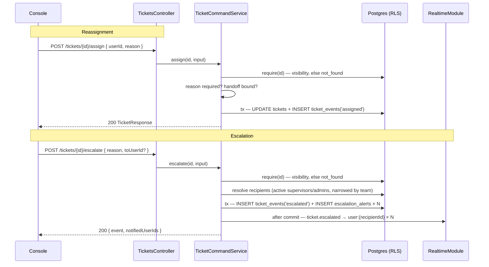

# Ticket reassignment and escalation (TAR-467)

Status: **accepted**, amended 2026-08-20 (TAR-584) · [Amendments](#amendments): 2.
Inherits: [0002 — architecture and API contract](./0002-architecture-and-api-contract.md),
[0004 — RBAC permission matrix](./0004-rbac-permission-matrix.md),
[0006 — SLA timers and supervisor alerts](./0006-sla-timers-and-supervisor-alerts.md),
[0008 — assignment rotation and workload](./0008-assignment-rotation-and-workload.md).
Consumed by: TAR-468 (schema), TAR-469 (backend), TAR-470 (frontend), TAR-471 (QA),
TAR-472 (review), TAR-473 (docs).

Reader: engineer.

> **Two amendments are folded in and both are marked ⚠️ at the place they change**, per the
> convention 0008 sets: a reader who trusts a line in a table does not scroll to an appendix.
> **Amendment 1** (ratified TAR-584) — escalation alerts are `notifications` rows of
> `type = 'escalation'`, not a parallel `escalation_alerts` table; decision 5's behaviour is
> unchanged. **Amendment 2** (TAR-584) — the alert reports the ticket's **current** holder,
> read at list time, not its holder at escalation time. See [Amendments](#amendments).

## Context and Problem

TAR-32 asks for two things a ticket cannot do today:

1. an **agent** hands a ticket to a teammate, giving a reason, and the reason is on the
   ticket's history;
2. a ticket is **escalated to a supervisor**, the supervisor is notified, and the
   escalation is in the audit trail.

Most of the machinery already exists and this document is therefore mostly a set of
rulings on what to reuse, not an invention:

- `POST /api/v1/tickets/{id}/assign` ships today (TAR-23, 0008 decision 3). Its input
  schema **already carries an optional `reason`**, and `TicketCommandService.writeAssignment`
  already writes it onto a `ticket_events` row beside `previousAssignedUserId` /
  `previousAssignedTeamId` — the comment there says in as many words that TAR-32's
  `fromValue` has to come from somewhere.
- `ticket_events` is the append-only per-ticket trail, its `type` column is text
  specifically so later stories add types without a migration, and
  `TICKET_EVENT_TYPES` / `TicketEventSchema` are already published in
  `packages/contracts/src/tickets.ts`.
- 0006 already solved "notify a supervisor about a ticket": a durable `sla_alerts` row
  plus one socket emit per row, with recipients derived by `resolveAlertRecipients` in
  `apps/api/src/sla/sla-recipients.ts`.

So there are exactly four open questions, and they are the ones this document answers.

**One is a genuine conflict with a shipped decision.** TAR-32's first acceptance criterion
opens "as an **agent**", and 0004 grants `ticket:assign` to **supervisor and above** — an
agent has no way to move a ticket at all. Widening `ticket:assign` would also hand every
agent the right to take a ticket _off_ a colleague, which is precisely what 0004 split
`conversation:claim` out of `conversation:assign` to prevent. Decision 2 resolves it.

**One is a scope trap.** 0006 rejected a general `notifications` table and predicted the
moment this document is written: "when the second notification type arrives, generalising
it is a rename and a `type` column". This _is_ the second type. Decision 5 says why it is
still not the moment, and states the trigger that makes it one.

## Goals / Non-Goals

**Goals**

- The reassignment endpoint, its required `reason`, and the exact validation-error shape.
- The escalation endpoint and its required `reason`.
- One audit-record shape that reassignment and escalation both fit, structurally
  consistent on actor, target, reason, timestamp and tenant.
- The supervisor notification mechanism: delivery channel and the trigger point in the
  escalation flow.
- The tenant-scoping rule for both endpoints, stated at the layer that enforces it.
- The `GET /api/v1/tickets/{id}/events` read, which is what makes any of it visible.

**Non-Goals**

- **De-escalation, or an "is escalated" state on the ticket.** TAR-32 asks for the
  escalation to be _recorded_ and _delivered_, not for a lifecycle. Adding
  `tickets.escalated_at` would need a resolve flow, a queue filter and an empty state,
  none of which the story asks for. See open question 2.
- **Escalation outside the platform** — email, WhatsApp, push. Explicitly out of scope on
  TAR-32, and 0006 already shaped the transport so a channel can be added later.
- **A realtime push on reassignment.** `TicketCommandService.assign` deliberately emits
  nothing today and this document does not change that; TAR-274's view refetches. Only
  escalation pushes, because only escalation has a recipient who is not looking at the
  ticket.
- **A manager hierarchy.** 0006 decision 4 rejected `users.manager_user_id` for v1 and
  this document reuses that rule rather than reopening it.
- **Reassigning a conversation.** Conversations have their own claim/assign surface.

## Proposed Architecture

Nothing new sits between the console and the database. Two routes are added to the
existing `TicketsController`, one table is added beside `sla_alerts`, and the recipient
rule is imported rather than rewritten.



| Component                 | Responsibility                                                         |
| ------------------------- | ---------------------------------------------------------------------- |
| `TicketsController`       | Two new routes plus `GET /tickets/{id}/events`. Permissions only       |
| `TicketCommandService`    | `assign` gains the reason rule and the handoff bound; `escalate` added |
| `TicketEventQueryService` | New. The event-log read and its keyset page                            |
| `EscalationAlertService`  | New. Recipient resolution, alert writes, the recipient's read surface  |
| `resolveAlertRecipients`  | **Unchanged.** Imported from `sla-recipients.ts`, not copied           |
| `RealtimeRelayService`    | One new event, addressed exactly as `sla.breached` is                  |

## Decision 1 — Reassignment reuses `POST /tickets/{id}/assign`, and `reason` becomes conditionally required

**Trade-off axis: one write surface with a state-dependent rule, vs. two routes with one rule each.**

**Chosen — one route. `reason` is required exactly when the ticket already has an assignee.**

```
required     when before.assignedUserId !== null || before.assignedTeamId !== null
optional     when the ticket is held by nobody
```

The rule is not arbitrary: TAR-32's criterion is about **reassignment** — a write that
takes work away from somebody — and that is precisely the case where the ticket already
has a holder. A supervisor emptying the flagged queue (0008 decision 3) is placing work
nobody held, which is not a handoff and has no handoff to explain.

Because the console must know whether to mark the field required _before_ it submits, the
rule is published as a pure predicate rather than described twice:

```ts
// packages/contracts/src/tickets.ts
export function ticketAssignRequiresReason(ticket: {
  assignedUserId: string | null;
  assignedTeamId: string | null;
}): boolean {
  return ticket.assignedUserId !== null || ticket.assignedTeamId !== null;
}
```

Same shape as `canAgentTransition`, `isSlaBreached` and `TICKET_STATUS_REQUIRES_CLOSE`:
one rule, one file, imported by both halves. A second copy that drifts is a form that
refuses a submit the API would have accepted, or worse, offers one it will not.

`reason` also gains a floor and a trim. Today it is `z.string().max(500)`, so the empty
string satisfies "present" and logs nothing:

```ts
reason: z.string().trim().min(3).max(500).optional(),
```

**The schema cannot enforce the conditional half** — Zod sees the body, not the row — so
`TicketCommandService.assign` raises it after `require(ticketId)`, as
`validation_failed`, with the field named:

```json
{
  "error": {
    "code": "validation_failed",
    "message": "A reason is required when reassigning a ticket somebody already holds.",
    "details": [{ "path": "reason", "message": "Required when the ticket has an assignee." }],
    "requestId": "019fed83-ebd1-774d-86e4-46137546a539"
  }
}
```

`400`, per `API_ERROR_STATUS`. **Not `conflict`** — nothing about the row's state refused a
well-formed request; a field of the body is missing, which is what `validation_failed`
means everywhere else in this API.

Ordering inside `assign` is fixed and reviewable: `require` (visibility) → handoff bound
(decision 2) → reason rule → assignee existence → the no-op check → the write. The reason
rule runs **before** `assertAssigneesExist` so a caller missing a reason is told that,
rather than being sent to check a user id that was fine.

**The existing no-op branch stays and is checked first for reason purposes.** A request
that moves nothing already returns 200 with the current ticket and writes no event
(`movesAnything`). A missing reason on such a request is still refused — silently
accepting it would train a console to omit the field.

**Rejected — always require `reason`.** One rule, no predicate, no state-dependent
branch. Rejected because it puts a mandatory free-text field in front of the supervisor's
flagged-queue placement, which is a bulk triage action TAR-277's guide describes as
clearing a list, and because it is a breaking change to a route TAR-274's console already
calls without one — for a case TAR-32 does not ask about.

**Rejected — a separate `POST /tickets/{id}/reassign`.** One rule per route and no
predicate to publish. Rejected because the two writes are byte-for-byte the same
transaction — the same four assignment and routing columns, the same CHECK constraint,
the same event — so it is two routes over one service method, two RBAC declarations to
keep in step, and a third thing the console has to decide between. 0008 already ruled
that assignment is one route.

## Decision 2 — An agent may hand off a ticket they hold: `ticket:handoff`, granted to every role

**Trade-off axis: widening an existing permission vs. adding a bounded one.**

TAR-32 says "as an agent"; 0004 grants `ticket:assign` to supervisor and above. One of
them has to move.

**Chosen — a new `ticket:handoff` permission held by every role, bounded by the route.**

```ts
// packages/contracts/src/rbac.ts
export const PERMISSIONS = [
  …
  'ticket:assign',
  'ticket:handoff',   // NEW — every role
  'ticket:escalate',  // NEW — every role, decision 3
  'ticket:close',
  …
];

const AGENT_PERMISSIONS = [
  …
  'ticket:update',
  'ticket:handoff',   // NEW
  'ticket:escalate',  // NEW
  'ticket:close',
  …
] as const satisfies readonly Permission[];
```

`supervisor` and `admin` inherit both — the matrix is strictly nested and `admin` is the
whole `PERMISSIONS` set, so nothing else changes.

The route declares the **weaker** permission, and `TicketCommandService.assign` applies
the bound. A caller who does **not** hold `ticket:assign` may write only when all three
hold:

1. **They hold the ticket.** `before.assignedUserId === principal.userId`. Not "their team
   holds it" — a ticket routed to a team is nobody's to give away, and every member could
   otherwise reassign it out from under whoever is working it.
2. **The target is a teammate.** `input.userId` names a user sharing at least one team
   with the caller (`principal.teamIds`), or `input.teamId` names one of the caller's own
   teams. "Teammate" is TAR-32's own word, and it is the bound that stops an agent parking
   work on a team they have nothing to do with.
3. **They are not releasing it.** The result must leave somebody holding the ticket.
   Dropping a ticket back to unassigned is abandonment, not a handoff, and it puts the
   ticket in a state only `ticket:assign` can create.

Any of the three failing is `forbidden` — **not** `not_found`. By this point the caller
has passed `require` and is looking at the ticket, so its existence is not a secret from
them; what is refused is the act. That is 0002's own rule and the same reading
`TicketCloseNotPermittedError` already gets.

A caller holding `ticket:assign` skips all three. Their write is unchanged from today.

This is 0004 invariant 7 applied to tickets, one word for one word: `conversation:claim`
takes what nobody is on and is granted to every role; `conversation:assign` moves what
somebody is on and stays supervisor-and-above. `ticket:handoff` gives away what _you_ are
on. None of the three lets an agent take work off a colleague.

**Rejected — grant `ticket:assign` to agents.** No new permission, no bound, no service
branch. Rejected because it is the exact widening 0004 refused for conversations: every
agent could reassign every ticket they can see, including one a colleague is mid-way
through, and the ticket queue has no claim step to make that recoverable.

**Rejected — no permission; check `assignedUserId === userId` inside the service and
leave the route on `ticket:assign`.** Rejected because the route would then 403 every
agent before the service was reached, and because a role-shaped rule outside
`ROLE_PERMISSIONS` is what `rbac.ts` documents as forbidden. As a permission, the console
gets the handoff button's visibility off `principal.permissions` for free.

⚠️ **This is the review checklist item for TAR-472.** A route whose declared permission is
weaker than one of its behaviours is where authorization bugs live. The bound must be
verified in the diff — an integration test in which an agent reassigns a colleague's
ticket and receives 403 — not assumed from this document.

## Decision 3 — `POST /tickets/{id}/escalate` raises attention; it does not move the assignment

**Trade-off axis: escalation as a reassignment upward, vs. escalation as a signal.**

**Chosen — escalation writes an event and notifies. The ticket does not change hands.**

```
POST /api/v1/tickets/{id}/escalate    ticket:escalate    200 → TicketEscalationResponse
{ "reason": "Customer is threatening chargeback, needs a refund decision.",
  "toUserId": "019fed83-ebd1-774d-86e4-46137546a539" }   // optional
```

The agent keeps the ticket. An escalation that un-assigned the agent would leave the
customer with nobody at 02:14 while the supervisor sleeps, and would silently make
"escalate" the one button that loses your work. A supervisor who wants to take the ticket
uses `POST /tickets/{id}/assign`, which is the route for changing hands — the two stay
orthogonal, and each is one thing.

`reason` is **unconditionally required** here, `z.string().trim().min(3).max(500)`. Unlike
a placement, there is no escalation without something to escalate: the reason is the whole
payload.

`toUserId` is optional and names one supervisor when the agent knows who they need.

- Present: the user must exist in this tenant, be `status: 'active'`, and hold
  `ticket:read_all` — the same population 0006 calls the candidates. Anything else is
  `validation_failed` on `toUserId`, mirroring `UnknownTicketAssigneeError`. Exactly one
  alert row is written.
- Absent: recipients come from `resolveAlertRecipients(candidates, responsibility)` in
  `apps/api/src/sla/sla-recipients.ts`, **imported unchanged**. Active supervisors and
  admins, narrowed to those sharing a team with whoever holds the ticket, falling back to
  every candidate when that yields nobody.

Requiring `ticket:read_all` of a named recipient is not decoration: it is what makes the
notification safe to send. The recipient can already read the ticket, so telling them
about it exposes nothing new — 0006's own argument for the candidate set.

**Re-escalation is allowed.** A second ask an hour after the first is a legitimate act,
and swallowing it would make the button lie in exactly the situation it exists for. Two
consequences, both handled rather than hoped away:

- the console disables the control while the request is in flight, which is what stops the
  double-click;
- the route honours `Idempotency-Key` through the existing generic middleware
  (`apps/api/src/common/idempotency`), so a retry after a dropped response replays the
  first result instead of notifying everybody twice. The header is **optional** — 0002
  requires it on sends and billing only — and this is the first route to accept it
  outside that set, because it is the first non-billing route that genuinely creates.

**The response is not a `TicketResponse`.** Nothing on the ticket moved, so returning one
would tell the console nothing and hide the only fact it needs:

```ts
export const TicketEscalationResponseSchema = z.object({
  event: TicketEventSchema,
  /** Every recipient an alert row was written for. Empty is a real outcome. */
  notifiedUserIds: z.array(IdSchema),
});
```

An empty `notifiedUserIds` is what a tenant with no active supervisor or admin gets
(0006 decision 4, step 5). The escalation is still recorded — it happened — and the console
must say "recorded, but nobody was notified" rather than a green tick. Not an error: the
agent did nothing wrong and has no way to fix it.

**Rejected — escalate by reassigning to a supervisor.** No new route, no new table, no new
event type: `POST /assign` with a supervisor's id already does it. Rejected because it
does not satisfy the acceptance criterion — nothing notifies, "escalated" and "reassigned"
become indistinguishable in the history, and it forces the agent off a ticket they may
still be the right person to work.

**Rejected — a `priority: 'urgent'` bump as the escalation.** Rejected because priority is
a property of the _work_ and escalation is a request aimed at a _person_; conflating them
would make every urgent ticket read as escalated in TAR-30's reporting.

## Decision 4 — The audit record is `ticket_events`, and both actions fit one shape

**`audit_logs` is not touched, deliberately.** `TicketCommandService` already states the
rule: `audit_logs` carries security-relevant events, and reassigning a ticket is ordinary
operational activity that happens hundreds of times a day per tenant. Writing it there
would drown the trail an auditor reads. `ticket_events` is the per-ticket history, and it
is what TAR-32's escalation log means.

`ticket_events.type` is text precisely so a story can add a type without a migration
(TAR-468 therefore has **no** enum change to make here). One type is added:

```ts
export const TICKET_EVENT_TYPES = [
  …
  'assigned',
  'unassigned',
  /**
   * An agent asked for supervisor attention (TAR-32). The assignment does not
   * move — 0011 decision 3 — so this is never an `assigned` event, and the two
   * must stay distinguishable in the history.
   */
  'escalated',
  …
] as const;
```

`assigned` and `unassigned` are **reused** for reassignment. A reassignment is an
assignment whose previous holder happened to be non-null, and a third type meaning "the
assignment moved" would make every consumer learn all three — the argument
`TICKET_EVENT_TYPES` already makes about `reopened`.

### The one shape, and what each column carries

Structural consistency across both actions comes from the table, not from a convention:

| Fact          | Where it lives                         | Reassignment                          | Escalation                                  |
| ------------- | -------------------------------------- | ------------------------------------- | ------------------------------------------- |
| **tenant**    | `ticket_events.tenant_id`              | `NOT NULL`, under RLS                 | same                                        |
| **target**    | `ticket_events.ticket_id`              | composite FK `(tenant_id, ticket_id)` | same                                        |
| **actor**     | `ticket_events.actor_user_id`          | the caller; never null on these two   | same                                        |
| **timestamp** | `ticket_events.created_at`             | `timestamptz(3)`, DB default          | same                                        |
| **reason**    | `ticket_events.data.reason`            | required per decision 1               | always required                             |
| **cause**     | `ticket_events.data.cause`             | `'agent'`                             | `'agent'`                                   |
| **from → to** | `data.previous*` / the row's new state | user and team, both sides             | `data.escalatedToUserId`, null when derived |

`actor_user_id` is nullable on the column because the router and the SLA sweep write
system events through it. **Both of TAR-32's events are always attributed**: neither route
is reachable without a principal, and an event claiming a system actor on a human decision
would be a lie the trail cannot recover from. TAR-471 should assert it.

### The published read shape

`TicketEventSchema` is already published and nothing consumes it yet, so it is amended
additively rather than reinterpreted. `fromValue` / `toValue` stay the scalar pair
(`status_changed`, `priority_changed`); assignment movement gets a nested object, matching
the convention `TicketRouting` and `TicketSla` already set:

```ts
/** Both sides of an assignment change. Null on every event that is not one. */
export const TicketEventAssignmentSchema = z.object({
  fromUserId: IdSchema.nullable(),
  fromTeamId: IdSchema.nullable(),
  toUserId: IdSchema.nullable(),
  toTeamId: IdSchema.nullable(),
});

export const TicketEventSchema = z.object({
  id: IdSchema,
  ticketId: IdSchema,
  type: TicketEventTypeSchema,
  actorUserId: IdSchema.nullable(),
  fromValue: z.string().nullable(),
  toValue: z.string().nullable(),
  assignment: TicketEventAssignmentSchema.nullable(), // NEW
  reason: z.string().nullable(),
  cause: TicketEventCauseSchema.nullable(),
  createdAt: TimestampSchema,
});
```

Per-type encoding, and this table is the contract TAR-470 renders from:

| `type`                | `fromValue`  | `toValue`                        | `assignment` | `reason`                       |
| --------------------- | ------------ | -------------------------------- | ------------ | ------------------------------ |
| `created`             | null         | null                             | null         | null                           |
| `status_changed`      | old status   | new status                       | null         | null                           |
| `priority_changed`    | old priority | new priority                     | null         | null                           |
| `assigned`            | null         | null                             | **set**      | when given                     |
| `unassigned`          | null         | null                             | **set**      | when given                     |
| `escalated`           | null         | named supervisor id, or **null** | null         | **always**                     |
| `assignment_deferred` | null         | null                             | null         | the `FallbackAssignmentReason` |
| `sla_breached`        | null         | the `SlaTargetKind`              | null         | null                           |

`toValue` being null on an `escalated` event is meaningful, not missing: it says the
escalation was addressed to whoever supervises this ticket rather than to a person. The
console renders the two differently.

### `GET /api/v1/tickets/{id}/events`

The read `TicketsController` has reserved since TAR-25 and the only reason any of the
above is visible.

```
GET /api/v1/tickets/{id}/events?limit=&cursor=   ticket:read   → CursorPage<TicketEvent>
```

- **`ticket:read`, and the ticket goes through `TicketQueryService.require` first**, so the
  event log inherits the ticket's visibility rule exactly and cannot become a side channel
  onto a ticket the principal may not open. A ticket they may not see is `not_found`.
- **Ordered `created_at DESC, id DESC`**, served by the existing
  `(tenant_id, ticket_id, created_at DESC, id DESC)` index. No new index.
- **Keyset paginated** through `CursorPageQuerySchema`, like every other list in this API.
  A busy ticket accumulates events indefinitely and an offset page over an append-only log
  is the one shape that silently degrades.
- **No `type` filter at v1.** A ticket's history is short enough to read whole, and adding
  one costs an index on a column whose selectivity nobody has measured.

## Decision 5 — Notification: a durable row per recipient, pushed over the existing socket

⚠️ **The table named throughout this decision is not the table that shipped.** Read
amendment 1 immediately below before anything under it; the storage moved, the behaviour did
not.

> ### ⚠️ Amendment 1 — superseded in storage, unchanged in behaviour (TAR-468) — **ratified**
>
> **What this decision specifies below — a new `escalation_alerts` table — was not
> built. The trigger it named fired first.**
>
> This decision accepted two parallel notification tables explicitly as a price rather
> than a design, and named **the third notification type** as the point to fold them
> into the generic `notifications` table 0006 predicted. TAR-394 reached that point
> first, at the _second_ type: `20260816130000_notifications_generalisation` renamed
> `sla_alerts` to `notifications` and added a `type` column, exactly as 0006 decision 5
> said should happen.
>
> So the premise this decision reasoned from no longer held by the time TAR-468 ran.
> Escalation was not arriving into a world of one bespoke alerts table; it was arriving
> into a world where the generic one already existed, and a fourth parallel table would
> have been the deviation — with precisely the cost this document names below: two
> unread counts, two acknowledge endpoints, and a supervisor who has to look in two
> places.
>
> **What shipped instead** (`20260816150000` + `20260816160000`):
>
> | This decision                                            | What was built                                                                                                                            |
> | -------------------------------------------------------- | ----------------------------------------------------------------------------------------------------------------------------------------- |
> | `escalation_alerts` table                                | `notifications` row with `type = 'escalation'`                                                                                            |
> | `EscalationAlert` model                                  | `Notification`                                                                                                                            |
> | Unique `(tenant_id, ticket_event_id, recipient_user_id)` | **unchanged**, on `notifications`                                                                                                         |
> | Composite FKs to tickets / ticket_events / users         | **unchanged** — `(tenant_id, ticket_event_id)` is a real column, not a `dedupe_key` string, so the structural invariant below still holds |
> | New RLS policy                                           | Not needed — `notifications` already carries one                                                                                          |
> | —                                                        | `notifications_escalation_columns` CHECK, new: `ticket_event_id` non-null exactly for this type                                           |
>
> **Everything else in this decision stands as written**: the transport, the trigger
> point, the transaction boundary, the after-commit emit, and the reasoning for
> `ticket_event_id` as group key and idempotency key at once. The record is still the
> row and the socket is still the immediacy.
>
> **No contract change.** TAR-470 shipped `TicketEscalationResponseSchema` as
> `{ event, notifiedUserIds }` (#155) and publishes no `escalation-alerts` route, so
> nothing downstream referenced the table name.
>
> The `EscalationAlertService` named in the interfaces table above should be read as a
> service over `notifications` filtered to this type — the same arrangement
> `sla-alert.mapper.ts` already uses for `sla_breach`.
>
> **Ratified 2026-08-20 (TAR-584). `notifications.type = 'escalation'` is the decision.**
> Decision 5 named the third notification type as the point to fold the alert tables
> together; TAR-394 reached that point first, so by the time escalation landed the generic
> table was the incumbent and a fourth parallel one would have been the deviation — at
> exactly the cost this decision priced and accepted: two unread counts, two acknowledge
> endpoints, and a supervisor who has to look in two places. The structural invariants the
> decision reasoned from all survive the move: `ticket_event_id` is a real column and not a
> `dedupe_key` string, the composite foreign keys and the recipient uniqueness are unchanged,
> and `notifications_escalation_columns` makes `ticket_event_id` non-null for exactly this
> type. Nothing downstream referenced the table name. Rebuilding `escalation_alerts` to match
> the prose would cost a migration and buy a second place to look.
>
> Everything below this box is kept as written rather than rewritten, because it is the
> record of _why_ the row and the socket are what they are, and that reasoning is unchanged.
> Read every `escalation_alerts` under it as "a `notifications` row of `type = 'escalation'`",
> and `EscalationAlert` / `EscalationAlertService` as `Notification` and a service over
> `notifications` filtered to that type — the arrangement `sla-alert.mapper.ts` already uses
> for `sla_breach`.

**Trade-off axis: a purpose-built table now, vs. the generic `notifications` table 0006 predicted.**

**Chosen — `escalation_alerts`, an exact structural mirror of `sla_alerts`.**

The transport is 0006 decision 5, unchanged and for the same reasons: **the row is the
record, the socket is the immediacy.** A supervisor offline when the escalation fires sees
it on their next list read, which is what makes "the supervisor is notified" true rather
than "a message was emitted".

### `escalation_alerts` — new (TAR-468)

- **Tenant-scoped:** yes. `tenant_id NOT NULL`, standard RLS policy, in the same migration.
- **Model:** `EscalationAlert`
- **Unique:** `(tenant_id, ticket_event_id, recipient_user_id)`
- **Indexes:**
  - `(tenant_id, recipient_user_id, created_at DESC, id DESC)` — the recipient's list and
    its keyset page
  - `(tenant_id, ticket_id)` — "what escalations did this ticket raise"
- **Relations:** composite FKs `(tenant_id, ticket_id) → tickets`,
  `(tenant_id, ticket_event_id) → ticket_events`,
  `(tenant_id, recipient_user_id) → users` with `onDelete: NoAction` — matching every other
  user reference in `schema.prisma`, because removing a user is a status change and never
  a row delete.
- **Owned by:** TAR-468

| Column              | Notes                                                                                                                                                            |
| ------------------- | ---------------------------------------------------------------------------------------------------------------------------------------------------------------- |
| `ticket_event_id`   | The `escalated` event this alert belongs to. **The group key** — N recipient rows point at one escalation act, so the console shows one escalation and not three |
| `recipient_user_id` | One row per person told. The read rule is "you are a named recipient"                                                                                            |
| `acknowledged_at`   | First write wins; a second acknowledge is not a conflict                                                                                                         |

`ticket_event_id` doing double duty as group key and idempotency key is the point of the
design. There is no natural uniqueness on `(ticket, recipient)` — a second escalation an
hour later must notify again — but a _retry of one escalation_ must not, and the event row
is already unique. It also means the alert can never reference an escalation that is not in
the audit trail.

⚠️ **TAR-468 must add `@@unique([tenantId, id])` to `TicketEvent`.** The composite FK
`(tenant_id, ticket_event_id)` has nothing to reference without it. `Ticket` already
carries the same constraint for the same reason.

### Trigger point, and the transaction boundary

The order is fixed and is the reviewable part:

1. `require(ticketId)` — visibility.
2. Resolve recipients. **Outside** the transaction, and knowingly: a supervisor suspended
   in the milliseconds between the read and the write is told about one ticket they can no
   longer act on. A lock spanning the two is a heavier cure than the disease — the same
   trade `assertAssigneesExist` already makes.
3. **One transaction:** insert the `escalated` `ticket_events` row, then insert the
   `escalation_alerts` rows referencing it. Both or neither. An alert without an audit
   entry is a notification nobody can explain; an audit entry without alerts claims a
   supervisor was told when none was. This is the argument `AuditService` makes for taking
   the caller's transaction client, applied here.
4. **After commit:** emit `ticket.escalated` once per row actually inserted. If the
   process dies between commit and emit, the rows exist and the supervisor sees them on
   their next read — the loss is the push, not the record.

### The realtime event

```ts
z.object({
  event: z.literal('ticket.escalated'),
  alert: EscalationAlertResponseSchema,
  ticket: TicketResponseSchema,
}),
```

Emitted to `userRoom(alert.recipientUserId)`, **once per inserted row and to nobody else**.
Deliberately not `tenantReadersRoom` and not `tenantRoom`: the realtime contract's own
amendment rules that a fan-out wider than the read rule is an authorization bypass, the
read rule here is "you are a named recipient", and the rows say who that is. `ticket` rides
along so the console renders without a second fetch, per that file's whole-resources rule.

### The recipient's read surface

Mirrors `sla-alerts` route for route, so there is one shape to learn:

```
GET  /api/v1/escalation-alerts?unacknowledgedOnly=&limit=&cursor=   ticket:read
POST /api/v1/escalation-alerts/{id}/acknowledge                     ticket:read
```

`unacknowledgedOnly` defaults **true** — the landing view is what still needs attention —
and is `z.stringbool()`, not `z.boolean()`, for the reason `SlaAlertListQuerySchema`
documents at length: it parses a query string, `"false"` arrives as four characters, and
`z.coerce.boolean()` would turn the filter _on_ for `?unacknowledgedOnly=false`.

**No `_all` permission.** Every row names its recipient and the query narrows to
`recipient_user_id = principal.userId` on top of RLS. Another principal's alert answers
`not_found`, never `forbidden` — a 403 confirms the id names a real alert.

**Rejected — generalise `sla_alerts` into a `notifications` table now.** 0006 predicted
this moment and it is factually the second notification type, so this is the strongest
alternative and it is rejected on scope rather than on principle: doing it means migrating
a shipped table, rewriting `GET /api/v1/sla-alerts`, the `sla.breached` event and TAR-281's
console surface, all inside a story estimated at one backend day and whose acceptance
criteria say nothing about SLA. Two purpose-built tables is the honest cost of not doing it.

⚠️ **The trigger is stated so it is not rediscovered:** the **third** notification type —
`@mention` in an internal note is the likely one — forces the generalisation, and it should
be filed as its own story rather than smuggled into whichever feature arrives third. See
open question 1.

**Rejected — socket only, no table.** 0006 rejected it and the reason is unchanged: a
supervisor offline at 02:14 never learns, and there is nothing to make delivery idempotent
with.

**Rejected — write to `audit_logs` and let the console poll it.** Rejected for decision 4's
reason and one more: `audit_logs` has no recipient column, so there would be nothing to
address a notification to.

## Technology Choices

Everything in ADRs 0001, 0002, 0004, 0006 and 0008 is inherited unchanged. Only what this
document adds:

| Concern               | Choice                                     | Alternatives considered                           | Rationale                                                                                    |
| --------------------- | ------------------------------------------ | ------------------------------------------------- | -------------------------------------------------------------------------------------------- |
| Reassignment surface  | Existing `POST /tickets/{id}/assign`       | A separate `/reassign` route                      | Identical transaction; two routes over one method is two RBAC surfaces                       |
| Reason enforcement    | Service-side, conditional on the row       | Always-required in the Zod schema                 | Matches the criterion; no break to TAR-274's shipped console                                 |
| Agent's right to move | New `ticket:handoff`, bounded by the route | Widening `ticket:assign`                          | 0004 invariant 7, applied to tickets one word for one word                                   |
| Escalation semantics  | Signal; assignment untouched               | Reassign upward; priority bump                    | Escalating must not lose the customer their agent                                            |
| Escalation record     | `ticket_events` type `escalated`           | `audit_logs` row                                  | Operational, not security-relevant; text `type` needs no migration                           |
| Notification store    | ⚠️ `notifications`, `type = 'escalation'`  | A parallel `escalation_alerts` table; socket only | Survives an offline supervisor. Amendment 1: the generic table existed before this story ran |
| Notification push     | `ticket.escalated` → `user:{id}`           | `tenant:{id}` broadcast                           | The socket audience must equal the rows written                                              |
| Duplicate escalation  | Allowed; optional `Idempotency-Key`        | Refuse while one is open; time-window suppression | A second ask after silence is legitimate; suppression is magic                               |

## Data Model

Only `escalation_alerts` is new (specified under decision 5). Everything else is an
existing table gaining rows:

| Table           | Change                                                                                                                                                              |
| --------------- | ------------------------------------------------------------------------------------------------------------------------------------------------------------------- |
| `tickets`       | **None.** Decision 3 keeps the assignment columns out of the escalation path                                                                                        |
| `ticket_events` | `@@unique([tenantId, id])` for the composite FK. New `type` value needs no DDL                                                                                      |
| `notifications` | ⚠️ Rows of `type = 'escalation'`, plus the `notifications_escalation_columns` CHECK. **No new table** — amendment 1; this row read `escalation_alerts` as specified |

**No enum is added.** `ticket_events.type` is text by design, and `notifications.type` is
text for the same reason — that is what let escalation become a type rather than a table.

**The migration is reversible.** ⚠️ As shipped (amendment 1) the down path drops the CHECK
and the escalation columns rather than a table; nothing is backfilled, and no existing row is
rewritten. As originally specified it was `DROP TABLE escalation_alerts`.

## Interfaces

The complete published surface. TAR-469 implements exactly this and TAR-470 mocks exactly
this; any mismatch is raised with the architect, not settled privately between them.

```ts
// packages/contracts/src/rbac.ts        — decision 2
'ticket:handoff' | 'ticket:escalate'   // added to PERMISSIONS and AGENT_PERMISSIONS

// packages/contracts/src/tickets.ts    — decisions 1, 3, 4
export function ticketAssignRequiresReason(ticket: {
  assignedUserId: string | null;
  assignedTeamId: string | null;
}): boolean;

export const TicketAssignInputSchema = z
  .object({
    userId: IdSchema.nullable().optional(),
    teamId: IdSchema.nullable().optional(),
    reason: z.string().trim().min(3).max(500).optional(),
  })
  .refine((v) => v.userId !== undefined || v.teamId !== undefined, {
    message: 'Provide at least one of userId or teamId',
  });

export const TicketEscalateInputSchema = z.object({
  reason: z.string().trim().min(3).max(500),
  /** A named supervisor. Absent means "whoever supervises this ticket". */
  toUserId: IdSchema.optional(),
});

export const TicketEventAssignmentSchema = z.object({
  fromUserId: IdSchema.nullable(),
  fromTeamId: IdSchema.nullable(),
  toUserId: IdSchema.nullable(),
  toTeamId: IdSchema.nullable(),
});

export const TicketEscalationResponseSchema = z.object({
  event: TicketEventSchema,
  notifiedUserIds: z.array(IdSchema),
});

export const TicketEventListQuerySchema = CursorPageQuerySchema;

// packages/contracts/src/escalations.ts — new file, decision 5
export const EscalationAlertResponseSchema = z.object({
  id: IdSchema,
  ticketId: IdSchema,
  ticketNumber: z.int().positive(),
  ticketEventId: IdSchema,
  /** Who asked for help. */
  raisedByUserId: IdSchema,
  reason: z.string(),
  /**
   * ⚠️ The ticket's **current** assignment, read off the ticket at list time — not a
   * snapshot of who held it when the escalation fired (amendment 2). A ticket reassigned
   * since reads as it stands now.
   */
  assignedUserId: IdSchema.nullable(),
  assignedTeamId: IdSchema.nullable(),
  acknowledgedAt: TimestampSchema.nullable(),
  createdAt: TimestampSchema,
});

export const EscalationAlertListQuerySchema = CursorPageQuerySchema.extend({
  unacknowledgedOnly: z.stringbool().default(true),
});

// packages/contracts/src/realtime.ts    — decision 5
{ event: 'ticket.escalated', alert: EscalationAlertResponseSchema, ticket: TicketResponseSchema }
```

`raisedByUserId` and `reason` are denormalised onto the alert response from the
`ticket_events` row so the supervisor's list needs no join — the same call `sla_alerts`
makes with `kind` and `due_at`, and for the same reason.

### Routes

| Method | Path                                         | Permission        | Success | Body → Response                                    |
| ------ | -------------------------------------------- | ----------------- | ------- | -------------------------------------------------- |
| `POST` | `/api/v1/tickets/{id}/assign`                | `ticket:handoff`  | `200`   | `TicketAssignInput` → `TicketResponse`             |
| `POST` | `/api/v1/tickets/{id}/escalate`              | `ticket:escalate` | `200`   | `TicketEscalateInput` → `TicketEscalationResponse` |
| `GET`  | `/api/v1/tickets/{id}/events`                | `ticket:read`     | `200`   | — → `CursorPage<TicketEvent>`                      |
| `GET`  | `/api/v1/escalation-alerts`                  | `ticket:read`     | `200`   | — → `CursorPage<EscalationAlertResponse>`          |
| `POST` | `/api/v1/escalation-alerts/{id}/acknowledge` | `ticket:read`     | `200`   | — → `EscalationAlertResponse`                      |

`200` on both POSTs, not `201`. `assign` returns the ticket as it now stands, and
`escalate` returns a record the caller addresses by ticket and never by its own URL — there
is no resource location to hand back.

### Errors

Every code is already in `API_ERROR_CODES`. **No new error code is introduced**, and none
should be: inventing one would make `error-codes.ts` something an implementation edits.

| Condition                                                                         | Code                     | Status |
| --------------------------------------------------------------------------------- | ------------------------ | ------ |
| Ticket unknown, in another tenant, or not visible to the caller                   | `not_found`              | 404    |
| `reason` missing on a reassignment (decision 1)                                   | `validation_failed`      | 400    |
| `reason` missing, blank, or under 3 characters on an escalation                   | `validation_failed`      | 400    |
| Neither `userId` nor `teamId` on an assign                                        | `validation_failed`      | 400    |
| `userId` / `teamId` / `toUserId` names nobody in this tenant, or an inactive user | `validation_failed`      | 400    |
| `toUserId` names a user who does not hold `ticket:read_all`                       | `validation_failed`      | 400    |
| Path id is not a UUID                                                             | `validation_failed`      | 400    |
| Agent reassigning a ticket they do not hold                                       | `forbidden`              | 403    |
| Agent reassigning to a non-teammate                                               | `forbidden`              | 403    |
| Agent releasing a ticket (leaving it unassigned)                                  | `forbidden`              | 403    |
| Another principal's escalation alert                                              | `not_found`              | 404    |
| Tenant deactivated with a session still open                                      | `forbidden`              | 403    |
| `Idempotency-Key` replayed with a different body                                  | `idempotency_key_reused` | 409    |

The `not_found`-vs-`forbidden` split follows `tickets.http.ts` exactly: a resource the
caller may not _see_ is `not_found`; an act they may not _perform_ on a resource they are
looking at is `forbidden`.

## Failure Modes and Operations

| Condition                                               | Behaviour                                                                                           | What to watch                                                                      |
| ------------------------------------------------------- | --------------------------------------------------------------------------------------------------- | ---------------------------------------------------------------------------------- |
| Tenant has no active supervisor or admin                | Event written, zero alert rows, warning logged naming the ticket. `notifiedUserIds: []`             | Count of escalations with zero recipients — a real one is a misconfigured tenant   |
| Recipient suspended between resolution and commit       | One alert row for somebody who can no longer act. Accepted (decision 5, step 2)                     | —                                                                                  |
| Process dies between commit and socket emit             | Rows exist; recipient sees them on next list read. Push lost, record kept                           | Gap between `escalation_alerts` inserts and emits                                  |
| Socket disconnected / supervisor offline                | Identical to the above by construction. This is why the row exists                                  | —                                                                                  |
| Escalation transaction fails                            | Neither event nor alerts. Caller gets `internal_error` and can retry                                | Rollback rate on the escalate route                                                |
| Two agents reassign the same ticket at once             | Last writer wins, both on the event log. Unchanged from today (0008)                                | —                                                                                  |
| Ticket reassigned while an escalation is unacknowledged | Both stand. ⚠️ The alert names the ticket's **current** holder, re-read on every list (amendment 2) | —                                                                                  |
| `escalation_alerts` grows without bound                 | Same unbounded-growth gap `sla_alerts` has today                                                    | Row count per tenant — see open question 3                                         |
| An agent escalates the same ticket repeatedly           | Every escalation notifies. Not rate-limited at v1                                                   | Escalations per ticket; a tenant above ~3 is a process problem, not a platform one |

Nothing here pages anyone. An escalation that reaches no recipient is the one worth an
alert rule, and it is a tenant-configuration signal rather than a platform fault.

## Security and Access

- **Tenant scoping is the database's job, not the service's.** Both routes run through
  `TenantPrisma` under RLS with the GUC set by `HostTenantGuard`; `tenant_id` is never read
  from a request body. `escalation_alerts` carries `tenant_id NOT NULL` with the standard
  policy and **composite** foreign keys on `(tenant_id, ticket_id)`,
  `(tenant_id, ticket_event_id)` and `(tenant_id, recipient_user_id)` — so a row pairing one
  tenant's ticket with another's user is refused by the database and not by an `if`. That
  is TAR-468's "enforced at the data layer, not left to application code alone".
- **No cross-tenant reassignment or escalation is expressible.** Every id in a body is
  resolved through `TenantPrisma` before it is used, so another tenant's user or team is
  simply not there and answers `validation_failed` on the field — never a foreign-key
  violation surfacing as `internal_error`, and never a 404 that would confirm the id names
  something real elsewhere.
- **A ticket in another tenant is `not_found`.** Under RLS it is invisible before any
  permission is considered, so there is no path where a 403 could leak its existence.
- **The socket audience equals the rows written.** One emit per `escalation_alerts` row, to
  that recipient's user room. No tenant-wide fan-out on either event.
- **Notification payloads carry no message content** — a ticket number, ids, and the
  agent-supplied reason. The reason is free text an agent wrote about their own tenant's
  ticket and goes only to principals who already hold `ticket:read_all`, so it discloses
  nothing they could not read.
- **`reason` is tenant data and may contain PII.** It lives in `ticket_events.data` and is
  read by that tenant only. It must **not** be copied into `audit_logs`, which is exported
  for compliance review — the rule `audit.actions.ts` already states for routing-rule
  conditions.
- No secret, token or credential appears in any shape in this document.

## Implementation Phases

The sub-issues already exist. This maps onto them rather than proposing new ones.

| Stage | Task        | Delivers                                                                                                                                                                                                                                         | Unblocks |
| ----- | ----------- | ------------------------------------------------------------------------------------------------------------------------------------------------------------------------------------------------------------------------------------------------ | -------- |
| 2     | **TAR-468** | `escalation_alerts` with its RLS policy, composite FKs, unique and both indexes; `@@unique([tenantId, id])` on `TicketEvent`; reversible migration. **No enum, no `ALTER TABLE tickets`**                                                        | 469      |
| 3     | **TAR-469** | The `rbac.ts` and `tickets.ts` contract diffs; `escalations.ts`; the reason rule and the handoff bound in `TicketCommandService`; `escalate`; `GET /tickets/{id}/events`; `EscalationAlertService` and its two routes; the realtime event        | 471      |
| 3     | **TAR-470** | Reassign and escalate forms with a required reason; the ticket history view; the supervisor's escalation list. **Starts immediately** — every shape it needs is in this document, and `apps/web/lib/api/mock/handlers.ts` is where it mocks them | 471      |
| 4     | **TAR-471** | Both Given/When/Then criteria end to end, plus the negative set below                                                                                                                                                                            | 472      |
| 5     | **TAR-472** | Review, with decision 2's ⚠️ as the checklist item                                                                                                                                                                                               | 473      |
| 6     | **TAR-473** | `docs/reference/tickets-api.md`, a tenant-user guide for both flows, changelog                                                                                                                                                                   | —        |

TAR-470 does **not** wait on TAR-469. The contract above is the fixed artifact; a mismatch
found while mocking is raised here, not resolved privately with the backend.

### What TAR-471 must cover beyond the happy path

1. Reassignment of a held ticket with no `reason` → 400 `validation_failed`, `path: 'reason'`.
2. Placement of an **unheld** ticket with no `reason` → 200. The asymmetry is the design.
3. `reason: '   '` → 400. Whitespace is not a reason.
4. Escalation with no `reason` → 400.
5. Agent reassigning a ticket assigned to a **colleague** → 403.
6. Agent reassigning their own ticket to a **non-teammate** → 403.
7. Agent releasing their own ticket → 403; the same request from a supervisor → 200.
8. Cross-tenant: a ticket id from tenant B under tenant A's host → 404, under all three
   roles. A `toUserId` from tenant B → 400, and **no row is written**.
9. Escalation writes exactly one `ticket_events` row and one `escalation_alerts` row per
   resolved recipient, in one transaction — assert no alert survives a forced rollback.
10. A tenant with no active supervisor: the event is written, `notifiedUserIds` is empty,
    the request still succeeds.
11. `GET /tickets/{id}/events` on a ticket the principal cannot see → 404, not 403.
12. `GET /escalation-alerts` returns only the calling principal's rows; another
    principal's alert id on `acknowledge` → 404.

## Open Questions and Risks

| #   | Item                                                                                                                                                        | Severity | Proposed resolution                                                                                                                                                                   |
| --- | ----------------------------------------------------------------------------------------------------------------------------------------------------------- | -------- | ------------------------------------------------------------------------------------------------------------------------------------------------------------------------------------- |
| 1   | ~~**Two notification tables now exist.**~~ **Resolved.** They never did: TAR-394 folded `sla_alerts` into `notifications` before this story ran             | —        | Closed by amendment 1. Escalation is `notifications.type = 'escalation'`; there is one alert table, one unread count and one acknowledge surface                                      |
| 2   | **No de-escalation and no "is escalated" state.** A ticket escalated in error stays escalated in the history, and nothing lists open escalations per ticket | Medium   | Out of scope here. `acknowledged_at` on the alert is the supervisor's half. If tenants ask for a ticket-level state, it is a column plus a filter plus a resolve flow — its own story |
| 3   | **`escalation_alerts` retention is unset**, inheriting the same gap 0006 left open for `sla_alerts`                                                         | Low now  | Settle both together in the wider retention story rather than inventing a second policy. Must be decided before the first large tenant                                                |
| 4   | **Is an agent allowed to escalate a ticket they do not hold?** As specified, yes — `ticket:escalate` is bounded only by `require`'s visibility rule         | Low      | Deliberate: a colleague spotting a problem on a team ticket should be able to raise it. Revisit if escalation volume suggests it is being used as a comment channel                   |
| 5   | **`Idempotency-Key` on a non-billing, non-send route** is a first for this API                                                                              | Low      | The middleware is generic and the header stays optional. TAR-472 should confirm the replay path returns the original `notifiedUserIds` rather than re-resolving                       |
| 6   | **`ticket:handoff` and `ticket:escalate` are granted to every role**, so `ROLE_PERMISSIONS.agent` grows by two                                              | Low      | Intended. Both are bounded rights over work the agent already has; neither reaches a ticket they cannot see                                                                           |

## Amendments

Both are corrected ⚠️ at their original locations as well as recorded here, per the
convention [0008](./0008-assignment-rotation-and-workload.md#amendments) sets: a reader who
trusts a line in a table will not scroll to an appendix.

### Amendment 1 — escalation alerts are `notifications` rows, not a table (TAR-468) — **ratified 2026-08-20**

Body under [decision 5](#decision-5--notification-a-durable-row-per-recipient-pushed-over-the-existing-socket),
where the specification it corrects lives.

**Ratified as `notifications.type = 'escalation'`.** Decision 5 accepted two parallel alert
tables as a priced cost and named the **third** notification type as the trigger to fold
them into the generic table 0006 predicted. TAR-394's
`20260816130000_notifications_generalisation` reached that trigger first, at the second
type. So TAR-468 did not choose against this document; it arrived after the premise this
document reasoned from had already expired, and building `escalation_alerts` anyway would
have bought precisely the cost decision 5 named — two unread counts, two acknowledge
endpoints, one supervisor looking in two places.

Ratified rather than overruled because every invariant decision 5 argued for survives the
move: `ticket_event_id` is a real column carrying the composite foreign key, not a
`dedupe_key` string, so an alert still cannot reference an escalation absent from the audit
trail; `(tenant_id, ticket_event_id, recipient_user_id)` is unchanged, so a retried
escalation still cannot double-notify while a second escalation still can;
`notifications_escalation_columns` makes `ticket_event_id` non-null for exactly this type,
which is stricter than the original table's nullability would have been. The published
surface never referenced the storage — `TicketEscalationResponseSchema` is `{ event,
notifiedUserIds }` (#155) and the `escalation-alerts` routes shipped as specified — so
overruling would cost a migration and a rewrite of a shipped read path to buy a name.

**Consequences recorded elsewhere in this document:** the Technology Choices "Notification
store" row, the Data Model table and its reversibility note, and open question 1, which is
closed rather than deferred.

### Amendment 2 — the alert names the ticket's **current** holder, not its holder at escalation time (TAR-584)

Two places said the escalation alert reports the ticket's holder _at escalation time,
deliberately_: the `assignedUserId` comment in Interfaces and the
reassigned-while-unacknowledged row in Failure Modes. **Neither describes what shipped, and
the code is the one that is right.**

`EscalationAlertResponse` is assembled in `apps/api/src/tickets/escalation-alert.mapper.ts`,
whose projection reads the assignment through the **ticket** relation
(`ticket: { select: { assignedUserId, assignedTeamId } }`), evaluated when the list is
served. A ticket reassigned after the escalation therefore reads as it stands now, on every
read.

**Trade-off axis: the alert as an actionable work item, vs. the alert as an audit record.**

**Chosen — the current holder, re-read on every list.** A supervisor opens an
unacknowledged escalation in order to act on it, and the only assignment that can be acted
on is the one in force now. An alert naming the agent who handed the ticket on two hours ago
sends the supervisor to the wrong person and does it silently, because the row looks
authoritative either way.

**Rejected — snapshot the assignment onto the escalation.** It is neither free nor needed.
Not free: by decision 4's per-type encoding an `escalated` event carries `assignment: null`,
and its JSONB payload carries only `reason`, `cause` and the optional `escalatedToUserId` —
who held the ticket at that instant is recorded nowhere on the escalation, so this is new
payload keys or new columns, a writer change, a mapper change, and a ruling on what the rows
already committed are supposed to say. Not needed: `ticket_events` answers it already. The
`assigned` / `unassigned` events carry both sides of every move, so the holder at any
instant is the last such event before the escalation's `created_at` — reconstructable from
the append-only trail decision 4 exists to provide. **The alert is the work item;
`ticket_events` is the record.** Carrying the point-in-time fact in both places would create
a second source for it and make the alert the one a console trusts.

**Also corrected: `packages/contracts/src/escalations.ts`.** The published doc comment on
`assignedUserId` opened with "Who was holding the ticket **when it was escalated**" and then
described current-holder behaviour in its second clause (#161), so the field's only
contract-level description contradicted itself. It now states the semantics once.

**Nothing about the running system changes.** No schema, no query, no response shape, no
field name: `assignedUserId` / `assignedTeamId` are accurate names for the ticket's
assignment and stay as they are. This amendment is a correction to the specification, not a
change request.

**What would reopen this.** A tenant asking "who was holding it when it was escalated?" as a
list-level fact rather than a per-ticket lookup — a reporting requirement, not this story's.
It is answerable from `ticket_events` without a schema change, and should be built as a
reporting read rather than by widening the alert.
