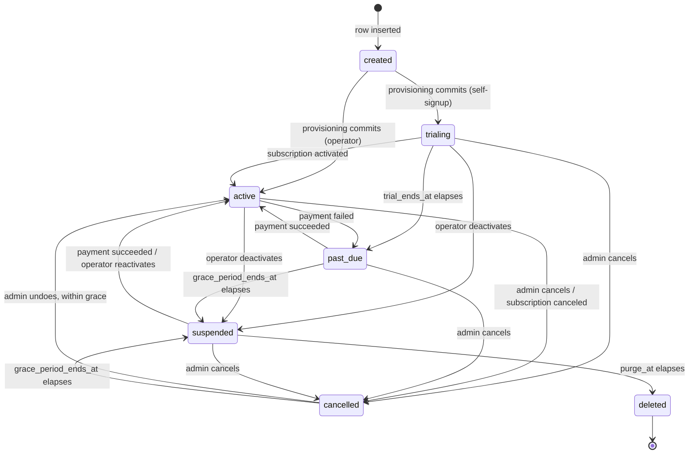

# Tenant lifecycle state machine, and what of it is built (TAR-414)

Status: reference companion to
[0009 — tenant lifecycle, self-signup and the retention contract](./0009-tenant-lifecycle-and-self-signup.md)
· **Decides nothing.** 0009 is the design authority and every "why" lives there · As built on
`main` at `1c0b98f`, 20 August 2026

Written for engineers. 0009 is 1 184 lines and answers "why is it this shape"; this page answers
the two questions a reader has when they arrive at the code — **what are the states and the
edges**, and **which of them has a writer today**. When the lifecycle engine lands, the _As built_
column in [Every edge](#every-edge) is the part that changes and the rest does not.

The published vocabulary is `TENANT_STATUSES`, `TENANT_STATUS_TRANSITIONS`,
`TENANT_STATUS_EFFECTS`, `LIFECYCLE_TRIGGERS` and `LIFECYCLE_POLICY` in
`packages/contracts/src/tenant.ts`, and the `tenant_status` and `lifecycle_trigger` enums in
`apps/api/prisma/schema.prisma`. Those files are the source of truth; the tables here state what
they cannot show at a glance.

## The seven states



| State       | Means                                                               | Console badge     |
| ----------- | ------------------------------------------------------------------- | ----------------- |
| `created`   | The row exists and nothing else does. Never observable — see below  | _Setting up_      |
| `trialing`  | A working product on the trial plan's caps, until `trial_ends_at`   | _Trial_           |
| `active`    | A working product with whatever caps the tenant was sold            | _Active_          |
| `past_due`  | A payment has not gone through. Nothing about the product changes   | _Payment overdue_ |
| `suspended` | People are locked out. Inbound messages still land. Nothing deleted | _Suspended_       |
| `cancelled` | Closing. Still working, counting down to `suspended`                | _Closing_         |
| `deleted`   | A tombstone. The tenant's data is gone and the slug stays claimed   | _Deleted_         |

Badges are `workspace.statuses` in `apps/web/content/en.ts` — the console says _workspace_ where
this page says _tenant_, per [the style guide](../STYLE.md#terminology).

Three properties of the graph are load-bearing, and 0009 argues each of them:

- **Everything funnels through `suspended` before `deleted`.** There is no `cancelled → deleted`
  edge. `purge_at` is set on entry to `suspended` and nowhere else, so there is one timer, one
  sweep branch and one code path that can destroy data.
- **`deleted` has no outbound edge.** A tenant that came back from `deleted` would be a tenant
  whose rows were not actually deleted. `contract.test.ts` asserts this.
- **`created` is never served.** Provisioning leaves it inside the transaction that inserted the
  row, so no tenant is ever observable in it. Keeping the value is what makes the database gate
  refusing it meaningful rather than theatre.

## Every edge

`Trigger` is the `lifecycle_trigger` value the transition must carry. An edge taken with the
wrong trigger is a bug, not a shortcut — `active → past_due` from a UI button is the example
0009 uses.

| From        | To          | Trigger                              | What causes it                                      | As built                                |
| ----------- | ----------- | ------------------------------------ | --------------------------------------------------- | --------------------------------------- |
| `created`   | `trialing`  | `system`                             | `POST /api/v1/signup/verify` provisions             | **Built** — `TenantSignupService`       |
| `created`   | `active`    | `system`                             | `POST /api/v1/admin/tenants` provisions             | **Built** — `TenantProvisioningService` |
| `trialing`  | `active`    | `billing_event`                      | A subscription is activated                         | Not built — no `BillingEvent` producer  |
| `trialing`  | `past_due`  | `timer`                              | `trial_ends_at` elapses with no subscription        | Not built — no sweep                    |
| `trialing`  | `cancelled` | `user_action`                        | The tenant admin cancels                            | Not built — no endpoint                 |
| `trialing`  | `suspended` | `operator_action`                    | An operator deactivates                             | **Built** — `TenantDeactivationService` |
| `active`    | `past_due`  | `billing_event`                      | A charge fails                                      | Not built                               |
| `active`    | `cancelled` | `user_action` \| `billing_event`     | The admin cancels, or the subscription is cancelled | Not built                               |
| `active`    | `suspended` | `operator_action`                    | An operator deactivates                             | **Built** — `TenantDeactivationService` |
| `past_due`  | `active`    | `billing_event`                      | A retried charge succeeds                           | Not built                               |
| `past_due`  | `suspended` | `timer`                              | `grace_period_ends_at` elapses                      | Not built — no sweep                    |
| `past_due`  | `cancelled` | `user_action`                        | The tenant admin cancels                            | Not built                               |
| `cancelled` | `active`    | `user_action`                        | The admin undoes it inside the grace period         | Not built                               |
| `cancelled` | `suspended` | `timer`                              | `grace_period_ends_at` elapses                      | Not built — no sweep                    |
| `suspended` | `active`    | `billing_event` \| `operator_action` | Payment succeeds, or an operator reactivates        | Not built — no reactivate route         |
| `suspended` | `cancelled` | `user_action`                        | The tenant admin cancels                            | Not built                               |
| `suspended` | `deleted`   | `timer`                              | `purge_at` elapses and the purge finishes           | Not built — no purge                    |

Four things about the built column that a reader will otherwise discover by grepping:

1. **No transition writes `lifecycle_events`.** The table, its append-only trigger and its
   grants shipped with TAR-403, and the only rows in it are the ones that migration backfilled.
   Nothing in `apps/api/src` writes it — `TenantLifecycleService` does not exist yet.
2. **No transition sends an email.** `OutboundEmail.template` gained `signup_verification` and
   nothing else; the eight lifecycle templates 0009 decision 7 specifies are unwritten.
3. **`TenantDeactivationService` does not consult `TENANT_STATUS_TRANSITIONS`.** It refuses only
   `suspended`, `cancelled` and `deleted`, so deactivating a tenant sitting in `created` would
   take an edge the map does not contain. Unreachable in practice — provisioning leaves `created`
   inside its own transaction — but it is enforcement by a second list rather than by the map,
   and it goes away when the service delegates to `transition()` as 0009 requires.
4. **Deactivation stamps `suspended_at` and no other timer.** `purge_at` stays null, so an
   operator-deactivated tenant has no retention clock running and would not be purged even if
   the sweep existed.

## The windows

`LIFECYCLE_POLICY` in `packages/contracts/src/tenant.ts`. These are **lengths, not instants**:
the database stores only the instant a timer fires at, so revising a value here changes when
future timers fire and cannot silently re-date one already running.

| Key                       | Value | What it times                                                       |
| ------------------------- | ----- | ------------------------------------------------------------------- |
| `trialDays`               | 14    | `trialing` → `past_due`. Stamped as `trial_ends_at` at provisioning |
| `pastDueGraceDays`        | 14    | `past_due` → `suspended`                                            |
| `cancelledGraceDays`      | 7     | `cancelled` → `suspended`, and the undo window                      |
| `purgeAfterSuspendedDays` | 30    | `suspended` → `deleted`                                             |
| `deletionReminderDays`    | 7     | The last warning before the purge                                   |
| `trialEndingReminderDays` | 3     | The trial-ending warning                                            |
| `signupTokenTtlMs`        | 24 h  | A verification link, and the slug reservation behind it             |

Only `trialDays` and `signupTokenTtlMs` have a reader on `main`; the rest are published and
unconsumed until the sweep exists.

`purgeAfterSuspendedDays` is the one number here that is a policy decision rather than an
engineering one, and the only one irreversible in the wrong direction. 0009 open question 1 asks
for it to be confirmed before the engine ships.

> **TODO(author):** 0009 open question 1 — is `purgeAfterSuspendedDays = 30` confirmed? TAR-18
> records it as "default 30 days pending client policy". Nothing in the repository records an
> answer, and the constant ships as 30.

The columns those windows are written to are on `tenants`: `trial_ends_at`,
`grace_period_ends_at`, `purge_at`, `purge_started_at`, `suspended_at`, `cancelled_at` and
`deleted_at`. Only `trial_ends_at` (provisioning) and `suspended_at` (deactivation) have a writer
today. Two partial indexes — `tenants_grace_period_ends_at_idx` and `tenants_purge_at_idx` —
exist for the sweep that will read them.

## Two gates, and only one of them exists

0009 Amendment 1 ruling 1 states the invariant once: **the database gate answers "does this
tenant's data exist and is it intact"; the HTTP gate answers "may this principal reach this route
right now".** Neither carries a copy of the other's policy.

| Gate                                     | Admits                                                            | On `main`                                         |
| ---------------------------------------- | ----------------------------------------------------------------- | ------------------------------------------------- |
| `public.assert_tenant_active(text)`      | `trialing`, `active`, `past_due`                                  | **The live gate.** Every `TenantPrisma` statement |
| `public.assert_tenant_serviceable(text)` | + `suspended`, `cancelled`                                        | Exists, has no callers                            |
| `TenantStatusGuard` (pipeline stage 4)   | Per status × role, with an `@AvailableWhileSuspended()` allowlist | Does not exist — TAR-538                          |

The consequence of only the first one being wired is worth stating plainly, because it is the
opposite of the shipped design and it is what a reader will observe:

- A **suspended** tenant's inbound WhatsApp message is accepted and stored, but never reaches the
  tenant's inbox. The divergence from `TENANT_STATUS_EFFECTS.suspended.inboundAccepted` is real
  and narrower than "refused" — see [What happens to a suspended tenant's webhook](#what-happens-to-a-suspended-tenants-webhook)
  below. This is the behaviour TAR-403 shipped deliberately — 0009 records that loosening a
  security gate is not a schema migration's call — and ruling 1 resolves it the other way, in a
  migration that creates the replacement function without moving the call site.
- A **cancelled** tenant's admin cannot log in, so the seven-day undo window `cancelled → active`
  exists for cannot be exercised. There is no cancel endpoint to reach that state through either.

Moving the call site is TAR-404's, and it is a hard gate on `TenantStatusGuard` existing:
`assert_tenant_serviceable` admitting `suspended` with no HTTP gate behind it would give a
suspended tenant's agents their console back.

### What happens to a suspended tenant's webhook

Nothing is bounced and nothing is lost, and it is worth walking the path because "the gate refuses
`suspended`" is only true of one hop in it.

1. **Meta gets its `200`.** `WebhookIngestService` verifies the signature, stores the payload and
   answers, _then_ enqueues — in that order, so a queue outage cannot turn into permanent message
   loss.
2. **The payload is durable before any tenant is known.** `webhook_events` is written through
   `SystemPrisma`; it carries no `tenant_isolation` policy and passes no gate.
3. **Only the projection is gated.** `WhatsAppInboundWriter` writes `conversations` and
   `messages` through `TenantPrisma`, so that is where `TN001` is raised for a suspended tenant.
4. **The event is parked, not dropped.** `whatsapp-event.processor.ts` catches
   `TenantNotActiveError` by name and parks the row — status `failed`, which is this pipeline's
   word for "will not succeed as it stands", not for "discarded" — with reason `tenantNotActive`
   and the raw payload intact. Its own comment: "parking keeps the message replayable if the
   tenant comes back, and stops the retry budget being spent on a refusal that will not change".

So the customer's message is received, acknowledged and retained; what a suspended tenant loses is
the projection into its inbox, not the message.

> ⚠️ **Replay is manual, and there is no surface for it.** A parked row is deliberately **not**
> claimable, so re-enqueueing one does nothing and the sweeper skips it — it scans `received` and
> `processing` only. Replaying is an explicit operator act against the database:
>
> ```sql
> UPDATE webhook_events
>    SET status = 'received', attempts = 0, last_error = NULL
>  WHERE id = $1 AND status = 'failed';
> ```
>
> The next sweep picks it up from there. `WebhookEventsRepository.claim` records that an endpoint
> for this belongs on the platform-admin surface, where the act can be authorised and audited, and
> that there is none yet. **A reactivated tenant does not get its parked messages back on its
> own** — somebody has to run that statement, per event.

## What is not built, in one list

Everything below is published in `packages/contracts` and has no implementation on `main`. It is
TAR-404's scope, and TAR-404's merged pull request (#127) delivered the contract vocabulary
rather than the engine.

- `TenantLifecycleService` — the single writer of `tenants.status`, its `lifecycle_events` row
  and its notification enqueue.
- `TenantStatusGuard` at pipeline stage 4, and the `@AvailableWhileSuspended()` decorator —
  TAR-538. TAR-539 has since built the net beneath it: `AllExceptionsFilter` answers
  `subscription_inactive` (402) for a `TenantNotActiveError` that reaches HTTP without a
  translator, so a suspended tenant gets a clean refusal rather than a 500 naming the data layer.
  That is a fallback for what a guard cannot see, not the guard.
- The five-minute lifecycle sweep over `grace_period_ends_at` and `purge_at`.
- The batched, resumable purge, and `purge_started_at`'s writer.
- Eight of the nine notification templates, and the `tenant.notify` job.
- `GET /tenant/lifecycle`, `GET /tenant/lifecycle/events`, `POST /tenant/cancel`,
  `POST /tenant/cancel/undo`, `POST /tenant/delete`.
- `POST /admin/tenants/{slug}/reactivate`, `/cancel`, `/delete`, and
  `GET /admin/tenants/{slug}/lifecycle`.
- `applyBillingEvent` — the seam TAR-37 produces events for.

The console renders `TenantLifecycleResponse` and the onboarding checklist against the mock
transport (`NEXT_PUBLIC_USE_MOCK_API`), which is what TAR-407 and TAR-409 were scoped to do. See
[the lifecycle reference](../reference/tenant-lifecycle.md#the-console-reads-a-mock-today).

## Where to read next

| Question                                    | Page                                                                       |
| ------------------------------------------- | -------------------------------------------------------------------------- |
| Why is it this shape, and what was rejected | [ADR 0009](./0009-tenant-lifecycle-and-self-signup.md)                     |
| The endpoints, shapes and error codes       | [Tenant lifecycle reference](../reference/tenant-lifecycle.md)             |
| How a visitor signs up                      | [Signup API reference](../reference/signup-api.md)                         |
| What the database gate refuses, and why     | [Tenant isolation contract](../reference/tenancy.md#the-deactivation-gate) |
| What a workspace admin sees                 | [Set up your workspace](../guides/set-up-your-workspace.md)                |
